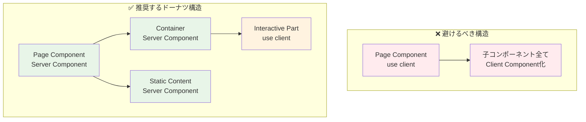
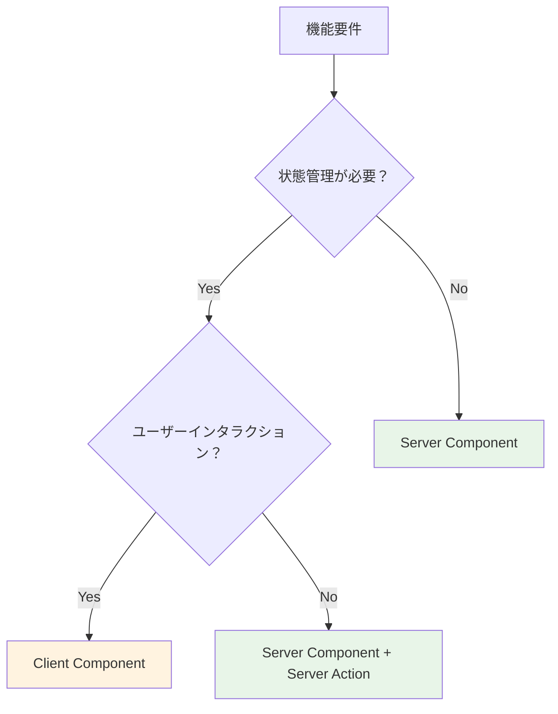
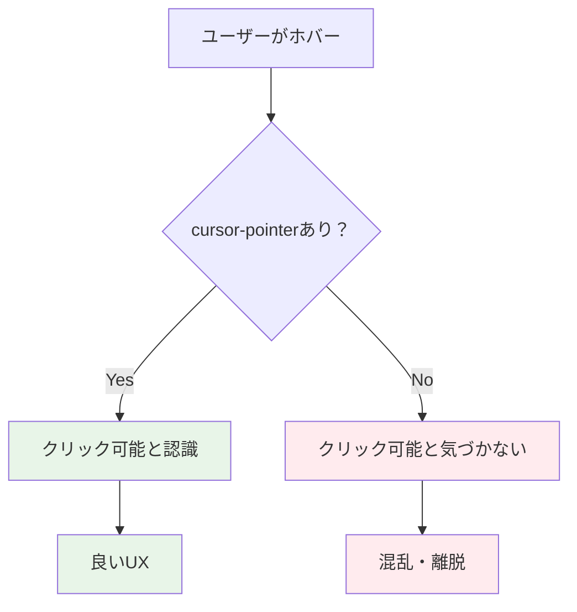

# フロントエンド開発ベストプラクティス 🎨

このドキュメントでは、Next.js App Router + Flowbite-React + TailwindCSS v4 での開発におけるベストプラクティスと最適化ルールについて説明します。

---

## Client Component 最適化ルール 🔧

### ドーナツ構造の原則 🍩

**なぜドーナツ構造なのか？**



**具体例：ユーザープロフィールページ**

```typescript
// ❌ 悪い例：ページ全体をClient Component化
'use client';
export default function UserProfilePage() {
  const [isEditing, setIsEditing] = useState(false);
  
  return (
    <div>
      <header>プロフィール</header> {/* 静的コンテンツもClient側に */}
      <UserInfo data={userData} />
      <EditButton onClick={() => setIsEditing(!isEditing)} />
      {isEditing && <EditForm />}
    </div>
  );
}
```

```typescript
// ✅ 良い例：ドーナツ構造
// Server Component（外側）
export default async function UserProfilePage() {
  const userData = await getUserData(); // サーバーでデータ取得
  
  return (
    <div>
      <header>プロフィール</header> {/* 静的コンテンツはサーバー側 */}
      <UserInfo data={userData} />
      <UserProfileClient initialData={userData} /> {/* 必要な部分のみClient */}
    </div>
  );
}

// Client Component（内側の必要な部分のみ）
'use client';
function UserProfileClient({ initialData }: { initialData: UserData }) {
  const [isEditing, setIsEditing] = useState(false);
  
  return (
    <>
      <EditButton onClick={() => setIsEditing(!isEditing)} />
      {isEditing && <EditFormClient data={initialData} />}
    </>
  );
}
```

**メリット：**

- **初回読み込み速度の向上** - JavaScriptバンドルサイズが小さくなる
- **SEO最適化** - 静的コンテンツがサーバーサイドレンダリングされる
- **キャッシュ効率** - 静的部分のキャッシュが効く

### 最小範囲の原則 🎯

**どこまでClient Componentにするべきか？**



**判断基準：**

| 機能 | Component種別 | 理由 |
|------|---------------|------|
| 静的コンテンツ表示 | Server Component | サーバーサイドレンダリングで十分 |
| データ取得・表示 | Server Component | サーバーでデータ取得が効率的 |
| フォーム送信 | Server Component + Server Action | サーバーサイドで処理可能 |
| リアルタイム状態管理 | Client Component | ブラウザでの状態管理が必要 |
| アニメーション・UI状態 | Client Component | ユーザーインタラクションが必要 |

**具体例：検索フォーム**

```typescript
// ✅ 推奨パターン
// Server Component（フォーム構造）
export default function SearchPage() {
  return (
    <div>
      <h1>検索ページ</h1> {/* 静的コンテンツ */}
      <SearchForm /> {/* Server Action使用 */}
      <SearchFilterClient /> {/* リアルタイムフィルタリングのみClient */}
    </div>
  );
}

// Server Action（フォーム送信）
async function SearchForm() {
  async function handleSearch(formData: FormData) {
    'use server';
    const query = formData.get('query');
    // サーバーサイドで検索処理
    redirect(`/search/results?q=${query}`);
  }
  
  return (
    <form action={handleSearch}>
      <input name="query" placeholder="検索キーワード" />
      <button type="submit">検索</button>
    </form>
  );
}

// Client Component（リアルタイム機能のみ）
'use client';
function SearchFilterClient() {
  const [activeFilters, setActiveFilters] = useState<string[]>([]);
  
  return (
    <div>
      {/* リアルタイムフィルタリング */}
      <FilterButtons 
        filters={activeFilters} 
        onChange={setActiveFilters} 
      />
    </div>
  );
}
```

### 命名規則 📝

**Client Component識別のための命名**

```typescript
// ✅ 推奨：Clientサフィックス
SignInFormClient.tsx
UserProfileClient.tsx  
SearchFilterClient.tsx

// ❌ 非推奨：不明確な命名
SignInForm.tsx // Server/Client区別不明
UserProfile.tsx // Server/Client区別不明
```

---

## TailwindCSS v4 最適化 🎨

### 新しい記法への移行

**v3から v4への変更点**

```typescript
// ❌ TailwindCSS v3（非推奨）
<div className="bg-black bg-opacity-50">
<div className="text-gray-500 text-opacity-80">

// ✅ TailwindCSS v4（推奨）  
<div className="bg-black/50">
<div className="text-gray-500/80">
```

**透明度指定のベストプラクティス**

```mermaid
graph LR
    A[色指定] --> B[/透明度]
    B --> C[最終クラス]
    
    example1[bg-blue-500] --> slash1[/30] --> result1[bg-blue-500/30]
    example2[text-red-600] --> slash2[/75] --> result2[text-red-600/75]
    example3[border-gray-300] --> slash3[/50] --> result3[border-gray-300/50]
    
    style result1 fill:#e3f2fd
    style result2 fill:#e3f2fd  
    style result3 fill:#e3f2fd
```

### Flowbite-React との統合

**テーマカスタマイズパターン**

```typescript
// src/app/layout.tsx
import { Flowbite } from 'flowbite-react';
import { createTheme } from 'flowbite-react';

const customTheme = createTheme({
  button: {
    color: {
      primary: 'bg-blue-600 hover:bg-blue-700 text-white',
      secondary: 'bg-gray-200 hover:bg-gray-300 text-gray-900',
    },
  },
  modal: {
    content: {
      base: 'bg-white rounded-lg shadow-lg',
    },
  },
});

export default function RootLayout({ children }: { children: React.ReactNode }) {
  return (
    <html>
      <body>
        <Flowbite theme={{ theme: customTheme }}>
          {children}
        </Flowbite>
      </body>
    </html>
  );
}
```

**コンポーネントでの使用例**

```typescript
import { Button, Modal } from 'flowbite-react';

export function CustomModal() {
  return (
    <Modal show={isOpen} onClose={() => setIsOpen(false)}>
      <Modal.Header>タイトル</Modal.Header>
      <Modal.Body>
        <div className="space-y-4">
          <p className="text-gray-700/90">コンテンツ</p>
        </div>
      </Modal.Body>
      <Modal.Footer>
        <Button color="primary">保存</Button>
        <Button color="secondary" onClick={() => setIsOpen(false)}>
          キャンセル
        </Button>
      </Modal.Footer>
    </Modal>
  );
}
```

---

## 開発 TIPS 💡

### 必須のアクセシビリティ設定

**クリック可能要素には必ず cursor-pointer**

```typescript
// ✅ 必須：クリック可能な要素
<button className="cursor-pointer hover:bg-gray-100">
  ボタン
</button>

<div 
  className="cursor-pointer hover:bg-blue-50 transition-colors"
  onClick={handleClick}
>
  クリック可能なDiv
</div>

// ❌ 忘れがち：カスタムクリック要素
<div onClick={handleClick}>  // cursor-pointerがない
  カスタムボタン
</div>
```

**なぜ cursor-pointer が重要なのか？**



### パフォーマンス最適化

**画像最適化（next/image）**

```typescript
import Image from 'next/image';

// ✅ 推奨：next/image使用
<Image
  src="/profile.jpg"
  alt="プロフィール画像"
  width={300}
  height={300}
  className="rounded-full cursor-pointer"
  priority // 重要な画像の場合
/>

// ❌ 非推奨：通常のimg要素

```

**動的インポート（コード分割）**

```typescript
import dynamic from 'next/dynamic';

// ✅ 重いコンポーネントの遅延読み込み
const HeavyChartClient = dynamic(
  () => import('./HeavyChartClient'),
  { 
    loading: () => <div className="animate-pulse bg-gray-200 h-64" />,
    ssr: false // クライアントサイドのみで実行
  }
);

export function DashboardPage() {
  return (
    <div>
      <h1>ダッシュボード</h1>
      <HeavyChartClient /> {/* 必要時のみ読み込み */}
    </div>
  );
}
```

---

## コンポーネント設計パターン 🏗️

### Compound Pattern（複合パターン）

**関連する複数のコンポーネントをグループ化**

```typescript
// ✅ 推奨：Compound Pattern
interface CardProps {
  children: React.ReactNode;
  className?: string;
}

function Card({ children, className = '' }: CardProps) {
  return (
    <div className={`bg-white rounded-lg shadow-md p-6 ${className}`}>
      {children}
    </div>
  );
}

function CardHeader({ children }: { children: React.ReactNode }) {
  return <div className="mb-4 border-b border-gray-200 pb-4">{children}</div>;
}

function CardTitle({ children }: { children: React.ReactNode }) {
  return <h2 className="text-xl font-semibold text-gray-900">{children}</h2>;
}

function CardContent({ children }: { children: React.ReactNode }) {
  return <div className="text-gray-700">{children}</div>;
}

// Compound Patternの設定
Card.Header = CardHeader;
Card.Title = CardTitle;
Card.Content = CardContent;

export { Card };

// 使用例
<Card>
  <Card.Header>
    <Card.Title>タイトル</Card.Title>
  </Card.Header>
  <Card.Content>
    コンテンツ
  </Card.Content>
</Card>
```

### Render Props パターン

**再利用可能なロジックの共有**

```typescript
interface DataFetcherProps<T> {
  url: string;
  children: (data: T | null, loading: boolean, error: string | null) => React.ReactNode;
}

function DataFetcher<T>({ url, children }: DataFetcherProps<T>) {
  const [data, setData] = useState<T | null>(null);
  const [loading, setLoading] = useState(true);
  const [error, setError] = useState<string | null>(null);
  
  useEffect(() => {
    fetch(url)
      .then(response => response.json())
      .then(setData)
      .catch(err => setError(err.message))
      .finally(() => setLoading(false));
  }, [url]);
  
  return children(data, loading, error);
}

// 使用例
<DataFetcher<User[]> url="/api/users">
  {(users, loading, error) => {
    if (loading) return <div className="animate-pulse">読み込み中...</div>;
    if (error) return <div className="text-red-500">エラー: {error}</div>;
    
    return (
      <div className="space-y-2">
        {users?.map(user => (
          <div key={user.id} className="p-4 border rounded cursor-pointer hover:bg-gray-50">
            {user.name}
          </div>
        ))}
      </div>
    );
  }}
</DataFetcher>
```

---

## エラーハンドリング 🚨

### Error Boundary パターン

```typescript
'use client';
import React from 'react';

interface ErrorBoundaryState {
  hasError: boolean;
  error: Error | null;
}

class ErrorBoundary extends React.Component<
  { children: React.ReactNode; fallback?: React.ReactNode },
  ErrorBoundaryState
> {
  constructor(props: any) {
    super(props);
    this.state = { hasError: false, error: null };
  }
  
  static getDerivedStateFromError(error: Error): ErrorBoundaryState {
    return { hasError: true, error };
  }
  
  componentDidCatch(error: Error, errorInfo: React.ErrorInfo) {
    console.error('Error caught by boundary:', error, errorInfo);
  }
  
  render() {
    if (this.state.hasError) {
      return this.props.fallback || (
        <div className="p-6 text-center">
          <h2 className="text-xl font-semibold text-red-600 mb-2">
            エラーが発生しました
          </h2>
          <p className="text-gray-600 mb-4">
            {this.state.error?.message || '予期しないエラーが発生しました'}
          </p>
          <button 
            className="px-4 py-2 bg-blue-600 text-white rounded cursor-pointer hover:bg-blue-700"
            onClick={() => this.setState({ hasError: false, error: null })}
          >
            再試行
          </button>
        </div>
      );
    }
    
    return this.props.children;
  }
}

// 使用例
<ErrorBoundary>
  <SomeComponentThatMightThrow />
</ErrorBoundary>
```

---

## まとめ 🎯

### フロントエンド開発の原則

1. **Server Components優先** - 可能な限りサーバーサイドで処理
2. **ドーナツ構造** - 必要最小限のClient Component
3. **アクセシビリティ** - cursor-pointerなど基本的なUX配慮
4. **パフォーマンス** - 動的インポート、画像最適化
5. **保守性** - 明確な命名規則、再利用可能なパターン

### 開発効率化のコツ

- **Flowbite-React活用** - 既製コンポーネントで開発速度向上
- **TailwindCSS v4** - 新しい記法で簡潔なスタイリング
- **TypeScript活用** - 型安全性による開発体験向上

---

## 関連ドキュメント 📚

- [プロジェクト構造](../project-structure.md) - 全体のファイル配置
- [開発ガイド](../development-guide.md) - 開発フロー全般
- [テスト戦略](../testing-strategy.md) - コンポーネントテスト手法
