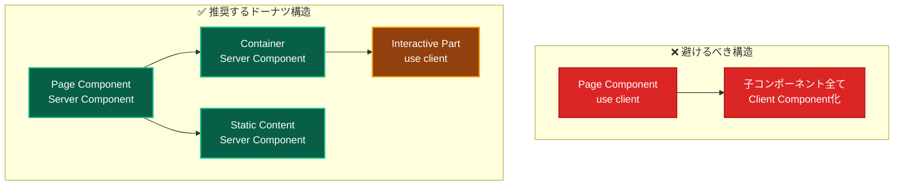
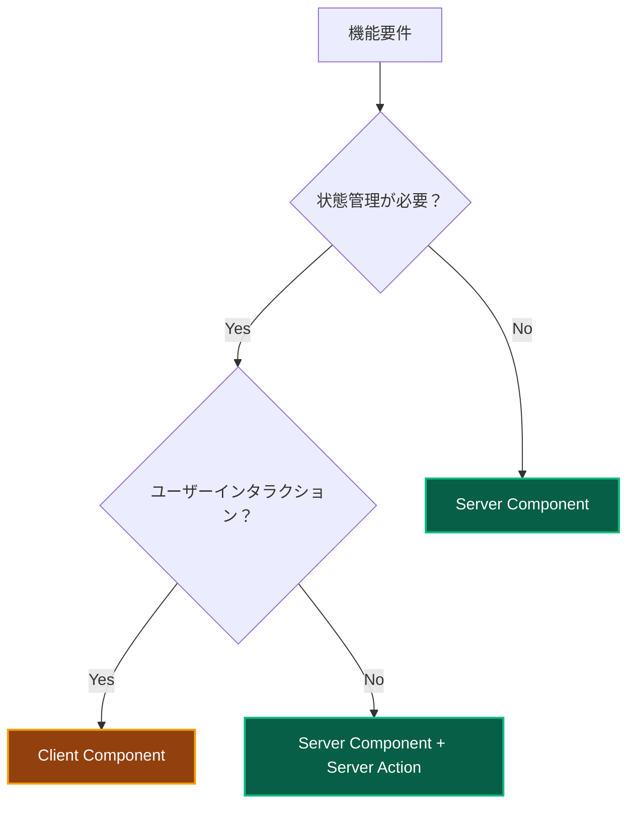
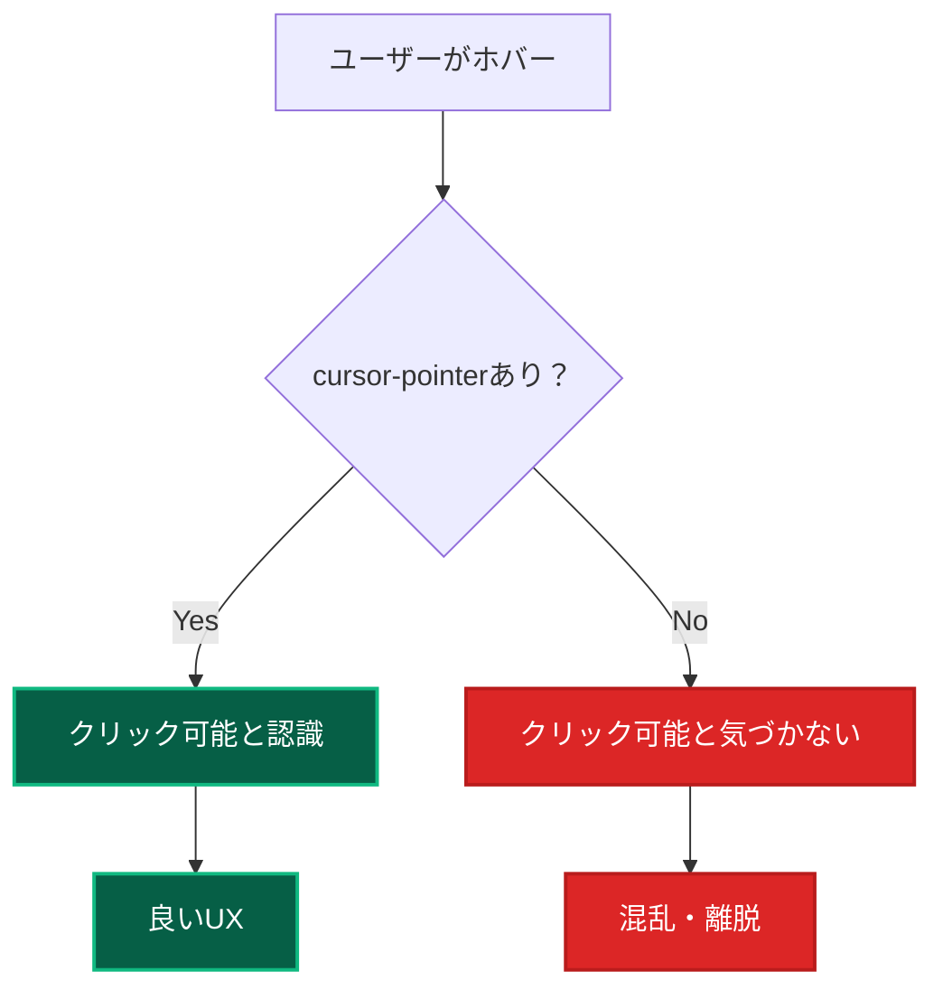

# フロントエンド開発ベストプラクティス 🎨 - shadcn/ui統合版

このドキュメントでは、Next.js App Router + shadcn/ui + TailwindCSS v4 での開発におけるベストプラクティスと最適化ルールについて説明します。
shadcn/ui統合により、Enhanced Components、Bridge System、HSL変数システムを活用した次世代開発手法を提供します。

---

## Client Component 最適化ルール 🔧

### ドーナツ構造の原則 🍩

**なぜドーナツ構造なのか？**



**具体例：ユーザープロフィールページ**

```typescript
// ❌ 悪い例：ページ全体をClient Component化
'use client';
export default function UserProfilePage() {
  const [isEditing, setIsEditing] = useState(false);

  return (
    <div>
      <header>プロフィール</header> {/* 静的コンテンツもClient側に */}
      <UserInfo data={userData} />
      <EditButton onClick={() => setIsEditing(!isEditing)} />
      {isEditing && <EditForm />}
    </div>
  );
}
```

```typescript
// ✅ 良い例：ドーナツ構造
// Server Component（外側）
export default async function UserProfilePage() {
  const userData = await getUserData(); // サーバーでデータ取得

  return (
    <div>
      <header>プロフィール</header> {/* 静的コンテンツはサーバー側 */}
      <UserInfo data={userData} />
      <UserProfileClient initialData={userData} /> {/* 必要な部分のみClient */}
    </div>
  );
}

// Client Component（内側の必要な部分のみ）
'use client';
function UserProfileClient({ initialData }: { initialData: UserData }) {
  const [isEditing, setIsEditing] = useState(false);

  return (
    <>
      <EditButton onClick={() => setIsEditing(!isEditing)} />
      {isEditing && <EditFormClient data={initialData} />}
    </>
  );
}
```

**メリット：**

- **初回読み込み速度の向上** - JavaScriptバンドルサイズが小さくなる
- **SEO最適化** - 静的コンテンツがサーバーサイドレンダリングされる
- **キャッシュ効率** - 静的部分のキャッシュが効く

### 最小範囲の原則 🎯

**どこまでClient Componentにするべきか？**



**判断基準：**

| 機能                   | Component種別                    | 理由                             |
| ---------------------- | -------------------------------- | -------------------------------- |
| 静的コンテンツ表示     | Server Component                 | サーバーサイドレンダリングで十分 |
| データ取得・表示       | Server Component                 | サーバーでデータ取得が効率的     |
| フォーム送信           | Server Component + Server Action | サーバーサイドで処理可能         |
| リアルタイム状態管理   | Client Component                 | ブラウザでの状態管理が必要       |
| アニメーション・UI状態 | Client Component                 | ユーザーインタラクションが必要   |

**具体例：検索フォーム**

```typescript
// ✅ 推奨パターン
// Server Component（フォーム構造）
export default function SearchPage() {
  return (
    <div>
      <h1>検索ページ</h1> {/* 静的コンテンツ */}
      <SearchForm /> {/* Server Action使用 */}
      <SearchFilterClient /> {/* リアルタイムフィルタリングのみClient */}
    </div>
  );
}

// Server Action（フォーム送信）
async function SearchForm() {
  async function handleSearch(formData: FormData) {
    'use server';
    const query = formData.get('query');
    // サーバーサイドで検索処理
    redirect(`/search/results?q=${query}`);
  }

  return (
    <form action={handleSearch}>
      <input name="query" placeholder="検索キーワード" />
      <button type="submit">検索</button>
    </form>
  );
}

// Client Component（リアルタイム機能のみ）
'use client';
function SearchFilterClient() {
  const [activeFilters, setActiveFilters] = useState<string[]>([]);

  return (
    <div>
      {/* リアルタイムフィルタリング */}
      <FilterButtons
        filters={activeFilters}
        onChange={setActiveFilters}
      />
    </div>
  );
}
```

### 命名規則 📝

**Client Component識別のための命名**

```typescript
// ✅ 推奨：Clientサフィックス
SignInFormClient.tsx;
UserProfileClient.tsx;
SearchFilterClient.tsx;

// ❌ 非推奨：不明確な命名
SignInForm.tsx; // Server/Client区別不明
UserProfile.tsx; // Server/Client区別不明
```

---

## TailwindCSS v4 最適化 🎨

### 新しい記法への移行

**v3から v4への変更点**

```typescript
// ❌ TailwindCSS v3（非推奨）
<div className="bg-black bg-opacity-50">
<div className="text-gray-500 text-opacity-80">

// ✅ TailwindCSS v4（推奨）
<div className="bg-black/50">
<div className="text-gray-500/80">
```

**透明度指定のベストプラクティス**

```mermaid
graph LR
    A[色指定] --> B[/透明度]
    B --> C[最終クラス]

    example1[bg-blue-500] --> slash1[/30] --> result1[bg-blue-500/30]
    example2[text-red-600] --> slash2[/75] --> result2[text-red-600/75]
    example3[border-gray-300] --> slash3[/50] --> result3[border-gray-300/50]

    style result1 fill:#1e40af,stroke:#3b82f6,stroke-width:2px,color:#ffffff
    style result2 fill:#1e40af,stroke:#3b82f6,stroke-width:2px,color:#ffffff
    style result3 fill:#1e40af,stroke:#3b82f6,stroke-width:2px,color:#ffffff
```

### テーマカラーシステム統合 🎨

**統一されたカラーパレットの活用**

```typescript
// ✅ 推奨：CSS変数を使用したテーマカラー
<Button className="bg-[var(--primary)] hover:bg-[var(--primary-hover)] text-[var(--text-inverse)]">
  プライマリボタン
</Button>

<Alert className="bg-[var(--error-light)] text-[var(--error)] border-[var(--error-muted)]">
  エラーメッセージ
</Alert>

// ✅ グラデーション効果
<div className="bg-gradient-to-r from-[var(--primary)] to-[var(--secondary)]">
  ブランドグラデーション
</div>

// ❌ 非推奨：ハードコードされた色
<Button className="bg-blue-600 hover:bg-blue-700 text-white">
  ハードコードボタン
</Button>
```

**ダークモード自動対応**

```typescript
// ✅ テーマ変数により自動でダークモード対応
<Card className="bg-[var(--surface)] text-[var(--text-primary)] border-[var(--border)]">
  <Card.Header>
    <h2 className="text-[var(--text-primary)]">タイトル</h2>
  </Card.Header>
  <Card.Content>
    <p className="text-[var(--text-secondary)]">コンテンツ</p>
  </Card.Content>
</Card>
```

**参考：** 詳細な色設計・使用方法は [`theme-system.md`](../theme-system.md) を参照

### shadcn/ui との統合

**Enhanced Components活用パターン**

```typescript
// Bridge System経由での最適なコンポーネント使用
import { Button, Card, Alert, Dialog } from '@/components/ui-bridge';

// shadcn/ui Enhanced Button（既存機能統合）
export function ActionButtons() {
  return (
    <div className="space-x-4">
      {/* 基本的なshadcn/uiボタン */}
      <Button variant="default">標準ボタン</Button>

      {/* 既存システム機能統合（gradient + loading） */}
      <Button
        variant="primary"
        gradient={true}
        loading={isLoading}
        fullWidth={false}
      >
        拡張機能ボタン
      </Button>

      {/* shadcn/ui標準variants */}
      <Button variant="destructive">削除</Button>
      <Button variant="outline">アウトライン</Button>
      <Button variant="ghost">ゴースト</Button>
    </div>
  );
}
```

**Form統合パターン（react-hook-form + shadcn/ui）**

```typescript
import { useForm } from 'react-hook-form';
import { zodResolver } from '@hookform/resolvers/zod';
import { z } from 'zod';
import {
  Form,
  FormControl,
  FormField,
  FormItem,
  FormLabel,
  FormMessage,
  FormDescription,
} from '@/components/ui-bridge';
import { Input } from '@/components/ui-bridge';
import { Button } from '@/components/ui-bridge';

const formSchema = z.object({
  username: z.string().min(2, {
    message: "ユーザー名は2文字以上で入力してください。",
  }),
  email: z.string().email({
    message: "有効なメールアドレスを入力してください。",
  }),
});

export function UserForm() {
  const form = useForm<z.infer<typeof formSchema>>({
    resolver: zodResolver(formSchema),
    defaultValues: {
      username: "",
      email: "",
    },
  });

  function onSubmit(values: z.infer<typeof formSchema>) {
    console.log(values);
  }

  return (
    <Form {...form}>
      <form onSubmit={form.handleSubmit(onSubmit)} className="space-y-8">
        <FormField
          control={form.control}
          name="username"
          render={({ field }) => (
            <FormItem>
              <FormLabel>ユーザー名</FormLabel>
              <FormControl>
                <Input placeholder="ユーザー名を入力" {...field} />
              </FormControl>
              <FormDescription>
                これは公開表示名として使用されます。
              </FormDescription>
              <FormMessage />
            </FormItem>
          )}
        />
        <FormField
          control={form.control}
          name="email"
          render={({ field }) => (
            <FormItem>
              <FormLabel>メールアドレス</FormLabel>
              <FormControl>
                <Input placeholder="email@example.com" {...field} />
              </FormControl>
              <FormMessage />
            </FormItem>
          )}
        />
        <Button type="submit" variant="primary" gradient={true}>
          送信
        </Button>
      </form>
    </Form>
  );
}
```

**Dialog/Modalパターン**

```typescript
import {
  Dialog,
  DialogContent,
  DialogDescription,
  DialogFooter,
  DialogHeader,
  DialogTitle,
  DialogTrigger,
} from '@/components/ui-bridge';
import { Button } from '@/components/ui-bridge';

export function ConfirmDialog() {
  return (
    <Dialog>
      <DialogTrigger asChild>
        <Button variant="destructive">削除</Button>
      </DialogTrigger>
      <DialogContent>
        <DialogHeader>
          <DialogTitle>削除の確認</DialogTitle>
          <DialogDescription>
            この操作は取り消すことができません。本当に削除しますか？
          </DialogDescription>
        </DialogHeader>
        <DialogFooter>
          <Button variant="outline">キャンセル</Button>
          <Button variant="destructive">削除する</Button>
        </DialogFooter>
      </DialogContent>
    </Dialog>
  );
}
```

---

## 開発 TIPS 💡

### 必須のアクセシビリティ設定

**クリック可能要素には必ず cursor-pointer**

```typescript
// ✅ 必須：クリック可能な要素
<button className="cursor-pointer hover:bg-gray-100">
  ボタン
</button>

<div
  className="cursor-pointer hover:bg-blue-50 transition-colors"
  onClick={handleClick}
>
  クリック可能なDiv
</div>

// ❌ 忘れがち：カスタムクリック要素
<div onClick={handleClick}>  // cursor-pointerがない
  カスタムボタン
</div>
```

**なぜ cursor-pointer が重要なのか？**



### パフォーマンス最適化

**画像最適化（next/image）**

```typescript
import Image from 'next/image';

// ✅ 推奨：next/image使用
<Image
  src="/profile.jpg"
  alt="プロフィール画像"
  width={300}
  height={300}
  className="rounded-full cursor-pointer"
  priority // 重要な画像の場合
/>

// ❌ 非推奨：通常のimg要素

```

**動的インポート（コード分割）**

```typescript
import dynamic from 'next/dynamic';

// ✅ 重いコンポーネントの遅延読み込み
const HeavyChartClient = dynamic(
  () => import('./HeavyChartClient'),
  {
    loading: () => <div className="animate-pulse bg-gray-200 h-64" />,
    ssr: false // クライアントサイドのみで実行
  }
);

export function DashboardPage() {
  return (
    <div>
      <h1>ダッシュボード</h1>
      <HeavyChartClient /> {/* 必要時のみ読み込み */}
    </div>
  );
}
```

---

## コンポーネント設計パターン 🏗️

### Compound Pattern（複合パターン）- shadcn/ui統合版

**shadcn/ui Enhanced Components でのCompound Pattern活用**

```typescript
// ✅ 推奨：shadcn/ui Enhanced Card（Compound Pattern統合）
import { Card } from '@/components/ui-bridge';

// 既存システムのCompound Patternサポート
export function ProductCard({ product }: { product: Product }) {
  return (
    <Card variant="elevated" padding="lg" className="hover:shadow-xl transition-shadow">
      <Card.Header>
        <Card.Title className="bg-gradient-to-r from-[var(--primary)] to-[var(--secondary)] bg-clip-text text-transparent">
          {product.name}
        </Card.Title>
      </Card.Header>
      <Card.Content>
        <div className="space-y-4">
          <p className="text-[var(--text-secondary)]">{product.description}</p>
          <div className="flex items-center justify-between">
            <span className="text-2xl font-bold text-[var(--primary)]">
              ¥{product.price.toLocaleString()}
            </span>
            <Badge variant="secondary">{product.category}</Badge>
          </div>
        </div>
      </Card.Content>
      <Card.Footer>
        <div className="flex gap-2 w-full">
          <Button variant="outline" className="flex-1">
            詳細
          </Button>
          <Button variant="primary" gradient={true} className="flex-1">
            カートに追加
          </Button>
        </div>
      </Card.Footer>
    </Card>
  );
}

// shadcn/ui標準パターンとの併用
import {
  Card,
  CardHeader,
  CardTitle,
  CardDescription,
  CardContent,
  CardFooter,
} from '@/components/ui-bridge';

export function NewsCard({ article }: { article: Article }) {
  return (
    <Card className="w-full max-w-md">
      <CardHeader>
        <CardTitle>{article.title}</CardTitle>
        <CardDescription>{article.summary}</CardDescription>
      </CardHeader>
      <CardContent>
        <p className="text-sm text-muted-foreground">
          {article.content}
        </p>
      </CardContent>
      <CardFooter className="flex justify-between">
        <p className="text-sm text-muted-foreground">
          {new Date(article.publishedAt).toLocaleDateString()}
        </p>
        <Button size="sm" variant="ghost">
          続きを読む
        </Button>
      </CardFooter>
    </Card>
  );
}
```

### Enhanced Pattern（拡張パターン）

**既存機能とshadcn/ui機能の統合活用**

```typescript
// ✅ Enhanced Button活用パターン
import { Button } from '@/components/ui-bridge';

export function ActionButtonGroup() {
  const [isLoading, setIsLoading] = useState(false);

  return (
    <div className="flex flex-col sm:flex-row gap-4">
      {/* shadcn/ui標準機能 */}
      <Button variant="default" size="lg">
        標準アクション
      </Button>

      {/* 既存システム機能統合 */}
      <Button
        variant="primary"
        gradient={true}
        loading={isLoading}
        fullWidth={false}
        size="lg"
        onClick={() => setIsLoading(true)}
      >
        グラデーション＋ローディング
      </Button>

      {/* ステート色活用 */}
      <Button variant="success" size="lg">
        成功アクション
      </Button>

      <Button variant="destructive" size="lg">
        危険アクション
      </Button>
    </div>
  );
}

// ✅ 統合Alert活用パターン
import { Alert, AlertDescription } from '@/components/ui-bridge';
import { AlertCircle, CheckCircle, Info, AlertTriangle } from 'lucide-react';

export function StatusAlerts() {
  return (
    <div className="space-y-4">
      {/* shadcn/ui標準 */}
      <Alert>
        <Info className="h-4 w-4" />
        <AlertDescription>
          標準的な情報メッセージです。
        </AlertDescription>
      </Alert>

      {/* 既存システムステート色統合 */}
      <Alert variant="success">
        <CheckCircle className="h-4 w-4" />
        <AlertDescription>
          操作が正常に完了しました。
        </AlertDescription>
      </Alert>

      <Alert variant="error">
        <AlertCircle className="h-4 w-4" />
        <AlertDescription>
          エラーが発生しました。もう一度お試しください。
        </AlertDescription>
      </Alert>

      <Alert variant="warning">
        <AlertTriangle className="h-4 w-4" />
        <AlertDescription>
          この操作には注意が必要です。
        </AlertDescription>
      </Alert>
    </div>
  );
}
```

### Render Props パターン

**再利用可能なロジックの共有**

```typescript
interface DataFetcherProps<T> {
  url: string;
  children: (data: T | null, loading: boolean, error: string | null) => React.ReactNode;
}

function DataFetcher<T>({ url, children }: DataFetcherProps<T>) {
  const [data, setData] = useState<T | null>(null);
  const [loading, setLoading] = useState(true);
  const [error, setError] = useState<string | null>(null);

  useEffect(() => {
    fetch(url)
      .then(response => response.json())
      .then(setData)
      .catch(err => setError(err.message))
      .finally(() => setLoading(false));
  }, [url]);

  return children(data, loading, error);
}

// 使用例
<DataFetcher<User[]> url="/api/users">
  {(users, loading, error) => {
    if (loading) return <div className="animate-pulse">読み込み中...</div>;
    if (error) return <div className="text-red-500">エラー: {error}</div>;

    return (
      <div className="space-y-2">
        {users?.map(user => (
          <div key={user.id} className="p-4 border rounded cursor-pointer hover:bg-gray-50">
            {user.name}
          </div>
        ))}
      </div>
    );
  }}
</DataFetcher>
```

---

## エラーハンドリング 🚨

### Error Boundary パターン

```typescript
'use client';
import React from 'react';

interface ErrorBoundaryState {
  hasError: boolean;
  error: Error | null;
}

class ErrorBoundary extends React.Component<
  { children: React.ReactNode; fallback?: React.ReactNode },
  ErrorBoundaryState
> {
  constructor(props: any) {
    super(props);
    this.state = { hasError: false, error: null };
  }

  static getDerivedStateFromError(error: Error): ErrorBoundaryState {
    return { hasError: true, error };
  }

  componentDidCatch(error: Error, errorInfo: React.ErrorInfo) {
    console.error('Error caught by boundary:', error, errorInfo);
  }

  render() {
    if (this.state.hasError) {
      return this.props.fallback || (
        <div className="p-6 text-center">
          <h2 className="text-xl font-semibold text-red-600 mb-2">
            エラーが発生しました
          </h2>
          <p className="text-gray-600 mb-4">
            {this.state.error?.message || '予期しないエラーが発生しました'}
          </p>
          <button
            className="px-4 py-2 bg-blue-600 text-white rounded cursor-pointer hover:bg-blue-700"
            onClick={() => this.setState({ hasError: false, error: null })}
          >
            再試行
          </button>
        </div>
      );
    }

    return this.props.children;
  }
}

// 使用例
<ErrorBoundary>
  <SomeComponentThatMightThrow />
</ErrorBoundary>
```

---

## まとめ 🎯

### フロントエンド開発の原則

1. **Server Components優先** - 可能な限りサーバーサイドで処理
2. **ドーナツ構造** - 必要最小限のClient Component
3. **アクセシビリティ** - cursor-pointerなど基本的なUX配慮
4. **パフォーマンス** - 動的インポート、画像最適化
5. **保守性** - 明確な命名規則、再利用可能なパターン

### 開発効率化のコツ

- **shadcn/ui Enhanced Components活用** - 既存機能＋shadcn/ui標準機能で開発速度向上
- **Bridge System活用** - 段階的移行による無理のない開発
- **TailwindCSS v4** - 新しい記法とHSL変数システムで簡潔なスタイリング
- **TypeScript活用** - 型安全性による開発体験向上
- **react-hook-form + zod統合** - フォーム開発の効率化と型安全性

### shadcn/ui統合開発のベストプラクティス

1. **Bridge System優先使用**

   ```typescript
   // ✅ 推奨：Bridge経由でコンポーネント使用
   import { Alert, Button, Card } from '@/components/ui-bridge';
   ```

2. **Enhanced Components活用**

   ```typescript
   // ✅ 既存機能（gradient, loading）+ shadcn/ui機能の統合
   <Button variant="primary" gradient={true} loading={isLoading}>
   ```

3. **適切な変数システム選択**

   ```typescript
   // shadcn/ui標準：HSL変数
   <div className="bg-primary text-primary-foreground">

   // 既存システム：HEX変数（グラデーション等）
   <div className="bg-gradient-to-r from-[var(--primary)] to-[var(--secondary)]">
   ```

4. **Form統合パターン活用**

   ```typescript
   // react-hook-form + zod + shadcn/ui Form統合
   <Form {...form}>
     <FormField>
       <FormControl>
         <Input {...field} />
       </FormControl>
     </FormField>
   </Form>
   ```

---

## 関連ドキュメント 📚

### 🎨 UI・デザインシステム

- [テーマカラーシステム v2.0](../theme-system.md) - shadcn/ui統合カラーパレット・HSL変数・ダークモード対応
- [Next.js統合パターン](../nextjs-integration-patterns.md) - App Router + shadcn/ui統合パターン

### 🏗️ 開発・アーキテクチャ

- [プロジェクト構造](../project-structure.md) - 全体のファイル配置
- [開発ガイド](../development-guide.md) - 開発フロー全般
- [テスト戦略](../testing-strategy.md) - Enhanced Componentsテスト手法

### 🔄 shadcn/ui移行関連

- [shadcn/ui移行計画](../../shadcn-ui-migration-plan.md) - 段階的移行戦略詳細
- [Bridge Systemガイド](../ddd/layers/components/ui-bridge-system.md) - コンポーネント統合システム

### 📋 DDD・Clean Architecture

- [Presentation Layer](../ddd/layers/presentation-layer.md) - UI層設計・Server Actions
- [Frontend Architecture](../ddd/concepts/frontend-architecture.md) - フロントエンド設計原則
