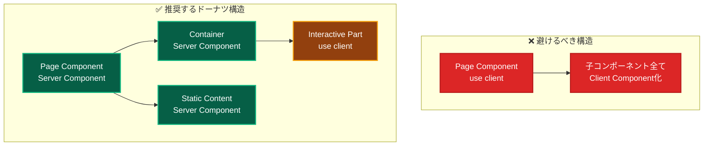
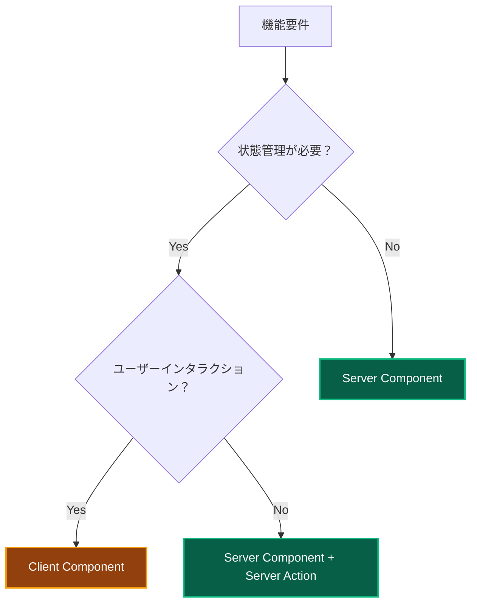
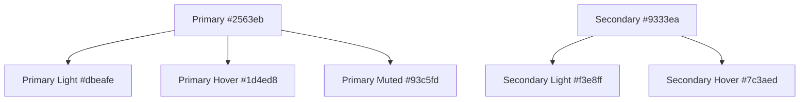
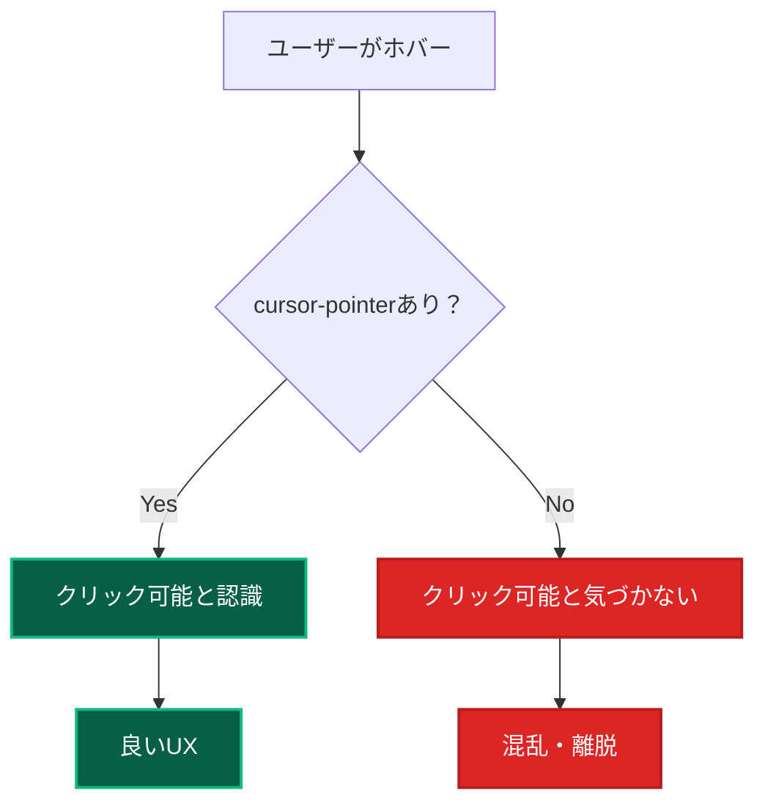

# フロントエンド開発ベストプラクティス 🎨 - shadcn/ui統合版

このドキュメントでは、Next.js App Router + shadcn/ui + TailwindCSS v4.2+ での開発におけるベストプラクティスと最適化ルールについて説明します。
shadcn/ui統合により、Enhanced Components、Bridge System、OKLCH変数システムを活用した次世代開発手法を提供します。

---

## Client Component 最適化ルール 🔧

### ドーナツ構造の原則 🍩

**なぜドーナツ構造なのか？**


```mermaid
graph TD
    subgraph "❌ 避けるべき構造"
        A1[Page Component <br/>use client] --> B1[子コンポーネント全て<br/>Client Component化]
        style A1 fill:#dc2626,stroke:#b91c1c,stroke-width:2px,color:#ffffff
        style B1 fill:#dc2626,stroke:#b91c1c,stroke-width:2px,color:#ffffff
    end

    subgraph "✅ 推奨するドーナツ構造"
        A2[Page Component <br/>Server Component] --> B2[Container<br/>Server Component]
        B2 --> C2[Interactive Part<br/>use client]
        A2 --> D2[Static Content<br/>Server Component]
        style A2 fill:#065f46,stroke:#10b981,stroke-width:2px,color:#ffffff
        style B2 fill:#065f46,stroke:#10b981,stroke-width:2px,color:#ffffff
        style C2 fill:#92400e,stroke:#f59e0b,stroke-width:2px,color:#ffffff
        style D2 fill:#065f46,stroke:#10b981,stroke-width:2px,color:#ffffff
    end
```

**具体例：ユーザープロフィールページ**

```typescript
// ❌ 悪い例：ページ全体をClient Component化
'use client';
export default function UserProfilePage() {
  const [isEditing, setIsEditing] = useState(false);

  return (
    <div>
      <header>プロフィール</header> {/* 静的コンテンツもClient側に */}
      <UserInfo data={userData} />
      <EditButton onClick={() => setIsEditing(!isEditing)} />
      {isEditing && <EditForm />}
    </div>
  );
}
```

```typescript
// ✅ 良い例：ドーナツ構造
// Server Component（外側）
export default async function UserProfilePage() {
  const userData = await getUserData(); // サーバーでデータ取得

  return (
    <div>
      <header>プロフィール</header> {/* 静的コンテンツはサーバー側 */}
      <UserInfo data={userData} />
      <UserProfileClient initialData={userData} /> {/* 必要な部分のみClient */}
    </div>
  );
}

// Client Component（内側の必要な部分のみ）
'use client';
function UserProfileClient({ initialData }: { initialData: UserData }) {
  const [isEditing, setIsEditing] = useState(false);

  return (
    <>
      <EditButton onClick={() => setIsEditing(!isEditing)} />
      {isEditing && <EditFormClient data={initialData} />}
    </>
  );
}
```

**メリット：**

- **初回読み込み速度の向上** - JavaScriptバンドルサイズが小さくなる
- **SEO最適化** - 静的コンテンツがサーバーサイドレンダリングされる
- **キャッシュ効率** - 静的部分のキャッシュが効く

### 最小範囲の原則 🎯

**どこまでClient Componentにするべきか？**


```mermaid
graph TD
    A[機能要件] --> B{状態管理が必要？}
    B -->|Yes| C{ユーザーインタラクション？}
    B -->|No| D[Server Component]
    C -->|Yes| E[Client Component]
    C -->|No| F[Server Component + Server Action]

    style D fill:#065f46,stroke:#10b981,stroke-width:2px,color:#ffffff
    style E fill:#92400e,stroke:#f59e0b,stroke-width:2px,color:#ffffff
    style F fill:#065f46,stroke:#10b981,stroke-width:2px,color:#ffffff
```

**判断基準：**

| 機能                   | Component種別                    | 理由                             |
| ---------------------- | -------------------------------- | -------------------------------- |
| 静的コンテンツ表示     | Server Component                 | サーバーサイドレンダリングで十分 |
| データ取得・表示       | Server Component                 | サーバーでデータ取得が効率的     |
| フォーム送信           | Server Component + Server Action | サーバーサイドで処理可能         |
| リアルタイム状態管理   | Client Component                 | ブラウザでの状態管理が必要       |
| アニメーション・UI状態 | Client Component                 | ユーザーインタラクションが必要   |

**具体例：検索フォーム**

```typescript
// ✅ 推奨パターン
// Server Component（フォーム構造）
export default function SearchPage() {
  return (
    <div>
      <h1>検索ページ</h1> {/* 静的コンテンツ */}
      <SearchForm /> {/* Server Action使用 */}
      <SearchFilterClient /> {/* リアルタイムフィルタリングのみClient */}
    </div>
  );
}

// Server Action（フォーム送信）
async function SearchForm() {
  async function handleSearch(formData: FormData) {
    'use server';
    const query = formData.get('query');
    // サーバーサイドで検索処理
    redirect(`/search/results?q=${query}`);
  }

  return (
    <form action={handleSearch}>
      <input name="query" placeholder="検索キーワード" />
      <button type="submit">検索</button>
    </form>
  );
}

// Client Component（リアルタイム機能のみ）
'use client';
function SearchFilterClient() {
  const [activeFilters, setActiveFilters] = useState<string[]>([]);

  return (
    <div>
      {/* リアルタイムフィルタリング */}
      <FilterButtons
        filters={activeFilters}
        onChange={setActiveFilters}
      />
    </div>
  );
}
```

### 命名規則 📝

**Client Component識別のための命名**

```typescript
// ✅ 推奨：Clientサフィックス
SignInFormClient.tsx;
UserProfileClient.tsx;
SearchFilterClient.tsx;

// ❌ 非推奨：不明確な命名
SignInForm.tsx; // Server/Client区別不明
UserProfile.tsx; // Server/Client区別不明
```

---

## TailwindCSS v4.2+ 最適化 🎨

### 新しい記法への移行

**v3から v4への変更点**

```typescript
// ❌ TailwindCSS v3（非推奨）
<div className="bg-black bg-opacity-50">
<div className="text-gray-500 text-opacity-80">

// ✅ TailwindCSS v4.2+（推奨）
<div className="bg-black/50">
<div className="text-gray-500/80">
```

**透明度指定のベストプラクティス**

```mermaid
graph LR
    A[色指定] --> B[/透明度]
    B --> C[最終クラス]

    example1[bg-blue-500] --> slash1[/30] --> result1[bg-blue-500/30]
    example2[text-red-600] --> slash2[/75] --> result2[text-red-600/75]
    example3[border-gray-300] --> slash3[/50] --> result3[border-gray-300/50]

    style result1 fill:#1e40af,stroke:#3b82f6,stroke-width:2px,color:#ffffff
    style result2 fill:#1e40af,stroke:#3b82f6,stroke-width:2px,color:#ffffff
    style result3 fill:#1e40af,stroke:#3b82f6,stroke-width:2px,color:#ffffff
```

### テーマカラーシステム統合 🎨

**統一されたカラーパレットの活用**

```typescript
// ✅ 推奨：CSS変数を使用したテーマカラー
<Button className="bg-[var(--primary)] hover:bg-[var(--primary-hover)] text-[var(--text-inverse)]">
  プライマリボタン
</Button>

<Alert className="bg-[var(--error-light)] text-[var(--error)] border-[var(--error-muted)]">
  エラーメッセージ
</Alert>

// ✅ グラデーション効果
<div className="bg-gradient-to-r from-[var(--primary)] to-[var(--secondary)]">
  ブランドグラデーション
</div>

// ❌ 非推奨：ハードコードされた色
<Button className="bg-blue-600 hover:bg-blue-700 text-white">
  ハードコードボタン
</Button>
```

**ダークモード自動対応**

```typescript
// ✅ テーマ変数により自動でダークモード対応
<Card className="bg-[var(--surface)] text-[var(--text-primary)] border-[var(--border)]">
  <Card.Header>
    <h2 className="text-[var(--text-primary)]">タイトル</h2>
  </Card.Header>
  <Card.Content>
    <p className="text-[var(--text-secondary)]">コンテンツ</p>
  </Card.Content>
</Card>
```

### shadcn/ui との統合

**Enhanced Components活用パターン**

```typescript
// @/components/ui/ からカスタマイズ済みコンポーネントをインポート
import { Button } from '@/components/ui/button';
import { Card } from '@/components/ui/card';
import { Alert } from '@/components/ui/alert';
import { Dialog } from '@/components/ui/dialog';

// shadcn/ui Enhanced Button（既存機能統合）
export function ActionButtons() {
  return (
    <div className="space-x-4">
      {/* 基本的なshadcn/uiボタン */}
      <Button variant="default">標準ボタン</Button>

      {/* 既存システム機能統合（aurora variant + loading） */}
      <Button
        variant="aurora"
        loading={isLoading}
        fullWidth={false}
      >
        拡張機能ボタン
      </Button>

      {/* shadcn/ui標準variants */}
      <Button variant="destructive">削除</Button>
      <Button variant="outline">アウトライン</Button>
      <Button variant="ghost">ゴースト</Button>
    </div>
  );
}
```

**Form統合パターン（react-hook-form + shadcn/ui）**

```typescript
import { useForm } from 'react-hook-form';
import { zodResolver } from '@hookform/resolvers/zod';
import { z } from 'zod';
import {
  Form,
  FormControl,
  FormField,
  FormItem,
  FormLabel,
  FormMessage,
  FormDescription,
} from '@/components/ui/form';
import { Input } from '@/components/ui/input';
import { Button } from '@/components/ui/button';

const formSchema = z.object({
  username: z.string().min(2, {
    message: "ユーザー名は2文字以上で入力してください。",
  }),
  email: z.email("有効なメールアドレスを入力してください。"),
});

export function UserForm() {
  const form = useForm<z.infer<typeof formSchema>>({
    resolver: zodResolver(formSchema),
    defaultValues: {
      username: "",
      email: "",
    },
  });

  function onSubmit(values: z.infer<typeof formSchema>) {
    console.log(values);
  }

  return (
    <Form {...form}>
      <form onSubmit={form.handleSubmit(onSubmit)} className="space-y-8">
        <FormField
          control={form.control}
          name="username"
          render={({ field }) => (
            <FormItem>
              <FormLabel>ユーザー名</FormLabel>
              <FormControl>
                <Input placeholder="ユーザー名を入力" {...field} />
              </FormControl>
              <FormDescription>
                これは公開表示名として使用されます。
              </FormDescription>
              <FormMessage />
            </FormItem>
          )}
        />
        <FormField
          control={form.control}
          name="email"
          render={({ field }) => (
            <FormItem>
              <FormLabel>メールアドレス</FormLabel>
              <FormControl>
                <Input placeholder="email@example.com" {...field} />
              </FormControl>
              <FormMessage />
            </FormItem>
          )}
        />
        <Button type="submit" variant="aurora">
          送信
        </Button>
      </form>
    </Form>
  );
}
```

**Dialog/Modalパターン**

```typescript
import {
  Dialog,
  DialogContent,
  DialogDescription,
  DialogFooter,
  DialogHeader,
  DialogTitle,
  DialogTrigger,
} from '@/components/ui/dialog';
import { Button } from '@/components/ui/button';

export function ConfirmDialog() {
  return (
    <Dialog>
      <DialogTrigger asChild>
        <Button variant="destructive">削除</Button>
      </DialogTrigger>
      <DialogContent>
        <DialogHeader>
          <DialogTitle>削除の確認</DialogTitle>
          <DialogDescription>
            この操作は取り消すことができません。本当に削除しますか？
          </DialogDescription>
        </DialogHeader>
        <DialogFooter>
          <Button variant="outline">キャンセル</Button>
          <Button variant="destructive">削除する</Button>
        </DialogFooter>
      </DialogContent>
    </Dialog>
  );
}
```

---

## テーマシステム

本プロジェクトでは、CSS変数を活用した統一テーマカラーシステムv2.0を採用しています。**Aurora Gradient System** + shadcn/ui統合により以下を実現：

- **統一されたデザイン**: 全コンポーネントで一貫したブランドカラー
- **完全ダークモード対応**: 自動切り替えによる最適な表示
- **高い保守性**: 色変更が一箇所で完結
- **shadcn/ui完全対応**: OKLCH変数によるshadcn/ui標準準拠
- **TailwindCSS v4.2+統合**: @theme inline指定による最適化（hsl()ラッピング不要、var()直接参照）

### Aurora Gradient System

**5種類の美しいマルチカラーグラデーション**

| グラデーション名 | 色構成 | 用途 |
|-----------------|--------|------|
| **Aurora** | Purple → Pink → Cyan | Primary / ブランド要素 |
| **Sunset** | Orange → Pink → Purple | Secondary / アクセント |
| **Ocean** | Teal → Green → Blue | Success / 成功状態 |
| **Cosmic** | Red → Pink → Violet | Error / エラー状態 |
| **Solar** | Yellow → Orange → Red | Warning / 警告状態 |

**グラデーションCSS変数**

```css
:root {
  /* Aurora Primary - Purple to Pink to Blue */
  --aurora-primary-start: #8b5cf6; /* violet-500 */
  --aurora-primary-mid: #ec4899;   /* pink-500 */
  --aurora-primary-end: #06b6d4;   /* cyan-500 */
  --aurora-primary-light: #f3e8ff; /* violet-50 */

  /* Sunset Secondary - Orange to Pink to Purple */
  --sunset-secondary-start: #f97316; /* orange-500 */
  --sunset-secondary-mid: #f472b6;   /* pink-400 */
  --sunset-secondary-end: #a855f7;   /* purple-500 */

  /* Ocean Success - Teal to Green to Blue */
  --ocean-success-start: #14b8a6; /* teal-500 */
  --ocean-success-mid: #22c55e;   /* green-500 */
  --ocean-success-end: #3b82f6;   /* blue-500 */

  /* Cosmic Error - Red to Magenta to Purple */
  --cosmic-error-start: #ef4444; /* red-500 */
  --cosmic-error-mid: #ec4899;   /* pink-500 */
  --cosmic-error-end: #8b5cf6;   /* violet-500 */

  /* Solar Warning - Yellow to Orange to Red */
  --solar-warning-start: #eab308; /* yellow-500 */
  --solar-warning-mid: #f97316;   /* orange-500 */
  --solar-warning-end: #ef4444;   /* red-500 */
}
```

**グラデーションユーティリティクラス**

```tsx
// ✅ Aurora グラデーション（Primary用）
<div className="gradient-aurora text-white">
  オーロラグラデーション
</div>

// ✅ Sunset グラデーション（Secondary用）
<div className="gradient-sunset text-white">
  サンセットグラデーション
</div>

// ✅ Ocean グラデーション（Success用）
<div className="gradient-ocean text-white">
  オーシャングラデーション
</div>

// ✅ Cosmic グラデーション（Error用）
<div className="gradient-cosmic text-white">
  コズミックグラデーション
</div>

// ✅ Solar グラデーション（Warning用）
<div className="gradient-solar text-white">
  ソーラーグラデーション
</div>

// ✅ Animated グラデーション（特殊効果）
<div className="gradient-animated text-white">
  アニメーショングラデーション
</div>

// ✅ Glass Morphism
<div className="gradient-glass">
  ガラスモーフィズム効果
</div>
```

### CSS変数定義

#### HEX変数系（既存システム互換）

```css
:root {
 /* 基本色 */
 --background: #ffffff;
 --foreground: #171717;

 /* プライマリカラー（ブルー系） */
 --primary: #2563eb; /* blue-600 */
 --primary-hover: #1d4ed8; /* blue-700 */
 --primary-light: #dbeafe; /* blue-50 */
 --primary-muted: #93c5fd; /* blue-300 */

 /* セカンダリカラー（パープル系） */
 --secondary: #9333ea; /* purple-600 */
 --secondary-hover: #7c3aed; /* purple-700 */
 --secondary-light: #f3e8ff; /* purple-50 */

 /* 成功 */
 --success: #16a34a; /* green-600 */
 --success-hover: #15803d; /* green-700 */
 --success-light: #f0fdf4; /* green-50 */
 --success-muted: #bbf7d0; /* green-200 */

 /* エラー */
 --error: #dc2626; /* red-600 */
 --error-hover: #b91c1c; /* red-700 */
 --error-light: #fef2f2; /* red-50 */
 --error-muted: #fecaca; /* red-200 */

 /* 警告 */
 --warning: #d97706; /* amber-600 */
 --warning-hover: #b45309; /* amber-700 */
 --warning-light: #fffbeb; /* amber-50 */
 --warning-muted: #fcd34d; /* amber-300 */

 /* 情報 */
 --info: #0284c7; /* sky-600 */
 --info-hover: #0369a1; /* sky-700 */
 --info-light: #f0f9ff; /* sky-50 */
 --info-muted: #7dd3fc; /* sky-300 */

 /* サーフェス（背景）カラー */
 --surface: #ffffff;
 --surface-50: #fafafa; /* gray-50 */
 --surface-100: #f5f5f5; /* gray-100 */
 --surface-200: #e5e5e5; /* gray-200 */
 --surface-300: #d4d4d4; /* gray-300 */
 --surface-600: #525252; /* gray-600 */
 --surface-700: #404040; /* gray-700 */

 /* テキストカラー */
 --text-primary: #171717; /* gray-900 */
 --text-secondary: #374151; /* gray-700 */
 --text-muted: #6b7280; /* gray-500 */
 --text-disabled: #9ca3af; /* gray-400 */
 --text-inverse: #ffffff;

 /* ボーダーカラー */
 --border: #e5e7eb; /* gray-200 */
 --border-light: #f3f4f6; /* gray-100 */
 --border-dark: #d1d5db; /* gray-300 */
}
```

#### OKLCH変数系（shadcn/ui標準準拠）

> **OKLCH色空間について**: OKLCH (Oklab Lightness Chroma Hue) は知覚均一性に優れた色空間で、
> 人間の視覚に近い色の補間・調整が可能。TailwindCSS v4.2+ と最新 shadcn/ui はOKLCHをデフォルトで採用している。
>
> - **利点**: 広色域（P3ディスプレイ対応）、知覚均一な明度調整、HSLより自然なカラーパレット生成
> - **形式**: `oklch(L C H)` - L=明度(0-1)、C=彩度(0-0.4)、H=色相(0-360)
> - **変換**: HSL/HEX値からの変換は [oklch.com](https://oklch.com/) 等のツールを使用

```css
:root {
 /* shadcn/ui 標準変数（OKLCH形式） */
 --background: oklch(1 0 0);          /* white */
 --foreground: oklch(0.145 0 0);      /* near-black */
 --primary: oklch(0.546 0.245 262.88); /* blue-600 */
 --primary-foreground: oklch(0.985 0 0); /* near-white */
 --secondary: oklch(0.462 0.255 293.54); /* purple-600 */
 --secondary-foreground: oklch(0.985 0 0);

 /* ステート色（OKLCH形式） */
 --success: oklch(0.577 0.174 149.64);  /* green-600 */
 --success-foreground: oklch(0.985 0 0);
 --destructive: oklch(0.577 0.245 27.33); /* red-600 */
 --destructive-foreground: oklch(0.985 0 0);
 --warning: oklch(0.613 0.172 66.95);   /* amber-600 */
 --warning-foreground: oklch(0.985 0 0);
 --info: oklch(0.554 0.163 241.09);     /* sky-600 */
 --info-foreground: oklch(0.985 0 0);

 /* UI要素（OKLCH形式） */
 --card: oklch(1 0 0);
 --card-foreground: oklch(0.145 0 0);
 --popover: oklch(1 0 0);
 --popover-foreground: oklch(0.145 0 0);
 --muted: oklch(0.962 0 0);
 --muted-foreground: oklch(0.556 0 0);
 --accent: oklch(0.962 0 0);
 --accent-foreground: oklch(0.216 0 0);
 --border: oklch(0.922 0 0);
 --input: oklch(0.922 0 0);
 --ring: oklch(0.546 0.245 262.88);
 --radius: 0.5rem;
}
```

#### TailwindCSS v4.2+ @theme統合

```css
@theme inline {
 /* CSS変数をTailwindユーティリティに自動変換（OKLCH形式のためhsl()ラッピング不要） */
 --color-background: var(--background);
 --color-foreground: var(--foreground);
 --color-primary: var(--primary);
 --color-primary-foreground: var(--primary-foreground);
 --color-secondary: var(--secondary);
 --color-secondary-foreground: var(--secondary-foreground);

 /* ステート色 */
 --color-success: var(--success);
 --color-success-foreground: var(--success-foreground);
 --color-destructive: var(--destructive);
 --color-destructive-foreground: var(--destructive-foreground);
 --color-warning: var(--warning);
 --color-warning-foreground: var(--warning-foreground);
 --color-info: var(--info);
 --color-info-foreground: var(--info-foreground);

 /* UI要素 */
 --color-card: var(--card);
 --color-card-foreground: var(--card-foreground);
 --color-popover: var(--popover);
 --color-popover-foreground: var(--popover-foreground);
 --color-muted: var(--muted);
 --color-muted-foreground: var(--muted-foreground);
 --color-accent: var(--accent);
 --color-accent-foreground: var(--accent-foreground);
 --color-border: var(--border);
 --color-input: var(--input);
 --color-ring: var(--ring);

 /* 既存システム互換（HEX変数系） */
 --color-surface: var(--surface, #ffffff);
 --color-surface-50: var(--surface-50, #fafafa);
 --color-text-primary: var(--text-primary, #171717);
 --color-text-secondary: var(--text-secondary, #374151);
 --color-text-muted: var(--text-muted, #6b7280);

 /* レスポンシブ・レイアウト */
 --radius: var(--radius, 0.5rem);
 --shadow-sm: 0 1px 2px 0 rgb(0 0 0 / 0.05);
 --shadow: 0 1px 3px 0 rgb(0 0 0 / 0.1), 0 1px 2px -1px rgb(0 0 0 / 0.1);
 --shadow-lg:
  0 10px 15px -3px rgb(0 0 0 / 0.1), 0 4px 6px -4px rgb(0 0 0 / 0.1);
}
```

### カラーパレット

**ブランドカラー階層**


```mermaid
graph TD
    A[Primary #2563eb] --> B[Primary Light #dbeafe]
    A --> C[Primary Hover #1d4ed8]
    A --> D[Primary Muted #93c5fd]

    E[Secondary #9333ea] --> F[Secondary Light #f3e8ff]
    E --> G[Secondary Hover #7c3aed]
```

**ステート色の用途**

| カラー         | 用途               | 例                            |
| -------------- | ------------------ | ----------------------------- |
| **Success** 🟢 | 成功状態、完了通知 | フォーム送信完了、保存成功    |
| **Error** 🔴   | エラー状態、警告   | バリデーションエラー、API失敗 |
| **Warning** 🟡 | 注意喚起、確認     | 削除確認、重要な変更          |
| **Info** 🔵    | 情報提供、案内     | ヒント、システム情報          |

**CSS Variables使い分け**

```tsx
// ✅ shadcn/ui標準：OKLCH変数使用
<div className="bg-primary text-primary-foreground">
  shadcn/ui標準スタイリング
</div>

// ✅ 既存システム：HEX変数使用
<div className="bg-[var(--primary)] text-[var(--text-inverse)]">
  既存システム互換スタイリング
</div>

// ✅ グラデーション：HEX変数推奨
<div className="bg-gradient-to-r from-[var(--primary)] to-[var(--secondary)]">
  グラデーション効果
</div>
```

**避けるべきパターン**

```tsx
// ❌ Bad: ハードコードされた色
<div className="bg-blue-600 text-white">

// ❌ Bad: ランダムなカラー選択
<div className="bg-pink-500 text-yellow-300">

// ❌ Bad: 不適切なステート色使用
<Button className="bg-[var(--error)]">通常のボタン</Button>
```

### グラデーション活用

**プライマリ・セカンダリ組み合わせ**

```css
/* ブランドグラデーション（推奨） */
.brand-gradient {
 background: linear-gradient(to right, var(--primary), var(--secondary));
}

/* ホバー効果用 */
.brand-gradient-hover {
 background: linear-gradient(
  to right,
  var(--primary-hover),
  var(--secondary-hover)
 );
}
```

**ヘッダー・ボタン・テキストへの適用**

```tsx
// ✅ ヘッダー・重要なUI要素
<header className="bg-gradient-to-r from-[var(--primary)] via-[var(--secondary)] to-[var(--primary-hover)]">

// ✅ ボタンのグラデーション効果（Enhanced Button）
<Button
  variant="aurora"
  className="bg-gradient-to-r from-[var(--primary)] to-[var(--secondary)] hover:from-[var(--primary-hover)] hover:to-[var(--secondary-hover)]"
>

// ✅ テキストグラデーション
<h1 className="bg-gradient-to-r from-[var(--primary)] to-[var(--secondary)] bg-clip-text text-transparent">
```

**アクセント用グラデーション**

```tsx
// 微妙なアクセント効果
<div className='relative'>
 <div className='absolute top-0 left-0 w-full h-1 bg-gradient-to-r from-[var(--primary)]/30 via-[var(--secondary)]/30 to-[var(--primary)]/30' />
 {/* コンテンツ */}
</div>
```

### ダークモード対応

**自動切り替えシステム**

```css
@media (prefers-color-scheme: dark) {
 :root {
  /* 基本色（反転） */
  --background: #0f0f0f;
  --foreground: #f5f5f5;

  /* サーフェス色（調整） */
  --surface: #0f0f0f;
  --surface-50: #262626; /* darker */
  --surface-100: #1c1c1c; /* darker */

  /* テキスト色（反転・調整） */
  --text-primary: #f5f5f5;
  --text-secondary: #d1d5db;
  --text-muted: #9ca3af;
  --text-disabled: #6b7280;
  --text-inverse: #0f0f0f;

  /* ボーダー色（調整） */
  --border: #374151;
  --border-light: #1f2937;
  --border-dark: #4b5563;

  /* shadcn/ui ダークモード変数（OKLCH形式） */
  --background: oklch(0.145 0 0);       /* near-black */
  --foreground: oklch(0.985 0 0);       /* near-white */
  --card: oklch(0.145 0 0);
  --card-foreground: oklch(0.985 0 0);
  --popover: oklch(0.145 0 0);
  --popover-foreground: oklch(0.985 0 0);
  --muted: oklch(0.269 0 0);
  --muted-foreground: oklch(0.708 0 0);
  --accent: oklch(0.269 0 0);
  --accent-foreground: oklch(0.985 0 0);
  --border: oklch(0.269 0 0);
  --input: oklch(0.269 0 0);
 }
}
```

**ダークモード最適化のポイント**

```tsx
// ✅ Good: 十分なコントラスト
<div className="bg-[var(--surface)] text-[var(--text-primary)]">

// ❌ Bad: コントラスト不足
<div className="bg-[var(--surface-50)] text-[var(--text-muted)]">

// ✅ ダークモード対応シャドウ
<Card className="shadow-lg shadow-[var(--primary)]/10">

// ダークモードでも美しいカラーシャドウ
<div className="hover:shadow-lg hover:shadow-[var(--primary)]/20">
```

### テーマトラブルシューティング

#### ダークモードでの視認性問題

```tsx
// ❌ Problem: コントラスト不足
<div className="bg-[var(--surface-50)] text-[var(--text-muted)]">

// ✅ Solution: 適切なコントラスト
<div className="bg-[var(--surface)] text-[var(--text-primary)]">
```

#### グラデーションが表示されない

```tsx
// ❌ Problem: 間違った構文
<div className="bg-gradient-to-r from-var(--primary) to-var(--secondary)">

// ✅ Solution: 正しい構文
<div className="bg-gradient-to-r from-[var(--primary)] to-[var(--secondary)]">
```

#### TailwindCSS v4.2+変数が認識されない

```css
/* ❌ Problem: 設定不備 */
@theme {
 --color-primary: var(--primary);
}

/* ✅ Solution: inline指定必須 */
@theme inline {
 --color-primary: var(--primary);
}
```

#### shadcn/ui Componentが期待通りに動作しない

```tsx
// ❌ Problem: OKLCH形式のvariantとHEX形式のclassNameが競合
<Alert variant="success" className="bg-[var(--success)]">
</Alert>

// ✅ Solution: Enhanced Componentを使用（自動的に適切な形式を選択）
<Alert variant="success">
</Alert>

// または明示的にshadcn/ui標準を使用
<Alert className="bg-success text-success-foreground">
</Alert>
```

---

## 開発 TIPS 💡

### 必須のアクセシビリティ設定

**クリック可能要素には必ず cursor-pointer**

```typescript
// ✅ 必須：クリック可能な要素
<button className="cursor-pointer hover:bg-gray-100">
  ボタン
</button>

<div
  className="cursor-pointer hover:bg-blue-50 transition-colors"
  onClick={handleClick}
>
  クリック可能なDiv
</div>

// ❌ 忘れがち：カスタムクリック要素
<div onClick={handleClick}>  // cursor-pointerがない
  カスタムボタン
</div>
```

**なぜ cursor-pointer が重要なのか？**


```mermaid
graph TD
    A[ユーザーがホバー] --> B{cursor-pointerあり？}
    B -->|Yes| C[クリック可能と認識]
    B -->|No| D[クリック可能と気づかない]

    C --> E[良いUX]
    D --> F[混乱・離脱]

    style C fill:#065f46,stroke:#10b981,stroke-width:2px,color:#ffffff
    style D fill:#dc2626,stroke:#b91c1c,stroke-width:2px,color:#ffffff
    style E fill:#065f46,stroke:#10b981,stroke-width:2px,color:#ffffff
    style F fill:#dc2626,stroke:#b91c1c,stroke-width:2px,color:#ffffff
```

### パフォーマンス最適化

**画像最適化（next/image）**

```typescript
import Image from 'next/image';

// ✅ 推奨：next/image使用
<Image
  src="/profile.jpg"
  alt="プロフィール画像"
  width={300}
  height={300}
  className="rounded-full cursor-pointer"
  priority // 重要な画像の場合
/>

// ❌ 非推奨：通常のimg要素

```

**動的インポート（コード分割）**

```typescript
import dynamic from 'next/dynamic';

// ✅ 重いコンポーネントの遅延読み込み
const HeavyChartClient = dynamic(
  () => import('./HeavyChartClient'),
  {
    loading: () => <div className="animate-pulse bg-gray-200 h-64" />,
    ssr: false // クライアントサイドのみで実行
  }
);

export function DashboardPage() {
  return (
    <div>
      <h1>ダッシュボード</h1>
      <HeavyChartClient /> {/* 必要時のみ読み込み */}
    </div>
  );
}
```

---

## コンポーネント設計パターン 🏗️

### Compound Pattern（複合パターン）- shadcn/ui統合版

**shadcn/ui Enhanced Components でのCompound Pattern活用**

```typescript
// ✅ 推奨：カスタマイズ済みCard（Compound Pattern統合）
import { Card } from '@/components/ui/card';

// 既存システムのCompound Patternサポート
export function ProductCard({ product }: { product: Product }) {
  return (
    <Card variant="elevated" padding="lg" className="hover:shadow-xl transition-shadow">
      <Card.Header>
        <Card.Title className="bg-gradient-to-r from-[var(--primary)] to-[var(--secondary)] bg-clip-text text-transparent">
          {product.name}
        </Card.Title>
      </Card.Header>
      <Card.Content>
        <div className="space-y-4">
          <p className="text-[var(--text-secondary)]">{product.description}</p>
          <div className="flex items-center justify-between">
            <span className="text-2xl font-bold text-[var(--primary)]">
              ¥{product.price.toLocaleString()}
            </span>
            <Badge variant="secondary">{product.category}</Badge>
          </div>
        </div>
      </Card.Content>
      <Card.Footer>
        <div className="flex gap-2 w-full">
          <Button variant="outline" className="flex-1">
            詳細
          </Button>
          <Button variant="aurora" className="flex-1">
            カートに追加
          </Button>
        </div>
      </Card.Footer>
    </Card>
  );
}

// shadcn/ui標準パターンとの併用
import {
  Card,
  CardHeader,
  CardTitle,
  CardDescription,
  CardContent,
  CardFooter,
} from '@/components/ui/card';

export function NewsCard({ article }: { article: Article }) {
  return (
    <Card className="w-full max-w-md">
      <CardHeader>
        <CardTitle>{article.title}</CardTitle>
        <CardDescription>{article.summary}</CardDescription>
      </CardHeader>
      <CardContent>
        <p className="text-sm text-muted-foreground">
          {article.content}
        </p>
      </CardContent>
      <CardFooter className="flex justify-between">
        <p className="text-sm text-muted-foreground">
          {new Date(article.publishedAt).toLocaleDateString()}
        </p>
        <Button size="sm" variant="ghost">
          続きを読む
        </Button>
      </CardFooter>
    </Card>
  );
}
```

### Enhanced Pattern（拡張パターン）

**既存機能とshadcn/ui機能の統合活用**

```typescript
// ✅ Enhanced Button活用パターン
import { Button } from '@/components/ui/button';

export function ActionButtonGroup() {
  const [isLoading, setIsLoading] = useState(false);

  return (
    <div className="flex flex-col sm:flex-row gap-4">
      {/* shadcn/ui標準機能 */}
      <Button variant="default" size="lg">
        標準アクション
      </Button>

      {/* 既存システム機能統合 */}
      <Button
        variant="aurora"
        loading={isLoading}
        fullWidth={false}
        size="lg"
        onClick={() => setIsLoading(true)}
      >
        グラデーション＋ローディング
      </Button>

      {/* ステート色活用 */}
      <Button variant="success" size="lg">
        成功アクション
      </Button>

      <Button variant="destructive" size="lg">
        危険アクション
      </Button>
    </div>
  );
}

// ✅ 統合Alert活用パターン
import { Alert, AlertDescription } from '@/components/ui/alert';
import { AlertCircle, CheckCircle, Info, AlertTriangle } from 'lucide-react';

export function StatusAlerts() {
  return (
    <div className="space-y-4">
      {/* shadcn/ui標準 */}
      <Alert>
        <Info className="h-4 w-4" />
        <AlertDescription>
          標準的な情報メッセージです。
        </AlertDescription>
      </Alert>

      {/* 既存システムステート色統合 */}
      <Alert variant="success">
        <CheckCircle className="h-4 w-4" />
        <AlertDescription>
          操作が正常に完了しました。
        </AlertDescription>
      </Alert>

      <Alert variant="error">
        <AlertCircle className="h-4 w-4" />
        <AlertDescription>
          エラーが発生しました。もう一度お試しください。
        </AlertDescription>
      </Alert>

      <Alert variant="warning">
        <AlertTriangle className="h-4 w-4" />
        <AlertDescription>
          この操作には注意が必要です。
        </AlertDescription>
      </Alert>
    </div>
  );
}
```

### Render Props パターン

**再利用可能なロジックの共有**

```typescript
interface DataFetcherProps<T> {
  url: string;
  children: (data: T | null, loading: boolean, error: string | null) => React.ReactNode;
}

function DataFetcher<T>({ url, children }: DataFetcherProps<T>) {
  const [data, setData] = useState<T | null>(null);
  const [loading, setLoading] = useState(true);
  const [error, setError] = useState<string | null>(null);

  useEffect(() => {
    fetch(url)
      .then(response => response.json())
      .then(setData)
      .catch(err => setError(err.message))
      .finally(() => setLoading(false));
  }, [url]);

  return children(data, loading, error);
}

// 使用例
<DataFetcher<User[]> url="/api/users">
  {(users, loading, error) => {
    if (loading) return <div className="animate-pulse">読み込み中...</div>;
    if (error) return <div className="text-red-500">エラー: {error}</div>;

    return (
      <div className="space-y-2">
        {users?.map(user => (
          <div key={user.id} className="p-4 border rounded cursor-pointer hover:bg-gray-50">
            {user.name}
          </div>
        ))}
      </div>
    );
  }}
</DataFetcher>
```

---

## エラーハンドリング 🚨

### Error Boundary パターン

```typescript
'use client';
import React from 'react';

interface ErrorBoundaryState {
  hasError: boolean;
  error: Error | null;
}

class ErrorBoundary extends React.Component<
  { children: React.ReactNode; fallback?: React.ReactNode },
  ErrorBoundaryState
> {
  constructor(props: any) {
    super(props);
    this.state = { hasError: false, error: null };
  }

  static getDerivedStateFromError(error: Error): ErrorBoundaryState {
    return { hasError: true, error };
  }

  componentDidCatch(error: Error, errorInfo: React.ErrorInfo) {
    console.error('Error caught by boundary:', error, errorInfo);
  }

  render() {
    if (this.state.hasError) {
      return this.props.fallback || (
        <div className="p-6 text-center">
          <h2 className="text-xl font-semibold text-red-600 mb-2">
            エラーが発生しました
          </h2>
          <p className="text-gray-600 mb-4">
            {this.state.error?.message || '予期しないエラーが発生しました'}
          </p>
          <button
            className="px-4 py-2 bg-blue-600 text-white rounded cursor-pointer hover:bg-blue-700"
            onClick={() => this.setState({ hasError: false, error: null })}
          >
            再試行
          </button>
        </div>
      );
    }

    return this.props.children;
  }
}

// 使用例
<ErrorBoundary>
  <SomeComponentThatMightThrow />
</ErrorBoundary>
```

---

## まとめ 🎯

### フロントエンド開発の原則

1. **Server Components優先** - 可能な限りサーバーサイドで処理
2. **ドーナツ構造** - 必要最小限のClient Component
3. **アクセシビリティ** - cursor-pointerなど基本的なUX配慮
4. **パフォーマンス** - 動的インポート、画像最適化
5. **保守性** - 明確な命名規則、再利用可能なパターン

### 開発効率化のコツ

- **shadcn/ui Enhanced Components活用** - 既存機能＋shadcn/ui標準機能で開発速度向上
- **Bridge System活用** - 段階的移行による無理のない開発
- **TailwindCSS v4.2+** - 新しい記法とOKLCH変数システムで簡潔なスタイリング
- **TypeScript活用** - 型安全性による開発体験向上
- **react-hook-form + zod統合** - フォーム開発の効率化と型安全性

### shadcn/ui統合開発のベストプラクティス

1. **@/components/ui/ から直接インポート**

   ```typescript
   // ✅ 推奨：個別インポート
   import { Alert } from '@/components/ui/alert';
   import { Button } from '@/components/ui/button';
   import { Card } from '@/components/ui/card';
   ```

2. **Enhanced Components活用**

   ```typescript
   // ✅ 既存機能（aurora variant, loading）+ shadcn/ui機能の統合
   <Button variant="aurora" loading={isLoading}>
   ```

3. **適切な変数システム選択**

   ```typescript
   // shadcn/ui標準：OKLCH変数
   <div className="bg-primary text-primary-foreground">

   // 既存システム：HEX変数（グラデーション等）
   <div className="bg-gradient-to-r from-[var(--primary)] to-[var(--secondary)]">
   ```

4. **Form統合パターン活用**

   ```typescript
   // react-hook-form + zod + shadcn/ui Form統合
   <Form {...form}>
     <FormField>
       <FormControl>
         <Input {...field} />
       </FormControl>
     </FormField>
   </Form>
   ```

5. **運用ルール**

   - 既存カスタマイズ済みコンポーネントは `pnpm ui:add` で追加しない
   - 新規コンポーネントのみ `ui:add` で追加（そのまま使用可能）
   - 命名規則: kebab-case（shadcn/ui標準に準拠）

---

## 関連ドキュメント 📚

### 🏗️ 開発・アーキテクチャ

- [プロジェクト構造](standards/project-structure.md) - 全体のファイル配置
- [開発ワークフロー](development/workflow.md) - 開発フロー全般
- [テスト戦略](../../testing/strategy.md) - テスト方針・構造・カバレッジ
- [Next.js統合パターン](nextjs-integration-patterns.md) - App Router + shadcn/ui統合パターン

### 📋 DDD・Clean Architecture

- [Presentation Layer](ddd/layers/presentation-layer.md) - UI層設計・Server Actions
- [Clean Architecture](ddd/concepts/clean-architecture.md) - アーキテクチャ設計原則

### 外部リソース

- [shadcn/ui公式ドキュメント](https://ui.shadcn.com/)
- [TailwindCSS v4.2+ドキュメント](https://tailwindcss.com/docs)
- [CSS変数について - MDN](https://developer.mozilla.org/ja/docs/Web/CSS/Using_CSS_custom_properties)
