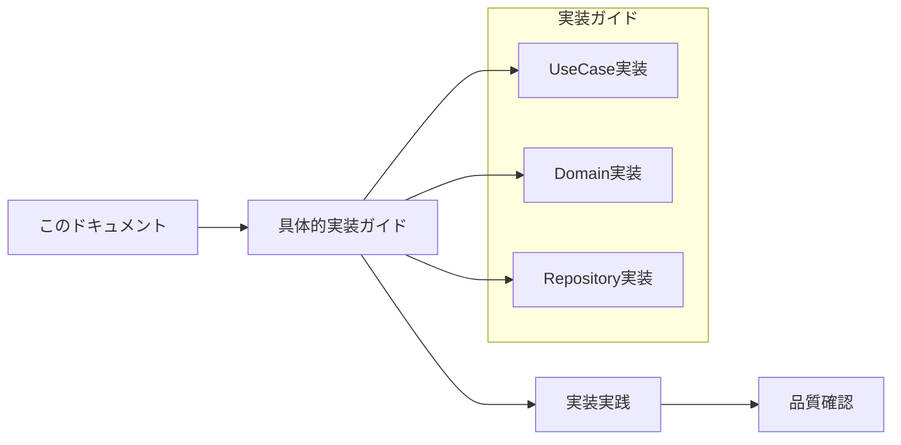
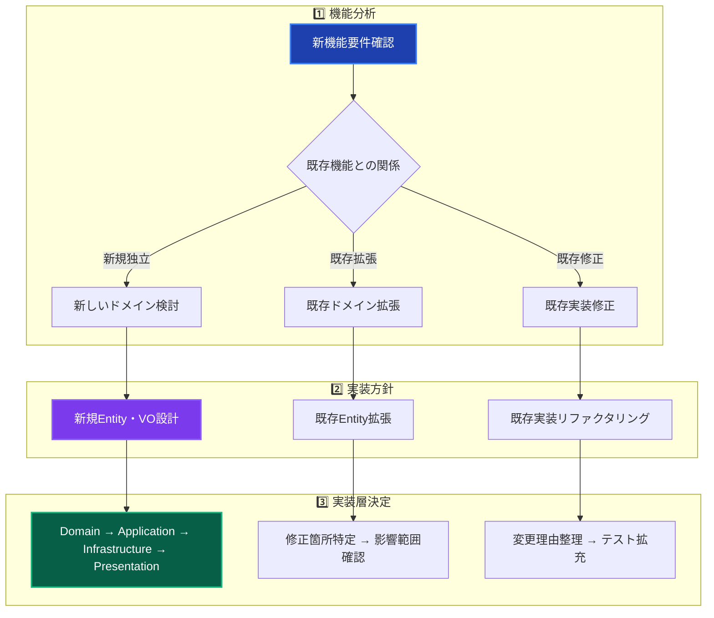
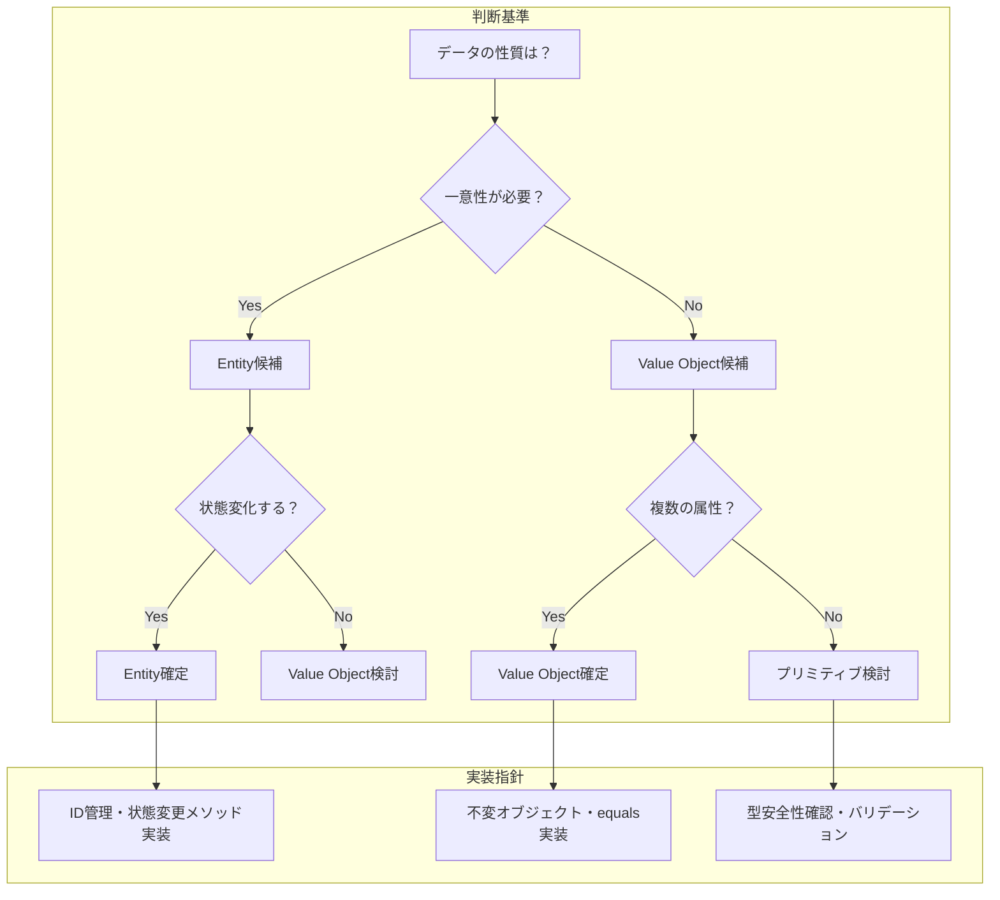
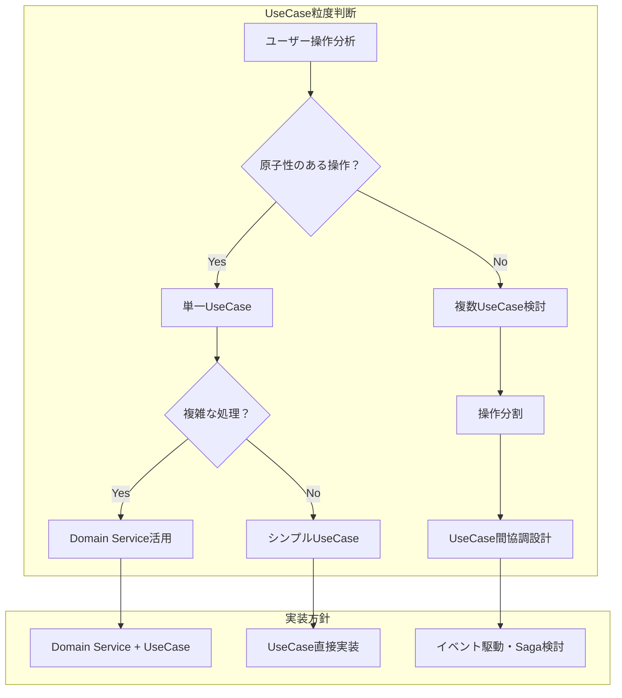
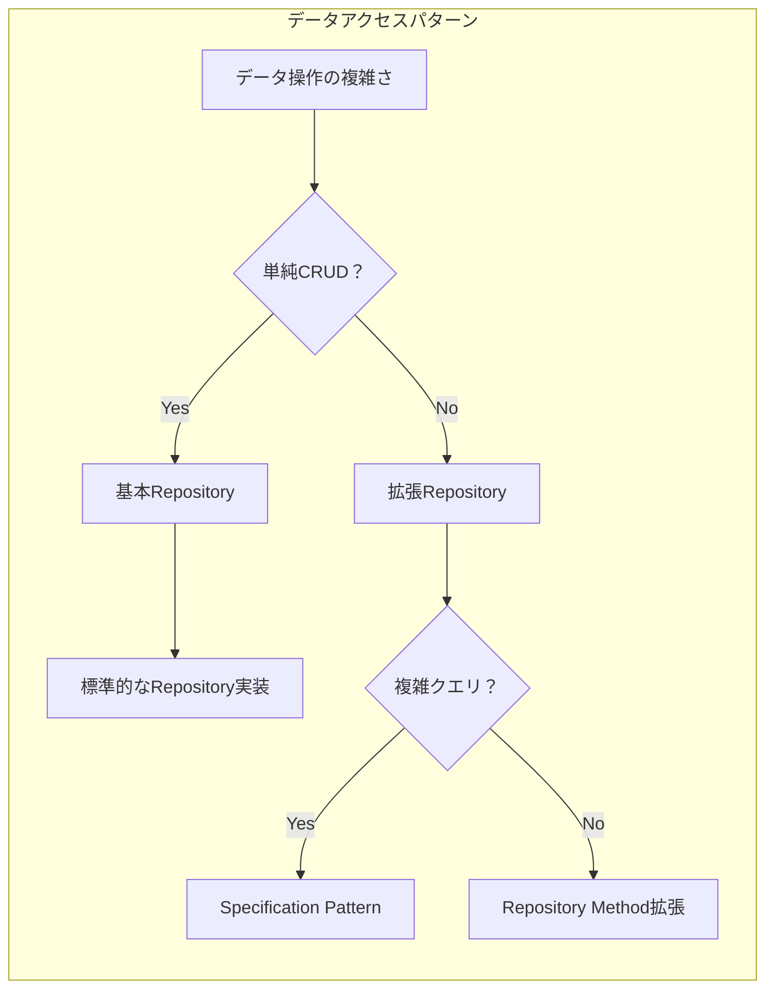
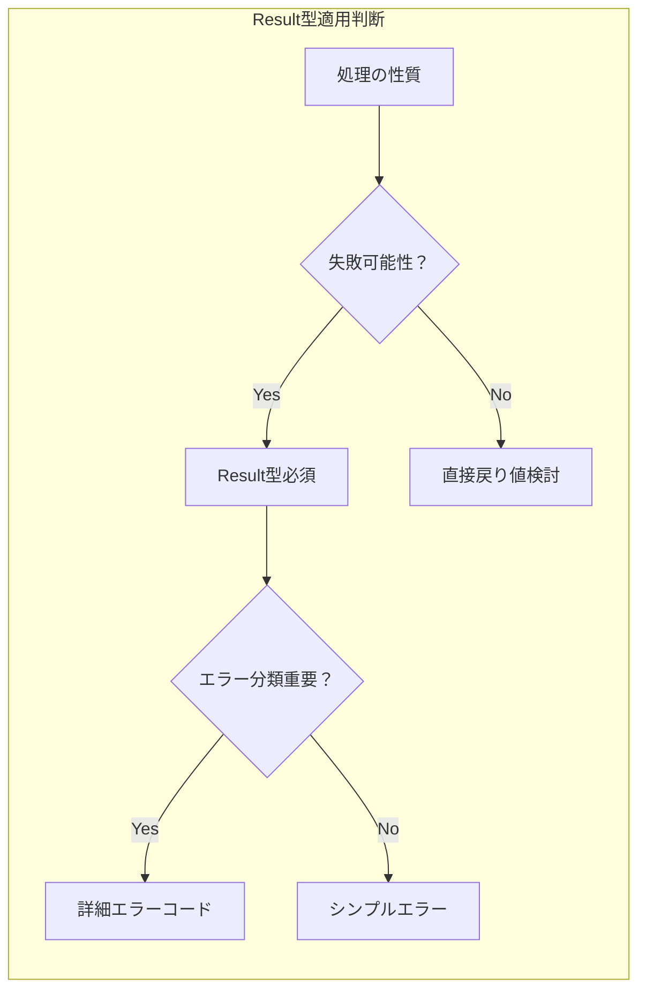
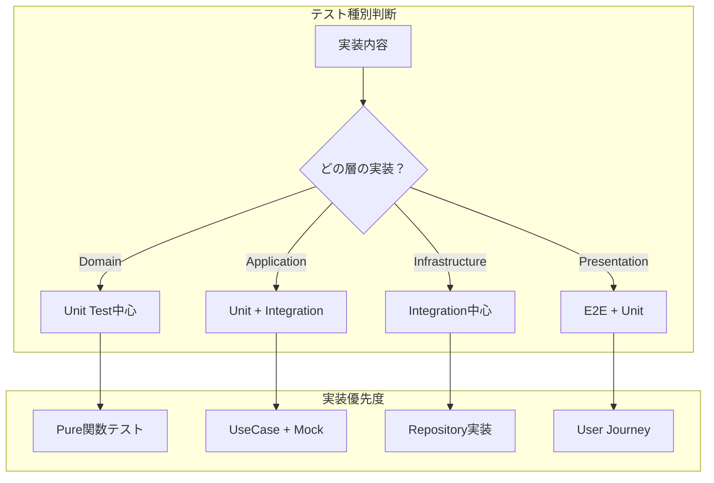
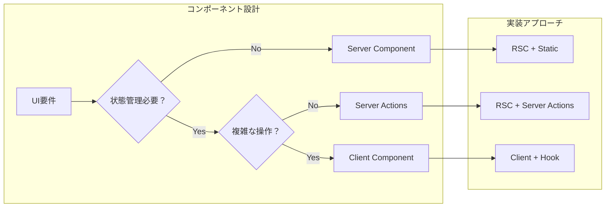
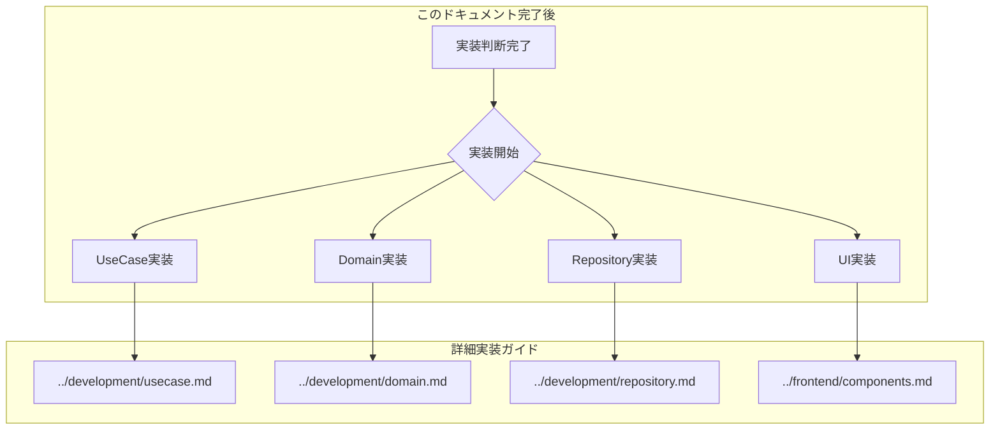

# 実装判断ガイド 🎯

理論から実践への架け橋 - 適切な実装選択のための決定支援

---

## 📖 このドキュメントについて

### 🎯 目的

- **概念理解後**: アーキテクチャ理解 → 実装選択の判断支援
- **実装迷子解決**: 「どう実装すればいいか分からない」状況の解決
- **品質保証**: アーキテクチャ準拠の実装パターン提供

### 📚 前提知識

- **必須**: [アーキテクチャ概要](../../architecture/overview.md) 理解
- **推奨**: [設計原則](../../architecture/principles.md) 読了
- **参考**: [開発フロー](../development/workflow.md) 確認

### 🔗 このドキュメント後の流れ



---

## 🚀 実装開始前の判断フロー

### 🎯 機能分析・実装方針決定



### 🏗️ レイヤー実装順序の決定

| 実装パターン | 開始レイヤー | 実装順序 | 適用ケース |
|-------------|-------------|----------|------------|
| **新規ドメイン** | Domain | Domain → Application → Infrastructure → Presentation | 完全に新しいビジネス概念 |
| **既存拡張** | Application | Application → Domain → Infrastructure → Presentation | 既存ドメインの新UseCase |
| **UI改善** | Presentation | Presentation → Application | 表示・操作性の改善 |
| **データ拡張** | Infrastructure | Infrastructure → Domain → Application | 新しいデータソース統合 |
| **パフォーマンス** | 問題箇所 | 測定 → 特定 → 最適化 → 検証 | 既存機能の性能改善 |

---

## 🎭 パターン別実装判断

### 💎 Value Object vs Entity 判断



#### 実装判断チェックリスト

**Entity判断 ✅**

- [ ] 一意性のある識別子が必要
- [ ] 時間とともに状態が変化する
- [ ] ライフサイクル管理が必要
- [ ] 他のオブジェクトから参照される

**Value Object判断 ✅**

- [ ] 値そのものに意味がある
- [ ] 一度作成したら変更しない
- [ ] 同じ値なら等価とみなせる
- [ ] 複数の属性の組み合わせで意味を持つ

#### 実装例指針

```typescript
// Entity パターン
class User {
  private constructor(
    private readonly id: UserId,
    private name: UserName,
    private email: Email
  ) {}
  
  // 状態変更メソッド
  changeName(newName: UserName): void {
    this.name = newName;
  }
}

// Value Object パターン  
class Email {
  private constructor(private readonly value: string) {}
  
  static create(value: string): Result<Email> {
    // バリデーション + 不変オブジェクト作成
  }
  
  equals(other: Email): boolean {
    return this.value === other.value;
  }
}
```

### 🎯 UseCase設計判断



#### UseCase設計指針

**単一責任の原則適用**

```typescript
// ✅ 適切なUseCase粒度
class CreateUserUseCase {
  async execute(request: CreateUserRequest): Promise<Result<CreateUserResponse>> {
    // 1つの明確な責任：ユーザー作成
  }
}

// ❌ 責任が広すぎる例
class UserManagementUseCase {
  // 複数の責任を持ちすぎ
  async createUser() { /* ... */ }
  async deleteUser() { /* ... */ }
  async sendEmail() { /* ... */ }
}
```

### 🗃️ Repository実装パターン判断



#### Repository実装指針

**基本パターン vs 拡張パターン**

```typescript
// 基本Repository（単純CRUD）
interface IUserRepository {
  findById(id: UserId): Promise<User | null>;
  save(user: User): Promise<void>;
  delete(id: UserId): Promise<void>;
}

// 拡張Repository（複雑クエリ）
interface IUserRepository extends IBasicRepository<User> {
  findByEmail(email: Email): Promise<User | null>;
  findActiveUsersCreatedAfter(date: Date): Promise<User[]>;
  // Specification Pattern活用
  findByCriteria(spec: UserSpecification): Promise<User[]>;
}
```

---

## 🔄 技術選択判断ガイド

### 💉 依存性注入パターン選択

```mermaid
graph TB
    subgraph "使用箇所判断"
        A[コードの場所] --> B{どのレイヤー？}
        B -->|Service層| C[Constructor Injection]
        B -->|UI層| D["resolve関数"]
        B -->|テスト| E[Mock注入]
    end
    
    subgraph "実装方針"
        C --> F[@inject デコレータ使用]
        D --> G[resolve('ServiceName')]
        E --> H[setupTestEnvironment()]
    end
```

#### DI実装判断チェックリスト

**Constructor Injection使用 ✅**

- [ ] Service層（Application/Domain/Infrastructure）
- [ ] 安定した依存関係
- [ ] ライフサイクル管理が重要

**resolve()関数使用 ✅**

- [ ] Presentation層（Server Actions/Components）
- [ ] 動的な依存解決
- [ ] 必要時のみサービス取得

### 🎆 Result型活用判断



#### Result型実装指針

```typescript
// エラー分類が重要な場合
async execute(request: SignInRequest): Promise<Result<SignInResponse>> {
  // バリデーションエラー
  if (!request.email) {
    return failure('メールアドレスが必要です', 'EMAIL_REQUIRED');
  }
  
  // ビジネスルールエラー
  if (!user) {
    return failure('ユーザーが見つかりません', 'USER_NOT_FOUND'); 
  }
  
  // インフラエラー
  try {
    // データベース操作
  } catch (error) {
    return failure('システムエラー', 'SYSTEM_ERROR');
  }
  
  return success(response);
}
```

---

## 📊 実装品質判断

### 🧪 テスト戦略選択



#### テスト実装判断基準

| レイヤー | 主要テスト | カバレッジ目標 | 実装重点 |
|---------|-----------|-------------|----------|
| **Domain** | Unit Test | 90%+ | ビジネスルール・不変条件 |
| **Application** | Unit + Integration | 94%+ | UseCase・Result型パターン |
| **Infrastructure** | Integration | 85%+ | 外部システム連携・Repository |
| **Presentation** | E2E + Unit | 80%+ | ユーザー操作・Server Actions |

### 🎨 UI実装パターン選択



#### UI実装優先順位

1. **React Server Components** - デフォルト選択
2. **Server Actions** - フォーム処理・データ更新
3. **Client Components** - 複雑なインタラクション時のみ

---

## 🎯 実装開始チェックリスト

### 📋 **新機能実装前**

#### **要件・設計確認**

- [ ] ビジネス要件の明確化完了
- [ ] [アーキテクチャ概要](../../architecture/overview.md) との整合性確認
- [ ] 既存機能への影響範囲特定
- [ ] 実装レイヤーと責務の決定

#### **技術選択確認**  

- [ ] Entity vs Value Object 判断完了
- [ ] UseCase粒度・責務確認
- [ ] Repository パターン選択
- [ ] DI パターン決定（Constructor vs resolve）
- [ ] Result型適用箇所特定

#### **実装準備**

- [ ] [開発フロー](../development/workflow.md) 確認
- [ ] 実装順序決定（Domain → Application → Infrastructure → Presentation）
- [ ] テスト戦略策定（Unit/Integration/E2E）
- [ ] [関連実装ガイド](../development/) 特定

### 🧪 **実装中の品質確認**

#### **コード品質**

- [ ] [コーディング規約](../standards/coding.md) 準拠
- [ ] レイヤー責務の適切な分離
- [ ] 依存関係方向の正確性（外側→内側）
- [ ] Result型による統一エラーハンドリング

#### **テスト品質**

- [ ] レイヤー別カバレッジ目標達成
- [ ] Result型パターン対応テスト実装
- [ ] [自動モック](../../testing/unit/mocking.md) 活用
- [ ] エラーケース網羅確認

### 🚀 **実装完了後**

#### **動作確認**

- [ ] 機能要件の動作確認完了
- [ ] [E2Eテスト](../../testing/e2e/overview.md) 実行・合格
- [ ] パフォーマンス要件確認
- [ ] 既存機能への影響確認

#### **品質保証**

- [ ] 全テスト実行・合格
- [ ] `pnpm lint` / `pnpm type-check` 合格
- [ ] [トラブルシューティング](../../troubleshooting/common-issues.md) 参照・問題解決
- [ ] コードレビュー実施

---

## 🔗 次のステップと関連ドキュメント

### 🛠️ **実装段階別詳細ガイド**



### 📚 **参考ドキュメント・関連情報**

| 実装フェーズ | 主要ガイド | 設計参考 | 問題解決 |
|-------------|-----------|---------|----------|
| **Domain実装** | [Domain実装ガイド](../development/domain.md) | [ドメイン層詳細](../../architecture/layers/domain.md) | [Domain問題](../../troubleshooting/development/domain.md) |
| **UseCase実装** | [UseCase実装ガイド](../development/usecase.md) | [Result型パターン](../../architecture/patterns/result-pattern.md) | [DI問題](../../troubleshooting/development/dependency-injection.md) |
| **Repository実装** | [Repository実装ガイド](../development/repository.md) | [インフラ層詳細](../../architecture/layers/infrastructure.md) | [DB問題](../../troubleshooting/development/database.md) |
| **UI実装** | [コンポーネント開発](../frontend/components.md) | [プレゼンテーション層](../../architecture/layers/presentation.md) | [フロントエンド問題](../../troubleshooting/frontend/) |

### 🎓 **継続的スキル向上**

- **実装パターン習得**: 本ガイド → [設計パターン詳細](../../architecture/patterns/)
- **品質向上**: [テスト戦略](../../testing/strategy.md) → [品質指標](../standards/quality.md)
- **チーム開発**: [開発フロー](../development/workflow.md) → [チーム協働](../team/)

---

**🎯 適切な判断により、アーキテクチャに準拠した高品質な実装を実現しましょう！**
