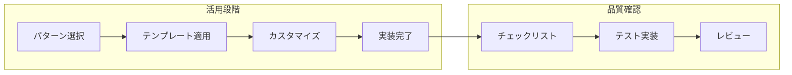
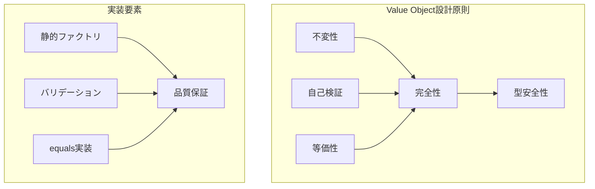
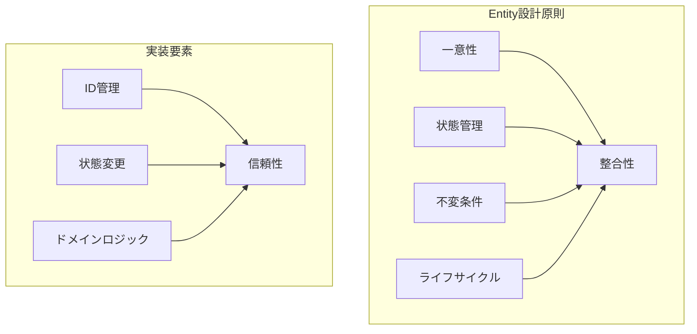
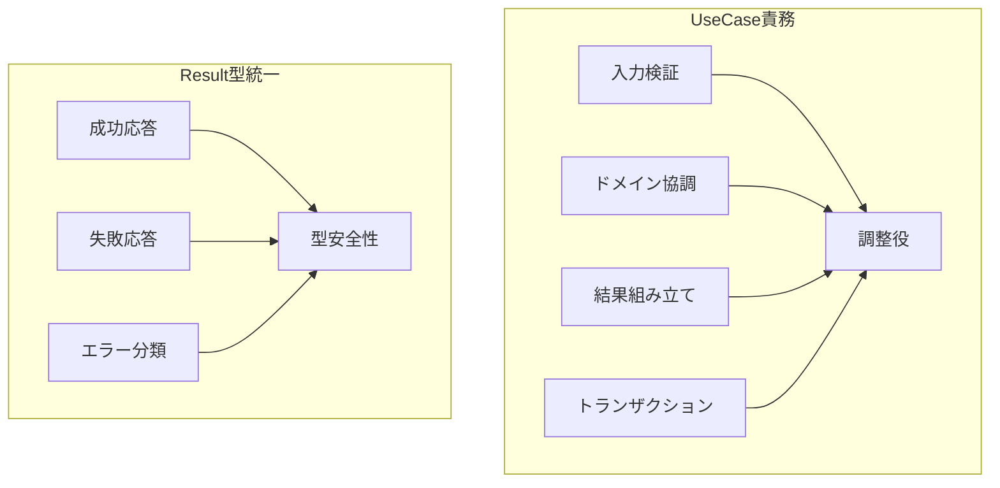
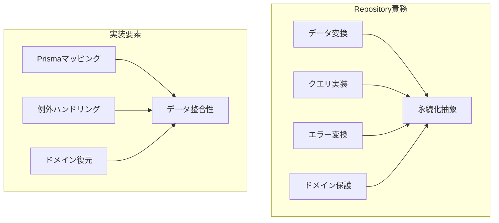
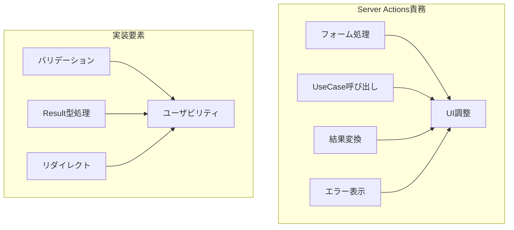
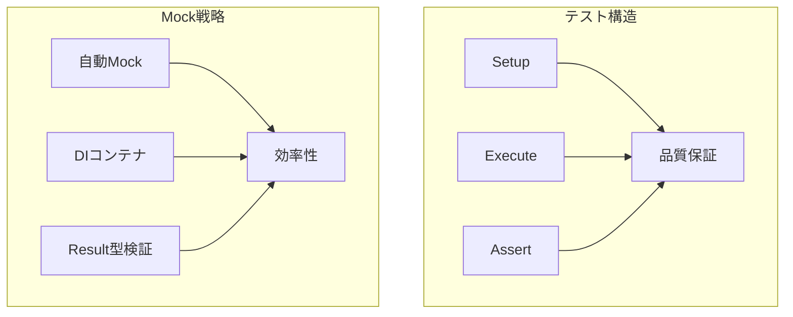
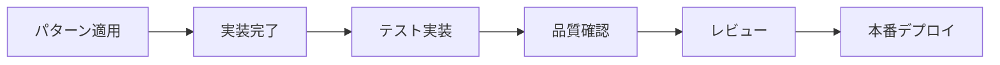

# 実装パターンガイド 🧩

理論を実践に変える具体的なパターンと事例集

---

## 📖 このドキュメントについて

### 🎯 目的

- **実装迷い解消**: 「どう書けばいいか分からない」を解決
- **パターン提供**: 実証済みの実装パターンを提示
- **品質統一**: チーム全体での一貫した実装品質確保

### 📚 前提知識

- **必須**: [実装判断ガイド](decision-guide.md) 読了
- **推奨**: [アーキテクチャ概要](../../architecture/overview.md) 理解
- **参考**: [設計原則](../../architecture/principles.md) | [開発フロー](../development/workflow.md)

### 🔄 このドキュメントの活用方法



---

## 🏗️ レイヤー別実装パターン

### 👑 Domain Layer パターン

#### 💎 Value Object実装テンプレート



**基本テンプレート:**

```typescript
// Email Value Object の標準実装パターン
export class Email {
 private constructor(private readonly value: string) {}

 // 静的ファクトリメソッド（必須）
 static create(value: string): Result<Email> {
  // 1. 入力値検証
  if (!value || value.trim().length === 0) {
   return failure('メールアドレスが入力されていません', 'EMAIL_REQUIRED');
  }

  // 2. フォーマット検証
  const emailRegex = /^[^\s@]+@[^\s@]+\.[^\s@]+$/;
  if (!emailRegex.test(value)) {
   return failure(
    'メールアドレスの形式が正しくありません',
    'EMAIL_INVALID_FORMAT',
   );
  }

  // 3. ビジネスルール検証
  if (value.length > 254) {
   return failure('メールアドレスが長すぎます', 'EMAIL_TOO_LONG');
  }

  return success(new Email(value.toLowerCase().trim()));
 }

 // 値取得メソッド（必須）
 toString(): string {
  return this.value;
 }

 // 等価性判定（必須）
 equals(other: Email): boolean {
  return this.value === other.value;
 }

 // ドメインメソッド（必要に応じて）
 getDomain(): string {
  return this.value.split('@')[1];
 }

 isBusinessDomain(): boolean {
  const businessDomains = ['company.com', 'business.org'];
  return businessDomains.includes(this.getDomain());
 }
}
```

**適用チェックリスト:**

- [ ] 静的ファクトリメソッドでのインスタンス生成
- [ ] Result型による安全なオブジェクト作成
- [ ] 段階的バリデーション（入力→フォーマット→ビジネスルール）
- [ ] 不変性の保証（readonlyフィールド）
- [ ] 等価性判定の実装

#### 🏰 Entity実装テンプレート



**基本テンプレート:**

```typescript
// User Entity の標準実装パターン
export class User {
 private constructor(
  private readonly id: UserId,
  private name: UserName,
  private email: Email,
  private readonly createdAt: Date,
  private updatedAt: Date,
 ) {}

 // 新規作成ファクトリメソッド
 static create(name: UserName, email: Email): Result<User> {
  const id = UserId.generate();
  const now = new Date();

  const user = new User(id, name, email, now, now);

  // ドメインルール検証
  const validationResult = user.validate();
  if (isFailure(validationResult)) {
   return validationResult;
  }

  return success(user);
 }

 // 復元ファクトリメソッド（Repository用）
 static reconstruct(
  id: UserId,
  name: UserName,
  email: Email,
  createdAt: Date,
  updatedAt: Date,
 ): User {
  return new User(id, name, email, createdAt, updatedAt);
 }

 // 状態変更メソッド（ビジネスルール含む）
 changeName(newName: UserName): Result<void> {
  // ビジネスルール: 名前変更の制限
  if (this.createdAt.getTime() > Date.now() - 24 * 60 * 60 * 1000) {
   return failure(
    'アカウント作成から24時間以内は名前変更できません',
    'NAME_CHANGE_TOO_SOON',
   );
  }

  this.name = newName;
  this.updatedAt = new Date();
  return success(undefined);
 }

 changeEmail(newEmail: Email): Result<void> {
  // ビジネスルール: 同じメールアドレスへの変更防止
  if (this.email.equals(newEmail)) {
   return failure('現在と同じメールアドレスです', 'EMAIL_UNCHANGED');
  }

  this.email = newEmail;
  this.updatedAt = new Date();
  return success(undefined);
 }

 // public readonlyでプロパティに直接アクセス可能
 // getter メソッドは不要（user.id, user.name, user.email でアクセス）

 // ドメインメソッド
 isNewUser(): boolean {
  const hoursSinceCreation =
   (Date.now() - this.createdAt.getTime()) / (1000 * 60 * 60);
  return hoursSinceCreation < 48; // 48時間以内は新規ユーザー
 }

 // 不変条件検証
 private validate(): Result<void> {
  // 必要に応じてエンティティ全体の整合性チェック
  return success(undefined);
 }
}
```

**適用チェックリスト:**

- [ ] 一意なID（UserId）による識別
- [ ] 作成・復元の分離されたファクトリメソッド
- [ ] Result型による安全な状態変更
- [ ] ビジネスルールを含む変更メソッド
- [ ] 適切なアクセサーとドメインメソッド

### 📋 Application Layer パターン

#### 🎯 UseCase実装テンプレート



**基本テンプレート:**

```typescript
// CreateUser UseCase の標準実装パターン
@injectable()
export class CreateUserUseCase {
 constructor(
  @inject(INJECTION_TOKENS.UserRepository)
  private readonly userRepository: IUserRepository,
  @inject(INJECTION_TOKENS.HashService)
  private readonly hashService: IHashService,
  @inject(INJECTION_TOKENS.Logger)
  private readonly logger: ILogger,
 ) {}

 async execute(
  request: CreateUserRequest,
 ): Promise<Result<CreateUserResponse>> {
  // 1. ログ出力（処理開始）
  this.logger.info('ユーザー作成処理開始', { email: request.email });

  try {
   // 2. 入力値検証・Value Object作成（コンストラクタ + DomainError パターン）
   let email: Email;
   let userName: UserName;

   try {
    email = new Email(request.email);
   } catch (error) {
    if (error instanceof DomainError) {
     this.logger.warn('メールアドレス検証失敗', {
      email: request.email,
      error: error.message,
     });
     return failure(error.message, error.code);
    }
    return failure('メールアドレスが無効です', 'INVALID_EMAIL');
   }

   try {
    userName = new UserName(request.name);
   } catch (error) {
    if (error instanceof DomainError) {
     this.logger.warn('ユーザー名検証失敗', {
      name: request.name,
      error: error.message,
     });
     return failure(error.message, error.code);
    }
    return failure('ユーザー名が無効です', 'INVALID_NAME');
   }

   // 3. ビジネスルール検証（重複チェック）
   const existingUser = await this.userRepository.findByEmail(email);
   if (existingUser) {
    this.logger.warn('メールアドレス重複', { email: request.email });
    return failure(
     'そのメールアドレスは既に使用されています',
     'EMAIL_ALREADY_EXISTS',
    );
   }

   // 4. パスワードハッシュ化
   const hashedPassword = await this.hashService.hash(request.password);

   // 5. エンティティ作成（ファクトリメソッドパターン）
   const user = User.create({
    name: userName,
    email: email,
    password: hashedPassword,
   });

   // 6. 永続化
   await this.userRepository.save(user);

   // 7. 応答組み立て
   // Value Object: .value で型安全にプリミティブ値を取得
   // プリミティブ型: 直接アクセス
   const response: CreateUserResponse = {
    userId: user.id.value,
    name: user.name.value,
    email: user.email.value,
    createdAt: user.createdAt.toISOString(),
   };

   // 8. ログ出力（処理完了）
   this.logger.info('ユーザー作成処理完了', { userId: response.userId });

   return success(response);
  } catch (error) {
   // インフラストラクチャエラーのハンドリング
   this.logger.error('ユーザー作成処理中にエラーが発生しました', {
    error: error instanceof Error ? error.message : 'Unknown error',
    email: request.email,
   });
   return failure(
    'ユーザー作成処理中にエラーが発生しました',
    'UNEXPECTED_ERROR',
   );
  }
 }
}

// Request/Response DTO
export interface CreateUserRequest {
 name: string;
 email: string;
 password: string;
}

export interface CreateUserResponse {
 userId: string;
 name: string;
 email: string;
 createdAt: string;
}
```

**適用チェックリスト:**

- [ ] 依存性注入による疎結合
- [ ] Result型による統一エラーハンドリング
- [ ] 段階的バリデーション（入力→ビジネスルール）
- [ ] 構造化ログ出力（開始・警告・完了・エラー）
- [ ] try-catch によるインフラエラー捕捉

### 🔧 Infrastructure Layer パターン

#### 🗃️ Repository実装テンプレート



**基本テンプレート:**

```typescript
// UserRepository の標準実装パターン
@injectable()
export class PrismaUserRepository implements IUserRepository {
 constructor(
  @inject(INJECTION_TOKENS.PrismaClient)
  private readonly prisma: PrismaClient,
  @inject(INJECTION_TOKENS.Logger)
  private readonly logger: ILogger,
 ) {}

 async findById(id: UserId): Promise<User | null> {
  try {
   this.logger.debug('ユーザー検索開始', { userId: id.value });

   const userData = await this.prisma.user.findUnique({
    where: { id: id.value },
   });

   if (!userData) {
    this.logger.debug('ユーザーが見つかりませんでした', {
     userId: id.value,
    });
    return null;
   }

   // ドメインオブジェクトへの変換
   const user = this.toDomain(userData);

   this.logger.debug('ユーザー検索完了', { userId: id.value });
   return user;
  } catch (error) {
   this.logger.error('ユーザー検索中にエラーが発生しました', {
    userId: id.value,
    error: error instanceof Error ? error.message : 'Unknown error',
   });
   throw new RepositoryError('ユーザー検索に失敗しました', error);
  }
 }

 async findByEmail(email: Email): Promise<User | null> {
  try {
   this.logger.debug('メールアドレスでユーザー検索開始', {
    email: email.value,
   });

   const userData = await this.prisma.user.findUnique({
    where: { email: email.value },
   });

   if (!userData) {
    this.logger.debug('該当ユーザーが見つかりませんでした', {
     email: email.value,
    });
    return null;
   }

   const user = this.toDomain(userData);

   this.logger.debug('メールアドレスでユーザー検索完了', {
    email: email.value,
   });
   return user;
  } catch (error) {
   this.logger.error('メールアドレスでのユーザー検索中にエラーが発生しました', {
    email: email.value,
    error: error instanceof Error ? error.message : 'Unknown error',
   });
   throw new RepositoryError('ユーザー検索に失敗しました', error);
  }
 }

 async save(user: User): Promise<void> {
  try {
   this.logger.debug('ユーザー保存開始', { userId: user.id.value });

   // ドメインオブジェクトからPrismaデータへの変換
   const userData = this.toPersistence(user);

   await this.prisma.user.upsert({
    where: { id: userData.id },
    update: {
     name: userData.name,
     email: userData.email,
     updatedAt: userData.updatedAt,
    },
    create: userData,
   });

   this.logger.info('ユーザー保存完了', { userId: user.id.value });
  } catch (error) {
   this.logger.error('ユーザー保存中にエラーが発生しました', {
    userId: user.id.value,
    error: error instanceof Error ? error.message : 'Unknown error',
   });
   throw new RepositoryError('ユーザー保存に失敗しました', error);
  }
 }

 async delete(id: UserId): Promise<void> {
  try {
   this.logger.debug('ユーザー削除開始', { userId: id.value });

   await this.prisma.user.delete({
    where: { id: id.value },
   });

   this.logger.info('ユーザー削除完了', { userId: id.value });
  } catch (error) {
   this.logger.error('ユーザー削除中にエラーが発生しました', {
    userId: id.value,
    error: error instanceof Error ? error.message : 'Unknown error',
   });
   throw new RepositoryError('ユーザー削除に失敗しました', error);
  }
 }

 // Prismaデータ → ドメインオブジェクト変換
 private toDomain(userData: any): User {
  const id = UserId.reconstruct(userData.id);
  const name = UserName.reconstruct(userData.name);
  const email = Email.reconstruct(userData.email);

  return User.reconstruct(
   id,
   name,
   email,
   userData.createdAt,
   userData.updatedAt,
  );
 }

 // ドメインオブジェクト → Prismaデータ変換
 // Value Object: .value で文字列変換
 // プリミティブ型: 直接アクセス
 private toPersistence(user: User): any {
  return {
   id: user.id.value,
   name: user.name,
   email: user.email.value,
   createdAt: user.createdAt,
   updatedAt: user.updatedAt,
  };
 }
}

// Repository専用エラークラス
export class RepositoryError extends Error {
 constructor(
  message: string,
  public readonly cause?: unknown,
 ) {
  super(message);
  this.name = 'RepositoryError';
 }
}
```

**適用チェックリスト:**

- [ ] ドメインインターフェース実装
- [ ] 双方向データ変換メソッド
- [ ] 構造化ログ出力
- [ ] Repository専用エラーハンドリング
- [ ] Prisma操作の適切な分離

### 🎨 Presentation Layer パターン

#### ⚡ Server Actions実装テンプレート



**基本テンプレート:**

```typescript
// createUser Server Action の標準実装パターン
'use server';

import { resolve } from '@/di/resolver';
import { isFailure, isSuccess } from '@/layers/application/types/Result';

import { revalidatePath } from 'next/cache';
import { redirect } from 'next/navigation';
import { z } from 'zod';

// フォームバリデーションスキーマ
const createUserSchema = z
 .object({
  name: z
   .string()
   .min(1, 'ユーザー名は必須です')
   .max(50, 'ユーザー名は50文字以内で入力してください'),
  email: z.string().email('有効なメールアドレスを入力してください'),
  password: z.string().min(8, 'パスワードは8文字以上で入力してください'),
  confirmPassword: z.string(),
 })
 .refine((data) => data.password === data.confirmPassword, {
  message: 'パスワードが一致しません',
  path: ['confirmPassword'],
 });

export async function createUserAction(
 prevState: any,
 formData: FormData,
): Promise<{
 success: boolean;
 message: string;
 errors?: Record<string, string>;
}> {
 // 1. フォームデータ抽出
 const formInput = {
  name: formData.get('name') as string,
  email: formData.get('email') as string,
  password: formData.get('password') as string,
  confirmPassword: formData.get('confirmPassword') as string,
 };

 // 2. フォームバリデーション
 const validationResult = createUserSchema.safeParse(formInput);
 if (!validationResult.success) {
  return {
   success: false,
   message: '入力内容に問題があります',
   errors: validationResult.error.flatten().fieldErrors as Record<
    string,
    string
   >,
  };
 }

 // 3. UseCase実行
 try {
  // 型安全な resolve 関数でUseCase取得
  const createUserUseCase = resolve('CreateUserUseCase');

  const result = await createUserUseCase.execute({
   name: validationResult.data.name,
   email: validationResult.data.email,
   password: validationResult.data.password,
  });

  // 4. Result型による結果処理
  if (isFailure(result)) {
   return {
    success: false,
    message: result.error.message || 'ユーザー作成に失敗しました',
   };
  }

  // 5. 成功時の処理
  revalidatePath('/users'); // キャッシュ無効化

  return {
   success: true,
   message: 'ユーザーを作成しました',
  };
 } catch (error) {
  console.error('ユーザー作成中にエラーが発生しました:', error);
  return {
   success: false,
   message: 'システムエラーが発生しました。時間をおいて再度お試しください',
  };
 }
}

// リダイレクト版Server Action
export async function createUserWithRedirectAction(
 formData: FormData,
): Promise<void> {
 const formInput = {
  name: formData.get('name') as string,
  email: formData.get('email') as string,
  password: formData.get('password') as string,
 };

 // バリデーション（簡素版）
 if (!formInput.name || !formInput.email || !formInput.password) {
  redirect('/register?error=validation');
 }

 try {
  // 型安全な resolve 関数でUseCase取得
  const createUserUseCase = resolve('CreateUserUseCase');

  const result = await createUserUseCase.execute(formInput);

  if (isFailure(result)) {
   redirect(`/register?error=${encodeURIComponent(result.error.message)}`);
  }

  // 成功時のリダイレクト
  redirect('/dashboard?message=user-created');
 } catch (error) {
  console.error('ユーザー作成中にエラーが発生しました:', error);
  redirect('/register?error=system');
 }
}
```

**適用チェックリスト:**

- [ ] 'use server' ディレクティブ
- [ ] zodによるフォームバリデーション
- [ ] resolve()による動的サービス取得
- [ ] Result型による結果判定
- [ ] 適切なエラーメッセージ返却

---

## 🧪 テストパターン

### 🎭 自動モックを活用したテストパターン



**UseCase テストテンプレート:**

```typescript
import { container } from '@/di/container';
import { resolve } from '@/di/resolver';
import { INJECTION_TOKENS } from '@/di/tokens';
import { isFailure, isSuccess } from '@/layers/application/types/Result';

import { setupTestEnvironment } from '@tests/utils/helpers/testHelpers';
import {
 createAutoMockHashService,
 createAutoMockLogger,
 createAutoMockUserRepository,
} from '@tests/utils/mocks/autoMocks';
import { beforeEach, describe, expect, it } from 'vitest';
import { MockProxy } from 'vitest-mock-extended';

describe('CreateUserUseCase', () => {
 // テスト環境自動セットアップ
 setupTestEnvironment();

 let createUserUseCase: CreateUserUseCase;
 let mockUserRepository: MockProxy<IUserRepository>;
 let mockHashService: MockProxy<IHashService>;
 let mockLogger: MockProxy<ILogger>;

 beforeEach(() => {
  // 自動モック生成
  mockUserRepository = createAutoMockUserRepository();
  mockHashService = createAutoMockHashService();
  mockLogger = createAutoMockLogger();

  // DIコンテナにモック登録
  container.registerInstance(
   INJECTION_TOKENS.UserRepository,
   mockUserRepository,
  );
  container.registerInstance(INJECTION_TOKENS.HashService, mockHashService);
  container.registerInstance(INJECTION_TOKENS.Logger, mockLogger);

  // 型安全な resolve 関数で UseCase 取得
  createUserUseCase = resolve('CreateUserUseCase');
 });

 describe('正常系', () => {
  it('有効な入力でユーザーを作成できる', async () => {
   // Arrange
   const validRequest = {
    name: 'テストユーザー',
    email: 'test@example.com',
    password: 'password123',
   };

   mockUserRepository.findByEmail.mockResolvedValue(null); // 重複なし
   mockHashService.hash.mockResolvedValue('hashed_password_123');

   // Act
   const result = await createUserUseCase.execute(validRequest);

   // Assert
   expect(isSuccess(result)).toBe(true);
   if (isSuccess(result)) {
    expect(result.data).toMatchObject({
     name: 'テストユーザー',
     email: 'test@example.com',
    });
    expect(result.data.userId).toBeDefined();
    expect(result.data.createdAt).toBeDefined();
   }

   // Mock呼び出し確認
   expect(mockUserRepository.findByEmail).toHaveBeenCalledWith(
    expect.objectContaining({ value: 'test@example.com' }),
   );
   expect(mockHashService.hash).toHaveBeenCalledWith('password123');
   expect(mockUserRepository.save).toHaveBeenCalledWith(expect.any(User));
   expect(mockLogger.info).toHaveBeenCalledWith('ユーザー作成処理開始', {
    email: 'test@example.com',
   });
  });
 });

 describe('異常系', () => {
  it('無効なメールアドレス形式の場合は失敗する', async () => {
   // Arrange
   const invalidRequest = {
    name: 'テストユーザー',
    email: 'invalid-email',
    password: 'password123',
   };

   // Act
   const result = await createUserUseCase.execute(invalidRequest);

   // Assert
   expect(isFailure(result)).toBe(true);
   if (isFailure(result)) {
    expect(result.error.message).toBe('メールアドレスの形式が正しくありません');
    expect(result.error.code).toBe('EMAIL_INVALID_FORMAT');
   }

   // Repository は呼び出されない
   expect(mockUserRepository.findByEmail).not.toHaveBeenCalled();
  });

  it('メールアドレス重複の場合は失敗する', async () => {
   // Arrange
   const duplicateRequest = {
    name: 'テストユーザー',
    email: 'existing@example.com',
    password: 'password123',
   };

   const existingUser = User.create({
    name: new UserName('既存ユーザー'),
    email: new Email('existing@example.com'),
    password: 'hashed_password',
   });

   mockUserRepository.findByEmail.mockResolvedValue(existingUser);

   // Act
   const result = await createUserUseCase.execute(duplicateRequest);

   // Assert
   expect(isFailure(result)).toBe(true);
   if (isFailure(result)) {
    expect(result.error.message).toBe(
     'そのメールアドレスは既に使用されています',
    );
    expect(result.error.code).toBe('EMAIL_ALREADY_EXISTS');
   }

   expect(mockUserRepository.findByEmail).toHaveBeenCalled();
   expect(mockUserRepository.save).not.toHaveBeenCalled();
  });

  it('Repository例外発生時はシステムエラーを返す', async () => {
   // Arrange
   const validRequest = {
    name: 'テストユーザー',
    email: 'test@example.com',
    password: 'password123',
   };

   mockUserRepository.findByEmail.mockRejectedValue(
    new Error('Database connection failed'),
   );

   // Act
   const result = await createUserUseCase.execute(validRequest);

   // Assert
   expect(isFailure(result)).toBe(true);
   if (isFailure(result)) {
    expect(result.error.message).toBe(
     'ユーザー作成処理中にエラーが発生しました',
    );
    expect(result.error.code).toBe('UNEXPECTED_ERROR');
   }

   expect(mockLogger.error).toHaveBeenCalledWith(
    'ユーザー作成処理中にエラーが発生しました',
    expect.objectContaining({
     error: 'Database connection failed',
     email: 'test@example.com',
    }),
   );
  });
 });
});
```

**テスト実装チェックリスト:**

- [ ] setupTestEnvironment() によるDIコンテナリセット
- [ ] 自動モック生成の活用（vitest-mock-extended）
- [ ] Result型パターンでの結果検証
- [ ] 成功・失敗・エラーケースの網羅
- [ ] Mock呼び出し確認による振る舞い検証

---

## 🔗 パターン適用ガイドライン

### 📊 パターン選択マトリックス

| 実装対象           | 適用パターン       | 品質観点           | 参考ドキュメント                                                   |
| ------------------ | ------------------ | ------------------ | ------------------------------------------------------------------ |
| **Value Object**   | 不変オブジェクト   | バリデーション     | [Value Objects](../ddd/layers/components/value-objects.md)         |
| **Entity**         | ライフサイクル管理 | 状態整合性         | [Entities](../ddd/layers/components/entities.md)                   |
| **UseCase**        | Result型統一       | エラーハンドリング | [UseCases](../ddd/layers/components/use-cases.md)                  |
| **Repository**     | データ変換分離     | ドメイン保護       | [Repository実装](../ddd/layers/components/repository-implementations.md) |
| **Server Actions** | フォーム処理       | ユーザビリティ     | [Server Actions](../ddd/layers/components/server-actions.md)       |

### 🎯 品質確保のポイント

#### **実装品質基準**

1. **型安全性**: Result型による統一エラーハンドリング
2. **テスタビリティ**: 自動モック対応設計
3. **保守性**: 責務分離とレイヤー遵守
4. **信頼性**: 包括的エラーケース対応

#### **継続的改善**

1. **パターン見直し**: 実装経験による最適化
2. **チーム共有**: 効果的パターンの水平展開
3. **品質監視**: メトリクス観測による改善

---

## 🚀 次のステップ

### 🛠️ **パターン適用後の流れ**



### 📚 **深掘り学習リソース**

- **実装詳細**: [DDD実装ガイド](../ddd/layers/) で具体的な実装方法を学習
- **アーキテクチャ理解**: [依存性注入パターン](../../architecture/patterns/dependency-injection.md) で理論を深化
- **品質向上**: [テスト戦略](../../testing/strategy.md) で品質保証手法を習得

---

**🧩 実証済みパターンで、効率的かつ高品質な実装を実現しましょう！**
