# 段階的実装フローガイド 📈

概念から実装まで - 迷わないための具体的ステップ

---

## 📖 このドキュメントについて

### 🎯 目的

- **実装ロードマップ**: 概念理解から実装完了までの明確な道筋
- **段階的アプローチ**: 複雑な実装を管理可能なステップに分解
- **実践的ガイド**: 各ステップでの具体的な作業内容と成果物

### 📚 前提知識

- **必須**: [実装判断ガイド](decision-guide.md) + [実装パターンガイド](patterns-guide.md) 読了
- **推奨**: [アーキテクチャ概要](../../architecture/overview.md) 理解
- **参考**: [開発フロー](../development/workflow.md) | [テスト戦略](../../testing/strategy.md)

### 🔄 このガイドの活用方法

```mermaid
graph LR
    subgraph "段階的実装"
        A[ステップ確認] --> B[作業実行] --> C[成果確認] --> D[次ステップ]
    end

    subgraph "品質保証"
        C --> E[テスト実装] --> F[レビュー] --> G[完了]
    end

    D --> A
```

---

## 🚀 新機能実装：完全フロー

### 📋 Phase 1: 要件分析・設計 (30-60分)

#### Step 1-1: 要件理解と分析

```mermaid
graph TB
    subgraph "要件分析"
        A[ビジネス要件確認] --> B[技術要件整理]
        B --> C[制約条件特定]
        C --> D[成功基準定義]
    end

    subgraph "成果物"
        E[要件定義書]
        F[技術制約リスト]
        G[受け入れ条件]
    end

    D --> E
    D --> F
    D --> G
```

**作業内容:**

1. **ビジネス要件のヒアリング・整理**

   - [ ] 機能の目的・価値の確認
   - [ ] ユーザーストーリーの明確化
   - [ ] 業務フロー・制約条件の把握

2. **技術要件の抽出**
   - [ ] 性能要件（レスポンス時間・スループット）
   - [ ] セキュリティ要件（認証・認可・データ保護）
   - [ ] 可用性要件（稼働率・障害復旧）

**成果確認:**

- [ ] 要件が明確に文書化されている
- [ ] 曖昧な部分がない（必要に応じて再確認）
- [ ] 実装可能性が技術的に確認されている

#### Step 1-2: アーキテクチャ適合性確認

```mermaid
graph LR
    subgraph "適合性チェック"
        A[既存アーキテクチャ] --> B{適合するか？}
        B -->|Yes| C[既存パターン活用]
        B -->|Partial| D[パターン拡張]
        B -->|No| E[新パターン検討]
    end

    subgraph "決定事項"
        F[実装方針]
        G[使用パターン]
        H[影響範囲]
    end

    C --> F
    D --> G
    E --> H
```

**作業内容:**

1. **[アーキテクチャ概要](../../architecture/overview.md) との照合**

   - [ ] 既存レイヤー構成での実現可能性確認
   - [ ] Clean Architecture原則との整合性確認
   - [ ] 依存関係方向の妥当性確認

2. **既存実装との関係分析**
   - [ ] 類似機能の実装パターン調査
   - [ ] 再利用可能なコンポーネント特定
   - [ ] 既存機能への影響範囲評価

**成果確認:**

- [ ] 実装レイヤーと責務が明確化されている
- [ ] 既存システムとの整合性が確認されている
- [ ] 影響範囲と変更ポイントが特定されている

#### Step 1-3: 実装計画策定

```mermaid
graph TB
    subgraph "実装計画"
        A[レイヤー順序決定] --> B[実装タスク分解]
        B --> C[依存関係整理]
        C --> D[スケジュール策定]
    end

    subgraph "品質計画"
        E[テスト戦略]
        F[レビュー計画]
        G[検証手順]
    end

    D --> E
    D --> F
    D --> G
```

**作業内容:**

1. **実装順序の決定**

   - [ ] [実装判断ガイド](decision-guide.md) に基づく順序決定
   - [ ] 新規ドメイン vs 既存拡張の判断
   - [ ] レイヤー間の実装依存関係整理

2. **タスク分解・見積もり**
   - [ ] 各レイヤーの実装タスク詳細化
   - [ ] テスト実装タスクの計画
   - [ ] レビュー・検証ポイントの設定

**成果確認:**

- [ ] 実装順序と各タスクが明確化されている
- [ ] 実装工数の見積もりが適切である
- [ ] テスト・品質保証計画が策定されている

---

### 👑 Phase 2: Domain Layer実装 (60-120分)

#### Step 2-1: Value Object設計・実装

```mermaid
graph TB
    subgraph "Value Object実装"
        A[概念モデリング] --> B[属性・制約定義]
        B --> C[バリデーション実装]
        C --> D[テスト実装]
    end

    subgraph "品質確認"
        E[境界値テスト]
        F[バリデーション確認]
        G[不変性確認]
    end

    D --> E
    D --> F
    D --> G
```

**作業内容:**

1. **概念分析・モデリング**

   - [ ] 業務概念の Value Object 抽出
   - [ ] [パターンガイド](patterns-guide.md) のValue Objectテンプレート参照
   - [ ] 属性・制約条件・ビジネスルールの整理

2. **実装作業**

   ```typescript
   // 実装例：UserId Value Object
   export class UserId {
    private constructor(private readonly value: string) {}

    static create(value: string): Result<UserId> {
     // バリデーション実装
    }

    static generate(): UserId {
     // 新ID生成実装
    }

    toString(): string {
     return this.value;
    }
    equals(other: UserId): boolean {
     return this.value === other.value;
    }
   }
   ```

3. **テスト実装**
   - [ ] 正常系テスト（有効な値での作成）
   - [ ] 異常系テスト（バリデーションエラー）
   - [ ] 境界値テスト（最小・最大値）
   - [ ] 等価性テスト（equals メソッド）

**成果確認:**

- [ ] Value Object が [パターンガイド](patterns-guide.md) に準拠している
- [ ] 全テストが成功している（カバレッジ90%以上）
- [ ] ビジネスルールが適切に実装されている

#### Step 2-2: Entity設計・実装

```mermaid
graph LR
    subgraph "Entity実装"
        A[一意性設計] --> B[状態管理]
        B --> C[ビジネスロジック]
        C --> D[不変条件]
    end

    subgraph "実装要素"
        E[ID管理]
        F[ファクトリメソッド]
        G[状態変更メソッド]
    end

    D --> E
    D --> F
    D --> G
```

**作業内容:**

1. **Entity設計**

   - [ ] 一意識別子（ID）の設計
   - [ ] ライフサイクル管理の設計
   - [ ] 状態変更ルールの定義

2. **実装作業**

   ```typescript
   // 実装例：User Entity
   export class User {
    private constructor(
     private readonly id: UserId,
     private name: UserName,
     private email: Email,
     // ...
    ) {}

    static create(name: UserName, email: Email): Result<User> {
     // 新規作成ファクトリ
    }

    static reconstruct(/* parameters */): User {
     // 復元ファクトリ（Repository用）
    }

    changeName(newName: UserName): Result<void> {
     // ビジネスルール付き状態変更
    }
   }
   ```

3. **包括的テスト実装**
   - [ ] 作成ファクトリテスト
   - [ ] 状態変更メソッドテスト
   - [ ] ビジネスルール検証テスト
   - [ ] 不変条件テスト

**成果確認:**

- [ ] Entity が [パターンガイド](patterns-guide.md) に準拠している
- [ ] ビジネスルールが適切に実装・テストされている
- [ ] 不変条件が保証されている

#### Step 2-3: Domain Service実装（必要に応じて）

```mermaid
graph TB
    subgraph "Domain Service判断"
        A[複雑なビジネスロジック] --> B{Entity/VO単体で実現？}
        B -->|No| C[Domain Service作成]
        B -->|Yes| D[Entity/VOで実装]
    end

    subgraph "実装内容"
        C --> E[サービスクラス作成]
        E --> F[ビジネスロジック実装]
        F --> G[依存関係注入]
    end
```

**作業内容:**

1. **Domain Service必要性判断**

   - [ ] 複数Entity間のビジネスロジック存在確認
   - [ ] 外部システム連携の必要性確認
   - [ ] ドメイン知識の集約必要性確認

2. **実装作業（必要な場合）**

   ```typescript
   @injectable()
   export class UserDomainService {
    constructor(
     @inject(INJECTION_TOKENS.UserRepository)
     private readonly userRepository: IUserRepository,
    ) {}

    async isDuplicateEmail(email: Email): Promise<boolean> {
     // 複雑なビジネスロジック実装
    }
   }
   ```

**成果確認:**

- [ ] Domain Service の必要性が適切に判断されている
- [ ] 実装した場合、責務が明確で単一責任を守っている

---

### 📋 Phase 3: Application Layer実装 (90-150分)

#### Step 3-1: DTO設計・実装

```mermaid
graph LR
    subgraph "DTO設計"
        A[入力DTO] --> D[境界明確化]
        B[出力DTO] --> D
        C[内部DTO] --> D
    end

    subgraph "実装要素"
        E[型安全性]
        F[バリデーション]
        G[変換ロジック]
    end

    D --> E
    D --> F
    D --> G
```

**作業内容:**

1. **DTO設計**

   - [ ] UseCase入力・出力の型定義
   - [ ] プリミティブ型による外部境界の設計
   - [ ] レイヤー間データ転送の設計

2. **実装作業**

   ```typescript
   // Request DTO
   export interface CreateUserRequest {
    name: string;
    email: string;
    password: string;
   }

   // Response DTO
   export interface CreateUserResponse {
    userId: string;
    name: string;
    email: string;
    createdAt: string;
   }
   ```

**成果確認:**

- [ ] 必要なDTOが定義されている
- [ ] 型安全性が確保されている
- [ ] レイヤー境界が明確になっている

#### Step 3-2: UseCase実装

```mermaid
graph TB
    subgraph "UseCase実装"
        A[依存性注入設計] --> B[メインロジック実装]
        B --> C[エラーハンドリング]
        C --> D[ログ出力]
    end

    subgraph "Result型活用"
        E[成功時処理]
        F[失敗時処理]
        G[例外処理]
    end

    D --> E
    D --> F
    D --> G
```

**作業内容:**

1. **UseCase クラス実装**

   - [ ] [パターンガイド](patterns-guide.md) のUseCaseテンプレート適用
   - [ ] 依存性注入の設定（`@injectable`, `@inject`）
   - [ ] Result型による統一エラーハンドリング

2. **詳細実装**

   ```typescript
   @injectable()
   export class CreateUserUseCase {
    constructor(
     @inject(INJECTION_TOKENS.UserRepository)
     private readonly userRepository: IUserRepository,
     // 他の依存関係...
    ) {}

    async execute(
     request: CreateUserRequest,
    ): Promise<Result<CreateUserResponse>> {
     // 1. バリデーション
     // 2. ビジネスロジック実行
     // 3. 永続化
     // 4. 結果返却
    }
   }
   ```

3. **包括的テスト実装**
   - [ ] [パターンガイド](patterns-guide.md) のテストテンプレート適用
   - [ ] 自動モック（vitest-mock-extended）活用
   - [ ] 成功・失敗・エラーケース網羅

**成果確認:**

- [ ] UseCase が [パターンガイド](patterns-guide.md) に準拠している
- [ ] Result型による統一エラーハンドリングが実装されている
- [ ] テストカバレッジが94%以上達成されている

#### Step 3-3: DI設定・統合確認

```mermaid
graph LR
    subgraph "DI設定"
        A[Token定義] --> B[TypeMap追加]
        B --> C[Container登録]
        C --> D[依存解決確認]
    end

    subgraph "動作確認"
        E[Unit Test]
        F[Integration Test]
        G[実行確認]
    end

    D --> E
    D --> F
    D --> G
```

**作業内容:**

1. **DI設定実装**

   - [ ] `tokens.ts` にトークンと型定義追加
   - [ ] `applicationContainer.ts` にサービス登録
   - [ ] 循環依存がないことを確認

2. **統合確認**
   - [ ] DIコンテナからのサービス解決テスト
   - [ ] 実際のUseCase実行確認
   - [ ] エラーハンドリング動作確認

**成果確認:**

- [ ] DIコンテナでサービスが正常に解決される
- [ ] 循環依存エラーが発生しない
- [ ] 統合テストが成功している

---

### 🔧 Phase 4: Infrastructure Layer実装 (90-120分)

#### Step 4-1: Repository Interface定義

```mermaid
graph TB
    subgraph "Interface設計"
        A[ドメイン要件] --> B[操作定義]
        B --> C[戻り値設計]
        C --> D[例外設計]
    end

    subgraph "実装指針"
        E[ドメイン保護]
        F[実装隠蔽]
        G[テスタビリティ]
    end

    D --> E
    D --> F
    D --> G
```

**作業内容:**

1. **Interface設計**

   - [ ] ドメイン要件からCRUD操作抽出
   - [ ] 戻り値・引数の型設計
   - [ ] 例外ケースの整理

2. **実装作業**

   ```typescript
   export interface IUserRepository {
    findById(id: UserId): Promise<User | null>;
    findByEmail(email: Email): Promise<User | null>;
    save(user: User): Promise<void>;
    delete(id: UserId): Promise<void>;
   }
   ```

**成果確認:**

- [ ] ドメイン要件を満たすInterface定義
- [ ] Domain層での型安全性確保
- [ ] 実装詳細の適切な隠蔽

#### Step 4-2: Repository実装

```mermaid
graph LR
    subgraph "Repository実装"
        A[データ変換] --> B[Prisma操作]
        B --> C[エラー処理]
        C --> D[ログ出力]
    end

    subgraph "品質要素"
        E[型安全性]
        F[例外安全性]
        G[パフォーマンス]
    end

    D --> E
    D --> F
    D --> G
```

**作業内容:**

1. **Repository実装**

   - [ ] [パターンガイド](patterns-guide.md) のRepositoryテンプレート適用
   - [ ] ドメインオブジェクト ↔ Prismaデータ変換実装
   - [ ] エラーハンドリング・ログ出力実装

2. **詳細実装**

   ```typescript
   @injectable()
   export class PrismaUserRepository implements IUserRepository {
    constructor(
     @inject(INJECTION_TOKENS.PrismaClient)
     private readonly prisma: PrismaClient,
     @inject(INJECTION_TOKENS.Logger)
     private readonly logger: ILogger,
    ) {}

    async findById(id: UserId): Promise<User | null> {
     // パターンガイドテンプレートに従った実装
    }

    private toDomain(userData: any): User {
     /* 変換ロジック */
    }
    private toPersistence(user: User): any {
     /* 変換ロジック */
    }
   }
   ```

**成果確認:**

- [ ] Repository が [パターンガイド](patterns-guide.md) に準拠している
- [ ] データ変換ロジックが正常に動作している
- [ ] エラーハンドリングが適切に実装されている

#### Step 4-3: 統合テスト実装

```mermaid
graph TB
    subgraph "統合テスト"
        A[DB接続テスト] --> B[CRUD操作テスト]
        B --> C[エラーケーステスト]
        C --> D[パフォーマンステスト]
    end

    subgraph "検証項目"
        E[データ整合性]
        F[トランザクション]
        G[並行性]
    end

    D --> E
    D --> F
    D --> G
```

**作業内容:**

1. **統合テスト実装**
   - [ ] Repository の実際のDB操作テスト
   - [ ] ドメインオブジェクト復元テスト
   - [ ] エラーケース（DB接続失敗等）テスト

**成果確認:**

- [ ] 統合テストがすべて成功している
- [ ] Repository実装の信頼性が確認されている

---

### 🎨 Phase 5: Presentation Layer実装 (60-90分)

#### Step 5-1: Server Actions実装

```mermaid
graph LR
    subgraph "Server Actions"
        A[フォーム処理] --> B[バリデーション]
        B --> C[UseCase呼び出し]
        C --> D[結果処理]
    end

    subgraph "UI統合"
        E[エラー表示]
        F[成功処理]
        G[リダイレクト]
    end

    D --> E
    D --> F
    D --> G
```

**作業内容:**

1. **Server Actions実装**

   - [ ] [パターンガイド](patterns-guide.md) のServer Actionsテンプレート適用
   - [ ] zodによるフォームバリデーション実装
   - [ ] Result型による結果処理実装

2. **詳細実装**

   ```typescript
   'use server';

   export async function createUserAction(
    prevState: any,
    formData: FormData,
   ): Promise<ActionResult> {
    // パターンガイドに従った実装
   }
   ```

**成果確認:**

- [ ] Server Actions が [パターンガイド](patterns-guide.md) に準拠している
- [ ] フォームバリデーションが適切に動作している
- [ ] エラーメッセージが適切に表示されている

#### Step 5-2: UI Component実装・統合

```mermaid
graph TB
    subgraph "UI実装"
        A[コンポーネント設計] --> B[Server Actions統合]
        B --> C[エラー処理]
        C --> D[アクセシビリティ]
    end

    subgraph "品質確認"
        E[動作確認]
        F[レスポンシブ]
        G[ユーザビリティ]
    end

    D --> E
    D --> F
    D --> G
```

**作業内容:**

1. **UIコンポーネント実装**
   - [ ] React Server Components優先での実装
   - [ ] Server Actions統合
   - [ ] エラー状態・ローディング状態の実装

**成果確認:**

- [ ] UIコンポーネントが正常に動作している
- [ ] Server Actionsとの統合が適切である
- [ ] エラーハンドリングが適切に実装されている

---

### 🧪 Phase 6: テスト・品質保証 (60-90分)

#### Step 6-1: E2Eテスト実装

```mermaid
graph LR
    subgraph "E2Eテスト"
        A[ユーザーシナリオ] --> B[テストケース作成]
        B --> C[Playwright実装]
        C --> D[エラーケーステスト]
    end

    subgraph "品質確認"
        E[機能動作]
        F[セキュリティ]
        G[パフォーマンス]
    end

    D --> E
    D --> F
    D --> G
```

**作業内容:**

1. **E2Eテストシナリオ作成**
   - [ ] ユーザージャーニー全体のテスト設計
   - [ ] [E2Eテストガイド](../../testing/e2e/overview.md) 参照
   - [ ] セキュリティ監視テスト（エラー監視等）実装

**成果確認:**

- [ ] E2Eテストが成功している
- [ ] ユーザーシナリオが網羅されている
- [ ] セキュリティ監視が適切に動作している

#### Step 6-2: 品質総合確認

```mermaid
graph TB
    subgraph "品質確認"
        A[テストカバレッジ] --> B[コード品質]
        B --> C[パフォーマンス]
        C --> D[セキュリティ]
    end

    subgraph "合格基準"
        E[Application: 94%+]
        F[Domain: 90%+]
        G[Infrastructure: 85%+]
    end

    D --> E
    D --> F
    D --> G
```

**作業内容:**

1. **包括的品質確認**
   - [ ] `pnpm test:coverage` 実行・カバレッジ確認
   - [ ] `pnpm lint` / `pnpm type-check` 実行
   - [ ] `pnpm test:e2e` 実行・全E2Eテスト成功
   - [ ] パフォーマンス要件確認

**成果確認:**

- [ ] すべてのテストが成功している
- [ ] カバレッジ目標を達成している（Application 94%+, Domain 90%+, Infrastructure 85%+）
- [ ] Lint・型チェックエラーがない

---

## 🔄 継続的改善フロー

### 📊 実装完了後の振り返り

```mermaid
graph LR
    subgraph "振り返り項目"
        A[実装効率] --> D[改善提案]
        B[品質達成度] --> D
        C[問題・課題] --> D
    end

    subgraph "改善実施"
        D --> E[パターン見直し]
        E --> F[ガイド更新]
        F --> G[チーム共有]
    end
```

#### 振り返りチェックリスト

- [ ] **実装効率**: 見積もりと実績の差異分析
- [ ] **品質達成度**: カバレッジ・バグ率の評価
- [ ] **問題・課題**: 実装中に遭遇した困難の整理
- [ ] **パターン改善**: より効率的な実装方法の検討

### 🚀 チーム知識共有

#### 共有項目

1. **効果的パターン**: 実装で効果があったパターン
2. **避けるべき方法**: 問題を引き起こした実装方法
3. **ツール・手法**: 開発効率を上げたツール・手法
4. **品質向上**: 品質向上に寄与した手法

---

## 🔗 関連ドキュメント・次のステップ

### 📚 **実装段階別詳細ガイド**

| Phase                  | 詳細ガイド                                      | 参考パターン                                                      | 品質基準       |
| ---------------------- | ----------------------------------------------- | ----------------------------------------------------------------- | -------------- |
| **要件・設計**         | [実装判断ガイド](decision-guide.md)             | [アーキテクチャ概要](../../architecture/overview.md)              | 要件明確化     |
| **Domain実装**         | [Domain実装](../development/domain.md)          | [パターンガイド](patterns-guide.md)                               | カバレッジ90%+ |
| **Application実装**    | [UseCase実装](../development/usecase.md)        | [Result型パターン](../../architecture/patterns/result-pattern.md) | カバレッジ94%+ |
| **Infrastructure実装** | [Repository実装](../development/repository.md)  | [インフラ層](../../architecture/layers/infrastructure.md)         | カバレッジ85%+ |
| **Presentation実装**   | [Server Actions](../frontend/server-actions.md) | [フロントエンド](../frontend/)                                    | E2Eテスト成功  |

### 🎯 **継続学習リソース**

- **深掘り**: [設計パターン詳細](../../architecture/patterns/) で理論を深化
- **効率化**: [開発ツール](../../reference/tools.md) で作業効率向上
- **品質向上**: [テスト戦略](../../testing/strategy.md) で品質保証強化
- **チーム開発**: [チーム協働](../team/) でチーム開発力向上

---

**📈 段階的アプローチで、確実かつ効率的な高品質実装を実現しましょう！**
