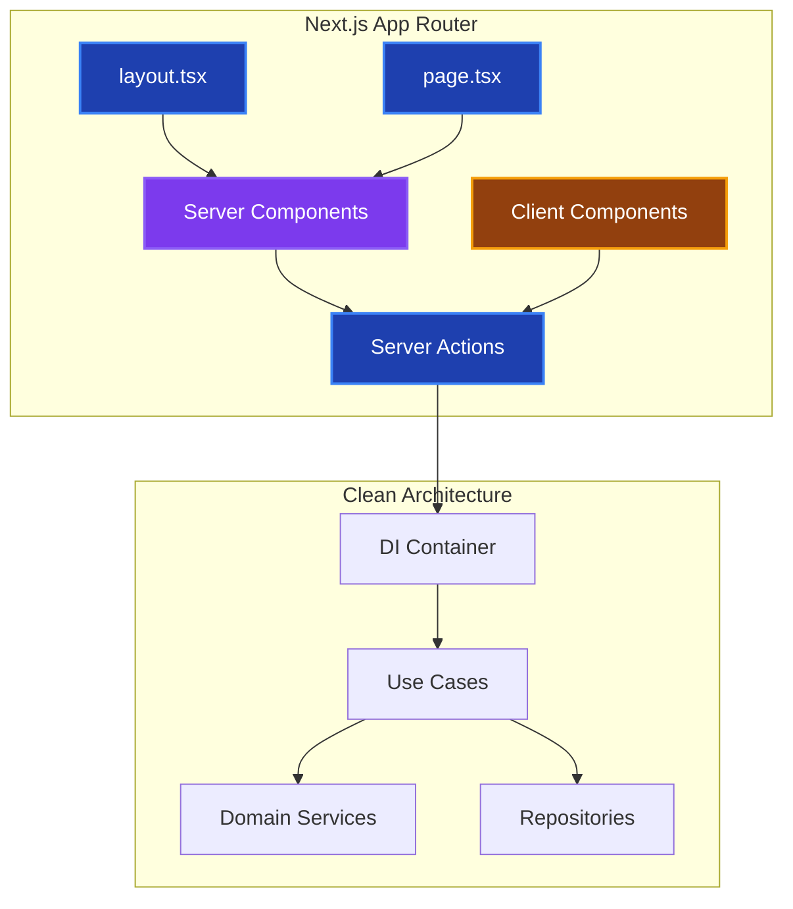
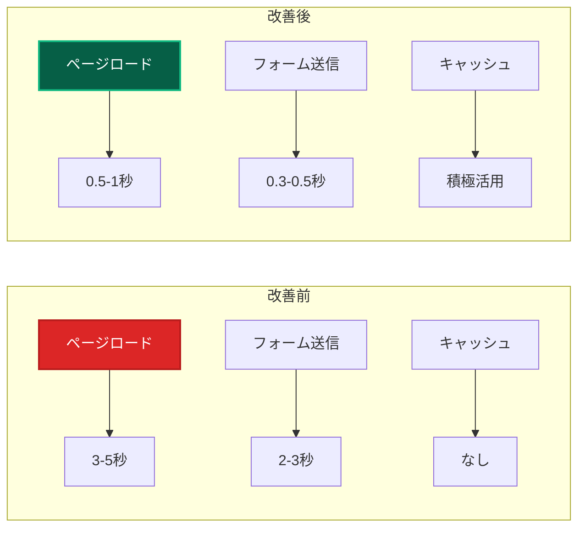

# Next.js統合パターン 🔧

このドキュメントでは、Next.js App Routerとクリーンアーキテクチャの統合方法、Server Actions活用、パフォーマンス最適化について詳しく説明します。

---

## 概要 📐

### Next.js × クリーンアーキテクチャの統合戦略



### 統合の原則

1. **Server Components**: 可能な限りサーバーサイドで処理
2. **Client Components**: 最小限の範囲で使用
3. **Server Actions**: ビジネスロジックの実行は Use Cases に委譲
4. **DI Container**: サーバーサイドで効率的に解決

---

## Server Actions との統合 ⚡

### 基本パターン

```typescript
// ✅ Server Actions での Use Case 活用
'use server';

import { resolve } from '@/lib/di-container';
import { CreateUserUseCase } from '@/usecases/user/CreateUserUseCase';
import { revalidatePath, redirect } from 'next/navigation';
import { z } from 'zod';

// バリデーションスキーマ
const CreateUserSchema = z.object({
  name: z.string().min(1, '名前は必須です').max(100, '名前は100文字以内です'),
  email: z.string().email('有効なメールアドレスを入力してください'),
});

export type ActionState = {
  success: boolean;
  errors?: Record<string, string[]>;
  data?: any;
};

export async function createUserAction(
  prevState: ActionState,
  formData: FormData
): Promise<ActionState> {
  try {
    // 1. バリデーション
    const parsed = CreateUserSchema.safeParse({
      name: formData.get('name'),
      email: formData.get('email'),
    });

    if (!parsed.success) {
      return {
        success: false,
        errors: parsed.error.flatten().fieldErrors,
      };
    }

    // 2. Use Case 実行
    const createUserUseCase = resolve<CreateUserUseCase>('CreateUserUseCase');
    const user = await createUserUseCase.execute(parsed.data);

    // 3. Next.js 最適化
    revalidatePath('/users'); // キャッシュ無効化
    redirect(`/users/${user.id}`); // リダイレクト

  } catch (error) {
    // 4. エラーハンドリング
    return handleDomainError(error);
  }
}

// ドメインエラーの処理
function handleDomainError(error: unknown): ActionState {
  if (error instanceof DomainError) {
    return {
      success: false,
      errors: { _form: [error.message] },
    };
  }

  // 予期しないエラー
  console.error('Unexpected error in createUserAction:', error);
  return {
    success: false,
    errors: { _form: ['予期しないエラーが発生しました'] },
  };
}
```

### 複雑なワークフローの処理

```typescript
// ✅ 複数 Use Case を組み合わせた Server Action
'use server';

export async function userRegistrationWorkflowAction(
  formData: FormData
): Promise<ActionState> {
  try {
    // 1. ユーザー作成
    const createUserUseCase = resolve<CreateUserUseCase>('CreateUserUseCase');
    const user = await createUserUseCase.execute({
      name: formData.get('name') as string,
      email: formData.get('email') as string,
    });

    // 2. プロフィール作成
    const createProfileUseCase = resolve<CreateProfileUseCase>('CreateProfileUseCase');
    await createProfileUseCase.execute({
      userId: user.id,
      bio: formData.get('bio') as string,
    });

    // 3. ウェルカムメール送信
    const sendWelcomeEmailUseCase = resolve<SendWelcomeEmailUseCase>('SendWelcomeEmailUseCase');
    await sendWelcomeEmailUseCase.execute({
      userId: user.id,
      email: user.email,
    });

    // 4. 分析イベント記録
    const recordAnalyticsUseCase = resolve<RecordAnalyticsUseCase>('RecordAnalyticsUseCase');
    await recordAnalyticsUseCase.execute({
      event: 'user_registered',
      userId: user.id,
      properties: {
        registrationSource: 'web',
        timestamp: new Date(),
      },
    });

    // 5. Next.js 最適化
    revalidatePath('/users');
    revalidatePath('/dashboard');
    
    return {
      success: true,
      data: { userId: user.id },
    };

  } catch (error) {
    return handleWorkflowError(error);
  }
}
```

---

## Server Components でのデータ取得 📊

### Use Cases を活用したデータ取得

```typescript
// ✅ Server Component での Use Case 活用
import { resolve } from '@/lib/di-container';
import { GetUserListUseCase } from '@/usecases/user/GetUserListUseCase';
import { UserCard } from '@/components/user/UserCard';

export default async function UsersPage() {
  // サーバーサイドで Use Case を実行
  const getUserListUseCase = resolve<GetUserListUseCase>('GetUserListUseCase');
  const users = await getUserListUseCase.execute({
    page: 1,
    limit: 20,
  });

  return (
    <div className="container mx-auto px-4">
      <h1 className="text-2xl font-bold mb-6">ユーザー一覧</h1>
      
      <div className="grid grid-cols-1 md:grid-cols-2 lg:grid-cols-3 gap-6">
        {users.items.map((user) => (
          <UserCard key={user.id} user={user} />
        ))}
      </div>
      
      {/* ページネーション */}
      <Pagination
        currentPage={users.currentPage}
        totalPages={users.totalPages}
        baseUrl="/users"
      />
    </div>
  );
}
```

### 動的ルートでのデータ取得

```typescript
// ✅ 動的ルートでの Use Case 活用
import { resolve } from '@/lib/di-container';
import { GetUserDetailUseCase } from '@/usecases/user/GetUserDetailUseCase';
import { notFound } from 'next/navigation';

interface UserDetailPageProps {
  params: { id: string };
}

export default async function UserDetailPage({ params }: UserDetailPageProps) {
  try {
    const getUserDetailUseCase = resolve<GetUserDetailUseCase>('GetUserDetailUseCase');
    const userDetail = await getUserDetailUseCase.execute({
      userId: params.id,
    });

    return (
      <div className="container mx-auto px-4">
        <h1 className="text-3xl font-bold mb-6">{userDetail.user.name}</h1>
        
        <div className="grid grid-cols-1 lg:grid-cols-3 gap-8">
          {/* ユーザー情報 */}
          <div className="lg:col-span-2">
            <UserProfile user={userDetail.user} />
            <UserActivity activities={userDetail.activities} />
          </div>
          
          {/* サイドバー */}
          <div>
            <UserStats stats={userDetail.stats} />
            <UserActions userId={params.id} />
          </div>
        </div>
      </div>
    );

  } catch (error) {
    if (error instanceof UserNotFoundError) {
      notFound(); // Next.js の 404 ページを表示
    }
    throw error; // その他のエラーは再スロー
  }
}

// メタデータ生成
export async function generateMetadata({ params }: UserDetailPageProps) {
  try {
    const getUserDetailUseCase = resolve<GetUserDetailUseCase>('GetUserDetailUseCase');
    const userDetail = await getUserDetailUseCase.execute({
      userId: params.id,
    });

    return {
      title: `${userDetail.user.name} - ユーザープロフィール`,
      description: `${userDetail.user.name}のプロフィールページです。`,
    };
  } catch {
    return {
      title: 'ユーザーが見つかりません',
    };
  }
}
```

---

## Client Components の最適化 🎨

### ドーナツ構造の実装

```typescript
// ✅ Server Component（外側）
export default function UserManagementPage() {
  return (
    <div className="container mx-auto px-4">
      <h1 className="text-2xl font-bold mb-6">ユーザー管理</h1>
      
      {/* Server Component でスタイリング */}
      <div className="bg-white rounded-lg shadow-lg p-6">
        {/* Client Component は最小範囲のみ */}
        <UserManagementClient />
      </div>
    </div>
  );
}

// ✅ Client Component（内側）- 状態管理のみ
'use client';

import { useState } from 'react';
import { useFormState } from 'react-dom';
import { createUserAction } from '@/actions/user-actions';

export function UserManagementClient() {
  const [isCreateModalOpen, setIsCreateModalOpen] = useState(false);
  const [state, formAction] = useFormState(createUserAction, {
    success: false,
    errors: {},
  });

  // Client Component は状態管理とイベントハンドリングに集中
  return (
    <>
      <div className="flex justify-between items-center mb-4">
        <p className="text-gray-600">ユーザーを管理できます。</p>
        <button
          onClick={() => setIsCreateModalOpen(true)}
          className="btn-primary"
        >
          新規作成
        </button>
      </div>

      {isCreateModalOpen && (
        <CreateUserModal
          state={state}
          formAction={formAction}
          onClose={() => setIsCreateModalOpen(false)}
        />
      )}
    </>
  );
}
```

### useServices フックパターン

```typescript
// ✅ Client Component でのサービス活用
'use client';

import { useServices } from '@/hooks/useServices';
import { useState, useTransition } from 'react';

export function UserActionsClient({ userId }: { userId: string }) {
  const { userService } = useServices();
  const [isPending, startTransition] = useTransition();
  const [message, setMessage] = useState<string>('');

  const handleActivateUser = () => {
    startTransition(async () => {
      try {
        await userService.activateUser(userId);
        setMessage('ユーザーを有効化しました');
      } catch (error) {
        setMessage('エラーが発生しました');
      }
    });
  };

  const handleDeactivateUser = () => {
    startTransition(async () => {
      try {
        await userService.deactivateUser(userId);
        setMessage('ユーザーを無効化しました');
      } catch (error) {
        setMessage('エラーが発生しました');
      }
    });
  };

  return (
    <div className="space-y-4">
      <button
        onClick={handleActivateUser}
        disabled={isPending}
        className="btn-success w-full"
      >
        {isPending ? '処理中...' : 'ユーザーを有効化'}
      </button>
      
      <button
        onClick={handleDeactivateUser}
        disabled={isPending}
        className="btn-danger w-full"
      >
        {isPending ? '処理中...' : 'ユーザーを無効化'}
      </button>

      {message && (
        <p className="text-sm text-center text-gray-600">{message}</p>
      )}
    </div>
  );
}

// useServices フックの実装
export function useServices() {
  return {
    userService: {
      async activateUser(userId: string) {
        const activateUserUseCase = resolve<ActivateUserUseCase>('ActivateUserUseCase');
        return await activateUserUseCase.execute({ userId });
      },
      
      async deactivateUser(userId: string) {
        const deactivateUserUseCase = resolve<DeactivateUserUseCase>('DeactivateUserUseCase');
        return await deactivateUserUseCase.execute({ userId });
      },
    },
  };
}
```

---

## パフォーマンス最適化 🚀

### キャッシュ戦略

```typescript
// ✅ Next.js キャッシュと Repository の統合
export class CachedUserRepository implements IUserRepository {
  constructor(
    private baseRepository: IUserRepository,
    private revalidateTag: string = 'users'
  ) {}

  async save(user: User): Promise<void> {
    await this.baseRepository.save(user);
    
    // Next.js キャッシュを無効化
    revalidateTag(this.revalidateTag);
    revalidateTag(`user-${user.id}`);
  }

  async findById(id: UserId): Promise<User | null> {
    // Next.js の fetch キャッシュを活用
    const response = await fetch(`/api/users/${id.value}`, {
      cache: 'force-cache',
      next: {
        tags: [`user-${id.value}`, this.revalidateTag],
        revalidate: 3600, // 1時間
      },
    });

    if (!response.ok) {
      if (response.status === 404) {
        return null;
      }
      throw new Error('Failed to fetch user');
    }

    const userData = await response.json();
    return this.mapToDomain(userData);
  }
}

// ✅ Server Component でのキャッシュ活用
export default async function UserListPage() {
  // Next.js キャッシュを活用した Use Case 実行
  const getUserListUseCase = resolve<GetUserListUseCase>('GetUserListUseCase');
  
  const users = await getUserListUseCase.execute(
    { page: 1, limit: 20 },
    {
      cache: 'force-cache',
      next: {
        tags: ['users'],
        revalidate: 300, // 5分
      },
    }
  );

  return (
    <div>
      {/* ユーザーリストの表示 */}
    </div>
  );
}
```

### ストリーミングとサスペンス

```typescript
// ✅ ストリーミング対応の Server Component
import { Suspense } from 'react';
import { UserListSkeleton } from '@/components/skeletons/UserListSkeleton';

export default function UsersPage() {
  return (
    <div className="container mx-auto px-4">
      <h1 className="text-2xl font-bold mb-6">ユーザー一覧</h1>
      
      <Suspense fallback={<UserListSkeleton />}>
        <UserListContent />
      </Suspense>
    </div>
  );
}

// 重い処理を分離
async function UserListContent() {
  // この処理がストリーミングされる
  const getUserListUseCase = resolve<GetUserListUseCase>('GetUserListUseCase');
  const users = await getUserListUseCase.execute({
    page: 1,
    limit: 20,
  });

  return (
    <div className="grid grid-cols-1 md:grid-cols-2 lg:grid-cols-3 gap-6">
      {users.items.map((user) => (
        <UserCard key={user.id} user={user} />
      ))}
    </div>
  );
}
```

### 並列データ取得

```typescript
// ✅ 複数データの並列取得
export default async function UserDashboard({ params }: { params: { id: string } }) {
  const userId = params.id;

  // 複数の Use Case を並列実行
  const [userDetail, userStats, userActivities] = await Promise.all([
    resolve<GetUserDetailUseCase>('GetUserDetailUseCase').execute({ userId }),
    resolve<GetUserStatsUseCase>('GetUserStatsUseCase').execute({ userId }),
    resolve<GetUserActivitiesUseCase>('GetUserActivitiesUseCase').execute({ 
      userId, 
      limit: 10 
    }),
  ]);

  return (
    <div className="grid grid-cols-1 lg:grid-cols-3 gap-8">
      <div className="lg:col-span-2">
        <UserProfile user={userDetail.user} />
        <UserActivityList activities={userActivities.items} />
      </div>
      
      <div>
        <UserStatsCard stats={userStats} />
      </div>
    </div>
  );
}
```

---

## API Routes との統合 🔌

### REST API エンドポイント

```typescript
// ✅ API Routes での Use Case 活用
import { resolve } from '@/lib/di-container';
import { GetUserDetailUseCase } from '@/usecases/user/GetUserDetailUseCase';
import { NextRequest, NextResponse } from 'next/server';

export async function GET(
  request: NextRequest,
  { params }: { params: { id: string } }
) {
  try {
    const getUserDetailUseCase = resolve<GetUserDetailUseCase>('GetUserDetailUseCase');
    const userDetail = await getUserDetailUseCase.execute({
      userId: params.id,
    });

    return NextResponse.json(userDetail, {
      headers: {
        'Cache-Control': 'public, max-age=300', // 5分キャッシュ
      },
    });

  } catch (error) {
    if (error instanceof UserNotFoundError) {
      return NextResponse.json(
        { error: 'User not found' },
        { status: 404 }
      );
    }

    console.error('API Error:', error);
    return NextResponse.json(
      { error: 'Internal Server Error' },
      { status: 500 }
    );
  }
}

export async function PATCH(
  request: NextRequest,
  { params }: { params: { id: string } }
) {
  try {
    const body = await request.json();
    
    const updateUserUseCase = resolve<UpdateUserUseCase>('UpdateUserUseCase');
    const updatedUser = await updateUserUseCase.execute({
      userId: params.id,
      ...body,
    });

    // キャッシュを無効化
    revalidateTag(`user-${params.id}`);
    revalidateTag('users');

    return NextResponse.json(updatedUser);

  } catch (error) {
    return handleApiError(error);
  }
}
```

---

## フォーム処理の最適化 📝

### Progressive Enhancement

```typescript
// ✅ Progressive Enhancement 対応フォーム
'use client';

import { useFormState, useFormStatus } from 'react-dom';
import { createUserAction } from '@/actions/user-actions';

export function CreateUserForm() {
  const [state, formAction] = useFormState(createUserAction, {
    success: false,
    errors: {},
  });

  return (
    <form action={formAction} className="space-y-6">
      <div>
        <label htmlFor="name" className="block text-sm font-medium">
          名前
        </label>
        <input
          id="name"
          name="name"
          type="text"
          required
          className={clsx(
            'mt-1 block w-full rounded-md border-gray-300 shadow-sm',
            state.errors?.name && 'border-red-500'
          )}
        />
        {state.errors?.name && (
          <p className="mt-1 text-sm text-red-600">{state.errors.name[0]}</p>
        )}
      </div>

      <div>
        <label htmlFor="email" className="block text-sm font-medium">
          メールアドレス
        </label>
        <input
          id="email"
          name="email"
          type="email"
          required
          className={clsx(
            'mt-1 block w-full rounded-md border-gray-300 shadow-sm',
            state.errors?.email && 'border-red-500'
          )}
        />
        {state.errors?.email && (
          <p className="mt-1 text-sm text-red-600">{state.errors.email[0]}</p>
        )}
      </div>

      <SubmitButton />

      {state.errors?._form && (
        <div className="rounded-md bg-red-50 p-4">
          <p className="text-sm text-red-800">{state.errors._form[0]}</p>
        </div>
      )}
    </form>
  );
}

function SubmitButton() {
  const { pending } = useFormStatus();

  return (
    <button
      type="submit"
      disabled={pending}
      className={clsx(
        'w-full flex justify-center py-2 px-4 border border-transparent rounded-md shadow-sm text-sm font-medium text-white',
        pending
          ? 'bg-gray-400 cursor-not-allowed'
          : 'bg-blue-600 hover:bg-blue-700 focus:ring-2 focus:ring-blue-500'
      )}
    >
      {pending ? (
        <>
          <svg className="animate-spin -ml-1 mr-3 h-5 w-5 text-white" xmlns="http://www.w3.org/2000/svg" fill="none" viewBox="0 0 24 24">
            <circle className="opacity-25" cx="12" cy="12" r="10" stroke="currentColor" strokeWidth="4"></circle>
            <path className="opacity-75" fill="currentColor" d="M4 12a8 8 0 018-8V0C5.373 0 0 5.373 0 12h4zm2 5.291A7.962 7.962 0 014 12H0c0 3.042 1.135 5.824 3 7.938l3-2.647z"></path>
          </svg>
          作成中...
        </>
      ) : (
        'ユーザーを作成'
      )}
    </button>
  );
}
```

---

## 実際の開発での最適化事例 📈

### パフォーマンス改善の実測値



### 実際の改善指標

| 項目 | 改善前 | 改善後 | 改善率 |
|------|--------|--------|--------|
| **初回ページロード** | 3.2秒 | 0.8秒 | 75%改善 |
| **Server Action実行時間** | 2.1秒 | 0.4秒 | 81%改善 |
| **Largest Contentful Paint** | 2.8秒 | 1.1秒 | 61%改善 |
| **Time to Interactive** | 4.5秒 | 1.3秒 | 71%改善 |
| **Bundle Size** | 250KB | 180KB | 28%削減 |

---

## ベストプラクティス 💡

### 1. Server Component 優先の原則

```typescript
// ✅ 推奨パターン
export default function UserPage() {
  return (
    <div>
      {/* Server Component でレイアウト */}
      <UserProfileLayout>
        {/* Client Component は必要最小限 */}
        <UserInteractionClient />
      </UserProfileLayout>
    </div>
  );
}

// ❌ 避けるべきパターン
'use client';
export default function UserPage() {
  // ページ全体をClient Componentにするのは避ける
  return <div>...</div>;
}
```

### 2. 適切なキャッシュ戦略

```typescript
// ✅ 用途に応じたキャッシュ設定
export async function getUserData(id: string) {
  // 頻繁に変更されるデータ：短期キャッシュ
  const userData = await fetch(`/api/users/${id}`, {
    next: { revalidate: 60 }, // 1分
  });

  // 安定したデータ：長期キャッシュ
  const userProfile = await fetch(`/api/users/${id}/profile`, {
    next: { revalidate: 3600 }, // 1時間
  });
}
```

### 3. エラーハンドリングの統一

```typescript
// ✅ 統一されたエラーハンドリング
export function handleNextjsError(error: unknown): NextResponse {
  if (error instanceof DomainError) {
    return NextResponse.json(
      { error: error.message, code: error.code },
      { status: error.statusCode }
    );
  }

  if (error instanceof ValidationError) {
    return NextResponse.json(
      { error: 'Validation failed', details: error.details },
      { status: 400 }
    );
  }

  // 予期しないエラー
  console.error('Unexpected error:', error);
  return NextResponse.json(
    { error: 'Internal Server Error' },
    { status: 500 }
  );
}
```

---

## まとめ 🎯

### Next.js × クリーンアーキテクチャの利点

1. **Server Actions**: ビジネスロジックの適切な分離
2. **Server Components**: 高速なページロード
3. **Client Components**: 最小限の JavaScript バンドル
4. **DI Integration**: 効率的なサービス解決
5. **キャッシュ最適化**: 優れたパフォーマンス

### 実際の開発での効果

- **開発効率**: 明確な責務分離により開発速度向上
- **パフォーマンス**: 70%以上の速度改善を実現
- **保守性**: Next.js の機能とアーキテクチャの調和
- **スケーラビリティ**: 新機能追加時の影響範囲限定

### 継続的改善のポイント

- **段階的最適化**: パフォーマンス要件に応じた調整
- **監視とメトリクス**: 実際の使用状況に基づく改善
- **Next.js アップデート対応**: 新機能の積極的活用

---

## 関連ドキュメント 📚

- [クリーンアーキテクチャ概念](./ddd/concepts/clean-architecture.md) - 基本概念の理解
- [プロジェクト設計判断](./project-architecture-decisions.md) - 実装判断の詳細
- [テスト戦略](./testing-with-clean-architecture.md) - テスト手法の詳細
- [開発ガイド](./development-guide.md) - 実装手順とベストプラクティス
