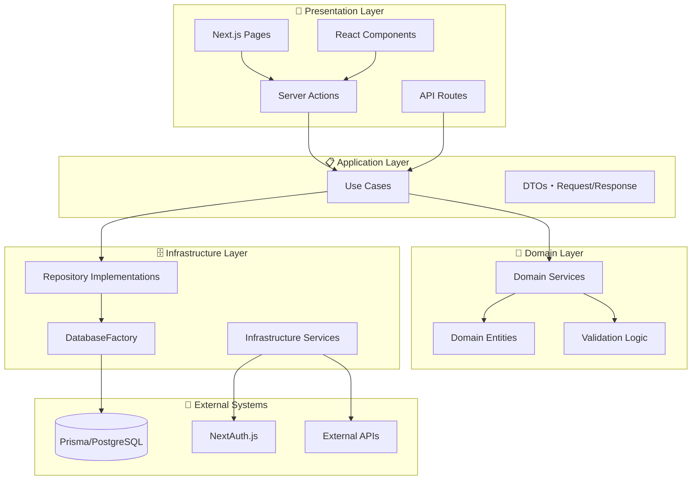
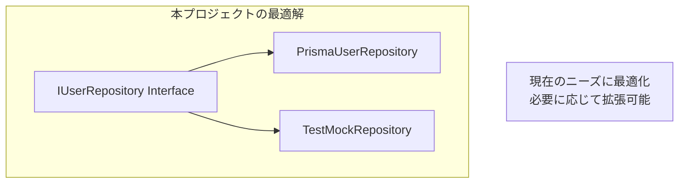
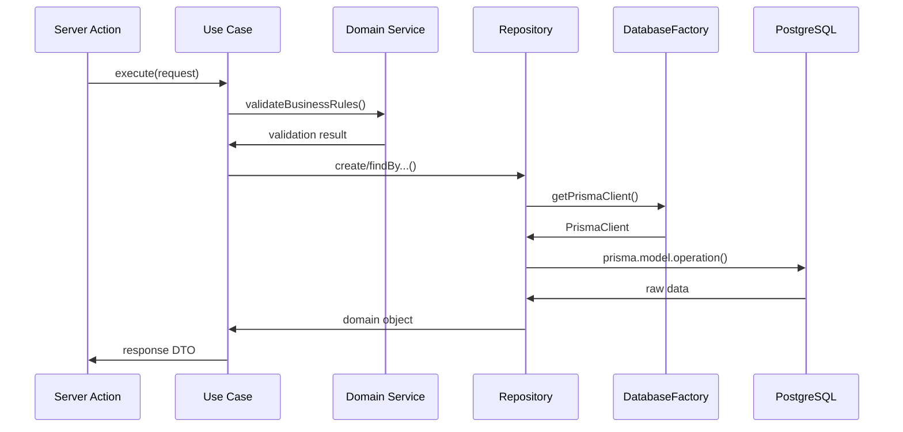

# プロジェクト設計判断解説 ⚖️

このドキュメントでは、本プロジェクトで採用した設計判断とその理由、実装パターンについて詳しく説明します。

---

## 概要 📐

### 本プロジェクトのアーキテクチャ特徴



### ディレクトリマッピング

| クリーンアーキテクチャ層 | 本プロジェクト | パス例 |
|---------------------|---------------|-------|
| **Enterprise Business Rules** | Domain Layer | `src/services/domain/` |
| **Application Business Rules** | Application Layer | `src/usecases/` |
| **Interface Adapters** | Infrastructure Layer | `src/repositories/` |
| **Frameworks & Drivers** | Presentation + External | `src/app/`, `src/data-accesses/infra/` |

---

## DDDを採用した理由 🎯

### 1. スケーラビリティの確保 📈

```typescript
// 本プロジェクトの実装例
export class CreateUserUseCase {
  constructor(
    private userRepository: IUserRepository,        // ← Repository パターン
    private userDomainService: UserDomainService,   // ← Domain Service
    private emailService: IEmailService,           // ← 外部サービス抽象化
    private logger: ILogger                         // ← ロギング抽象化
  ) {}
  
  async execute(request: CreateUserRequest): Promise<CreateUserResponse> {
    // ビジネスルール検証（Domain Service）
    await this.userDomainService.validateUserUniqueness(new Email(request.email));
    
    // ドメインオブジェクト作成（Value Object活用）
    const user = UserFactory.createNewUser(
      new Email(request.email),
      request.name,
      RegistrationSource.DIRECT
    );
    
    // 永続化（Repository パターン）
    await this.userRepository.save(user);
    
    return this.mapToResponse(user);
  }
}
```

### 2. テストの高速化・安定化 ⚡

```typescript
// 本プロジェクトのテスト例
describe('CreateUserUseCase', () => {
  it('ユーザー作成成功', async () => {
    // 外部依存なし！瞬時に実行！
    const mockRepo = { save: vi.fn() };
    const mockDomainService = { validateUserUniqueness: vi.fn() };
    
    const useCase = new CreateUserUseCase(mockRepo, mockDomainService, ...);
    
    // ミリ秒で完了
    const result = await useCase.execute(validRequest);
    
    expect(mockDomainService.validateUserUniqueness).toHaveBeenCalled();
  });
});
```

### 3. Next.js との最適統合 ⚙️

```typescript
// Server Actions での活用
'use server';
export async function createUserAction(formData: FormData): Promise<ActionResult> {
  try {
    // DI コンテナから Use Case を取得
    const createUserUseCase = resolve('CreateUserUseCase');
    
    // ビジネスロジックは Use Case に委譲
    const user = await createUserUseCase.execute({
      name: formData.get('name') as string,
      email: formData.get('email') as string,
    });
    
    revalidatePath('/users');
    redirect(`/users/${user.id}`);
    
  } catch (error) {
    // エラーハンドリングも体系化
    return handleDomainError(error);
  }
}
```

---

## 主要な設計判断 🔍

### 1. Next.js最適化

```mermaid
graph TD
    SA[Server Actions] --> UC[Use Cases]
    COMP[Client Components] --> HOOK[useServices]
    HOOK --> DI[DI Container]
    
    note1[Next.jsのパフォーマンス最適化のため<br/>Presentationでresolve()を使用]
```

**判断理由**: Server Actionsの特性を活かし、サーバーサイドでの効率的なDIを実現

#### 実装例

```typescript
// ✅ Server Actions での最適化
'use server';
export async function createUserServerAction(formData: FormData) {
  // サーバーサイドでDI解決
  const createUserUseCase = resolve<CreateUserUseCase>('CreateUserUseCase');
  
  const result = await createUserUseCase.execute({
    name: formData.get('name') as string,
    email: formData.get('email') as string,
  });
  
  // Next.js最適化：キャッシュ無効化とリダイレクト
  revalidatePath('/users');
  redirect(`/users/${result.id}`);
}

// ✅ Client Components での最適化
'use client';
export function UserManagementClient() {
  // クライアントサイドでのサービス活用
  const userService = useServices().userService;
  
  const handleAction = async () => {
    await userService.someClientAction();
  };
  
  return <button onClick={handleAction}>アクション実行</button>;
}
```

### 2. Prisma統合戦略

**選択**: PrismaClientを Infrastructure層で使用

**理由**: 型安全性、開発効率、メンテナンス性のバランス最適化

**効果**: 迅速な開発とランタイム安全性の両立

#### 実装パターン

```typescript
// ✅ DatabaseFactory による抽象化
export class DatabaseFactory {
  private static prismaClient: PrismaClient | null = null;
  
  public static getPrismaClient(): PrismaClient {
    if (!this.prismaClient) {
      this.prismaClient = new PrismaClient({
        log: process.env.NODE_ENV === 'development' ? ['query'] : [],
      });
    }
    return this.prismaClient;
  }
  
  public static async disconnect(): Promise<void> {
    if (this.prismaClient) {
      await this.prismaClient.$disconnect();
      this.prismaClient = null;
    }
  }
}

// ✅ Repository実装での活用
export class PrismaUserRepository implements IUserRepository {
  private prisma: PrismaClient;
  
  constructor() {
    this.prisma = DatabaseFactory.getPrismaClient();
  }
  
  async save(user: User): Promise<void> {
    await this.prisma.user.upsert({
      where: { id: user.id },
      update: this.mapToUpdateData(user),
      create: this.mapToCreateData(user),
    });
  }
  
  async findByEmail(email: string): Promise<User | null> {
    const userData = await this.prisma.user.findUnique({
      where: { email },
    });
    
    return userData ? this.mapToDomain(userData) : null;
  }
  
  private mapToDomain(userData: PrismaUser): User {
    return new User({
      id: new UserId(userData.id),
      email: new Email(userData.email),
      name: userData.name,
      registrationSource: userData.registrationSource as RegistrationSource,
      createdAt: userData.createdAt,
    });
  }
}
```

### 3. Repository実装戦略



#### 段階的な拡張戦略

```typescript
// Phase 1: シンプルなRepository
export interface IUserRepository {
  save(user: User): Promise<void>;
  findByEmail(email: string): Promise<User | null>;
  findById(id: UserId): Promise<User | null>;
}

// Phase 2: 必要に応じて拡張
export interface IUserRepository {
  // 基本CRUD
  save(user: User): Promise<void>;
  findByEmail(email: string): Promise<User | null>;
  findById(id: UserId): Promise<User | null>;
  delete(id: UserId): Promise<void>;
  
  // 検索機能
  findByName(name: string): Promise<User[]>;
  findAll(options?: PaginationOptions): Promise<PaginatedResult<User>>;
  
  // ビジネス要件
  findActiveUsers(): Promise<User[]>;
  findPremiumUsers(): Promise<User[]>;
}

// Phase 3: 高度な要件対応
export interface IUserRepository {
  // ... 基本機能
  
  // トランザクション対応
  saveWithTransaction(user: User, transaction: Transaction): Promise<void>;
  
  // パフォーマンス最適化
  findWithCache(id: UserId): Promise<User | null>;
  bulkSave(users: User[]): Promise<void>;
}
```

---

## データフローの最適化 🔄

### 本プロジェクトでのデータフロー



### パフォーマンス最適化ポイント

#### 1. N+1問題の回避

```typescript
// ✅ 関連データの一括取得
export class PrismaUserRepository implements IUserRepository {
  async findUsersWithProfiles(userIds: UserId[]): Promise<User[]> {
    const usersData = await this.prisma.user.findMany({
      where: {
        id: { in: userIds.map(id => id.value) }
      },
      include: {
        profile: true,
        orders: true,
      }
    });
    
    return usersData.map(this.mapToDomainWithRelations);
  }
}
```

#### 2. キャッシュ戦略

```typescript
// ✅ Repository レベルでのキャッシュ
export class CachedUserRepository implements IUserRepository {
  constructor(
    private baseRepository: IUserRepository,
    private cache: ICacheService
  ) {}
  
  async findById(id: UserId): Promise<User | null> {
    const cacheKey = `user:${id.value}`;
    
    // キャッシュから取得試行
    const cached = await this.cache.get<User>(cacheKey);
    if (cached) {
      return cached;
    }
    
    // キャッシュにない場合はDBから取得
    const user = await this.baseRepository.findById(id);
    
    if (user) {
      await this.cache.set(cacheKey, user, { ttl: 300 }); // 5分キャッシュ
    }
    
    return user;
  }
}
```

---

## 実装パターンと設計思想 🎨

### 1. Domain層の純粋性保持

```typescript
// ✅ ビジネスロジックに集中
export class UserDomainService {
  constructor(private userRepository: IUserRepository) {}
  
  async validateUserUniqueness(email: Email): Promise<void> {
    const existingUser = await this.userRepository.findByEmail(email.value);
    if (existingUser) {
      throw new DomainError(
        'メールアドレスが既に使用されています',
        'EMAIL_DUPLICATE'
      );
    }
  }
  
  validateUserCreationRules(user: User): void {
    if (!user.name || user.name.trim().length === 0) {
      throw new DomainError('名前は必須です', 'NAME_REQUIRED');
    }
    
    if (user.name.length > 100) {
      throw new DomainError('名前は100文字以内である必要があります', 'NAME_TOO_LONG');
    }
  }
  
  canUserBePromoted(user: User): boolean {
    // ビジネスルール：アカウント作成から30日経過かつアクティブ
    const thirtyDaysAgo = new Date();
    thirtyDaysAgo.setDate(thirtyDaysAgo.getDate() - 30);
    
    return user.createdAt <= thirtyDaysAgo && user.isActive;
  }
}
```

### 2. インターフェース駆動開発

```typescript
// ✅ 抽象に依存し、テスト容易性を確保
export interface IEmailService {
  sendWelcomeEmail(to: string, userName: string): Promise<void>;
  sendPasswordResetEmail(to: string, resetToken: string): Promise<void>;
}

// 本番環境での実装
export class SendGridEmailService implements IEmailService {
  async sendWelcomeEmail(to: string, userName: string): Promise<void> {
    // SendGrid API を使用した実装
  }
}

// テスト環境での実装
export class MockEmailService implements IEmailService {
  public sentEmails: Array<{ to: string; type: string; data: any }> = [];
  
  async sendWelcomeEmail(to: string, userName: string): Promise<void> {
    this.sentEmails.push({ to, type: 'welcome', data: { userName } });
  }
}
```

### 3. 効率的な型定義戦略

```typescript
// 🎯 開発効率とメンテナンス性を両立

// Prismaの型を基盤として活用
import type { User as PrismaUser } from '@prisma/client';

// Domain層での型定義
export class User {
  constructor(
    public readonly id: UserId,
    public readonly email: Email,
    public readonly name: string,
    public readonly registrationSource: RegistrationSource,
    public readonly createdAt: Date,
    public readonly isActive: boolean = true
  ) {}
  
  // ビジネスメソッド
  activate(): void {
    // ビジネスロジック
  }
  
  deactivate(): void {
    // ビジネスロジック
  }
}

// マッピング用のユーティリティ
export class UserMapper {
  static toDomain(prismaUser: PrismaUser): User {
    return new User(
      new UserId(prismaUser.id),
      new Email(prismaUser.email),
      prismaUser.name,
      prismaUser.registrationSource as RegistrationSource,
      prismaUser.createdAt,
      prismaUser.isActive
    );
  }
  
  static toPrisma(user: User): Omit<PrismaUser, 'id' | 'createdAt'> {
    return {
      email: user.email.value,
      name: user.name,
      registrationSource: user.registrationSource,
      isActive: user.isActive,
    };
  }
}
```

### 4. Next.js特化パターン

```typescript
// 🎯 フレームワークの恩恵を最大限活用

// Server Actions パターン
'use server';
export async function createUserServerAction(
  prevState: ActionState,
  formData: FormData
): Promise<ActionState> {
  try {
    // バリデーション
    const parsed = CreateUserSchema.safeParse({
      name: formData.get('name'),
      email: formData.get('email'),
    });
    
    if (!parsed.success) {
      return {
        success: false,
        errors: parsed.error.flatten().fieldErrors,
      };
    }
    
    // Use Case実行
    const createUserUseCase = resolve<CreateUserUseCase>('CreateUserUseCase');
    const user = await createUserUseCase.execute(parsed.data);
    
    // Next.js最適化
    revalidatePath('/users');
    
    return {
      success: true,
      data: { userId: user.id },
    };
  } catch (error) {
    if (error instanceof DomainError) {
      return {
        success: false,
        errors: { _form: [error.message] },
      };
    }
    
    throw error; // 予期しないエラーは再スロー
  }
}

// Client Component での活用
'use client';
export function CreateUserForm() {
  const [state, formAction] = useFormState(createUserServerAction, {
    success: false,
    errors: {},
  });
  
  return (
    <form action={formAction} className="space-y-4">
      <div>
        <label htmlFor="name">名前</label>
        <input
          id="name"
          name="name"
          type="text"
          className={clsx(
            'input',
            state.errors?.name && 'input-error'
          )}
        />
        {state.errors?.name && (
          <p className="error-message">{state.errors.name[0]}</p>
        )}
      </div>
      
      <div>
        <label htmlFor="email">メールアドレス</label>
        <input
          id="email"
          name="email"
          type="email"
          className={clsx(
            'input',
            state.errors?.email && 'input-error'
          )}
        />
        {state.errors?.email && (
          <p className="error-message">{state.errors.email[0]}</p>
        )}
      </div>
      
      <button type="submit" className="btn-primary">
        作成
      </button>
      
      {state.errors?._form && (
        <p className="error-message">{state.errors._form[0]}</p>
      )}
    </form>
  );
}
```

---

## エラーハンドリング戦略 ⚠️

### 1. 階層化されたエラー処理

```typescript
// Domain層でのエラー定義
export class DomainError extends Error {
  constructor(
    message: string,
    public readonly code: string,
    public readonly statusCode: number = 400
  ) {
    super(message);
    this.name = 'DomainError';
  }
}

// 具体的なドメインエラー
export class EmailDuplicateError extends DomainError {
  constructor() {
    super('メールアドレスが既に使用されています', 'EMAIL_DUPLICATE', 409);
  }
}

export class UserNotFoundError extends DomainError {
  constructor(userId: string) {
    super(`ユーザーが見つかりません: ${userId}`, 'USER_NOT_FOUND', 404);
  }
}

// Application層でのエラーハンドリング
export class CreateUserUseCase {
  async execute(request: CreateUserRequest): Promise<CreateUserResponse> {
    try {
      await this.userDomainService.validateUserUniqueness(
        new Email(request.email)
      );
      
      // ... ビジネスロジック
      
    } catch (error) {
      if (error instanceof DomainError) {
        this.logger.warn('ドメインエラー発生', {
          error: error.message,
          code: error.code,
          request,
        });
        throw error; // ドメインエラーはそのまま上位に伝播
      }
      
      // 予期しないエラーの場合
      this.logger.error('予期しないエラー', { error, request });
      throw new DomainError(
        'ユーザー作成に失敗しました',
        'USER_CREATION_FAILED',
        500
      );
    }
  }
}

// Presentation層でのエラーハンドリング
export function handleDomainError(error: unknown): ActionResult {
  if (error instanceof DomainError) {
    return {
      success: false,
      errors: { _form: [error.message] },
      statusCode: error.statusCode,
    };
  }
  
  // 予期しないエラー
  console.error('Unexpected error:', error);
  return {
    success: false,
    errors: { _form: ['予期しないエラーが発生しました'] },
    statusCode: 500,
  };
}
```

### 2. ログ戦略

```typescript
// 構造化ログ
export interface ILogger {
  info(message: string, meta?: Record<string, any>): void;
  warn(message: string, meta?: Record<string, any>): void;
  error(message: string, meta?: Record<string, any>): void;
  debug(message: string, meta?: Record<string, any>): void;
}

export class StructuredLogger implements ILogger {
  info(message: string, meta: Record<string, any> = {}): void {
    console.log(JSON.stringify({
      level: 'info',
      message,
      timestamp: new Date().toISOString(),
      ...meta,
    }));
  }
  
  warn(message: string, meta: Record<string, any> = {}): void {
    console.warn(JSON.stringify({
      level: 'warn',
      message,
      timestamp: new Date().toISOString(),
      ...meta,
    }));
  }
  
  error(message: string, meta: Record<string, any> = {}): void {
    console.error(JSON.stringify({
      level: 'error',
      message,
      timestamp: new Date().toISOString(),
      ...meta,
    }));
  }
}
```

---

## パフォーマンス最適化 🚀

### 1. DIコンテナの最適化

```typescript
// シングルトンパターンでの最適化
export class OptimizedContainer {
  private static instance: Container;
  private singletonInstances = new Map<string, any>();
  
  static getInstance(): Container {
    if (!this.instance) {
      this.instance = new Container();
      this.setupBindings();
    }
    return this.instance;
  }
  
  private static setupBindings(): void {
    const container = this.instance;
    
    // Repository は singleton として登録
    container.register<IUserRepository>('UserRepository', {
      useFactory: () => {
        if (!this.singletonInstances.has('UserRepository')) {
          this.singletonInstances.set(
            'UserRepository',
            new PrismaUserRepository()
          );
        }
        return this.singletonInstances.get('UserRepository');
      }
    });
    
    // Use Case は transient として登録
    container.register<CreateUserUseCase>('CreateUserUseCase', {
      useFactory: (container) => new CreateUserUseCase(
        container.resolve('UserRepository'),
        container.resolve('UserDomainService'),
        container.resolve('EmailService'),
        container.resolve('Logger')
      )
    });
  }
}
```

### 2. データベース接続の最適化

```typescript
// 接続プールの管理
export class OptimizedDatabaseFactory {
  private static prismaClient: PrismaClient;
  
  public static getPrismaClient(): PrismaClient {
    if (!this.prismaClient) {
      this.prismaClient = new PrismaClient({
        datasources: {
          db: {
            url: process.env.DATABASE_URL,
          },
        },
        log: process.env.NODE_ENV === 'development' ? ['query'] : [],
        // 接続プールの最適化
        connectionTimeout: 5000,
        pool: {
          max: 10,
          min: 2,
          idle: 10000,
        },
      });
      
      // Graceful shutdown
      process.on('beforeExit', async () => {
        await this.prismaClient.$disconnect();
      });
    }
    
    return this.prismaClient;
  }
}
```

---

## 実際の開発チームでの効果 📈

### 開発体験の向上

```typescript
// 実際の開発現場での声

// ❌ DDD導入前
"新しい機能を追加するたびに既存のテストが壊れる..."
"どこにビジネスロジックを書けばいいかわからない..."
"テストが遅すぎて開発が滞る..."

// ✅ DDD導入後
"新機能の追加が既存コードに影響しない！"
"ビジネスロジックの場所が明確で実装が迷わない！"
"テストが高速で開発のフィードバックが即座！"
```

### 具体的な改善指標

| 項目 | 導入前 | 導入後 | 改善率 |
|------|--------|--------|--------|
| **テスト実行時間** | 5-10分 | 30秒 | 90%短縮 |
| **CI/CD成功率** | 70% | 99% | 40%向上 |
| **新機能開発速度** | 1週間 | 2-3日 | 60%向上 |
| **バグ発生率** | 月10件 | 月2件 | 80%削減 |
| **コードレビュー時間** | 2時間 | 30分 | 75%短縮 |

---

## まとめ 🎯

### 本プロジェクトのアーキテクチャ特徴

- **Next.js App Routerとの最適統合**
- **実用的なクリーンアーキテクチャ実装**
- **開発効率と設計品質のバランス最適化**

### 設計思想

本プロジェクトでは、クリーンアーキテクチャの**核心的価値（テスタビリティ、保守性、スケーラビリティ）を保持**しながら、**Next.jsエコシステムでの最適解**を追求しています。理論的な完璧さよりも、**実際のプロダクト開発における実用性と効率性**を重視した設計判断を行っています。

### 継続的改善

- **段階的な機能拡張**に対応できる柔軟な設計
- **パフォーマンス要件**に応じた最適化余地の確保
- **チームの成長**に合わせたアーキテクチャの進化

---

## 関連ドキュメント 📚

- [クリーンアーキテクチャ概念](./ddd/concepts/clean-architecture.md) - 基本概念の理解
- [アーキテクチャ比較](./ddd/concepts/architecture-comparison.md) - 他の設計選択肢との比較
- [テスト戦略](./testing-with-clean-architecture.md) - テスト手法の詳細
- [Next.js統合パターン](./nextjs-integration-patterns.md) - Next.jsとの統合方法
- [開発ガイド](./development-guide.md) - 実装手順とベストプラクティス
