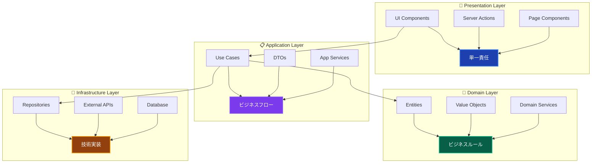
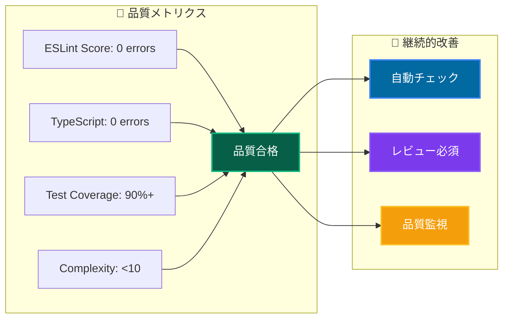

# コーディング規約 📏

Clean Architecture + DDD プロジェクトにおける統一的なコーディング標準

---

## 📖 このドキュメントについて

### 🎯 目的

- **品質統一**: チーム全体での一貫した品質レベル確保
- **可読性向上**: 保守しやすく理解しやすいコード実現
- **効率化**: レビューやデバッグ作業の効率化

### 📚 前提知識

- **必須**: TypeScript基礎、React/Next.js基礎
- **推奨**: [アーキテクチャ概要](../../architecture/overview.md) 理解
- **参考**: [設計原則](../../architecture/principles.md) | [命名規則](naming.md)

### 🔗 関連ドキュメント

- **[命名規則詳細](naming.md)** - 詳細な命名ガイドライン
- **[プロジェクト構造](project-structure.md)** - ディレクトリ・ファイル構成
- **[開発フロー](../development/workflow.md)** - 実装・レビューフロー

---

## 🏗️ アーキテクチャ原則に基づくルール

### 📋 レイヤー責務の厳格な分離



### 🚫 禁止事項・違反パターン

```typescript
// ❌ 禁止: レイヤー越境の直接依存
// Presentation → Infrastructure

// ✅ 推奨: 適切な依存関係
// Presentation → Application
import { resolve } from '@/diContainer';
// ❌ 禁止: Domain → Application
import { CreateUserUseCase } from '@/layers/application'; // NG

// Application → Domain (Interface)
import { IUserRepository } from '@/layers/domain/repositories/IUserRepository';
import { INJECTION_TOKENS } from '@/di/tokens';

import { PrismaClient } from '@prisma/client'; // NG

// ❌ 禁止: フレームワーク依存のDomain
import { NextRequest } from 'next/server'; // Domain層でNG
```

---

## 🎯 Result型パターンの統一

### 必須実装パターン

```typescript
// ✅ UseCase戻り値は必ずResult型
export class CreateUserUseCase {
 async execute(
  request: CreateUserRequest,
 ): Promise<Result<CreateUserResponse>> {
  try {
   // 1. 入力検証
   const emailResult = Email.create(request.email);
   if (isFailure(emailResult)) {
    return emailResult; // そのまま失敗を返す
   }

   // 2. ビジネスロジック実行
   const user = await this.createUser(emailResult.data);

   // 3. 成功レスポンス組み立て
   return success({
    userId: user.getId().toString(),
    name: user.getName().toString(),
    email: user.getEmail().toString(),
    createdAt: user.getCreatedAt().toISOString(),
   });
  } catch (error) {
   // 4. インフラエラーの統一処理
   this.logger.error('ユーザー作成中にエラーが発生', { error });
   return failure('ユーザー作成に失敗しました', 'UNEXPECTED_ERROR');
  }
 }
}

// ✅ Server ActionsでのResult型処理
export async function createUserAction(formData: FormData) {
 const useCase = resolve(INJECTION_TOKENS.CreateUserUseCase);
 const result = await useCase.execute(request);

 if (isFailure(result)) {
  return {
   success: false,
   message: result.error.message,
  };
 }

 return {
  success: true,
  data: result.data,
 };
}
```

---

## 💉 依存性注入の統一パターン

### サービス層での Constructor Injection

```typescript
// ✅ 推奨: Application/Domain/Infrastructure層
@injectable()
export class CreateUserUseCase {
 constructor(
  @inject(INJECTION_TOKENS.UserRepository)
  private readonly userRepository: IUserRepository,
  @inject(INJECTION_TOKENS.HashService)
  private readonly hashService: IHashService,
  @inject(INJECTION_TOKENS.Logger)
  private readonly logger: ILogger,
 ) {}

 // UseCase実装...
}
```

### Presentation層での Dynamic Resolution

```typescript
// ✅ 推奨: Server Actions/Components
'use server';

export async function createUserAction(formData: FormData) {
 // 動的解決パターン
 const useCase = resolve(INJECTION_TOKENS.CreateUserUseCase);
 const result = await useCase.execute(request);
 // 処理...
}
```

---

## 📁 インポート・モジュール管理

### 🚫 禁止: index.ts ファイル作成

```typescript
// ❌ 禁止: index.tsファイルの作成
// /components/ui/index.ts - 作成しない

// ❌ 禁止: まとめてインポート
import { Button, Input, Card } from '@/components/ui';

// ✅ 推奨: 個別インポート
import { Button } from '@/components/ui/Button';
import { Input } from '@/components/ui/Input';
import { Card } from '@/components/ui/Card';
```

### 📍 Alias使用の統一

```typescript
// ✅ プロジェクト標準のalias使用
import { UserService } from '@/layers/application/services/UserService';
import { Email } from '@/layers/domain/valueObjects/Email';
import { setupTestEnvironment } from '@tests/utils/helpers/testHelpers';

// ❌ 禁止: 相対パス
import { UserService } from '../../application/services/UserService';
import { Email } from '../../../domain/valueObjects/Email';
```

---

## 🎨 コンポーネント・UI実装規約

### React Server Components優先

```typescript
// ✅ 推奨: RSC (default export)
export default function UserProfilePage({ params }: { params: { id: string } }) {
  // Server Component実装
  return (
    <div>
      <UserProfile userId={params.id} />
    </div>
  );
}

// ✅ 必要時のみClient Component
'use client';

export function InteractiveUserForm() {
  const [state, setState] = useState();
  // クライアント側ロジック
}
```

### Server Actions統合

```typescript
// ✅ 推奨: Server Actionsパターン
'use server';

import { resolve } from '@/diContainer';

import { redirect } from 'next/navigation';

export async function updateUserAction(formData: FormData) {
 // バリデーション
 const input = {
  name: formData.get('name') as string,
  email: formData.get('email') as string,
 };

 // UseCase実行
 const useCase = resolve(INJECTION_TOKENS.UpdateUserUseCase);
 const result = await useCase.execute(input);

 if (isFailure(result)) {
  return { success: false, message: result.error.message };
 }

 redirect('/users');
}
```

---

## 🧪 テスト実装規約

### vitest-mock-extended 標準使用

```typescript
// ✅ 推奨: 自動モック使用
import { setupTestEnvironment } from '@tests/utils/helpers/testHelpers';
import { createAutoMockUserRepository } from '@tests/utils/mocks/autoMocks';

describe('CreateUserUseCase', () => {
 setupTestEnvironment(); // DIコンテナリセット必須

 let useCase: CreateUserUseCase;
 let mockRepository: MockProxy<IUserRepository>;

 beforeEach(() => {
  // 自動モック生成
  mockRepository = createAutoMockUserRepository();
  container.registerInstance(INJECTION_TOKENS.UserRepository, mockRepository);

  useCase = container.resolve(CreateUserUseCase);
 });

 // Result型対応テスト
 it('should create user successfully', async () => {
  const result = await useCase.execute(validInput);

  expect(isSuccess(result)).toBe(true);
  if (isSuccess(result)) {
   expect(result.data.name).toBe('Test User');
  }
 });
});
```

---

## ✍️ コメント・ドキュメント規約

### 📝 適切なコメント記述

```typescript
// ✅ 推奨: なぜその実装なのかを説明
export class User {
 changeName(newName: UserName): Result<void> {
  // ビジネスルール: アカウント作成から24時間以内は名前変更不可
  // 理由: スパム防止・セキュリティ確保のため
  if (this.createdAt.getTime() > Date.now() - 24 * 60 * 60 * 1000) {
   return failure(
    'アカウント作成から24時間以内は名前変更できません',
    'NAME_CHANGE_TOO_SOON',
   );
  }

  this.name = newName;
  this.updatedAt = new Date();
  return success(undefined);
 }

 // ❌ 避ける: 何をしているかの説明
 // changeName(newName: UserName): Result<void> {
 //   // 名前を変更する
 //   this.name = newName;
 // }
}
```

### 🚫 コメント禁止パターン

```typescript
// ❌ 禁止: 個人的なメモ・TODO
// TODO: あとで直す
// FIXME: このコードはうまく動かない
// NOTE: 個人的な覚書

// ❌ 禁止: コードの履歴情報
// 2024/01/15 田中修正: バグ修正
// Version 1.2で追加

// ❌ 禁止: 明らかな処理の説明
// let user = new User(); // 新しいユーザーを作成
// user.save(); // ユーザーを保存
```

---

## 📊 コード品質指標

### 🎯 品質基準



### 🔧 自動チェック設定

```bash
# 品質チェックコマンド
pnpm lint        # ESLint実行
pnpm type-check  # TypeScript型チェック
pnpm test:unit   # ユニットテスト実行
pnpm format      # Prettier実行
```

---

## 🔄 レビュー・品質保証プロセス

### 📋 Pull Request チェックリスト

#### **実装品質**

- [ ] アーキテクチャ原則遵守（レイヤー分離・依存関係）
- [ ] Result型パターン統一
- [ ] 依存性注入の適切な使用
- [ ] エラーハンドリングの統一

#### **コード品質**

- [ ] ESLint・TypeScriptエラーなし
- [ ] テストカバレッジ基準達成
- [ ] 適切なコメント記述
- [ ] 命名規則遵守

#### **機能品質**

- [ ] ビジネス要件の適切な実装
- [ ] エッジケース対応
- [ ] セキュリティ考慮事項

---

## 🚀 継続的改善

### 📈 品質向上プロセス

1. **定期レビュー**: 月次でコーディング標準見直し
2. **ベストプラクティス共有**: チーム内知識展開
3. **ツール更新**: Linter・フォーマッタールール更新
4. **メトリクス監視**: 品質指標の継続的監視

### 🎓 学習・スキル向上

- **技術書籍**: Clean Code、Refactoring等
- **コードレビュー**: 相互学習・知識共有
- **勉強会**: 新技術・パターン習得

---

**📏 統一されたコーディング規約により、保守しやすく高品質なコードベースを実現しましょう！**
