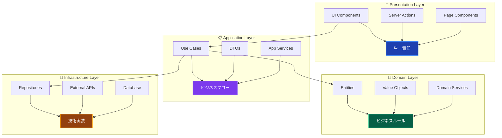
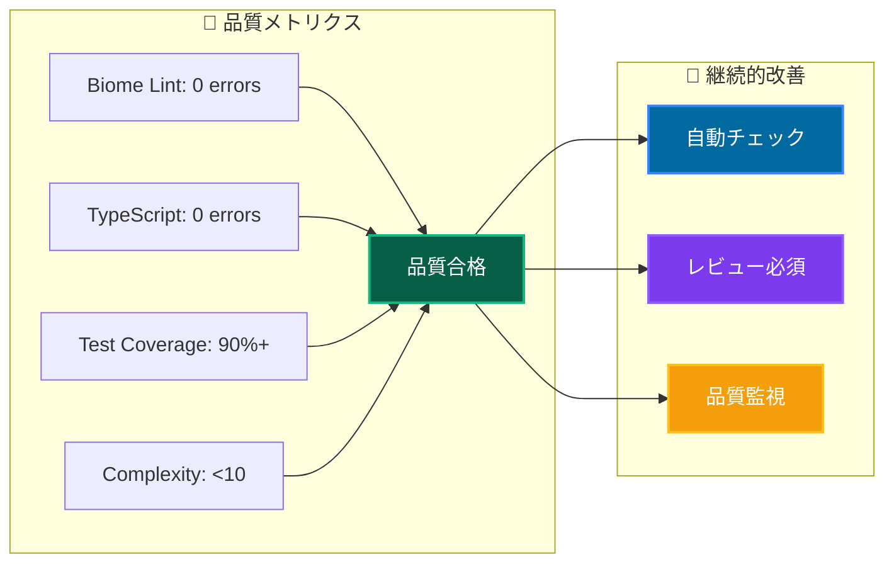

# コーディング規約 📏

Clean Architecture + DDD プロジェクトにおける統一的なコーディング標準

---

## 📖 このドキュメントについて

### 🎯 目的

- **品質統一**: チーム全体での一貫した品質レベル確保
- **可読性向上**: 保守しやすく理解しやすいコード実現
- **効率化**: レビューやデバッグ作業の効率化

### 📚 前提知識

- **必須**: TypeScript基礎、React/Next.js基礎
- **推奨**: [アーキテクチャ概要](../../architecture/overview.md) 理解
- **参考**: [設計原則](../../architecture/principles.md) | [命名規則](naming.md)

### 🔗 関連ドキュメント

- **[命名規則詳細](naming.md)** - 詳細な命名ガイドライン
- **[プロジェクト構造](project-structure.md)** - ディレクトリ・ファイル構成
- **[開発フロー](../development/workflow.md)** - 実装・レビューフロー

---

## 🏗️ アーキテクチャ原則に基づくルール

### 📋 レイヤー責務の厳格な分離


```mermaid
graph TB
    subgraph "🎨 Presentation Layer"
        A[UI Components] --> D[単一責任]
        B[Server Actions] --> D
        C[Page Components] --> D
    end

    subgraph "📋 Application Layer"
        E[Use Cases] --> H[ビジネスフロー]
        F[DTOs] --> H
        G[App Services] --> H
    end

    subgraph "👑 Domain Layer"
        I[Entities] --> L[ビジネスルール]
        J[Value Objects] --> L
        K[Domain Services] --> L
    end

    subgraph "🔧 Infrastructure Layer"
        M[Repositories] --> P[技術実装]
        N[External APIs] --> P
        O[Database] --> P
    end

    A --> E
    E --> I
    E --> M

    style D fill:#1e40af,stroke:#3b82f6,stroke-width:2px,color:#ffffff
    style H fill:#7c3aed,stroke:#8b5cf6,stroke-width:2px,color:#ffffff
    style L fill:#065f46,stroke:#10b981,stroke-width:2px,color:#ffffff
    style P fill:#92400e,stroke:#f59e0b,stroke-width:2px,color:#ffffff
```

### 🚫 禁止事項・違反パターン

```typescript
// ❌ 禁止: レイヤー越境の直接依存
// Presentation → Infrastructure

// ✅ 推奨: 適切な依存関係
// Presentation → Application
import { resolve } from '@/di/resolver';
// ❌ 禁止: Domain → Application
import { CreateUserUseCase } from '@/layers/application'; // NG

// Application → Domain (Interface)
import { IUserRepository } from '@/layers/domain/repositories/IUserRepository';
import { INJECTION_TOKENS } from '@/di/tokens';

import { PrismaClient } from '@prisma/client'; // NG

// ❌ 禁止: フレームワーク依存のDomain
import { NextRequest } from 'next/server'; // Domain層でNG
```

---

## 🎯 Result型パターンの統一

### 必須実装パターン

```typescript
// ✅ UseCase戻り値は必ずResult型
export class CreateUserUseCase {
 async execute(
  request: CreateUserRequest,
 ): Promise<Result<CreateUserResponse, AppError>> {
  try {
   // 1. 入力検証（Value Objectはコンストラクタ+DomainErrorパターン）
   let email: Email;
   try {
    email = new Email(request.email);
   } catch (error) {
    if (error instanceof DomainError) {
     return err({ message: error.message, code: error.code });
    }
    return err({ message: 'メールアドレスが無効です', code: 'INVALID_EMAIL' });
   }

   // 2. ビジネスロジック実行
   const user = await this.createUser(email);

   // 3. 成功レスポンス組み立て
   // Value Object: .value で型安全にプリミティブ値を取得
   // プリミティブ型: 直接アクセス
   return ok({
    userId: user.id.value,
    name: user.name,
    email: user.email.value,
    createdAt: user.createdAt.toISOString(),
   });
  } catch (error) {
   // 4. インフラエラーの統一処理
   this.logger.error('ユーザー作成中にエラーが発生', { error });
   return err({ message: 'ユーザー作成に失敗しました', code: 'UNEXPECTED_ERROR' });
  }
 }
}

// ✅ Server ActionsでのResult型処理
export async function createUserAction(formData: FormData) {
 const useCase = resolve('CreateUserUseCase');
 const result = await useCase.execute(request);

 if (result.isErr()) {
  return {
   success: false,
   message: result.error.message,
  };
 }

 return {
  success: true,
  data: result.value,
 };
}
```

---

## 💉 依存性注入の統一パターン

### サービス層での Constructor Injection

```typescript
// ✅ 推奨: Application/Domain/Infrastructure層
@injectable()
export class CreateUserUseCase {
 constructor(
  @inject(INJECTION_TOKENS.UserRepository)
  private readonly userRepository: IUserRepository,
  @inject(INJECTION_TOKENS.HashService)
  private readonly hashService: IHashService,
  @inject(INJECTION_TOKENS.Logger)
  private readonly logger: ILogger,
 ) {}

 // UseCase実装...
}
```

### Presentation層での Dynamic Resolution

```typescript
// ✅ 推奨: Server Actions/Components
'use server';

import { resolve } from '@/di/resolver';

export async function createUserAction(formData: FormData) {
 // 動的解決パターン（型安全な文字列キーで解決）
 const useCase = resolve('CreateUserUseCase');
 const result = await useCase.execute(request);
 // 処理...
}
```

---

## 📁 インポート・モジュール管理

### 🚫 禁止: index.ts ファイル作成

```typescript
// ❌ 禁止: index.tsファイルの作成
// /components/ui/index.ts - 作成しない

// ❌ 禁止: まとめてインポート
import { Button, Input, Card } from '@/components/ui';

// ✅ 推奨: 個別インポート
import { Button } from '@/components/ui/button';
import { Input } from '@/components/ui/input';
import { Card } from '@/components/ui/card';
```

### 📍 Alias使用の統一

```typescript
// ✅ プロジェクト標準のalias使用
import { UserService } from '@/layers/application/services/UserService';
import { Email } from '@/layers/domain/value-objects/Email';
import { setupTestEnvironment } from '@tests/utils/helpers/testHelpers';

// ❌ 禁止: 相対パス
import { UserService } from '../../application/services/UserService';
import { Email } from '../../../domain/value-objects/Email';
```

---

## 🎨 コンポーネント・UI実装規約

### React Server Components優先

```typescript
// ✅ 推奨: RSC (default export)
export default function UserProfilePage({ params }: { params: { id: string } }) {
  // Server Component実装
  return (
    <div>
      <UserProfile userId={params.id} />
    </div>
  );
}

// ✅ 必要時のみClient Component
'use client';

export function InteractiveUserForm() {
  const [state, setState] = useState();
  // クライアント側ロジック
}
```

### Server Actions統合

```typescript
// ✅ 推奨: Server Actionsパターン
'use server';

import { redirect } from 'next/navigation';

import { resolve } from '@/di/resolver';

export async function updateUserAction(formData: FormData) {
 // バリデーション
 const input = {
  name: formData.get('name') as string,
  email: formData.get('email') as string,
 };

 // UseCase実行（型安全な文字列キーで解決）
 const useCase = resolve('UpdateUserUseCase');
 const result = await useCase.execute(input);

 if (result.isErr()) {
  return err({ message: result.error.message, code: result.error.code });
 }

 redirect('/users');
}
```

---

## 🧪 テスト実装規約

### vitest-mock-extended 標準使用

```typescript
// ✅ 推奨: 自動モック使用
import { container } from '@/di/container';
import { resolve } from '@/di/resolver';
import { INJECTION_TOKENS } from '@/di/tokens';
import { setupTestEnvironment } from '@tests/utils/helpers/testHelpers';
import { createAutoMockUserRepository } from '@tests/utils/mocks/autoMocks';

describe('CreateUserUseCase', () => {
 setupTestEnvironment(); // DIコンテナリセット必須

 let useCase: CreateUserUseCase;
 let mockRepository: MockProxy<IUserRepository>;

 beforeEach(() => {
  // 自動モック生成
  mockRepository = createAutoMockUserRepository();
  container.registerInstance(INJECTION_TOKENS.UserRepository, mockRepository);

  // 型安全な resolve 関数でUseCase取得
  useCase = resolve('CreateUserUseCase');
 });

 // Result型対応テスト
 it('should create user successfully', async () => {
  const result = await useCase.execute(validInput);

  expect(result.isOk()).toBe(true);
  if (result.isOk()) {
   expect(result.value.name).toBe('Test User');
  }
 });
});
```

---

## ✍️ コメント・ドキュメント規約

### 📝 適切なコメント記述

```typescript
// ✅ 推奨: なぜその実装なのかを説明
export class User {
 // Entityはイミュータブル設計：更新時は新しいインスタンスを返す
 changeName(newName: UserName): User {
  // ビジネスルール: アカウント作成から24時間以内は名前変更不可
  // 理由: スパム防止・セキュリティ確保のため
  if (this.createdAt.getTime() > Date.now() - 24 * 60 * 60 * 1000) {
   throw new DomainError(
    'アカウント作成から24時間以内は名前変更できません',
    'NAME_CHANGE_TOO_SOON',
   );
  }

  return new User({
   ...this.toProps(),
   name: newName,
   updatedAt: new Date(),
  });
 }

 // ❌ 避ける: 何をしているかの説明
 // changeName(newName: UserName): User {
 //   // 名前を変更する
 //   return new User({ ...this.toProps(), name: newName });
 // }
}
```

### 🚫 コメント禁止パターン

```typescript
// ❌ 禁止: 個人的なメモ・TODO
// TODO: あとで直す
// FIXME: このコードはうまく動かない
// NOTE: 個人的な覚書

// ❌ 禁止: コードの履歴情報
// 2024/01/15 田中修正: バグ修正
// Version 1.2で追加

// ❌ 禁止: 明らかな処理の説明
// let user = new User(); // 新しいユーザーを作成
// user.save(); // ユーザーを保存
```

---

## 📊 コード品質指標

### 🎯 品質基準


```mermaid
graph LR
    subgraph "📏 品質メトリクス"
        A[Biome Lint: 0 errors] --> E[品質合格]
        B[TypeScript: 0 errors] --> E
        C[Test Coverage: 90%+] --> E
        D[Complexity: <10] --> E
    end

    subgraph "🚀 継続的改善"
        F[自動チェック]
        G[レビュー必須]
        H[品質監視]
    end

    E --> F
    E --> G
    E --> H

    style E fill:#065f46,stroke:#10b981,stroke-width:2px,color:#ffffff
    style F fill:#0369a1,stroke:#3b82f6,stroke-width:2px,color:#ffffff
    style G fill:#7c3aed,stroke:#8b5cf6,stroke-width:2px,color:#ffffff
    style H fill:#f59e0b,stroke:#fbbf24,stroke-width:2px,color:#ffffff
```

### 🔧 自動チェック設定

```bash
# 品質チェックコマンド
pnpm lint        # Biome Lint実行
pnpm type-check  # TypeScript型チェック
pnpm test:unit   # ユニットテスト実行
pnpm format      # Biome Format実行
```

---

## 🔄 レビュー・品質保証プロセス

### 📋 Pull Request チェックリスト

#### **実装品質**

- [ ] アーキテクチャ原則遵守（レイヤー分離・依存関係）
- [ ] Result型パターン統一
- [ ] 依存性注入の適切な使用
- [ ] エラーハンドリングの統一

#### **コード品質**

- [ ] Biome Lint・TypeScriptエラーなし
- [ ] テストカバレッジ基準達成
- [ ] 適切なコメント記述
- [ ] 命名規則遵守

#### **機能品質**

- [ ] ビジネス要件の適切な実装
- [ ] エッジケース対応
- [ ] セキュリティ考慮事項

---

## 🚀 継続的改善

### 📈 品質向上プロセス

1. **定期レビュー**: 月次でコーディング標準見直し
2. **ベストプラクティス共有**: チーム内知識展開
3. **ツール更新**: Linter・フォーマッタールール更新
4. **メトリクス監視**: 品質指標の継続的監視

### 🎓 学習・スキル向上

- **技術書籍**: Clean Code、Refactoring等
- **コードレビュー**: 相互学習・知識共有
- **勉強会**: 新技術・パターン習得

---

**📏 統一されたコーディング規約により、保守しやすく高品質なコードベースを実現しましょう！**
