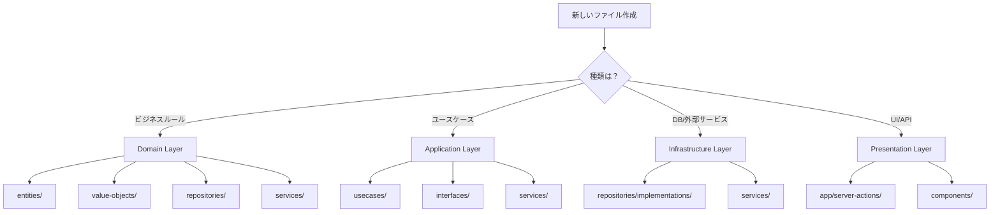

# プロジェクト構造 📁

Clean Architecture + DDD プロジェクトのディレクトリ・ファイル構成ガイド

---

## 📖 このドキュメントについて

### 🎯 目的

- **構造理解**: プロジェクト全体の俯瞰的理解
- **配置指針**: 新規ファイルの適切な配置場所の判断
- **ナビゲーション**: 必要なコードへの迅速なアクセス

### 🔗 関連ドキュメント

- **[命名規則](naming.md)** - ファイル・変数の命名ガイドライン
- **[コーディング規約](coding.md)** - コーディング標準
- **[アーキテクチャ概要](../../architecture/overview.md)** - システム全体設計

---

## 🗂️ ルートディレクトリ構造

```
d-next-resources/
├── src/                    # ソースコード
├── tests/                  # テストコード
├── prisma/                 # Prismaスキーマ・マイグレーション
├── public/                 # 静的ファイル
├── _DOCS/                  # ドキュメント
├── _templates/             # Hygenコード生成テンプレート
├── scripts/                # ユーティリティスクリプト
├── .claude/                # Claude Code設定
├── .serena/                # Serena MCP設定
├── next.config.ts          # Next.js設定
├── biome.json              # Biome設定（Lint + Format）
├── vitest.config.ts        # Vitest設定
├── tsconfig.json           # TypeScript設定
├── package.json            # パッケージ定義
├── CLAUDE.md               # Claude Code向けガイド
└── Makefile                # 開発コマンド定義
```

---

## 📂 src/ ディレクトリ詳細

### 全体構造

```
src/
├── app/                    # Next.js App Router
├── components/             # Reactコンポーネント
├── layers/                 # Clean Architectureレイヤー
├── di/                     # 依存性注入設定
├── hooks/                  # Custom Hooks
├── utils/                  # ユーティリティ関数
├── lib/                    # 外部ライブラリ設定
├── tools/                  # 開発ツール・ヘルパー
├── types/                  # グローバル型定義
└── proxy.ts                # Next.js 16 Proxy (旧middleware.ts)
```

### app/ - Next.js App Router

```
app/
├── (auth)/                 # 認証グループ
│   ├── sign-in/
│   │   └── page.tsx
│   └── sign-up/
│       └── page.tsx
├── (dashboard)/            # ダッシュボードグループ
│   ├── layout.tsx
│   └── users/
│       ├── page.tsx
│       └── [id]/
│           └── page.tsx
├── api/                    # API Routes
│   └── health/
│       └── route.ts
├── server-actions/         # Server Actions
│   ├── auth/
│   │   ├── signIn.ts
│   │   ├── signOut.ts
│   │   ├── refreshToken.ts
│   │   ├── changePassword.ts
│   │   └── resetPassword.ts
│   └── user/
│       ├── createUser.ts
│       ├── getUsers.ts
│       ├── getUserById.ts
│       ├── updateUser.ts
│       └── deleteUser.ts
├── globals.css             # グローバルCSS
├── layout.tsx              # ルートレイアウト
└── page.tsx                # ホームページ
```

### components/ - Reactコンポーネント

```
components/
├── features/               # 機能別コンポーネント
│   ├── auth/
│   │   ├── SignInForm.tsx
│   │   └── SignUpForm.tsx
│   ├── user/
│   │   ├── UserProfile.tsx
│   │   └── UserList.tsx
│   ├── navigation/
│   └── demo/
├── common/                 # 共通コンポーネント
│   ├── Header.tsx
│   ├── Footer.tsx
│   └── Breadcrumb.tsx
├── layout/                 # レイアウトコンポーネント
│   ├── MainLayout.tsx
│   └── DashboardLayout.tsx
└── ui/                     # shadcn/ui コンポーネント
    ├── button.tsx
    ├── input.tsx
    ├── card.tsx
    └── ...
```

### layers/ - Clean Architectureレイヤー

```
layers/
├── presentation/           # プレゼンテーション層
│   └── (Server Actionsはapp/server-actions/に配置)
│
├── application/            # アプリケーション層
│   ├── usecases/          # UseCase（DTOはUseCase内に定義）
│   │   ├── auth/
│   │   │   ├── SignInUseCase.ts
│   │   │   ├── SignOutUseCase.ts
│   │   │   ├── GetCurrentUserUseCase.ts
│   │   │   ├── RefreshTokenUseCase.ts
│   │   │   ├── ChangePasswordUseCase.ts
│   │   │   └── ResetPasswordUseCase.ts
│   │   ├── user/
│   │   │   ├── CreateUserUseCase.ts
│   │   │   ├── GetUsersUseCase.ts
│   │   │   ├── GetUserByIdUseCase.ts
│   │   │   └── DeleteUserUseCase.ts
│   │   └── UpdateUserUseCase.ts
│   ├── interfaces/        # アプリケーション層インターフェース
│   │   └── ILogger.ts
│   ├── services/          # Application Services
│   │   ├── AuthService.ts
│   │   ├── UserService.ts
│   │   └── TokenService.ts
│   └── types/             # 共通型定義
│       └── Result.ts
│
├── domain/                 # ドメイン層
│   ├── entities/          # エンティティ
│   │   ├── User.ts
│   │   └── UserSession.ts
│   ├── value-objects/     # 値オブジェクト
│   │   ├── EntityId.ts    # 汎用EntityId基底クラス
│   │   ├── UserId.ts
│   │   ├── SessionId.ts
│   │   └── Email.ts
│   ├── repositories/      # Repository Interface
│   │   └── IUserRepository.ts
│   ├── services/          # Domain Services
│   │   └── UserDomainService.ts
│   └── errors/            # ドメインエラー
│       └── DomainError.ts
│
└── infrastructure/         # インフラストラクチャ層
    ├── repositories/      # Repository Implementation
    │   └── implementations/
    │       └── PrismaUserRepository.ts
    ├── services/          # 外部サービス
    │   ├── HashService.ts
    │   └── EmailService.ts
    └── database/          # データベース関連
        └── prisma.ts
```

### di/ - 依存性注入設定

```
di/
├── tokens.ts              # DIトークン定義・TypeMap
├── container.ts           # TSyringeコンテナインスタンス
├── resolver.ts            # 型安全なresolve関数
└── containers/            # コンテナ登録設定
    ├── core.container.ts          # コア（Logger等）登録
    ├── domain.container.ts        # Domain層登録
    ├── infrastructure.container.ts # Infrastructure層登録
    └── application.container.ts   # Application層登録
```

---

## 🧪 tests/ ディレクトリ詳細

```
tests/
├── unit/                   # ユニットテスト
│   ├── usecases/          # UseCase テスト
│   │   ├── auth/
│   │   │   └── *.test.ts
│   │   ├── user/
│   │   │   └── *.test.ts
│   │   └── CreateUserUseCase.test.ts
│   ├── domain/            # Domain テスト
│   │   ├── entities/
│   │   │   └── User.test.ts
│   │   └── value-objects/
│   │       └── Email.test.ts
│   ├── repositories/      # Repository テスト
│   │   ├── PrismaUserRepository.test.ts
│   │   └── PrismaSessionRepository.test.ts
│   ├── services/          # Service テスト
│   │   └── *.test.ts
│   ├── server-actions/    # Server Action テスト
│   │   ├── auth/
│   │   │   └── signIn.test.ts
│   │   └── user/
│   │       └── createUser.test.ts
│   ├── di/                # DI テスト
│   │   └── container.test.ts
│   └── application/       # Application層テスト
│       └── usecases/
├── e2e/                    # E2Eテスト
│   └── *.spec.ts
├── utils/                  # テストユーティリティ
│   ├── helpers/
│   │   └── testHelpers.ts
│   └── mocks/
│       └── autoMocks.ts
└── setup.ts                # テストセットアップ
```

---

## 📄 設定ファイル

### TypeScript設定

```
tsconfig.json              # ベース設定
├── compilerOptions
│   ├── strict: true
│   ├── paths: { "@/*": ["./src/*"], "@tests/*": ["./tests/*"] }
│   └── ...
```

### Biome設定

```
biome.json                 # Lint + Format統合設定
├── linter
│   └── rules
│       ├── recommended: true
│       └── noRestrictedImports (レイヤー依存関係制御)
└── formatter
    ├── indentStyle: "space"
    └── indentWidth: 2
```

### Vitest設定

```
vitest.config.ts           # テスト設定
├── setupFiles: ['./tests/setup.ts']
├── coverage
│   └── thresholds
└── alias: { "@/*", "@tests/*" }
```

---

## 🎯 配置ガイドライン

### 新しいファイルをどこに置くか

| 作成するもの | 配置場所 |
|-------------|---------|
| **Entity** | `src/layers/domain/entities/` |
| **Value Object** | `src/layers/domain/value-objects/` |
| **Repository Interface** | `src/layers/domain/repositories/` |
| **Repository Implementation** | `src/layers/infrastructure/repositories/implementations/` |
| **UseCase** | `src/layers/application/usecases/{domain}/` |
| **Server Action** | `src/app/server-actions/{domain}/` |
| **Page Component** | `src/app/{route}/page.tsx` |
| **Feature Component** | `src/components/features/{feature}/` |
| **UI Component** | `src/components/ui/` |
| **Custom Hook** | `src/hooks/` |
| **Utility** | `src/utils/` |
| **Unit Test** | `tests/unit/{対応するsrc構造}/` |
| **E2E Test** | `tests/e2e/` |

### 決定フローチャート



---

## 📁 ディレクトリ作成時の注意

### index.ts 作成禁止

```typescript
// ❌ 禁止: index.tsファイルの作成
// /components/ui/index.ts

// ✅ 推奨: 個別ファイルからの直接import
import { Button } from '@/components/ui/button';
import { Input } from '@/components/ui/input';
```

### ドメイン別のサブディレクトリ

```
// ✅ 推奨: ドメイン別に整理
usecases/
├── auth/
│   ├── SignInUseCase.ts
│   └── SignUpUseCase.ts
└── users/
    ├── CreateUserUseCase.ts
    └── UpdateUserUseCase.ts

// ❌ 避ける: フラットな配置
usecases/
├── SignInUseCase.ts
├── SignUpUseCase.ts
├── CreateUserUseCase.ts
└── UpdateUserUseCase.ts
```

---

## ✅ 構造チェックリスト

- [ ] レイヤー間の依存方向は正しいか（外側→内側）
- [ ] ドメイン別にサブディレクトリが整理されているか
- [ ] テストファイルは対応するソースファイルと同じ構造か
- [ ] 共通コンポーネントと機能別コンポーネントが分離されているか
- [ ] 設定ファイルはルートディレクトリに配置されているか

---

**📁 整理された構造は、保守しやすいコードベースの基盤です！**
