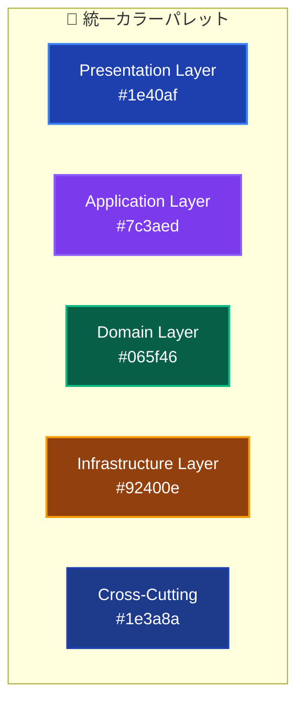
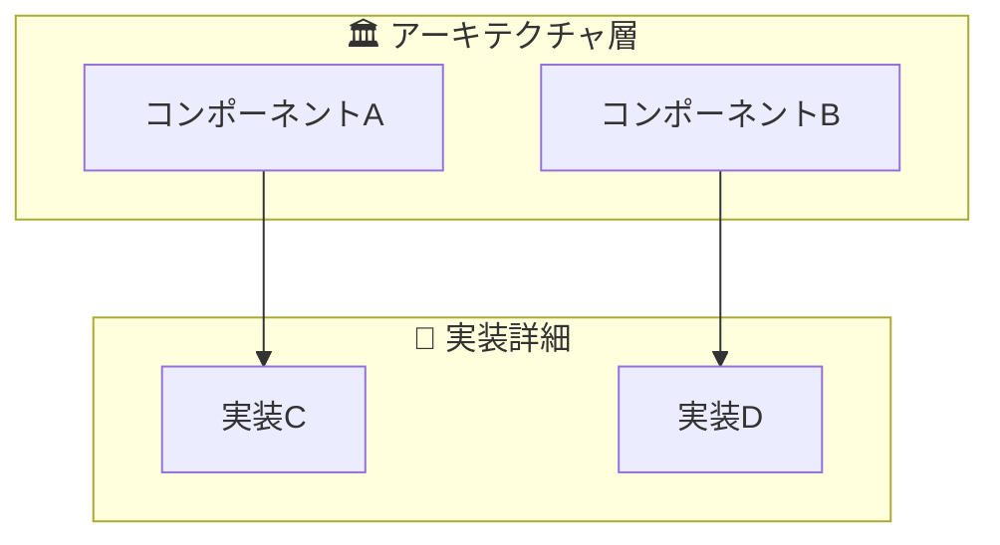
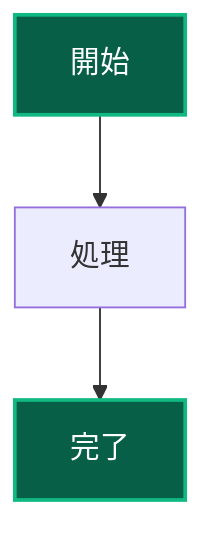

# ドキュメントスタイルガイド 🎨

視覚的一貫性とユーザビリティの統一基準

---

## 📖 このガイドについて

### 🎯 目的

- **視覚的一貫性**: 全ドキュメントでの統一されたビジュアル体験
- **読みやすさ向上**: 情報の階層化と視覚的整理
- **アクセシビリティ**: 多様なユーザーへの配慮

### 🔄 適用範囲

- **新規ドキュメント**: このガイドに完全準拠
- **既存ドキュメント**: 段階的にガイドラインに更新
- **README・主要ドキュメント**: 優先的に適用

---

## 🎭 絵文字使用標準

### 📋 カテゴリ別絵文字体系

#### **文書種別**

| 文書タイプ | 絵文字 | 使用例 |
|-----------|-------|--------|
| **概要・総論** | 🏛️ 📚 🌟 | アーキテクチャ概要 🏛️ |
| **実装ガイド** | 🛠️ ⚡ 🔧 | 開発フロー 🔄 |
| **テスト・品質** | 🧪 ✅ 📊 | テスト戦略 🧪 |
| **設定・環境** | ⚙️ 🔧 📦 | 環境セットアップ ⚙️ |
| **トラブル解決** | 🔧 🚨 🛠️ | よくある問題 🔧 |
| **リファレンス** | 📚 📋 📖 | コマンドリファレンス 📋 |

#### **セクション種別**

| セクション | 絵文字 | 使用場面 |
|-----------|-------|----------|
| **このドキュメントについて** | 📖 | 文書冒頭の説明 |
| **目的・概要** | 🎯 🚀 | 目標・ビジョン |
| **手順・プロセス** | 📋 🔄 | 段階的な作業手順 |
| **重要事項・注意** | ⚠️ 🚨 | 注意喚起・重要ポイント |
| **成功・完了** | ✅ 🎉 | 達成・成功状態 |
| **学習・教育** | 🎓 📚 | 学習リソース |
| **関連・参照** | 🔗 📎 | 関連ドキュメント |
| **次のステップ** | 🚀 ➡️ | 行動指針 |

#### **技術要素別**

| 技術要素 | 絵文字 | 説明 |
|---------|-------|------|
| **アーキテクチャ** | 🏛️ 🏗️ | システム設計・構造 |
| **レイヤー** | 👑 📋 🔧 🎨 | Domain/Application/Infrastructure/Presentation |
| **パターン** | 🧩 🎭 | 設計パターン・実装パターン |
| **依存性注入** | 💉 🔄 | DI関連内容 |
| **テスト** | 🧪 🎬 🎯 | Unit/E2E/Integration |
| **データベース** | 🗃️ 💾 | DB・永続化関連 |
| **UI・フロントエンド** | 🎨 🖼️ | UI実装・コンポーネント |

### 🎨 絵文字使用原則

#### **基本ルール**

1. **1文書1主要絵文字**: タイトルに使用する絵文字は統一
2. **セクション一貫性**: 同じ種類のセクションは同じ絵文字
3. **階層明確化**: 絵文字でセクション階層を視覚化
4. **過度使用回避**: 1行に2個以上の絵文字は避ける

#### **効果的な使用例**

```markdown
# アーキテクチャ概要 🏛️

## 📖 このドキュメントについて

### 🎯 目的
- **品質向上**: システム全体の品質確保

### 📚 前提知識  
- **必須**: TypeScript基礎

## 🚀 プロジェクトビジョン

### 👑 Domain Layer
- **Entity**: ビジネスエンティティ
- **Value Object**: 値オブジェクト

## 🔗 関連ドキュメント
```

---

## 📊 視覚的階層システム

### 🎯 見出し階層ガイドライン

#### **標準階層構造**

```markdown
# 文書タイトル 🎭 (H1)
メイン文書のタイトル - 1文書1つのみ

## 主要セクション 📋 (H2)  
文書の主要な章・セクション

### サブセクション 🔧 (H3)
主要セクション内の詳細分類

#### 詳細項目 💡 (H4)
具体的な項目・実装内容

##### 補足事項 📝 (H5)
詳細説明・注釈（使用は最小限）
```

#### **視覚的区切り使用**

```markdown
---  (水平線)
主要セクション間の明確な区切り

***  (強調区切り)  
重要な段落・警告の前後

<!-- スペース活用 -->
段落間の適切な空白で読みやすさ向上
```

### 📋 情報整理手法

#### **表形式の活用**

```markdown
| 項目 | 内容 | 重要度 | 詳細リンク |
|------|------|--------|-----------|
| **必須項目** | 基本設定 | 🔴 High | [詳細](link) |
| **推奨項目** | 拡張設定 | 🟡 Medium | [詳細](link) |
| **オプション** | 高度設定 | 🟢 Low | [詳細](link) |
```

#### **リスト活用パターン**

```markdown
### ✅ チェックリスト形式
- [ ] 未完了項目
- [x] 完了項目

### 🎯 優先度付きリスト  
1. **最重要**: 必須実施事項
2. **重要**: 推奨実施事項  
3. **参考**: 追加検討事項

### 📋 カテゴリ分類リスト
- **設計**: アーキテクチャ関連
- **実装**: コーディング関連
- **テスト**: 品質保証関連
```

---

## 🎨 Mermaid図スタイル標準

### 🎯 色彩体系

#### **レイヤー別カラーコード**



#### **状態・種別カラー**


### 📊 図表種別ガイドライン

#### **フローチャート (graph TB/LR)**

- **用途**: プロセス・フロー・階層関係
- **方向**: TB (上下) - 階層、LR (左右) - フロー
- **スタイル**: 角丸四角形、明確な矢印

#### **シーケンス図 (sequenceDiagram)**  

- **用途**: 時系列処理・相互作用
- **参加者**: 明確な役割分担
- **メッセージ**: 簡潔で分かりやすい表現

#### **サブグラフ活用**



---

## 📱 レスポンシブ・アクセシビリティ

### 📱 モバイル対応

#### **表の最適化**

```markdown
<!-- 複雑な表 → シンプルな表 + 補足説明 -->

❌ 避ける: 横幅が広すぎる表
| 項目名 | 詳細説明 | 実装方法 | テスト手法 | 関連ドキュメント | 備考 |

✅ 推奨: 重要情報に絞った表
| 項目 | 方法 | 詳細 |
|------|------|------|
| **実装** | パターンA | [詳細リンク](link) |

**補足説明**: 詳細な情報は別セクションまたはリンク先で提供
```

#### **長い行の分割**

```markdown
❌ 避ける: 
これは非常に長い文章で、モバイルデバイスでは読みにくくなる可能性があり、特に小さな画面では改行が不自然になってしまいます。

✅ 推奨:
これは適切な長さの文章です。
モバイルデバイスでも読みやすく、
自然な改行で表示されます。
```

### ♿ アクセシビリティ配慮

#### **見出し構造の最適化**

```markdown
# メインタイトル (H1) - 1つのみ
## 主要セクション (H2) - 論理的順序
### サブセクション (H3) - H2の下位
#### 詳細項目 (H4) - H3の下位
```

#### **リンクテキストの明確化**

```markdown
❌ 避ける: [こちら](link) を参照してください
❌ 避ける: [詳細](link)

✅ 推奨: [アーキテクチャ概要の詳細](architecture/overview.md)
✅ 推奨: [UseCase実装ガイド](guides/development/usecase.md)
```

#### **代替テキスト提供**

```markdown
<!-- 図表・画像には説明を併記 -->


*上図: 基本的な処理フローを示しています*

```

---

## 🎯 実践的適用例

### 📖 標準的なドキュメント構造

```markdown
# ドキュメントタイトル 🎭

簡潔で分かりやすい説明文

---

## 📖 このドキュメントについて

### 🎯 対象読者
- **初心者**: 基本概念の理解
- **中級者**: 実装手法の習得

### 📚 前提知識  
- **必須**: 基本概念の理解
- **推奨**: 関連技術の知識

### 🔗 関連ドキュメント
- [前提ドキュメント](link) - 事前に読む推奨
- [詳細ガイド](link) - 深掘り学習用

---

## 🚀 メインコンテンツ

### 📋 概要説明
主要なコンテンツの説明...



### 🛠️ 実装詳細

#### ✅ 基本パターン

実装の基本的なアプローチ...

#### 🎯 応用パターン  

より高度な実装手法...

---

## 🔗 次のステップ

### 📚 推奨学習パス

1. **[次のドキュメント](link)** - 論理的な次のステップ
2. **[関連実装](link)** - 実践的な内容

### 🎯 実践・応用

- **実装演習**: 学んだ内容の実践
- **品質確認**: 実装品質の確認

---

**🎭 このガイドにより、○○を実現しましょう！**

```

---

## 📊 品質チェックリスト

### ✅ **視覚的一貫性**
- [ ] 絵文字使用が標準に準拠している
- [ ] 見出し階層が適切に設定されている  
- [ ] 色彩使用が統一されている
- [ ] Mermaid図のスタイルが統一されている

### ✅ **読みやすさ**
- [ ] 適切な段落分け・空白配置
- [ ] 表・リストの効果的活用
- [ ] 長すぎる行・段落の分割
- [ ] 視覚的区切りの適切な使用

### ✅ **ナビゲーション**  
- [ ] 明確なリンクテキスト
- [ ] 関連ドキュメントの適切な参照
- [ ] 学習パス・次のステップの明示
- [ ] 目次・構造の分かりやすさ

### ✅ **アクセシビリティ**
- [ ] 見出し構造の論理性
- [ ] モバイル対応の配慮
- [ ] 代替テキスト・説明の提供
- [ ] 色以外の情報伝達手段併用

---

## 🔄 継続的改善

### 📈 品質監視指標
1. **視覚的一貫性**: スタイル準拠率
2. **読みやすさ**: ユーザーフィードバック
3. **ナビゲーション**: リンク有効率
4. **アクセシビリティ**: 多様性対応度

### 🎯 改善プロセス
1. **定期レビュー**: 月次スタイルガイド準拠確認
2. **フィードバック収集**: ユーザビリティ向上点の特定  
3. **ガイド更新**: 効果的なパターンの追加
4. **チーム共有**: ベストプラクティスの水平展開

---

**🎨 統一されたビジュアル体験で、優れたドキュメンテーションを実現しましょう！**
