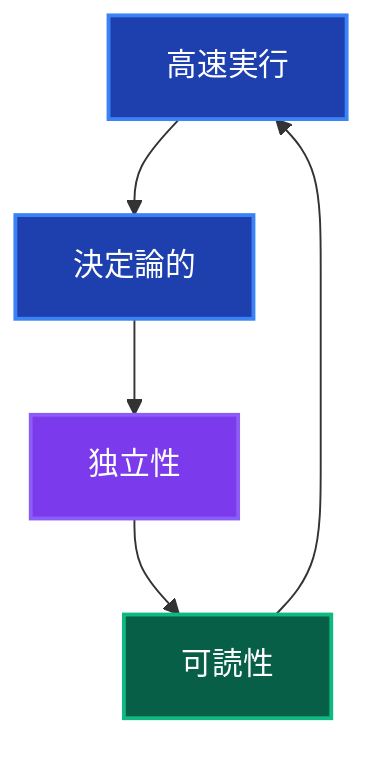
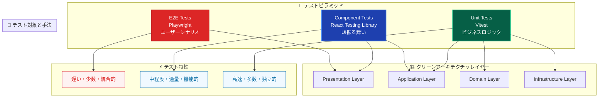
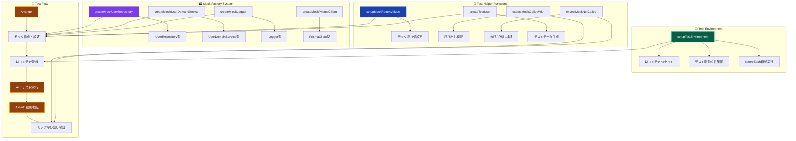
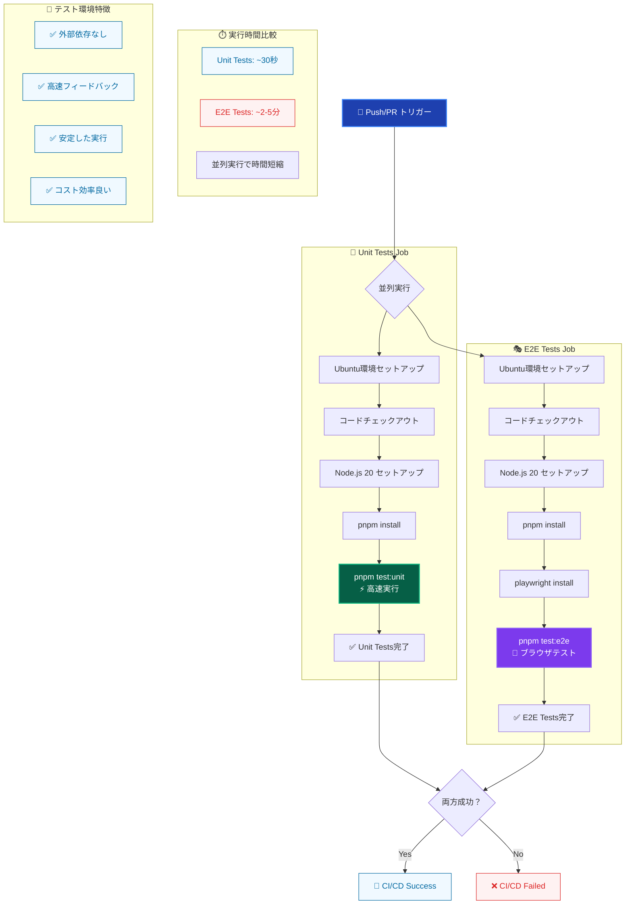
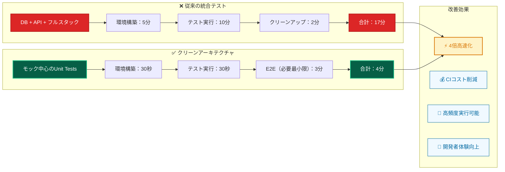

# クリーンアーキテクチャでのテスト戦略 🧪

このドキュメントでは、クリーンアーキテクチャを採用したプロジェクトでのテスト戦略と実装パターンについて詳しく説明します。

---

## 概要 📐

### テストフレームワーク構成

本プロジェクトでは以下のテストフレームワークを使用しています：

- **Unit Tests**: **Vitest** でDomain/UseCase/Utilityをテスト
- **Component Tests**: **React Testing Library** でPresentationレイヤーをテスト
- **E2E Tests**: **Playwright** でユーザーシナリオをテスト

### テスト戦略の原則



1. **高速実行** - テストは数秒で完了する
2. **決定論的** - 同じ入力に対して常に同じ結果
3. **独立性** - テスト間で状態を共有しない
4. **可読性** - AAA（Arrange-Act-Assert）パターンを徹底

---

## 1. Unit Tests（ユニットテスト）🔬

### 1.1 基本的なUseCaseテスト

```typescript
import { container } from '@/di/container';
import { resolve } from '@/di/resolver';
import { INJECTION_TOKENS } from '@/di/tokens';
import { CreateUserUseCase } from '@/layers/application/usecases/user/CreateUserUseCase';

import { beforeEach, describe, expect, it } from 'vitest';

import {
 createTestUser,
 expectMockCalledWith,
 expectMockNotCalled,
 setupMockReturnValues,
 setupTestEnvironment,
} from '../../utils/helpers/testHelpers';
import {
 createMockLogger,
 createMockUserDomainService,
 createMockUserRepository,
} from '../../utils/mocks/commonMocks';

describe('CreateUserUseCase', () => {
 let createUserUseCase: CreateUserUseCase;
 let mockUserRepository: ReturnType<typeof createMockUserRepository>;
 let mockUserDomainService: ReturnType<typeof createMockUserDomainService>;
 let mockLogger: ReturnType<typeof createMockLogger>;

 // テスト環境の自動セットアップ
 setupTestEnvironment();

 beforeEach(() => {
  // モックの作成
  mockUserRepository = createMockUserRepository();
  mockUserDomainService = createMockUserDomainService();
  mockLogger = createMockLogger();

  // DIコンテナにモックを登録
  container.registerInstance(
   INJECTION_TOKENS.UserRepository,
   mockUserRepository,
  );
  container.registerInstance(
   INJECTION_TOKENS.UserDomainService,
   mockUserDomainService,
  );
  container.registerInstance(INJECTION_TOKENS.Logger, mockLogger);

  // UseCaseインスタンスをDIコンテナから取得（型安全）
  createUserUseCase = resolve('CreateUserUseCase');
 });

 describe('execute', () => {
  const validInput = {
   name: 'John Doe',
   email: 'john@example.com',
   password: 'password123',
  };

  it('should successfully create a user', async () => {
   // Arrange
   const hashedPassword = 'hashed_password';
   const createdUser = createTestUser({
    name: validInput.name,
    email: validInput.email,
    passwordHash: hashedPassword,
   });

   setupMockReturnValues(mockUserDomainService, {
    validateUserData: null,
    hashPassword: hashedPassword,
   });
   setupMockReturnValues(mockUserRepository, {
    findByEmail: null,
    create: createdUser,
   });

   // Act
   const result = await createUserUseCase.execute(validInput);

   // Assert
   expect(result).toEqual({
    id: createdUser.id,
    name: createdUser.name,
    email: createdUser.email,
   });

   // モック呼び出しの確認
   expectMockCalledWith(mockUserDomainService.validateUserData, [validInput]);
   expectMockCalledWith(mockUserRepository.findByEmail, [validInput.email]);
   expectMockCalledWith(mockUserDomainService.hashPassword, [
    validInput.password,
   ]);
   expectMockCalledWith(mockUserRepository.create, [
    {
     name: validInput.name,
     email: validInput.email,
     passwordHash: hashedPassword,
    },
   ]);
  });

  it('should throw error for validation failure', async () => {
   // Arrange
   const validationError = new Error('有効なメールアドレスを入力してください');
   setupMockReturnValues(mockUserDomainService, {
    validateUserData: validationError,
   });

   // Act & Assert
   await expect(createUserUseCase.execute(validInput)).rejects.toThrow(
    '有効なメールアドレスを入力してください',
   );

   expectMockCalledWith(mockUserDomainService.validateUserData, [validInput]);
   expectMockNotCalled(mockUserRepository.findByEmail);
  });

  it('should throw error when email already exists', async () => {
   // Arrange
   const existingUser = createTestUser({ email: validInput.email });

   setupMockReturnValues(mockUserDomainService, {
    validateUserData: null,
   });
   setupMockReturnValues(mockUserRepository, {
    findByEmail: existingUser,
   });

   // Act & Assert
   await expect(createUserUseCase.execute(validInput)).rejects.toThrow(
    'このメールアドレスは既に使用されています',
   );

   expectMockCalledWith(mockUserDomainService.validateUserData, [validInput]);
   expectMockCalledWith(mockUserRepository.findByEmail, [validInput.email]);
   expectMockNotCalled(mockUserDomainService.hashPassword);
  });
 });
});
```

### 1.2 Domain Service テスト

```typescript
import { UserDomainService } from '@/services/domain/UserDomainService';

import { beforeEach, describe, expect, it } from 'vitest';

import {
 createTestUser,
 setupMockReturnValues,
} from '../../utils/helpers/testHelpers';
import {
 createMockConfigService,
 createMockHashService,
} from '../../utils/mocks/commonMocks';

describe('UserDomainService', () => {
 let userDomainService: UserDomainService;
 let mockHashService: ReturnType<typeof createMockHashService>;
 let mockConfigService: ReturnType<typeof createMockConfigService>;

 beforeEach(() => {
  mockHashService = createMockHashService();
  mockConfigService = createMockConfigService();

  userDomainService = new UserDomainService(mockHashService, mockConfigService);
 });

 describe('validateUserData', () => {
  it('should validate correct user data', () => {
   // Arrange
   const validData = {
    name: 'John Doe',
    email: 'john@example.com',
    password: 'password123',
   };

   // Act & Assert
   expect(() => userDomainService.validateUserData(validData)).not.toThrow();
  });

  it('should throw error for invalid email', () => {
   // Arrange
   const invalidData = {
    name: 'John Doe',
    email: 'invalid-email',
    password: 'password123',
   };

   // Act & Assert
   expect(() => userDomainService.validateUserData(invalidData)).toThrow(
    '有効なメールアドレスを入力してください',
   );
  });

  it('should throw error for short password', () => {
   // Arrange
   const invalidData = {
    name: 'John Doe',
    email: 'john@example.com',
    password: '123',
   };

   // Act & Assert
   expect(() => userDomainService.validateUserData(invalidData)).toThrow(
    'パスワードは8文字以上である必要があります',
   );
  });
 });

 describe('hashPassword', () => {
  it('should hash password successfully', async () => {
   // Arrange
   const password = 'password123';
   const hashedPassword = 'hashed_password_123';

   setupMockReturnValues(mockHashService, {
    generateHash: hashedPassword,
   });

   // Act
   const result = await userDomainService.hashPassword(password);

   // Assert
   expect(result).toBe(hashedPassword);
   expect(mockHashService.generateHash).toHaveBeenCalledWith(password, 10);
  });

  it('should throw error when hashing fails', async () => {
   // Arrange
   const password = 'password123';
   const hashError = new Error('Hashing failed');

   setupMockReturnValues(mockHashService, {
    generateHash: hashError,
   });

   // Act & Assert
   await expect(userDomainService.hashPassword(password)).rejects.toThrow(
    'Hashing failed',
   );
  });
 });

 describe('verifyPassword', () => {
  it('should verify password successfully', async () => {
   // Arrange
   const password = 'password123';
   const hashedPassword = 'hashed_password_123';

   setupMockReturnValues(mockHashService, {
    compareHash: true,
   });

   // Act
   const result = await userDomainService.verifyPassword(
    password,
    hashedPassword,
   );

   // Assert
   expect(result).toBe(true);
   expect(mockHashService.compareHash).toHaveBeenCalledWith(
    password,
    hashedPassword,
   );
  });

  it('should return false for incorrect password', async () => {
   // Arrange
   const password = 'wrongpassword';
   const hashedPassword = 'hashed_password_123';

   setupMockReturnValues(mockHashService, {
    compareHash: false,
   });

   // Act
   const result = await userDomainService.verifyPassword(
    password,
    hashedPassword,
   );

   // Assert
   expect(result).toBe(false);
  });
 });
});
```

### 1.3 Repository テスト

```typescript
import { PrismaUserRepository } from '@/repositories/implementations/PrismaUserRepository';

import { beforeEach, describe, expect, it } from 'vitest';

import {
 createTestUser,
 setupMockReturnValues,
} from '../../utils/helpers/testHelpers';
import { createMockPrismaClient } from '../../utils/mocks/commonMocks';

describe('PrismaUserRepository', () => {
 let userRepository: PrismaUserRepository;
 let mockPrismaClient: ReturnType<typeof createMockPrismaClient>;

 beforeEach(() => {
  mockPrismaClient = createMockPrismaClient();
  userRepository = new PrismaUserRepository(mockPrismaClient);
 });

 describe('create', () => {
  it('should create user successfully', async () => {
   // Arrange
   const userData = {
    name: 'John Doe',
    email: 'john@example.com',
    passwordHash: 'hashed_password',
   };
   const createdUser = createTestUser(userData);

   setupMockReturnValues(mockPrismaClient.user, {
    create: createdUser,
   });

   // Act
   const result = await userRepository.create(userData);

   // Assert
   expect(result).toEqual(createdUser);
   expect(mockPrismaClient.user.create).toHaveBeenCalledWith({
    data: userData,
   });
  });

  it('should throw error when creation fails', async () => {
   // Arrange
   const userData = {
    name: 'John Doe',
    email: 'john@example.com',
    passwordHash: 'hashed_password',
   };
   const dbError = new Error('Database error');

   setupMockReturnValues(mockPrismaClient.user, {
    create: dbError,
   });

   // Act & Assert
   await expect(userRepository.create(userData)).rejects.toThrow(
    'Database error',
   );
  });
 });

 describe('findByEmail', () => {
  it('should find user by email', async () => {
   // Arrange
   const email = 'john@example.com';
   const foundUser = createTestUser({ email });

   setupMockReturnValues(mockPrismaClient.user, {
    findUnique: foundUser,
   });

   // Act
   const result = await userRepository.findByEmail(email);

   // Assert
   expect(result).toEqual(foundUser);
   expect(mockPrismaClient.user.findUnique).toHaveBeenCalledWith({
    where: { email },
   });
  });

  it('should return null when user not found', async () => {
   // Arrange
   const email = 'notfound@example.com';

   setupMockReturnValues(mockPrismaClient.user, {
    findUnique: null,
   });

   // Act
   const result = await userRepository.findByEmail(email);

   // Assert
   expect(result).toBeNull();
  });
 });
});
```

---

## 2. テストアーキテクチャとモック戦略 🛠️

### 2.1 テストピラミッドとクリーンアーキテクチャ



### 2.2 モックアーキテクチャの設計



### 2.3 モックファクトリーパターン

**一貫性のあるモック作成:**

```typescript
// tests/utils/mocks/commonMocks.ts
export const createMockUserRepository = (): IUserRepository =>
 ({
  create: vi.fn(),
  findByEmail: vi.fn(),
 }) as any;

export const createMockUserDomainService = (): UserDomainService =>
 ({
  validateUserData: vi.fn(),
  hashPassword: vi.fn(),
  verifyPassword: vi.fn(),
 }) as any;
```

### 2.2 テストヘルパー関数

```typescript
// tests/utils/helpers/testHelpers.ts
import { beforeEach, expect, vi } from 'vitest';

/**
 * モックの戻り値を設定するヘルパー
 */
export const setupMockReturnValues = (
 mocks: Record<string, any>,
 values: Record<string, any>,
) => {
 Object.entries(values).forEach(([key, value]) => {
  if (mocks[key]) {
   if (value instanceof Error) {
    mocks[key].mockRejectedValue(value);
   } else if (
    key === 'compareHash' ||
    key === 'generateHash' ||
    key === 'create' ||
    key === 'findUnique' ||
    key === 'findFirst'
   ) {
    // 非同期メソッドはPromiseとして扱う
    mocks[key].mockResolvedValue(value);
   } else {
    // 同期的な値
    mocks[key].mockReturnValue(value);
   }
  }
 });
};

/**
 * 期待されるモック呼び出しをアサートするヘルパー
 */
export const expectMockCalledWith = (
 mockFn: any,
 expectedArgs: any[],
 callIndex = 0,
) => {
 return expect(mockFn).toHaveBeenNthCalledWith(callIndex + 1, ...expectedArgs);
};

/**
 * モックが呼ばれていないことをアサートするヘルパー
 */
export const expectMockNotCalled = (mockFn: any) => {
 return expect(mockFn).not.toHaveBeenCalled();
};

/**
 * テストデータファクトリー
 */
export const createTestUser = (overrides = {}) => ({
 id: 'test-user-1',
 name: 'Test User',
 email: 'test@example.com',
 passwordHash: 'hashed_password_123',
 createdAt: new Date('2024-01-01T00:00:00Z'),
 updatedAt: new Date('2024-01-01T00:00:00Z'),
 ...overrides,
});

/**
 * テスト環境のセットアップ
 */
export function setupTestEnvironment() {
 beforeEach(() => {
  // DIコンテナのリセット
  container.clearInstances();
 });
}
```

### 2.3 DIコンテナを使ったテスト

```typescript
import { container } from '@/di/container';
import { resolve } from '@/di/resolver';
import { INJECTION_TOKENS } from '@/di/tokens';

describe('DIコンテナを使ったテスト', () => {
 setupTestEnvironment(); // 自動的にbeforeEachでコンテナをクリア

 beforeEach(() => {
  // モックをDIコンテナに登録
  const mockRepository = createMockUserRepository();
  const mockService = createMockUserDomainService();

  container.registerInstance(INJECTION_TOKENS.UserRepository, mockRepository);
  container.registerInstance(INJECTION_TOKENS.UserDomainService, mockService);

  // 型安全にUseCaseを取得
  const useCase = resolve('CreateUserUseCase');
 });
});
```

---

## 3. Component Tests（コンポーネントテスト）⚛️

### 3.1 基本的なコンポーネントテスト

```typescript
import { render, screen, fireEvent, waitFor } from '@testing-library/react';
import { describe, it, expect, vi, beforeEach } from 'vitest';
import { SignInForm } from '@/components/forms/SignInForm';

// Server Actionのモック
vi.mock('@/actions/auth/signInAction', () => ({
  signInAction: vi.fn(),
}));

describe('SignInForm', () => {
  const mockSignInAction = vi.mocked(signInAction);

  beforeEach(() => {
    vi.clearAllMocks();
  });

  it('should render sign-in form correctly', () => {
    // Arrange & Act
    render(<SignInForm />);

    // Assert
    expect(screen.getByLabelText('メールアドレス')).toBeInTheDocument();
    expect(screen.getByLabelText('パスワード')).toBeInTheDocument();
    expect(screen.getByRole('button', { name: 'サインイン' })).toBeInTheDocument();
  });

  it('should submit form with correct data', async () => {
    // Arrange
    mockSignInAction.mockResolvedValue({ success: true });
    render(<SignInForm />);

    const emailInput = screen.getByLabelText('メールアドレス');
    const passwordInput = screen.getByLabelText('パスワード');
    const submitButton = screen.getByRole('button', { name: 'サインイン' });

    // Act
    fireEvent.change(emailInput, { target: { value: 'test@example.com' } });
    fireEvent.change(passwordInput, { target: { value: 'password123' } });
    fireEvent.click(submitButton);

    // Assert
    await waitFor(() => {
      expect(mockSignInAction).toHaveBeenCalledWith({
        email: 'test@example.com',
        password: 'password123',
      });
    });
  });

  it('should display error message on sign-in failure', async () => {
    // Arrange
    mockSignInAction.mockResolvedValue({
      success: false,
      error: 'サインインに失敗しました',
    });
    render(<SignInForm />);

    // Act
    fireEvent.click(screen.getByRole('button', { name: 'サインイン' }));

    // Assert
    await waitFor(() => {
      expect(screen.getByText('サインインに失敗しました')).toBeInTheDocument();
    });
  });
});
```

### 3.2 DIコンテナを使ったコンポーネントテスト

```typescript
import { render, screen } from '@testing-library/react';
import { describe, it, expect, beforeEach } from 'vitest';
import { UserProfile } from '@/components/user/UserProfile';
import { container } from '@/di/container';
import { INJECTION_TOKENS } from '@/di/tokens';
import { createMockUserRepository } from '../../utils/mocks/commonMocks';
import { setupTestEnvironment, createTestUser } from '../../utils/helpers/testHelpers';

describe('UserProfile', () => {
  let mockUserRepository: ReturnType<typeof createMockUserRepository>;

  setupTestEnvironment();

  beforeEach(() => {
    mockUserRepository = createMockUserRepository();
    container.registerInstance(INJECTION_TOKENS.UserRepository, mockUserRepository);
  });

  it('should display user information', async () => {
    // Arrange
    const testUser = createTestUser({
      name: 'John Doe',
      email: 'john@example.com',
    });

    mockUserRepository.findById.mockResolvedValue(testUser);

    // Act
    render(<UserProfile userId="test-user-1" />);

    // Assert
    await waitFor(() => {
      expect(screen.getByText('John Doe')).toBeInTheDocument();
      expect(screen.getByText('john@example.com')).toBeInTheDocument();
    });
  });
});
```

---

## 4. E2E Tests（E2Eテスト）🎭

### 4.1 基本的なE2Eテスト

```typescript
import { expect, test } from '@playwright/test';

test.describe('User Registration Flow', () => {
 test('should register new user successfully', async ({ page }) => {
  // Arrange
  await page.goto('/register');

  // Act
  await page.fill('[data-testid="name-input"]', 'John Doe');
  await page.fill('[data-testid="email-input"]', 'john@example.com');
  await page.fill('[data-testid="password-input"]', 'password123');
  await page.click('[data-testid="register-button"]');

  // Assert
  await expect(page).toHaveURL('/dashboard');
  await expect(page.locator('[data-testid="welcome-message"]')).toContainText(
   'John Doe',
  );
 });

 test('should show error for duplicate email', async ({ page }) => {
  // Arrange
  await page.goto('/register');

  // Act
  await page.fill('[data-testid="email-input"]', 'existing@example.com');
  await page.fill('[data-testid="name-input"]', 'John Doe');
  await page.fill('[data-testid="password-input"]', 'password123');
  await page.click('[data-testid="register-button"]');

  // Assert
  await expect(page.locator('[data-testid="error-message"]')).toContainText(
   'このメールアドレスは既に使用されています',
  );
 });
});
```

---

## 5. テスト実行とCI/CD 🚀

### 5.1 テスト実行コマンド

```bash
# ユニットテスト実行
pnpm test:unit

# ユニットテスト（ウォッチモード）
pnpm test:watch

# E2Eテスト実行
pnpm test:e2e

# 全テスト実行
pnpm test
```

### 5.2 CI/CDテストパイプライン



### CI/CDパイプライン設定のメリット



---

## 6. テストのベストプラクティス 💡

### 6.1 AAA パターンの徹底

```typescript
it('should create user successfully', async () => {
 // Arrange: テストデータとモックの準備
 const userData = { name: 'John', email: 'john@example.com' };
 setupMockReturnValues(mockRepository, { create: createTestUser(userData) });

 // Act: テスト対象の実行
 const result = await useCase.execute(userData);

 // Assert: 結果の検証
 expect(result).toBeDefined();
 expectMockCalledWith(mockRepository.create, [userData]);
});
```

### 6.2 テストの独立性確保

```typescript
describe('UserService', () => {
 setupTestEnvironment(); // 各テスト前にDIコンテナをクリア

 beforeEach(() => {
  // 各テストで新しいモックを作成
  mockRepository = createMockUserRepository();
  mockService = createMockUserDomainService();
 });
});
```

### 6.3 エラーケースのテスト

```typescript
it('should handle database errors gracefully', async () => {
 // Arrange
 const dbError = new Error('Database connection failed');
 setupMockReturnValues(mockRepository, { create: dbError });

 // Act & Assert
 await expect(useCase.execute(userData)).rejects.toThrow(
  'Database connection failed',
 );

 // 後続処理が実行されないことを確認
 expectMockNotCalled(mockEmailService.sendWelcomeEmail);
});
```

### 6.4 ログ出力の制約

**重要**: テストがエラーとなる場合以外は、エラーログ（`console.error`, `logger.error` 等）を使用しない。正常系のテストでは `console.log` や `console.info` を適切に使用し、テストログの可読性を保つ。

```typescript
it('should log user creation info', async () => {
 // Arrange
 const userData = { name: 'John', email: 'john@example.com' };
 const consoleSpy = vi.spyOn(console, 'info');

 // Act
 await useCase.execute(userData);

 // Assert
 expect(consoleSpy).toHaveBeenCalledWith(
  'ユーザー作成完了',
  expect.any(Object),
 );

 consoleSpy.mockRestore();
});
```

---

## まとめ 📝

クリーンアーキテクチャでのテスト戦略では、以下の点が重要です：

1. **レイヤー毎の適切なテスト手法**の選択
2. **DIコンテナを活用**したテストの独立性確保
3. **共通ヘルパー関数**による一貫性のあるテスト実装
4. **AAA パターン**による可読性の高いテスト
5. **Vitest の機能**を最大限活用した高速テスト実行

これらの原則に従うことで、保守性が高く、信頼性のあるテストスイートを構築できます。

---

## 関連ドキュメント 📚

- [クリーンアーキテクチャ概念](./ddd/concepts/clean-architecture.md) - 基本概念の理解
- [アーキテクチャ比較](./ddd/concepts/architecture-comparison.md) - 他の設計選択肢との比較
- [プロジェクト設計判断](./project-architecture-decisions.md) - 実装判断の詳細
- [開発ワークフロー](./development/workflow.md) - 実装手順とベストプラクティス
