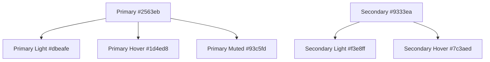

# テーマカラーシステム v2.0 - shadcn/ui統合版

統一されたデザインシステムとダークモード対応を実現するテーマカラーの設計と実装ガイド。
shadcn/ui統合により、HSL形式のCSS変数とTailwindCSS v4対応を追加実装。

## 📋 目次

- [概要](#概要)
- [shadcn/ui統合概要](#shadcnui統合概要)
- [CSS変数定義](#css変数定義)
- [shadcn/ui HSL変数系](#shadcnui-hsl変数系)
- [TailwindCSS v4 @theme統合](#tailwindcss-v4-theme統合)
- [カラーパレット](#カラーパレット)
- [使用パターン](#使用パターン)
- [shadcn/ui Component使用法](#shadcnui-component使用法)
- [グラデーション活用](#グラデーション活用)
- [ダークモード対応](#ダークモード対応)
- [実装例](#実装例)
- [ベストプラクティス](#ベストプラクティス)
- [トラブルシューティング](#トラブルシューティング)

## 概要

本プロジェクトでは、CSS変数を活用した統一テーマカラーシステムv2.0を採用しています。shadcn/ui統合により以下を実現：

- **🎨 統一されたデザイン**: 全コンポーネントで一貫したブランドカラー
- **🌓 完全ダークモード対応**: 自動切り替えによる最適な表示
- **🔧 高い保守性**: 色変更が一箇所で完結
- **♿ アクセシビリティ**: 適切なコントラスト比の確保
- **🧩 shadcn/ui完全対応**: HSL形式変数によるshadcn/ui標準準拠
- **⚡ TailwindCSS v4統合**: @theme inline指定による最適化
- **🔄 統一配置**: `@/components/ui/` にカスタマイズ済みコンポーネントを配置

## shadcn/ui統合概要

### 🚀 テーマシステム v2.0 の特徴

**統一されたデュアル変数システム**により、既存システムとshadcn/uiの両方に対応：

#### 1. **HEX変数系（既存システム）**

- 既存コンポーネントとの完全互換性維持
- グラデーション効果の継続サポート
- 段階的移行を可能にするレガシー対応

#### 2. **HSL変数系（shadcn/ui标准）**

- shadcn/ui標準のHSL形式準拠
- 透明度調整の柔軟性向上
- 色相・彩度・明度の独立制御

#### 3. **TailwindCSS v4 @theme統合**

- `@theme inline`指定による最適化
- CSS変数の自動TailwindUtilities変換
- ビルド時の色値最適化

```css
/* 統合テーマシステム v2.0 実装例 */
:root {
 /* 既存HEX変数（レガシー互換） */
 --primary: #2563eb;
 --primary-hover: #1d4ed8;

 /* shadcn/ui HSL変数（新標準） */
 --primary: 217 91% 60%; /* #2563eb のHSL変換 */
 --primary-foreground: 0 0% 98%;
}

@theme inline {
 /* TailwindCSS v4 統合 */
 --color-primary: hsl(var(--primary));
 --color-primary-foreground: hsl(var(--primary-foreground));
}
```

## CSS変数定義

### 基本カラー

### 🎯 HEX変数系（既存システム互換）

```css
:root {
 /* 基本色 */
 --background: #ffffff;
 --foreground: #171717;

 /* プライマリカラー（ブルー系） */
 --primary: #2563eb; /* blue-600 */
 --primary-hover: #1d4ed8; /* blue-700 */
 --primary-light: #dbeafe; /* blue-50 */
 --primary-muted: #93c5fd; /* blue-300 */

 /* セカンダリカラー（パープル系） */
 --secondary: #9333ea; /* purple-600 */
 --secondary-hover: #7c3aed; /* purple-700 */
 --secondary-light: #f3e8ff; /* purple-50 */
}
```

## shadcn/ui HSL変数系

### 🎨 shadcn/ui標準準拠HSL変数

```css
:root {
 /* shadcn/ui 標準変数（HSL形式） */
 --background: 0 0% 100%; /* #ffffff */
 --foreground: 0 0% 3.9%; /* #171717 */
 --primary: 217 91% 60%; /* #2563eb */
 --primary-foreground: 0 0% 98%; /* #ffffff */
 --secondary: 262 90% 60%; /* #9333ea */
 --secondary-foreground: 0 0% 98%; /* #ffffff */

 /* ステート色（HSL形式） */
 --success: 142 76% 36%; /* #16a34a */
 --success-foreground: 0 0% 98%; /* #ffffff */
 --destructive: 0 84% 60%; /* #dc2626 */
 --destructive-foreground: 0 0% 98%; /* #ffffff */
 --warning: 32 95% 44%; /* #d97706 */
 --warning-foreground: 0 0% 98%; /* #ffffff */
 --info: 199 89% 48%; /* #0284c7 */
 --info-foreground: 0 0% 98%; /* #ffffff */

 /* UI要素（HSL形式） */
 --card: 0 0% 100%; /* #ffffff */
 --card-foreground: 0 0% 3.9%; /* #171717 */
 --popover: 0 0% 100%; /* #ffffff */
 --popover-foreground: 0 0% 3.9%; /* #171717*/
 --muted: 0 0% 96.1%; /* #f5f5f5 */
 --muted-foreground: 0 0% 45.1%; /* #6b7280 */
 --accent: 0 0% 96.1%; /* #f5f5f5 */
 --accent-foreground: 0 0% 9%; /* #171717 */
 --border: 0 0% 89.8%; /* #e5e7eb */
 --input: 0 0% 89.8%; /* #e5e7eb */
 --ring: 217 91% 60%; /* #2563eb */
 --radius: 0.5rem;
}
```

### 🌙 ダークモード対応HSL変数

```css
@media (prefers-color-scheme: dark) {
 :root {
  /* ダークモード shadcn/ui 標準変数 */
  --background: 0 0% 3.9%; /* #0a0a0a */
  --foreground: 0 0% 98%; /* #fafafa */
  --primary: 217 91% 60%; /* #2563eb (同じ) */
  --primary-foreground: 0 0% 98%; /* #fafafa */
  --secondary: 262 90% 60%; /* #9333ea (同じ) */
  --secondary-foreground: 0 0% 98%; /* #fafafa */

  /* UI要素（ダークモード） */
  --card: 0 0% 3.9%; /* #0a0a0a */
  --card-foreground: 0 0% 98%; /* #fafafa */
  --popover: 0 0% 3.9%; /* #0a0a0a */
  --popover-foreground: 0 0% 98%; /* #fafafa */
  --muted: 0 0% 14.9%; /* #262626 */
  --muted-foreground: 0 0% 63.9%; /* #a3a3a3 */
  --accent: 0 0% 14.9%; /* #262626 */
  --accent-foreground: 0 0% 98%; /* #fafafa */
  --border: 0 0% 14.9%; /* #262626 */
  --input: 0 0% 14.9%; /* #262626 */
  --ring: 217 91% 60%; /* #2563eb */
 }
}
```

## TailwindCSS v4 @theme統合

### ⚡ @theme inline 指定

```css
@theme inline {
 /* CSS変数をTailwindユーティリティに自動変換 */
 --color-background: hsl(var(--background));
 --color-foreground: hsl(var(--foreground));
 --color-primary: hsl(var(--primary));
 --color-primary-foreground: hsl(var(--primary-foreground));
 --color-secondary: hsl(var(--secondary));
 --color-secondary-foreground: hsl(var(--secondary-foreground));

 /* ステート色 */
 --color-success: hsl(var(--success));
 --color-success-foreground: hsl(var(--success-foreground));
 --color-destructive: hsl(var(--destructive));
 --color-destructive-foreground: hsl(var(--destructive-foreground));
 --color-warning: hsl(var(--warning));
 --color-warning-foreground: hsl(var(--warning-foreground));
 --color-info: hsl(var(--info));
 --color-info-foreground: hsl(var(--info-foreground));

 /* UI要素 */
 --color-card: hsl(var(--card));
 --color-card-foreground: hsl(var(--card-foreground));
 --color-popover: hsl(var(--popover));
 --color-popover-foreground: hsl(var(--popover-foreground));
 --color-muted: hsl(var(--muted));
 --color-muted-foreground: hsl(var(--muted-foreground));
 --color-accent: hsl(var(--accent));
 --color-accent-foreground: hsl(var(--accent-foreground));
 --color-border: hsl(var(--border));
 --color-input: hsl(var(--input));
 --color-ring: hsl(var(--ring));

 /* 既存システム互換（HEX変数系） */
 --color-surface: var(--surface, #ffffff);
 --color-surface-50: var(--surface-50, #fafafa);
 --color-text-primary: var(--text-primary, #171717);
 --color-text-secondary: var(--text-secondary, #374151);
 --color-text-muted: var(--text-muted, #6b7280);

 /* レスポンシブ・レイアウト */
 --radius: var(--radius, 0.5rem);
 --shadow-sm: 0 1px 2px 0 rgb(0 0 0 / 0.05);
 --shadow: 0 1px 3px 0 rgb(0 0 0 / 0.1), 0 1px 2px -1px rgb(0 0 0 / 0.1);
 --shadow-lg:
  0 10px 15px -3px rgb(0 0 0 / 0.1), 0 4px 6px -4px rgb(0 0 0 / 0.1);
}
```

### 🎯 レガシー互換ステートカラー（HEX系）

```css
:root {
 /* 成功 */
 --success: #16a34a; /* green-600 */
 --success-hover: #15803d; /* green-700 */
 --success-light: #f0fdf4; /* green-50 */
 --success-muted: #bbf7d0; /* green-200 */

 /* エラー */
 --error: #dc2626; /* red-600 */
 --error-hover: #b91c1c; /* red-700 */
 --error-light: #fef2f2; /* red-50 */
 --error-muted: #fecaca; /* red-200 */

 /* 警告 */
 --warning: #d97706; /* amber-600 */
 --warning-hover: #b45309; /* amber-700 */
 --warning-light: #fffbeb; /* amber-50 */
 --warning-muted: #fcd34d; /* amber-300 */

 /* 情報 */
 --info: #0284c7; /* sky-600 */
 --info-hover: #0369a1; /* sky-700 */
 --info-light: #f0f9ff; /* sky-50 */
 --info-muted: #7dd3fc; /* sky-300 */
}
```

### サーフェス・テキスト・ボーダー

```css
:root {
 /* サーフェス（背景）カラー */
 --surface: #ffffff;
 --surface-50: #fafafa; /* gray-50 */
 --surface-100: #f5f5f5; /* gray-100 */
 --surface-200: #e5e5e5; /* gray-200 */
 --surface-300: #d4d4d4; /* gray-300 */
 --surface-600: #525252; /* gray-600 */
 --surface-700: #404040; /* gray-700 */

 /* テキストカラー */
 --text-primary: #171717; /* gray-900 */
 --text-secondary: #374151; /* gray-700 */
 --text-muted: #6b7280; /* gray-500 */
 --text-disabled: #9ca3af; /* gray-400 */
 --text-inverse: #ffffff;

 /* ボーダーカラー */
 --border: #e5e7eb; /* gray-200 */
 --border-light: #f3f4f6; /* gray-100 */
 --border-dark: #d1d5db; /* gray-300 */
}
```

## カラーパレット

### ブランドカラー階層



### ステート色の用途

| カラー         | 用途               | 例                            |
| -------------- | ------------------ | ----------------------------- |
| **Success** 🟢 | 成功状態、完了通知 | フォーム送信完了、保存成功    |
| **Error** 🔴   | エラー状態、警告   | バリデーションエラー、API失敗 |
| **Warning** 🟡 | 注意喚起、確認     | 削除確認、重要な変更          |
| **Info** 🔵    | 情報提供、案内     | ヒント、システム情報          |

## 使用パターン

### ✅ 推奨パターン

#### テーマカラーの適切な使用

```tsx
// ✅ Good: テーマ変数を使用
<Button className="bg-[var(--primary)] hover:bg-[var(--primary-hover)]">
  プライマリボタン
</Button>

// ✅ Good: ステート色の適切な使用
<Alert className="bg-[var(--error-light)] text-[var(--error)] border-[var(--error-muted)]">
  エラーメッセージ
</Alert>
```

#### 階層的なテキスト色

```tsx
// ✅ Good: テキスト階層の明確化
<div>
 <h1 className='text-[var(--text-primary)]'>メインタイトル</h1>
 <p className='text-[var(--text-secondary)]'>サブテキスト</p>
 <span className='text-[var(--text-muted)]'>補足情報</span>
</div>
```

### ❌ 避けるべきパターン

```tsx
// ❌ Bad: ハードコードされた色
<div className="bg-blue-600 text-white">

// ❌ Bad: ランダムなカラー選択
<div className="bg-pink-500 text-yellow-300">

// ❌ Bad: 不適切なステート色使用
<Button className="bg-[var(--error)]">通常のボタン</Button>
```

## グラデーション活用

### 統一されたグラデーションパターン

#### プライマリ・セカンダリ組み合わせ

```css
/* ブランドグラデーション（推奨） */
.brand-gradient {
 background: linear-gradient(to right, var(--primary), var(--secondary));
}

/* ホバー効果用 */
.brand-gradient-hover {
 background: linear-gradient(
  to right,
  var(--primary-hover),
  var(--secondary-hover)
 );
}
```

### shadcn/ui Component使用法

### 🧩 Enhanced Components活用

#### shadcn/ui Button Enhanced使用法

```tsx
// ✅ 基本的なshadcn/ui Button
<Button variant="default" size="default">
  標準ボタン
</Button>

// ✅ 既存システム機能統合（gradient + loading）
<Button
  variant="primary"
  size="lg"
  gradient={true}
  loading={isLoading}
  fullWidth={true}
>
  拡張機能付きボタン
</Button>

// ✅ shadcn/ui標準バリエーション
<Button variant="destructive" size="sm">
  削除ボタン
</Button>
<Button variant="outline" size="default">
  アウトラインボタン
</Button>
<Button variant="secondary" size="lg">
  セカンダリボタン
</Button>
<Button variant="ghost" size="icon">
  <Icon />
</Button>
```

#### shadcn/ui Card Enhanced使用法

```tsx
// ✅ Compound Pattern対応（既存システム）
<Card variant="elevated" padding="lg">
  <Card.Header>
    <h2>カードタイトル</h2>
  </Card.Header>
  <Card.Content>
    <p>カードコンテンツ</p>
  </Card.Content>
  <Card.Footer>
    <Button>アクション</Button>
  </Card.Footer>
</Card>

// ✅ shadcn/ui標準パターン
<Card>
  <CardHeader>
    <CardTitle>shadcn/ui標準タイトル</CardTitle>
    <CardDescription>説明テキスト</CardDescription>
  </CardHeader>
  <CardContent>
    <p>コンテンツ</p>
  </CardContent>
  <CardFooter>
    <Button>フッターアクション</Button>
  </CardFooter>
</Card>
```

#### Form + Input Components

```tsx
// ✅ shadcn/ui Form統合
<Form {...form}>
 <form onSubmit={form.handleSubmit(onSubmit)}>
  <FormField
   control={form.control}
   name='username'
   render={({ field }) => (
    <FormItem>
     <FormLabel>ユーザー名</FormLabel>
     <FormControl>
      <Input placeholder='ユーザー名を入力' {...field} />
     </FormControl>
     <FormDescription>表示名として使用されます</FormDescription>
     <FormMessage />
    </FormItem>
   )}
  />
  <Button type='submit'>送信</Button>
 </form>
</Form>
```

### 🎨 shadcn/ui Theme活用パターン

#### HSL変数を使ったshadcn/ui標準スタイリング

```tsx
// ✅ shadcn/ui標準CSS Variables
<div className="bg-background text-foreground border-border">
  <div className="bg-card text-card-foreground p-6 rounded-lg shadow-lg">
    <h2 className="text-primary">プライマリテキスト</h2>
    <p className="text-muted-foreground">サブテキスト</p>
  </div>
</div>

// ✅ State Color活用
<Alert variant="success">
  <AlertDescription>
    成功メッセージ（HSL変数使用）
  </AlertDescription>
</Alert>

<Button variant="destructive">
  危険アクション（HSL変数使用）
</Button>
```

### 🔄 コンポーネントインポート

#### 統一されたインポートパス

```tsx
// ✅ 推奨：@/components/ui/ から直接インポート
import { Button } from '@/components/ui/button';
import { Card } from '@/components/ui/card';
import { Alert } from '@/components/ui/alert';
import { Input } from '@/components/ui/input';

// ✅ Form関連コンポーネント
import {
  Form,
  FormControl,
  FormField,
  FormItem,
  FormLabel,
  FormMessage,
} from '@/components/ui/form';
```

**⚠️ 運用ルール**:

- 既存カスタマイズ済みコンポーネントは `pnpm ui:add` で追加しない
- 新規コンポーネントのみ `ui:add` で追加（そのまま使用可能）
- 命名規則: kebab-case（shadcn/ui標準に準拠）

### 使用例

```tsx
// ✅ ヘッダー・重要なUI要素
<header className="bg-gradient-to-r from-[var(--primary)] via-[var(--secondary)] to-[var(--primary-hover)]">

// ✅ ボタンのグラデーション効果（Enhanced Button）
<Button
  gradient={true}
  className="bg-gradient-to-r from-[var(--primary)] to-[var(--secondary)] hover:from-[var(--primary-hover)] hover:to-[var(--secondary-hover)]"
>

// ✅ テキストグラデーション
<h1 className="bg-gradient-to-r from-[var(--primary)] to-[var(--secondary)] bg-clip-text text-transparent">
```

### アクセント用グラデーション

```tsx
// 微妙なアクセント効果
<div className='relative'>
 <div className='absolute top-0 left-0 w-full h-1 bg-gradient-to-r from-[var(--primary)]/30 via-[var(--secondary)]/30 to-[var(--primary)]/30' />
 {/* コンテンツ */}
</div>
```

## ダークモード対応

### 自動切り替えシステム

```css
@media (prefers-color-scheme: dark) {
 :root {
  /* 基本色（反転） */
  --background: #0f0f0f;
  --foreground: #f5f5f5;

  /* サーフェス色（調整） */
  --surface: #0f0f0f;
  --surface-50: #262626; /* darker */
  --surface-100: #1c1c1c; /* darker */

  /* テキスト色（反転・調整） */
  --text-primary: #f5f5f5;
  --text-secondary: #d1d5db;
  --text-muted: #9ca3af;
  --text-disabled: #6b7280;
  --text-inverse: #0f0f0f;

  /* ボーダー色（調整） */
  --border: #374151;
  --border-light: #1f2937;
  --border-dark: #4b5563;
 }
}
```

### ダークモード最適化のポイント

#### 1. **コントラスト確保**

```tsx
// ✅ Good: 十分なコントラスト
<div className="bg-[var(--surface)] text-[var(--text-primary)]">

// ❌ Bad: コントラスト不足
<div className="bg-[var(--surface-50)] text-[var(--text-muted)]">
```

#### 2. **シャドウ効果の調整**

```tsx
// ✅ ダークモード対応シャドウ
<Card className="shadow-lg shadow-[var(--primary)]/10">

// ダークモードでも美しいカラーシャドウ
<div className="hover:shadow-lg hover:shadow-[var(--primary)]/20">
```

## 実装例

### コンポーネント別実装パターン

#### Button Enhanced コンポーネント（統合版）

```tsx
// shadcn/ui + 既存システム統合実装
const buttonVariants = cva(
 'inline-flex items-center justify-center whitespace-nowrap rounded-md text-sm font-medium ring-offset-background transition-colors focus-visible:outline-none focus-visible:ring-2 focus-visible:ring-ring focus-visible:ring-offset-2 disabled:pointer-events-none disabled:opacity-50',
 {
  variants: {
   variant: {
    // shadcn/ui標準variants
    default: 'bg-primary text-primary-foreground hover:bg-primary/90',
    destructive:
     'bg-destructive text-destructive-foreground hover:bg-destructive/90',
    outline:
     'border border-input bg-background hover:bg-accent hover:text-accent-foreground',
    secondary: 'bg-secondary text-secondary-foreground hover:bg-secondary/80',
    ghost: 'hover:bg-accent hover:text-accent-foreground',
    link: 'text-primary underline-offset-4 hover:underline',

    // 既存システム統合variants
    primary: gradient
     ? 'bg-gradient-to-r from-[var(--primary)] to-[var(--secondary)] hover:from-[var(--primary-hover)] hover:to-[var(--secondary-hover)] text-[var(--text-inverse)]'
     : 'bg-[var(--primary)] hover:bg-[var(--primary-hover)] text-[var(--text-inverse)]',
    success:
     'bg-[var(--success)] hover:bg-[var(--success-hover)] text-[var(--text-inverse)]',
    warning:
     'bg-[var(--warning)] hover:bg-[var(--warning-hover)] text-[var(--text-inverse)]',
    info:
     'bg-[var(--info)] hover:bg-[var(--info-hover)] text-[var(--text-inverse)]',
   },
   size: {
    default: 'h-10 px-4 py-2',
    sm: 'h-9 rounded-md px-3',
    lg: 'h-11 rounded-md px-8',
    icon: 'h-10 w-10',
   },
  },
  defaultVariants: {
   variant: 'default',
   size: 'default',
  },
 },
);

// Enhanced機能の追加Props
export interface ButtonProps
 extends React.ComponentProps<'button'>,
  VariantProps<typeof buttonVariants> {
 asChild?: boolean;
 loading?: boolean; // 既存システム機能
 fullWidth?: boolean; // 既存システム機能
 gradient?: boolean; // 既存システム機能
}
```

#### Card Enhanced コンポーネント（統合版）

```tsx
// shadcn/ui Card + 既存Compound Pattern統合
const Card = React.forwardRef<HTMLDivElement, CardProps>(
 ({ className, variant = 'default', padding, ...props }, ref) => {
  return (
   <div
    ref={ref}
    className={cn(
     // shadcn/ui base styles
     'rounded-lg border bg-card text-card-foreground shadow-sm',
     // 既存システム variants
     {
      'border border-[var(--border)]': variant === 'default',
      'shadow-lg hover:shadow-xl': variant === 'elevated',
      'bg-[var(--surface)]/80 backdrop-blur-sm border border-[var(--surface)]/20':
       variant === 'glass',
     },
     // 既存システム padding
     {
      'p-3': padding === 'sm',
      'p-6': padding === 'md',
      'p-8': padding === 'lg',
     },
     className,
    )}
    {...props}
   />
  );
 },
);

// Compound Pattern対応（既存システム）
Card.Header = CardHeader;
Card.Content = CardContent;
Card.Footer = CardFooter;

// shadcn/ui標準exports
export {
 Card,
 CardHeader,
 CardTitle,
 CardDescription,
 CardContent,
 CardFooter,
};
```

#### Alert Enhanced コンポーネント（統合版）

```tsx
// shadcn/ui Alert + 既存システム統合
const alertVariants = cva(
 'relative w-full rounded-lg border p-4 [&>svg~*]:pl-7 [&>svg+div]:translate-y-[-3px] [&>svg]:absolute [&>svg]:left-4 [&>svg]:top-4 [&>svg]:text-foreground',
 {
  variants: {
   variant: {
    // shadcn/ui標準variants
    default: 'bg-background text-foreground',
    destructive:
     'border-destructive/50 text-destructive dark:border-destructive [&>svg]:text-destructive',

    // 既存システム統合variants（HEX変数使用）
    success:
     'bg-[var(--success-light)] border-[var(--success-muted)] text-[var(--success)]',
    error:
     'bg-[var(--error-light)] border-[var(--error-muted)] text-[var(--error)]',
    warning:
     'bg-[var(--warning-light)] border-[var(--warning-muted)] text-[var(--warning)]',
    info:
     'bg-[var(--info-light)] border-[var(--info-muted)] text-[var(--info)]',
   },
  },
  defaultVariants: {
   variant: 'default',
  },
 },
);

// Alert Enhanced Props
export interface AlertProps
 extends React.HTMLAttributes<HTMLDivElement>,
  VariantProps<typeof alertVariants> {}

const Alert = React.forwardRef<HTMLDivElement, AlertProps>(
 ({ className, variant, ...props }, ref) => (
  <div
   ref={ref}
   role='alert'
   className={cn(alertVariants({ variant }), className)}
   {...props}
  />
 ),
);
```

### 複合的な実装例

#### モダンなカード設計

```tsx
<Card
 variant='elevated'
 className='bg-[var(--surface)] border-2 border-[var(--primary)]/20 hover:border-[var(--primary)]/60 hover:shadow-lg hover:shadow-[var(--primary)]/10 transition-all duration-300'
>
 {/* アクセントライン */}
 <div className='absolute top-0 left-0 w-full h-1 bg-gradient-to-r from-[var(--primary)]/40 via-[var(--secondary)]/40 to-[var(--primary)]/40' />

 <Card.Header>
  <h2 className='bg-gradient-to-r from-[var(--primary)] to-[var(--secondary)] bg-clip-text text-transparent'>
   ブランドタイトル
  </h2>
 </Card.Header>

 <Card.Content>
  <p className='text-[var(--text-secondary)]'>コンテンツテキスト</p>
 </Card.Content>
</Card>
```

## ベストプラクティス

### 1. **色選択の基準**

#### 優先順位

1. **プライマリ**: メインアクション、ブランド要素
2. **セカンダリ**: サブアクション、アクセント
3. **ステート色**: 状態表示（成功・エラー・警告・情報）
4. **テキスト階層**: primary → secondary → muted → disabled

#### 使い分けルール

```tsx
// ✅ メインアクション
<Button variant="primary">保存</Button>

// ✅ サブアクション
<Button variant="secondary">キャンセル</Button>

// ✅ 危険なアクション
<Button variant="danger">削除</Button>

// ✅ 情報表示
<Badge variant="info">お知らせ</Badge>
```

### 2. **アクセシビリティ対応**

#### コントラスト比の確保

```tsx
// ✅ Good: 十分なコントラスト
<div className="bg-[var(--surface)] text-[var(--text-primary)]">
  メインコンテンツ
</div>

// ✅ Good: ステート色の適切な使用
<Alert variant="error">
  <p className="text-[var(--error)]">エラーメッセージ</p>
</Alert>
```

### 3. **パフォーマンス最適化**

#### CSS変数の効率的な使用

```css
/* ✅ Good: 変数の再利用 */
.primary-theme {
 background: var(--primary);
 color: var(--text-inverse);
 border: 1px solid var(--primary);
}

.primary-theme:hover {
 background: var(--primary-hover);
}
```

#### TailwindCSS v4最適化

```css
/* ✅ @theme inline によるビルド最適化 */
@theme inline {
 /* 自動的にTailwindユーティリティに変換 */
 --color-primary: hsl(var(--primary));
 --color-success: hsl(var(--success));
}

/* 結果：以下のクラスが自動生成 */
/* .bg-primary { background-color: hsl(217 91% 60%); } */
/* .text-primary { color: hsl(217 91% 60%); } */
/* .border-primary { border-color: hsl(217 91% 60%); } */
```

#### shadcn/ui コンポーネント最適化

```tsx
// ✅ カスタマイズ済みコンポーネントを使用
import { Button } from '@/components/ui/button';

// 既存機能（gradient, loading）+ shadcn/ui標準機能が統合
<Button variant='primary' gradient={true}>
  統合機能付きボタン
</Button>;
```

### 4. **shadcn/ui統合ベストプラクティス**

#### 適切なComponent選択

```tsx
// ✅ Good: @/components/ui/ から個別インポート
import { Alert } from '@/components/ui/alert';
import { Button } from '@/components/ui/button';
import { Card } from '@/components/ui/card';
import { Dialog } from '@/components/ui/dialog';
import { Form, FormField } from '@/components/ui/form';
```

#### CSS Variables使い分け

```tsx
// ✅ shadcn/ui標準：HSL変数使用
<div className="bg-primary text-primary-foreground">
  shadcn/ui標準スタイリング
</div>

// ✅ 既存システム：HEX変数使用
<div className="bg-[var(--primary)] text-[var(--text-inverse)]">
  既存システム互換スタイリング
</div>

// ✅ グラデーション：HEX変数推奨
<div className="bg-gradient-to-r from-[var(--primary)] to-[var(--secondary)]">
  グラデーション効果
</div>
```

## トラブルシューティング

### よくある問題と解決方法

#### 1. **ダークモードでの視認性問題**

**問題**: 背景とテキストのコントラストが不足

```tsx
// ❌ Problem: コントラスト不足
<div className="bg-[var(--surface-50)] text-[var(--text-muted)]">

// ✅ Solution: 適切なコントラスト
<div className="bg-[var(--surface)] text-[var(--text-primary)]">
```

#### 2. **グラデーションが表示されない**

**問題**: CSS変数内でのグラデーション構文エラー

```tsx
// ❌ Problem: 間違った構文
<div className="bg-gradient-to-r from-var(--primary) to-var(--secondary)">

// ✅ Solution: 正しい構文
<div className="bg-gradient-to-r from-[var(--primary)] to-[var(--secondary)]">
```

#### 3. **ホバー効果が機能しない**

**問題**: 透明度や色変化が見えにくい

```tsx
// ❌ Problem: 変化が微妙すぎる
<Button className="hover:bg-[var(--primary)]/5">

// ✅ Solution: 適切な変化量
<Button className="hover:bg-[var(--primary)]/20 hover:shadow-lg">
```

#### 4. **shadcn/ui Componentが期待通りに動作しない**

**問題**: HSL変数とHEX変数の混在による表示問題

```tsx
// ❌ Problem: 形式不一致
<Alert variant="success" className="bg-[var(--success)]">
  // HSL形式のvariantとHEX形式のclassNameが競合
</Alert>

// ✅ Solution: 統一したアプローチ
<Alert variant="success">
  // Enhanced Componentを使用（自動的に適切な形式を選択）
</Alert>

// または明示的にshadcn/ui標準を使用
<Alert className="bg-success text-success-foreground">
  // HSL変数系で統一
</Alert>
```

#### 5. **コンポーネントインポートパス問題**

**問題**: 間違ったパスからインポートしている

```tsx
// ❌ Problem: 存在しないパス
import { Button } from '@/components/ui-shadcn/button';
import { Card } from '@/components/ui-bridge';

// ✅ Solution: @/components/ui/ から個別インポート
import { Button } from '@/components/ui/button';
import { Card } from '@/components/ui/card';
import { Alert } from '@/components/ui/alert';
```

**注意**: ファイル名はkebab-case（`button.tsx`）でshadcn/ui標準に準拠しています。

#### 6. **TailwindCSS v4変数が認識されない**

**問題**: @theme inline設定の問題

```css
/* ❌ Problem: 設定不備 */
@theme {
 --color-primary: hsl(var(--primary));
}

/* ✅ Solution: inline指定必須 */
@theme inline {
 --color-primary: hsl(var(--primary));
}
```

### デバッグ用CSS

開発中に色を確認するための一時的なスタイル：

```css
/* デバッグ用: 色変数の表示確認 */
.debug-colors::before {
 content: 'Primary: ' var(--primary) ' | Secondary: ' var(--secondary);
 display: block;
 font-size: 12px;
 color: var(--text-muted);
 margin-bottom: 8px;
}
```

---

## 参考資料

### 📚 shadcn/ui関連

- [shadcn/ui公式ドキュメント](https://ui.shadcn.com/)
- [shadcn/ui Themes](https://ui.shadcn.com/themes)
- [Radix UI Primitives](https://www.radix-ui.com/primitives)

### 🎨 CSS・TailwindCSS関連

- [TailwindCSS v4ドキュメント](https://tailwindcss.com/docs)
- [TailwindCSS @theme](https://tailwindcss.com/docs/functions-and-directives#theme)
- [CSS変数について - MDN](https://developer.mozilla.org/ja/docs/Web/CSS/Using_CSS_custom_properties)
- [HSL色空間について - MDN](https://developer.mozilla.org/ja/docs/Web/CSS/color_value/hsl)

### ♿ アクセシビリティ

- [アクセシビリティ - WCAG Guidelines](https://www.w3.org/WAI/WCAG21/quickref/)
- [Color Contrast Analyzer](https://www.tpgi.com/color-contrast-checker/)

### 🔗 プロジェクト内ドキュメント

- [`frontend-best-practices.md`](_DOCS/guides/frontend-best-practices.md) - フロントエンド全般のベストプラクティス
- [`nextjs-integration-patterns.md`](_DOCS/guides/nextjs-integration-patterns.md) - Next.js統合パターン
- [`shadcn-ui-migration-plan.md`](../shadcn-ui-migration-plan.md) - shadcn/ui移行計画詳細

---

**🎨 統一されたテーマカラーシステム v2.0により、shadcn/ui統合で美しく保守性の高いUIを実現！**

### 🚀 shadcn/ui統合の成果

- **✅ 完全統合**: 既存システムとshadcn/uiのシームレス統合
- **🔄 段階的移行**: Bridge Systemによる無理のない移行
- **⚡ パフォーマンス**: TailwindCSS v4最適化
- **🎯 開発効率**: Enhanced Componentsによる開発速度向上
- **🌙 ダークモード**: HSL変数によるより柔軟なテーマ切り替え

**次世代UIシステムの完成です！** 🎊✨
