# テスト戦略 🧪

包括的な品質保証による持続可能な開発体験

---

## 🎯 テスト戦略の目的

### 品質保証の基本方針

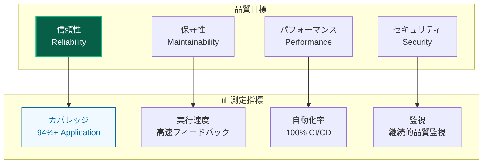

### 実現される価値

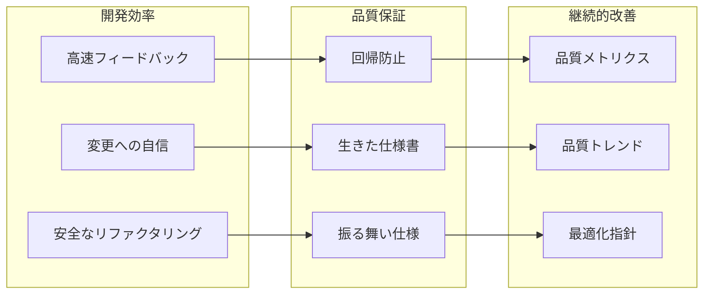

---

## 🏗️ テストピラミッド実践

### 階層的テスト戦略

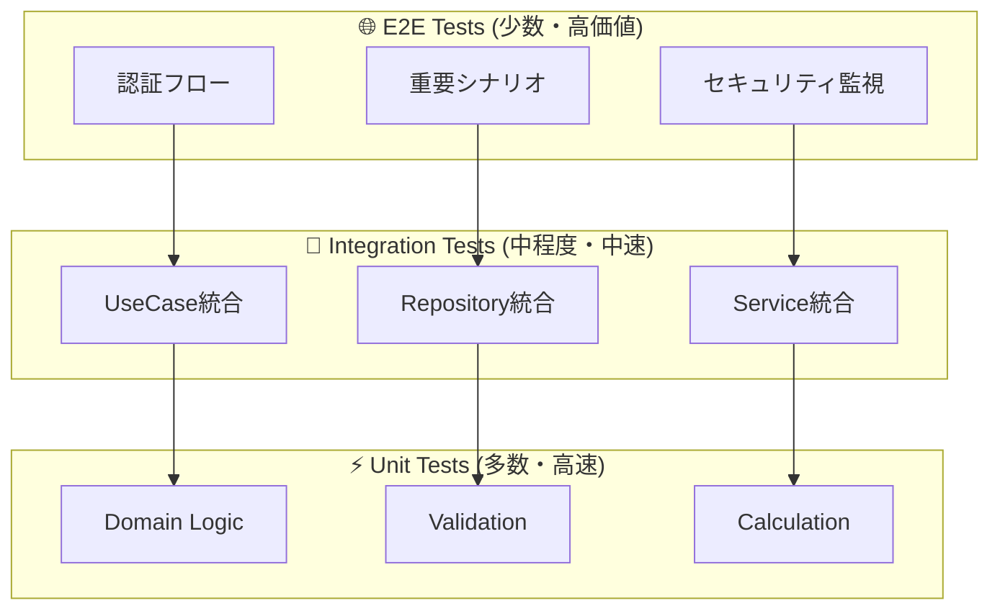

### レイヤー別テスト戦略

| レイヤー              | テスト種別         | カバレッジ目標 | 重点観点       | テスト手法                   |
| --------------------- | ------------------ | -------------- | -------------- | ---------------------------- |
| **🎨 Presentation**   | E2E + Unit         | 80%+           | ユーザビリティ | Playwright + Testing Library |
| **📋 Application**    | Unit + Integration | **94%+**       | ビジネスフロー | Result型パターン対応         |
| **👑 Domain**         | Unit               | **90%+**       | ビジネスルール | 純粋関数テスト               |
| **🔧 Infrastructure** | Integration        | 85%+           | 外部連携       | モック活用                   |

---

## 🎭 モック戦略

### 自動モック生成 (vitest-mock-extended)

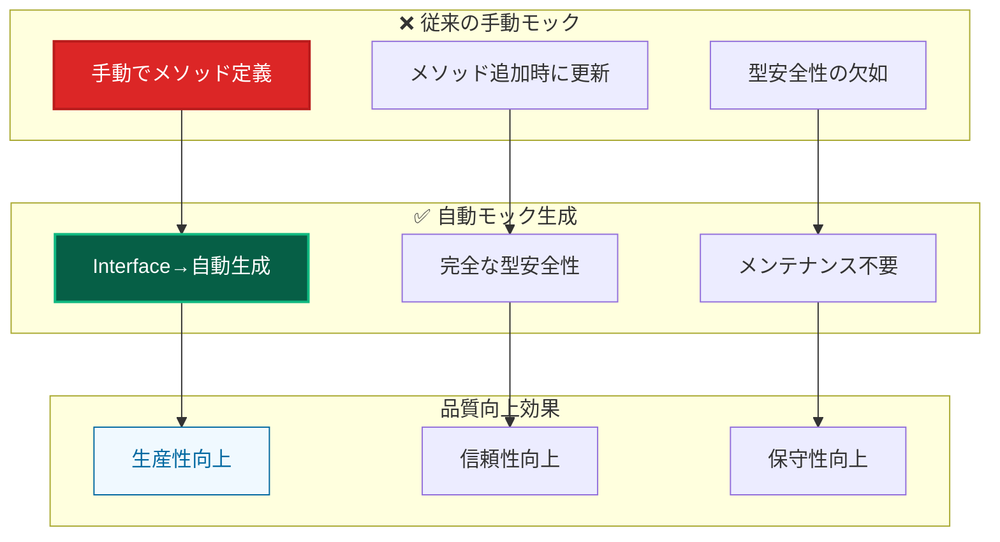

### モック種別と使い分け

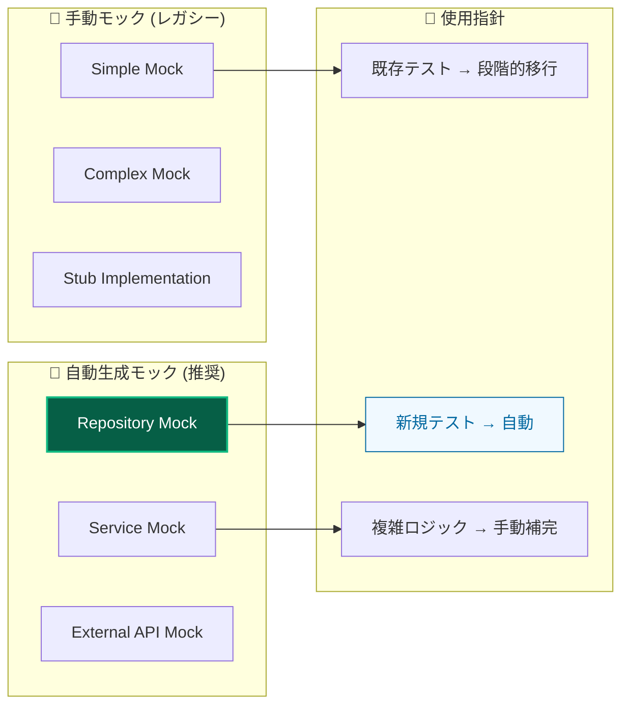

---

## 🎆 Result型パターンテスト

### 統一的エラーハンドリングテスト

```mermaid
graph TB
    subgraph "Result型テストパターン"
        SUCCESS[成功ケース<br/>isSuccess(result)]
        FAILURE[失敗ケース<br/>isFailure(result)]
        ERROR_CODE[エラーコード<br/>result.error.code]
    end

    subgraph "テストカテゴリ"
        VALIDATION[バリデーションエラー]
        BUSINESS[ビジネスルールエラー]
        INFRASTRUCTURE[インフラエラー]
    end

    subgraph "品質保証効果"
        TYPE_SAFETY[型安全性]
        ERROR_COVERAGE[エラーケース網羅]
        CONSISTENCY[一貫したテスト]
    end

    SUCCESS --> TYPE_SAFETY
    FAILURE --> ERROR_COVERAGE
    ERROR_CODE --> CONSISTENCY

    VALIDATION --> FAILURE
    BUSINESS --> FAILURE
    INFRASTRUCTURE --> FAILURE

    style SUCCESS fill:#065f46,stroke:#10b981,stroke-width:2px,color:#ffffff
    style TYPE_SAFETY fill:#f0f9ff,stroke:#0369a1,stroke-width:1px,color:#0369a1
```

### 包括的エラーケーステスト

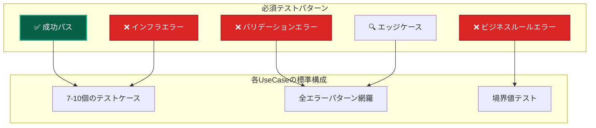

---

## 🎬 E2Eテスト戦略

### 視覚的テスト開発

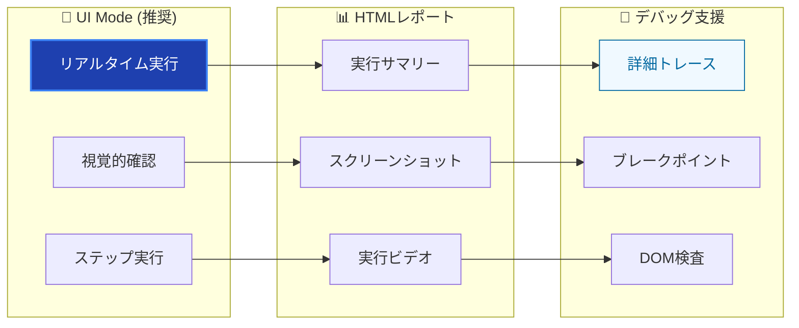

### セキュリティ監視テスト

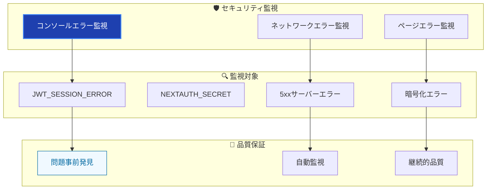

---

## 📊 品質指標とカバレッジ

### レイヤー別品質基準

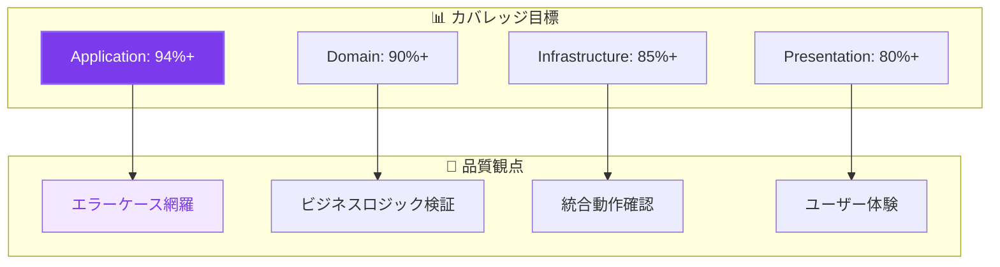

### 継続的品質改善

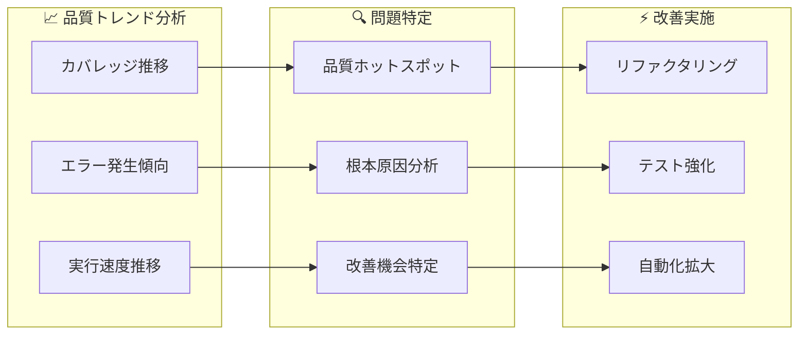

---

## 🚀 テスト実行最適化

### 並列実行戦略

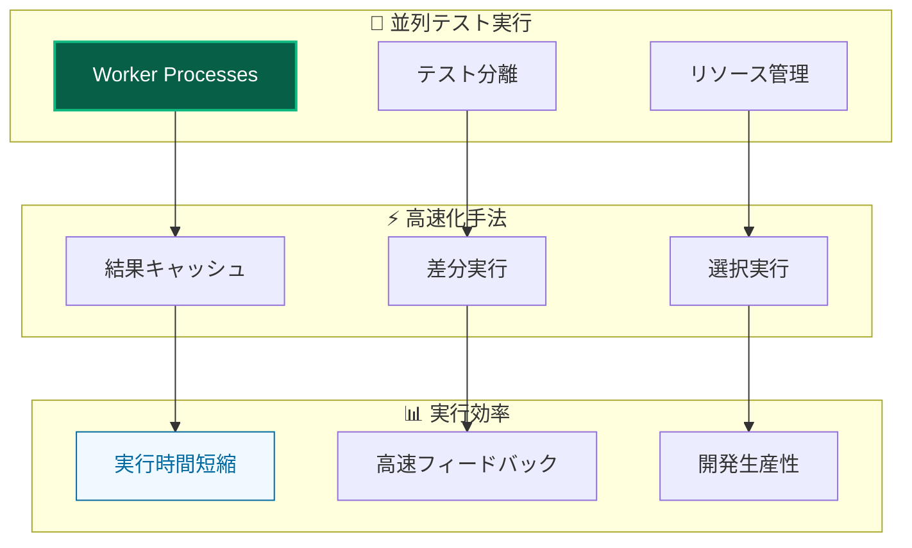

### CI/CD統合

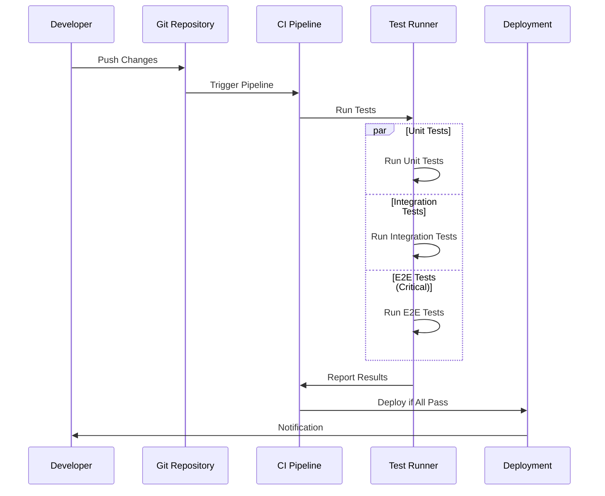

---

## 🧩 テスト環境管理

### DI Container統合

```mermaid
graph TB
    subgraph "🧪 テスト環境"
        TEST_CONTAINER[Test Container]
        MOCK_SERVICES[Mock Services]
        TEST_DATA[Test Data]
    end

    subgraph "🔄 環境セットアップ"
        SETUP[setupTestEnvironment()]
        RESET[Container Reset]
        CLEANUP[Cleanup]
    end

    subgraph "🎯 独立性保証"
        ISOLATION[テスト分離]
        REPRODUCIBLE[再現可能性]
        PREDICTABLE[予測可能性]
    end

    TEST_CONTAINER --> SETUP
    MOCK_SERVICES --> RESET
    TEST_DATA --> CLEANUP

    SETUP --> ISOLATION
    RESET --> REPRODUCIBLE
    CLEANUP --> PREDICTABLE

    style TEST_CONTAINER fill:#7c3aed,stroke:#8b5cf6,stroke-width:2px,color:#ffffff
    style ISOLATION fill:#f3e8ff,stroke:#8b5cf6,stroke-width:1px,color:#7c3aed
```

### データ管理戦略

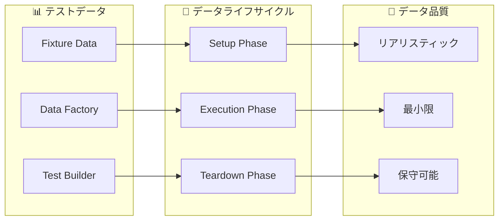

---

## 🛠️ テストツール活用

### 技術スタック

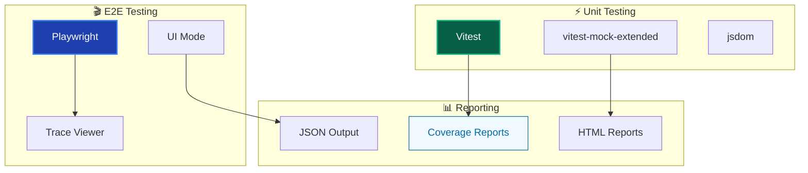

### ツール選択基準

| 用途                  | ツール               | 選択理由                   | 特徴              |
| --------------------- | -------------------- | -------------------------- | ----------------- |
| **Unit Testing**      | Vitest               | 高速、TypeScript統合       | ESM対応、並列実行 |
| **Mocking**           | vitest-mock-extended | 型安全な自動モック         | メンテナンス不要  |
| **E2E Testing**       | Playwright           | 安定性、豊富な機能         | UI Mode、トレース |
| **Component Testing** | Testing Library      | 行動駆動、アクセシビリティ | ユーザー視点      |

---

## 🔍 テスト品質評価

### 品質メトリクス

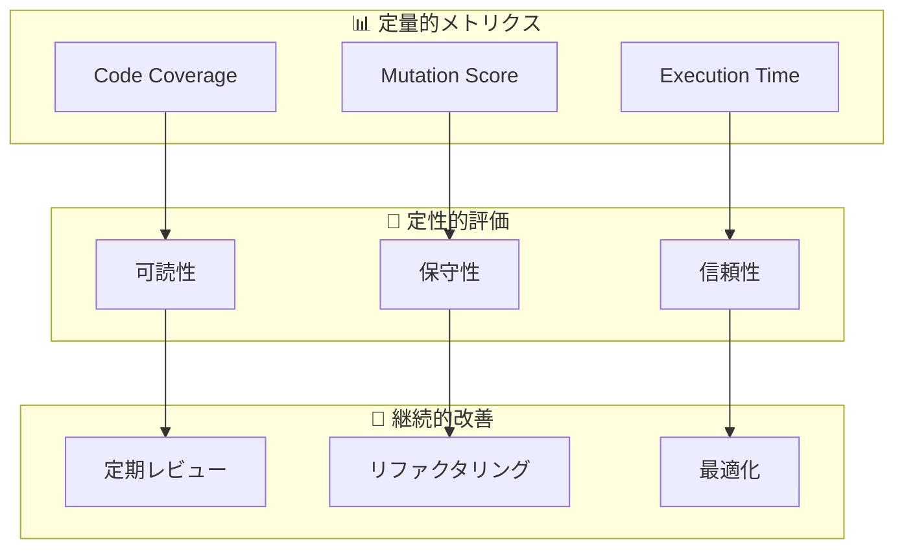

### 品質ゲート

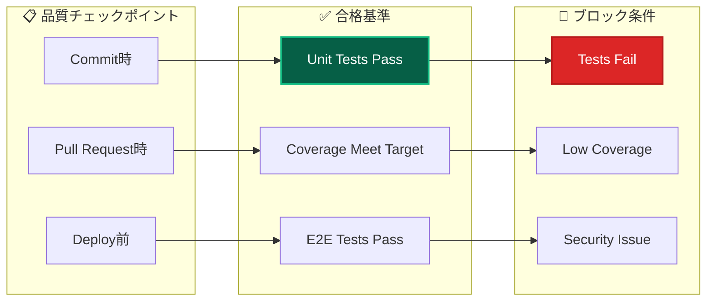

---

## 🔗 関連ドキュメント

### 詳細実装ガイド

- **[Unit Testing](unit/overview.md)** - ユニットテスト実装詳細
- **[E2E Testing](../guides/e2e-testing-guide.md)** - E2Eテスト実践ガイド
- **[Mocking Strategy](unit/mocking.md)** - モック戦略詳細

### 設計・アーキテクチャ

- **[アーキテクチャ概要](../architecture/overview.md)** - システム全体設計
- **[依存性注入](../architecture/patterns/dependency-injection.md)** - DI連携
- **[エラーハンドリング](../guides/ddd/cross-cutting/error-handling.md)** - Result型パターン

### 開発・運用

- **[開発フロー](../guides/development/workflow.md)** - 開発プロセス
- **[vitest-mock設定](../troubleshooting/development/vitest-mock-extended-setup.md)** - テスト問題解決
- **[コマンドリファレンス](../reference/commands.md)** - テスト実行コマンド

---

**🧪 包括的なテスト戦略により、持続可能で高品質な開発体験を実現しましょう！**
