# テスト戦略 🧪

包括的な品質保証による持続可能な開発体験

---

## 🎯 テスト戦略の目的

### 品質保証の基本方針

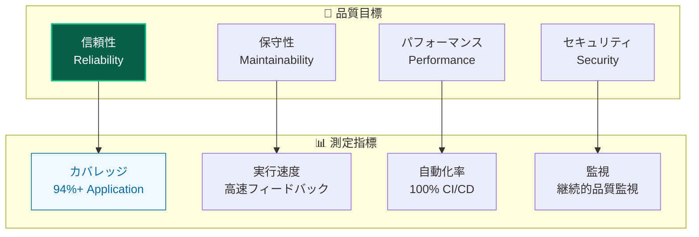
```mermaid
graph TB
    subgraph "🎯 品質目標"
        RELIABILITY[信頼性<br/>Reliability]
        MAINTAINABILITY[保守性<br/>Maintainability]
        PERFORMANCE[パフォーマンス<br/>Performance]
        SECURITY[セキュリティ<br/>Security]
    end

    subgraph "📊 測定指標"
        COVERAGE[カバレッジ<br/>94%+ Application]
        EXECUTION[実行速度<br/>高速フィードバック]
        AUTOMATION[自動化率<br/>100% CI/CD]
        MONITORING[監視<br/>継続的品質監視]
    end

    RELIABILITY --> COVERAGE
    MAINTAINABILITY --> EXECUTION
    PERFORMANCE --> AUTOMATION
    SECURITY --> MONITORING

    style RELIABILITY fill:#065f46,stroke:#10b981,stroke-width:2px,color:#ffffff
    style COVERAGE fill:#f0f9ff,stroke:#0369a1,stroke-width:1px,color:#0369a1
```

### 実現される価値

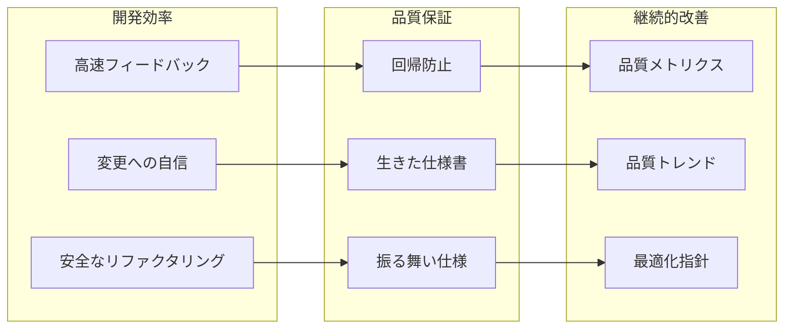
```mermaid
graph LR
    subgraph "開発効率"
        FAST[高速フィードバック]
        CONFIDENCE[変更への自信]
        REFACTOR[安全なリファクタリング]
    end

    subgraph "品質保証"
        REGRESSION[回帰防止]
        DOCUMENTATION[生きた仕様書]
        SPECIFICATION[振る舞い仕様]
    end

    subgraph "継続的改善"
        METRICS[品質メトリクス]
        TRENDS[品質トレンド]
        OPTIMIZATION[最適化指針]
    end

    FAST --> REGRESSION
    CONFIDENCE --> DOCUMENTATION
    REFACTOR --> SPECIFICATION

    REGRESSION --> METRICS
    DOCUMENTATION --> TRENDS
    SPECIFICATION --> OPTIMIZATION
```

---

## 🏗️ テストピラミッド実践

### 階層的テスト戦略

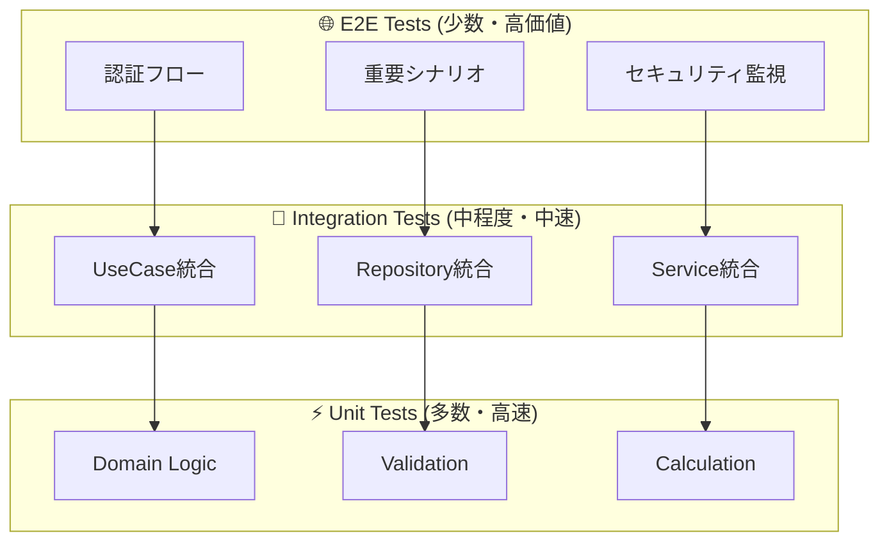
```mermaid
graph TB
    subgraph "🌐 E2E Tests (少数・高価値)"
        E2E_AUTH[認証フロー]
        E2E_CRITICAL[重要シナリオ]
        E2E_SECURITY[セキュリティ監視]
    end

    subgraph "🔗 Integration Tests (中程度・中速)"
        INT_USECASE[UseCase統合]
        INT_REPO[Repository統合]
        INT_SERVICE[Service統合]
    end

    subgraph "⚡ Unit Tests (多数・高速)"
        UNIT_DOMAIN[Domain Logic]
        UNIT_VALIDATION[Validation]
        UNIT_CALCULATION[Calculation]
    end

    E2E_AUTH --> INT_USECASE
    E2E_CRITICAL --> INT_REPO
    E2E_SECURITY --> INT_SERVICE

    INT_USECASE --> UNIT_DOMAIN
    INT_REPO --> UNIT_VALIDATION
    INT_SERVICE --> UNIT_CALCULATION

    classDef e2e fill:#1e40af,stroke:#3b82f6,stroke-width:2px,color:#ffffff
    classDef integration fill:#7c3aed,stroke:#8b5cf6,stroke-width:2px,color:#ffffff
    classDef unit fill:#065f46,stroke:#10b981,stroke-width:2px,color:#ffffff
```

### レイヤー別テスト戦略

| レイヤー              | テスト種別         | カバレッジ目標 | 重点観点       | テスト手法                   |
| --------------------- | ------------------ | -------------- | -------------- | ---------------------------- |
| **🎨 Presentation**   | E2E + Unit         | 80%+           | ユーザビリティ | Playwright + Testing Library |
| **📋 Application**    | Unit + Integration | **94%+**       | ビジネスフロー | Result型パターン対応         |
| **👑 Domain**         | Unit               | **90%+**       | ビジネスルール | 純粋関数テスト               |
| **🔧 Infrastructure** | Integration        | 85%+           | 外部連携       | モック活用                   |

### 👑 Domain Layer テスト実装例

```typescript
import { DomainError } from '@/layers/domain/errors/DomainError';
import { Email } from '@/layers/domain/value-objects/Email';

describe('Email Value Object', () => {
 describe('作成', () => {
  it('有効なメールアドレスで作成できる', () => {
   const email = new Email('test@example.com');
   expect(email.value).toBe('test@example.com');
  });

  it('無効な形式の場合はDomainErrorをスローする', () => {
   expect(() => new Email('invalid-email')).toThrow(DomainError);

   try {
    new Email('invalid-email');
   } catch (error) {
    expect(error).toBeInstanceOf(DomainError);
    expect((error as DomainError).code).toBe('EMAIL_INVALID_FORMAT');
   }
  });
 });

 describe('等価性', () => {
  it('同じ値のEmailは等価', () => {
   const email1 = new Email('test@example.com');
   const email2 = new Email('test@example.com');
   expect(email1.equals(email2)).toBe(true);
  });
 });
});
```

### 📋 Application Layer テスト実装例

```typescript
import { container } from '@/di/container';
import { resolve } from '@/di/resolver';
import { INJECTION_TOKENS } from '@/di/tokens';
import type { CreateUserUseCase } from '@/layers/application/usecases/user/CreateUserUseCase';

describe('CreateUserUseCase', () => {
 setupTestEnvironment(); // DIコンテナリセット

 let useCase: CreateUserUseCase;
 let mockRepository: MockProxy<IUserRepository>;

 beforeEach(() => {
  mockRepository = createAutoMockUserRepository();
  container.registerInstance(INJECTION_TOKENS.UserRepository, mockRepository);
  useCase = resolve('CreateUserUseCase');
 });

 describe('成功ケース', () => {
  it('有効な入力でユーザーを作成できる', async () => {
   mockRepository.findByEmail.mockResolvedValue(null);

   const result = await useCase.execute({
    name: 'Test User',
    email: 'test@example.com',
    password: 'password123',
   });

   expect(result.isOk()).toBe(true);
   if (result.isOk()) {
    expect(result.value.name).toBe('Test User');
   }
  });
 });

 describe('エラーケース', () => {
  it('メール重複時は失敗する', async () => {
   const existingUser = createMockUser();
   mockRepository.findByEmail.mockResolvedValue(existingUser);

   const result = await useCase.execute(validInput);

   expect(result.isErr()).toBe(true);
   if (result.isErr()) {
    expect(result.error.code).toBe('EMAIL_ALREADY_EXISTS');
   }
  });
 });
});
```

---

## 🎭 モック戦略

### 自動モック生成 (vitest-mock-extended)

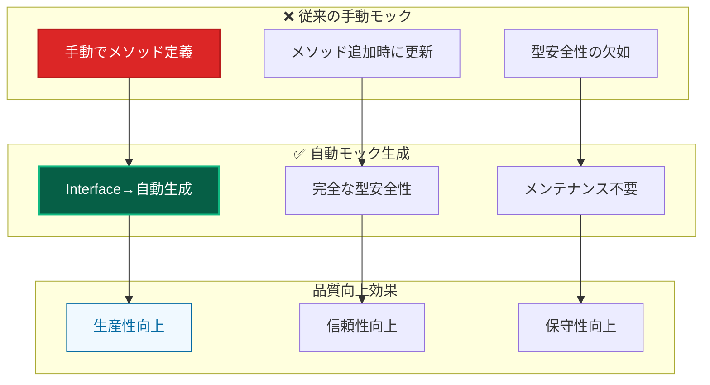
```mermaid
graph TB
    subgraph "❌ 従来の手動モック"
        MANUAL[手動でメソッド定義]
        MAINTAIN[メソッド追加時に更新]
        ERROR_PRONE[型安全性の欠如]
    end

    subgraph "✅ 自動モック生成"
        AUTO[Interface→自動生成]
        TYPE_SAFE[完全な型安全性]
        ZERO_MAINTAIN[メンテナンス不要]
    end

    subgraph "品質向上効果"
        PRODUCTIVITY[生産性向上]
        RELIABILITY[信頼性向上]
        MAINTAINABILITY[保守性向上]
    end

    MANUAL --> AUTO
    MAINTAIN --> TYPE_SAFE
    ERROR_PRONE --> ZERO_MAINTAIN

    AUTO --> PRODUCTIVITY
    TYPE_SAFE --> RELIABILITY
    ZERO_MAINTAIN --> MAINTAINABILITY

    style MANUAL fill:#dc2626,stroke:#b91c1c,stroke-width:2px,color:#ffffff
    style AUTO fill:#065f46,stroke:#10b981,stroke-width:2px,color:#ffffff
    style PRODUCTIVITY fill:#f0f9ff,stroke:#0369a1,stroke-width:1px,color:#0369a1
```

### モック種別と使い分け

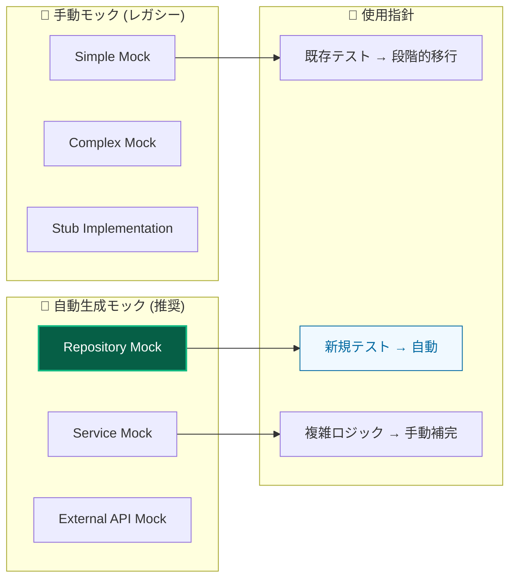
```mermaid
graph LR
    subgraph "🤖 自動生成モック (推奨)"
        AUTO_REPO[Repository Mock]
        AUTO_SERVICE[Service Mock]
        AUTO_EXTERNAL[External API Mock]
    end

    subgraph "📝 手動モック (レガシー)"
        MANUAL_SIMPLE[Simple Mock]
        MANUAL_COMPLEX[Complex Mock]
        MANUAL_STUB[Stub Implementation]
    end

    subgraph "🎯 使用指針"
        NEW_TEST[新規テスト → 自動]
        EXISTING[既存テスト → 段階的移行]
        COMPLEX_LOGIC[複雑ロジック → 手動補完]
    end

    AUTO_REPO --> NEW_TEST
    MANUAL_SIMPLE --> EXISTING
    AUTO_SERVICE --> COMPLEX_LOGIC

    style AUTO_REPO fill:#065f46,stroke:#10b981,stroke-width:2px,color:#ffffff
    style NEW_TEST fill:#f0f9ff,stroke:#0369a1,stroke-width:1px,color:#0369a1
```

---

## 🎆 Result型パターンテスト

### 統一的エラーハンドリングテスト

```mermaid
graph TB
    subgraph "Result型テストパターン"
        SUCCESS[成功ケース<br/>result.isOk()]
        FAILURE[失敗ケース<br/>result.isErr()]
        ERROR_CODE[エラーコード<br/>result.error.code]
    end

    subgraph "テストカテゴリ"
        VALIDATION[バリデーションエラー]
        BUSINESS[ビジネスルールエラー]
        INFRASTRUCTURE[インフラエラー]
    end

    subgraph "品質保証効果"
        TYPE_SAFETY[型安全性]
        ERROR_COVERAGE[エラーケース網羅]
        CONSISTENCY[一貫したテスト]
    end

    SUCCESS --> TYPE_SAFETY
    FAILURE --> ERROR_COVERAGE
    ERROR_CODE --> CONSISTENCY

    VALIDATION --> FAILURE
    BUSINESS --> FAILURE
    INFRASTRUCTURE --> FAILURE

    style SUCCESS fill:#065f46,stroke:#10b981,stroke-width:2px,color:#ffffff
    style TYPE_SAFETY fill:#f0f9ff,stroke:#0369a1,stroke-width:1px,color:#0369a1
```

### 包括的エラーケーステスト

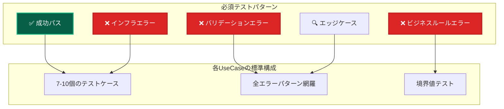
```mermaid
graph TB
    subgraph "必須テストパターン"
        HAPPY[✅ 成功パス]
        VALIDATION_ERR[❌ バリデーションエラー]
        BUSINESS_ERR[❌ ビジネスルールエラー]
        INFRA_ERR[❌ インフラエラー]
        EDGE[🔍 エッジケース]
    end

    subgraph "各UseCaseの標準構成"
        PATTERN[7-10個のテストケース]
        COVERAGE[全エラーパターン網羅]
        BOUNDARY[境界値テスト]
    end

    HAPPY --> PATTERN
    VALIDATION_ERR --> COVERAGE
    BUSINESS_ERR --> BOUNDARY
    INFRA_ERR --> PATTERN
    EDGE --> COVERAGE

    style HAPPY fill:#065f46,stroke:#10b981,stroke-width:2px,color:#ffffff
    style VALIDATION_ERR fill:#dc2626,stroke:#b91c1c,stroke-width:2px,color:#ffffff
    style BUSINESS_ERR fill:#dc2626,stroke:#b91c1c,stroke-width:2px,color:#ffffff
    style INFRA_ERR fill:#dc2626,stroke:#b91c1c,stroke-width:2px,color:#ffffff
```

---

## 🎬 E2Eテスト戦略

### 視覚的テスト開発

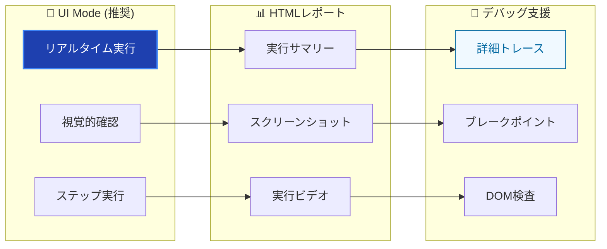
```mermaid
graph LR
    subgraph "🎨 UI Mode (推奨)"
        REALTIME[リアルタイム実行]
        VISUAL[視覚的確認]
        DEBUG[ステップ実行]
    end

    subgraph "📊 HTMLレポート"
        SUMMARY[実行サマリー]
        SCREENSHOT[スクリーンショット]
        VIDEO[実行ビデオ]
    end

    subgraph "🐛 デバッグ支援"
        TRACE[詳細トレース]
        BREAKPOINT[ブレークポイント]
        INSPECTION[DOM検査]
    end

    REALTIME --> SUMMARY
    VISUAL --> SCREENSHOT
    DEBUG --> VIDEO

    SUMMARY --> TRACE
    SCREENSHOT --> BREAKPOINT
    VIDEO --> INSPECTION

    style REALTIME fill:#1e40af,stroke:#3b82f6,stroke-width:2px,color:#ffffff
    style TRACE fill:#f0f9ff,stroke:#0369a1,stroke-width:1px,color:#0369a1
```

### セキュリティ監視テスト

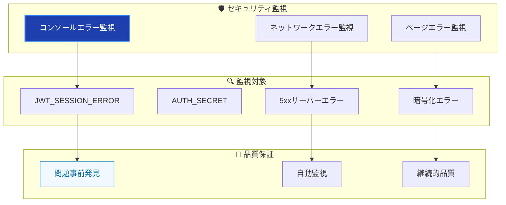
```mermaid
graph TB
    subgraph "🛡️ セキュリティ監視"
        CONSOLE[コンソールエラー監視]
        NETWORK[ネットワークエラー監視]
        PAGE[ページエラー監視]
    end

    subgraph "🔍 監視対象"
        JWT[JWT_SESSION_ERROR]
        NEXTAUTH[AUTH_SECRET]
        CRYPTO[暗号化エラー]
        SERVER[5xxサーバーエラー]
    end

    subgraph "🎯 品質保証"
        PREVENTION[問題事前発見]
        AUTOMATION[自動監視]
        CONTINUOUS[継続的品質]
    end

    CONSOLE --> JWT
    NETWORK --> SERVER
    PAGE --> CRYPTO

    JWT --> PREVENTION
    SERVER --> AUTOMATION
    CRYPTO --> CONTINUOUS

    style CONSOLE fill:#1e40af,stroke:#3b82f6,stroke-width:2px,color:#ffffff
    style PREVENTION fill:#f0f9ff,stroke:#0369a1,stroke-width:1px,color:#0369a1
```

---

## 📊 品質指標とカバレッジ

### 🎯 カバレッジ分析

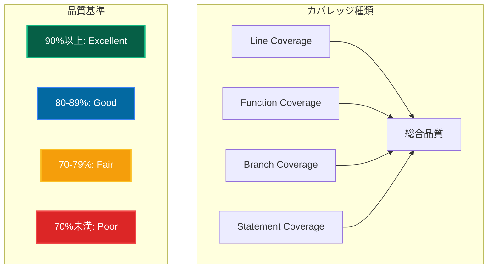
```mermaid
graph TB
    subgraph "カバレッジ種類"
        A[Line Coverage] --> E[総合品質]
        B[Function Coverage] --> E
        C[Branch Coverage] --> E
        D[Statement Coverage] --> E
    end

    subgraph "品質基準"
        F[90%以上: Excellent]
        G[80-89%: Good]
        H[70-79%: Fair]
        I[70%未満: Poor]
    end

    style F fill:#065f46,stroke:#10b981,stroke-width:2px,color:#ffffff
    style G fill:#0369a1,stroke:#3b82f6,stroke-width:2px,color:#ffffff
    style H fill:#f59e0b,stroke:#fbbf24,stroke-width:2px,color:#ffffff
    style I fill:#dc2626,stroke:#ef4444,stroke-width:2px,color:#ffffff
```

### 📈 継続的改善プロセス

1. **現状測定**: カバレッジ・品質指標確認
2. **目標設定**: レイヤー別目標値設定
3. **優先順位**: 重要度・影響度による優先付け
4. **実装**: 段階的テスト追加
5. **監視**: 継続的品質監視

### レイヤー別品質基準

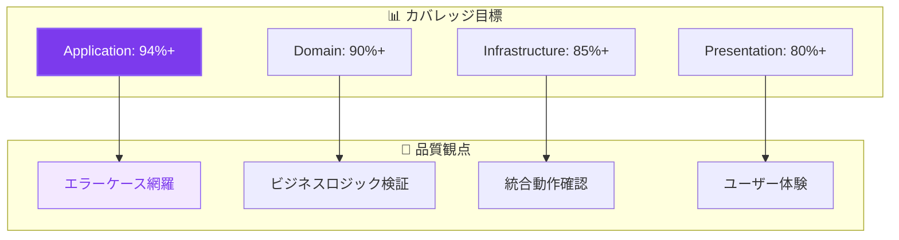
```mermaid
graph TB
    subgraph "📊 カバレッジ目標"
        APP[Application: 94%+]
        DOMAIN[Domain: 90%+]
        INFRA[Infrastructure: 85%+]
        PRES[Presentation: 80%+]
    end

    subgraph "🎯 品質観点"
        ERROR_COVERAGE[エラーケース網羅]
        BUSINESS_LOGIC[ビジネスロジック検証]
        INTEGRATION[統合動作確認]
        USER_EXPERIENCE[ユーザー体験]
    end

    APP --> ERROR_COVERAGE
    DOMAIN --> BUSINESS_LOGIC
    INFRA --> INTEGRATION
    PRES --> USER_EXPERIENCE

    style APP fill:#7c3aed,stroke:#8b5cf6,stroke-width:2px,color:#ffffff
    style ERROR_COVERAGE fill:#f3e8ff,stroke:#8b5cf6,stroke-width:1px,color:#7c3aed
```

### 継続的品質改善

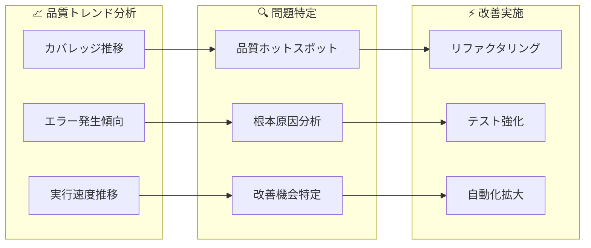
```mermaid
graph LR
    subgraph "📈 品質トレンド分析"
        COVERAGE_TREND[カバレッジ推移]
        ERROR_TREND[エラー発生傾向]
        PERFORMANCE_TREND[実行速度推移]
    end

    subgraph "🔍 問題特定"
        HOTSPOT[品質ホットスポット]
        ROOT_CAUSE[根本原因分析]
        IMPROVEMENT[改善機会特定]
    end

    subgraph "⚡ 改善実施"
        REFACTOR[リファクタリング]
        TEST_ENHANCE[テスト強化]
        AUTOMATION[自動化拡大]
    end

    COVERAGE_TREND --> HOTSPOT
    ERROR_TREND --> ROOT_CAUSE
    PERFORMANCE_TREND --> IMPROVEMENT

    HOTSPOT --> REFACTOR
    ROOT_CAUSE --> TEST_ENHANCE
    IMPROVEMENT --> AUTOMATION
```

---

## ⚡ 実行・開発フロー

### 🔄 テスト駆動開発 (TDD)

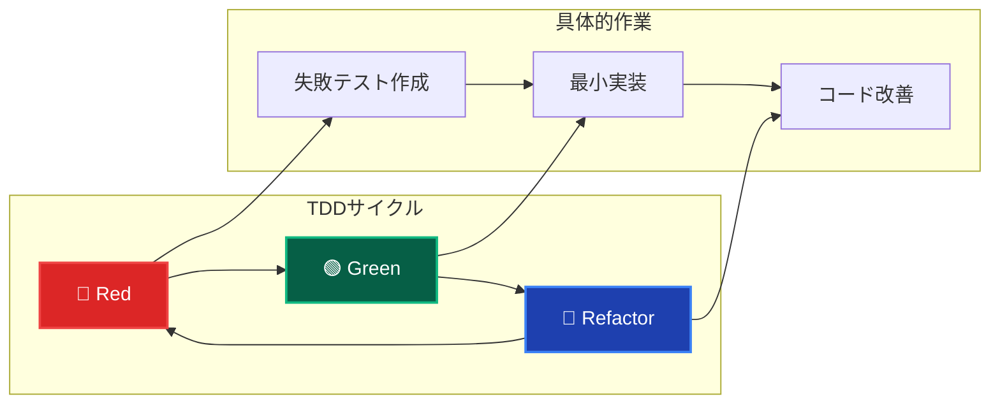
```mermaid
graph LR
    subgraph "TDDサイクル"
        A[🔴 Red] --> B[🟢 Green] --> C[🔵 Refactor] --> A
    end

    subgraph "具体的作業"
        D[失敗テスト作成] --> E[最小実装] --> F[コード改善]
    end

    A --> D
    B --> E
    C --> F

    style A fill:#dc2626,stroke:#ef4444,stroke-width:2px,color:#ffffff
    style B fill:#065f46,stroke:#10b981,stroke-width:2px,color:#ffffff
    style C fill:#1e40af,stroke:#3b82f6,stroke-width:2px,color:#ffffff
```

### 🚀 テスト実行コマンド

```bash
# 基本テスト実行
pnpm test:unit

# ウォッチモード（開発中推奨）
pnpm test:watch

# カバレッジ付き実行
pnpm test:coverage

# 特定ファイルのテスト
pnpm test:unit UserService.test.ts

# 詳細レポート
pnpm test:unit --reporter=verbose

# E2Eテスト実行
pnpm test:e2e

# 全テスト実行
pnpm test
```

---

## 🚀 テスト実行最適化

### 並列実行戦略

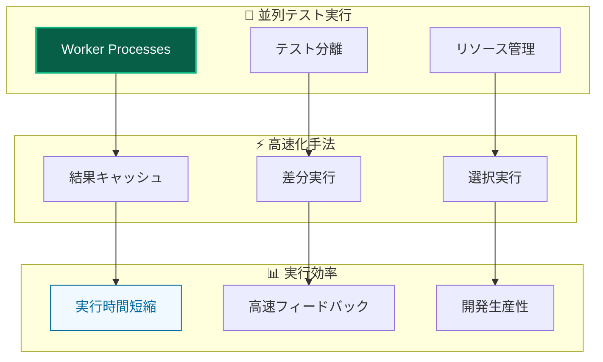
```mermaid
graph TB
    subgraph "🔄 並列テスト実行"
        WORKER[Worker Processes]
        ISOLATION[テスト分離]
        RESOURCE[リソース管理]
    end

    subgraph "⚡ 高速化手法"
        CACHE[結果キャッシュ]
        INCREMENTAL[差分実行]
        SELECTIVE[選択実行]
    end

    subgraph "📊 実行効率"
        TIME[実行時間短縮]
        FEEDBACK[高速フィードバック]
        PRODUCTIVITY[開発生産性]
    end

    WORKER --> CACHE
    ISOLATION --> INCREMENTAL
    RESOURCE --> SELECTIVE

    CACHE --> TIME
    INCREMENTAL --> FEEDBACK
    SELECTIVE --> PRODUCTIVITY

    style WORKER fill:#065f46,stroke:#10b981,stroke-width:2px,color:#ffffff
    style TIME fill:#f0f9ff,stroke:#0369a1,stroke-width:1px,color:#0369a1
```

### CI/CD統合

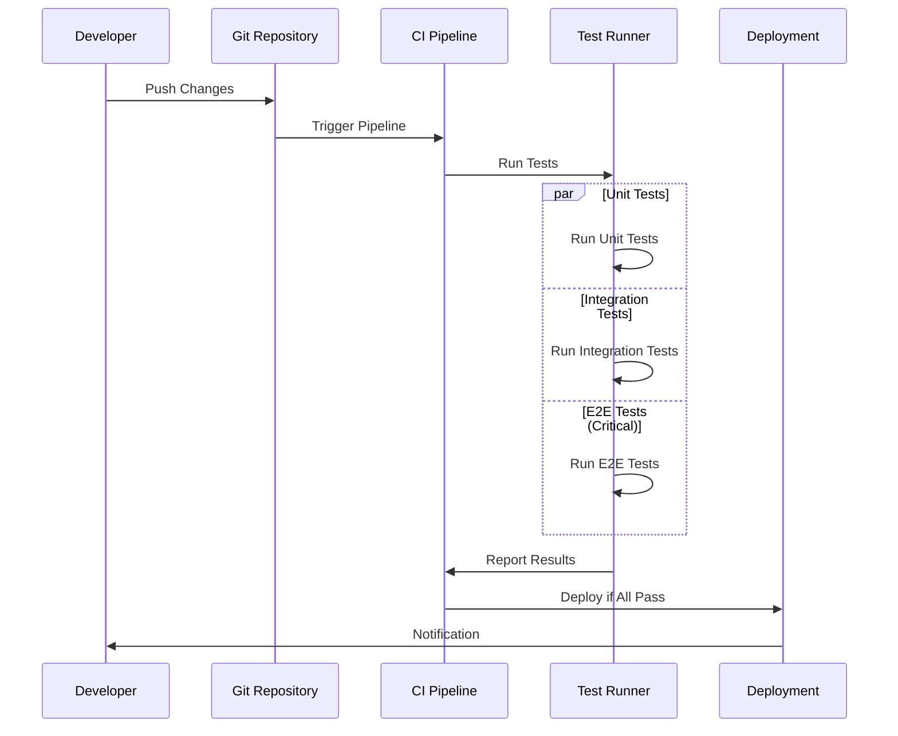
```mermaid
sequenceDiagram
    participant Dev as Developer
    participant Git as Git Repository
    participant CI as CI Pipeline
    participant Test as Test Runner
    participant Deploy as Deployment

    Dev->>Git: Push Changes
    Git->>CI: Trigger Pipeline
    CI->>Test: Run Tests

    par Unit Tests
        Test->>Test: Run Unit Tests
    and Integration Tests
        Test->>Test: Run Integration Tests
    and E2E Tests (Critical)
        Test->>Test: Run E2E Tests
    end

    Test->>CI: Report Results
    CI->>Deploy: Deploy if All Pass
    Deploy->>Dev: Notification
```

---

## 🧩 テスト環境管理

### DI Container統合

```mermaid
graph TB
    subgraph "🧪 テスト環境"
        TEST_CONTAINER[Test Container]
        MOCK_SERVICES[Mock Services]
        TEST_DATA[Test Data]
    end

    subgraph "🔄 環境セットアップ"
        SETUP[setupTestEnvironment()]
        RESET[Container Reset]
        CLEANUP[Cleanup]
    end

    subgraph "🎯 独立性保証"
        ISOLATION[テスト分離]
        REPRODUCIBLE[再現可能性]
        PREDICTABLE[予測可能性]
    end

    TEST_CONTAINER --> SETUP
    MOCK_SERVICES --> RESET
    TEST_DATA --> CLEANUP

    SETUP --> ISOLATION
    RESET --> REPRODUCIBLE
    CLEANUP --> PREDICTABLE

    style TEST_CONTAINER fill:#7c3aed,stroke:#8b5cf6,stroke-width:2px,color:#ffffff
    style ISOLATION fill:#f3e8ff,stroke:#8b5cf6,stroke-width:1px,color:#7c3aed
```

### データ管理戦略

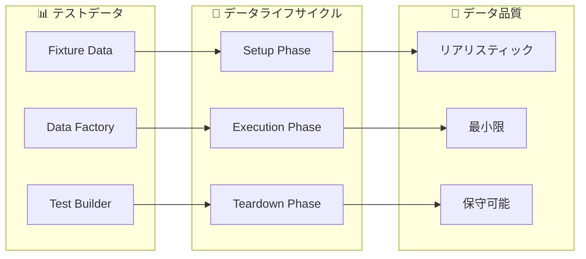
```mermaid
graph LR
    subgraph "📊 テストデータ"
        FIXTURE[Fixture Data]
        FACTORY[Data Factory]
        BUILDER[Test Builder]
    end

    subgraph "🔄 データライフサイクル"
        SETUP[Setup Phase]
        EXECUTION[Execution Phase]
        TEARDOWN[Teardown Phase]
    end

    subgraph "🎯 データ品質"
        REALISTIC[リアリスティック]
        MINIMAL[最小限]
        MAINTAINABLE[保守可能]
    end

    FIXTURE --> SETUP
    FACTORY --> EXECUTION
    BUILDER --> TEARDOWN

    SETUP --> REALISTIC
    EXECUTION --> MINIMAL
    TEARDOWN --> MAINTAINABLE
```

---

## 🛠️ テストツール活用

### 技術スタック

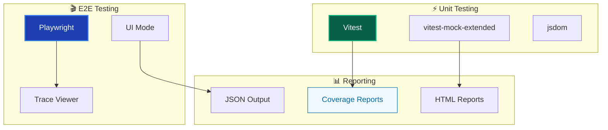
```mermaid
graph TB
    subgraph "⚡ Unit Testing"
        VITEST[Vitest]
        MOCK_EXT[vitest-mock-extended]
        JSDOM[jsdom]
    end

    subgraph "🎬 E2E Testing"
        PLAYWRIGHT[Playwright]
        UI_MODE[UI Mode]
        TRACE[Trace Viewer]
    end

    subgraph "📊 Reporting"
        COVERAGE[Coverage Reports]
        HTML[HTML Reports]
        JSON[JSON Output]
    end

    VITEST --> COVERAGE
    MOCK_EXT --> HTML
    PLAYWRIGHT --> TRACE
    UI_MODE --> JSON

    style VITEST fill:#065f46,stroke:#10b981,stroke-width:2px,color:#ffffff
    style PLAYWRIGHT fill:#1e40af,stroke:#3b82f6,stroke-width:2px,color:#ffffff
    style COVERAGE fill:#f0f9ff,stroke:#0369a1,stroke-width:1px,color:#0369a1
```

### ツール選択基準

| 用途                  | ツール               | 選択理由                   | 特徴              |
| --------------------- | -------------------- | -------------------------- | ----------------- |
| **Unit Testing**      | Vitest               | 高速、TypeScript統合       | ESM対応、並列実行 |
| **Mocking**           | vitest-mock-extended | 型安全な自動モック         | メンテナンス不要  |
| **E2E Testing**       | Playwright           | 安定性、豊富な機能         | UI Mode、トレース |
| **Component Testing** | Testing Library      | 行動駆動、アクセシビリティ | ユーザー視点      |

---

## 🔍 テスト品質評価

### 品質メトリクス

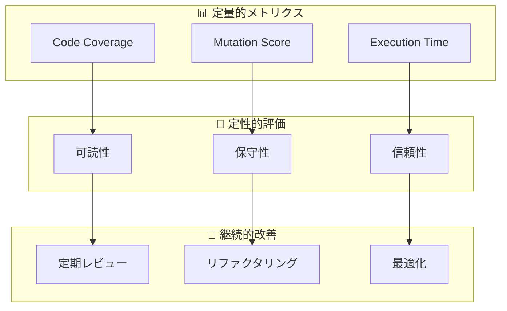
```mermaid
graph TB
    subgraph "📊 定量的メトリクス"
        COV[Code Coverage]
        MUTATION[Mutation Score]
        EXECUTION[Execution Time]
    end

    subgraph "🎯 定性的評価"
        READABILITY[可読性]
        MAINTAINABILITY[保守性]
        RELIABILITY[信頼性]
    end

    subgraph "🔄 継続的改善"
        REVIEW[定期レビュー]
        REFACTORING[リファクタリング]
        OPTIMIZATION[最適化]
    end

    COV --> READABILITY
    MUTATION --> MAINTAINABILITY
    EXECUTION --> RELIABILITY

    READABILITY --> REVIEW
    MAINTAINABILITY --> REFACTORING
    RELIABILITY --> OPTIMIZATION
```

### 品質ゲート

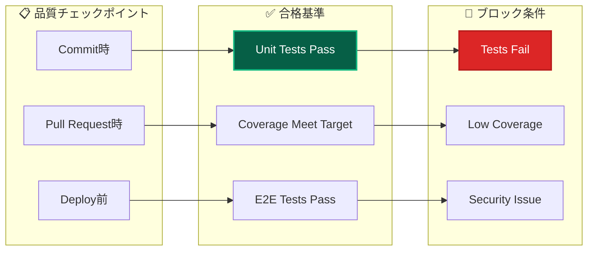
```mermaid
graph LR
    subgraph "📋 品質チェックポイント"
        COMMIT[Commit時]
        PR[Pull Request時]
        DEPLOY[Deploy前]
    end

    subgraph "✅ 合格基準"
        UNIT_PASS[Unit Tests Pass]
        COV_MEET[Coverage Meet Target]
        E2E_PASS[E2E Tests Pass]
    end

    subgraph "🚫 ブロック条件"
        FAIL[Tests Fail]
        LOW_COV[Low Coverage]
        SECURITY[Security Issue]
    end

    COMMIT --> UNIT_PASS
    PR --> COV_MEET
    DEPLOY --> E2E_PASS

    UNIT_PASS --> FAIL
    COV_MEET --> LOW_COV
    E2E_PASS --> SECURITY

    style UNIT_PASS fill:#065f46,stroke:#10b981,stroke-width:2px,color:#ffffff
    style FAIL fill:#dc2626,stroke:#b91c1c,stroke-width:2px,color:#ffffff
```

---

## 🔗 関連ドキュメント

### 詳細実装ガイド

- **[E2E Testing](../guides/e2e-testing-guide.md)** - E2Eテスト実践ガイド
- **[Mocking Strategy](unit/mocking.md)** - モック戦略詳細
- **[Clean Architecture Testing](../guides/testing-with-clean-architecture.md)** - レイヤー別テスト実装パターン

### 設計・アーキテクチャ

- **[アーキテクチャ概要](../architecture/overview.md)** - システム全体設計
- **[依存性注入](../architecture/patterns/dependency-injection.md)** - DI連携
- **[エラーハンドリング](../guides/ddd/cross-cutting/error-handling.md)** - Result型パターン

### 開発・運用

- **[開発フロー](../guides/development/workflow.md)** - 開発プロセス
- **[vitest-mock設定](../troubleshooting/development/vitest-mock-extended-setup.md)** - テスト問題解決
- **[コマンドリファレンス](../reference/commands.md)** - テスト実行コマンド

---

**🧪 包括的なテスト戦略により、持続可能で高品質な開発体験を実現しましょう！**
