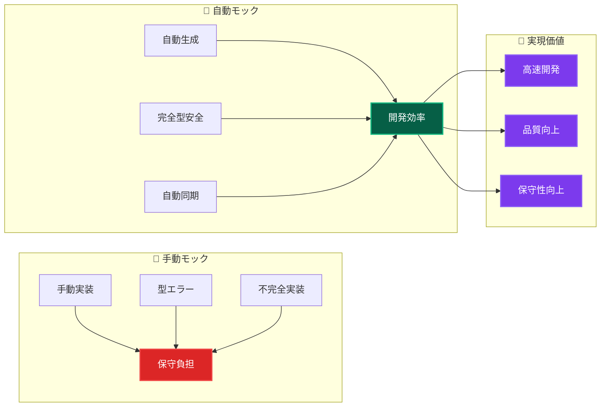
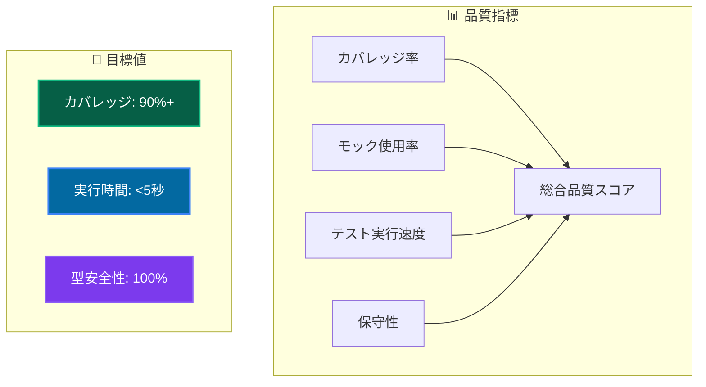

# 自動モック戦略 🎭

vitest-mock-extended を活用した効率的・型安全なモックテスト実装

---

## 📖 このドキュメントについて

### 🎯 目的

- **自動モック活用**: vitest-mock-extendedによる効率的テスト
- **型安全性確保**: 完全型対応のモック実装
- **DI統合**: 依存性注入との統合によるテスタブル設計

### 📚 前提知識

- **必須**: [ユニットテスト概要](overview.md) 理解
- **推奨**: [依存性注入パターン](../../architecture/patterns/dependency-injection.md) 理解
- **参考**: [テスト戦略](../strategy.md) | [実装パターンガイド](../../guides/implementation/patterns-guide.md)

### 🔗 このドキュメント後の推奨学習

1. **実践**: [実装パターンガイド](../../guides/implementation/patterns-guide.md) → 包括的テスト実装
2. **統合**: [統合テスト](../integration/overview.md) → Repository層テスト
3. **品質**: [テストパターン](patterns.md) → 高品質テスト手法

---

## 🚀 自動モック戦略の価値

### 従来の手動モック vs 自動モック



---

## 🛠️ vitest-mock-extended セットアップ

### 📦 インストール・設定

```bash
# 既にプロジェクトに統合済み
pnpm add -D vitest-mock-extended
```

### 🔧 基本設定

```typescript
// tests/utils/mocks/autoMocks.ts
import { mock, MockProxy } from 'vitest-mock-extended';
import type { IUserRepository } from '@/layers/domain/repositories/IUserRepository';
import type { ILogger } from '@/layers/infrastructure/logging/ILogger';
import type { IHashService } from '@/layers/infrastructure/services/IHashService';

// 🚀 自動モック生成ファクトリ関数
export function createAutoMockUserRepository(): MockProxy<IUserRepository> {
  return mock<IUserRepository>();
}

export function createAutoMockLogger(): MockProxy<ILogger> {
  return mock<ILogger>();
}

export function createAutoMockHashService(): MockProxy<IHashService> {
  return mock<IHashService>();
}

// 🎯 ドメインサービス用
export function createAutoMockUserDomainService(): MockProxy<IUserDomainService> {
  return mock<IUserDomainService>();
}
```

---

## 🎯 実践的モック実装パターン

### 📋 UseCase テストの標準パターン

```typescript
import { describe, it, expect, beforeEach } from 'vitest';
import { MockProxy } from 'vitest-mock-extended';
import { setupTestEnvironment } from '@tests/utils/helpers/testHelpers';
import { 
  createAutoMockUserRepository,
  createAutoMockHashService,
  createAutoMockLogger 
} from '@tests/utils/mocks/autoMocks';
import { container } from '@/diContainer';
import { INJECTION_TOKENS } from '@/layers/infrastructure/di/tokens';
import { CreateUserUseCase } from '@/layers/application/usecases/CreateUserUseCase';
import { isSuccess, isFailure } from '@/layers/application/types/Result';

describe('CreateUserUseCase', () => {
  // 🔄 テスト環境自動セットアップ
  setupTestEnvironment();

  let createUserUseCase: CreateUserUseCase;
  let mockUserRepository: MockProxy<IUserRepository>;
  let mockHashService: MockProxy<IHashService>;
  let mockLogger: MockProxy<ILogger>;

  beforeEach(() => {
    // 🤖 自動モック生成
    mockUserRepository = createAutoMockUserRepository();
    mockHashService = createAutoMockHashService();
    mockLogger = createAutoMockLogger();

    // 💉 DIコンテナにモック登録
    container.registerInstance(INJECTION_TOKENS.UserRepository, mockUserRepository);
    container.registerInstance(INJECTION_TOKENS.HashService, mockHashService);
    container.registerInstance(INJECTION_TOKENS.Logger, mockLogger);

    // 🎯 UseCaseインスタンス取得
    createUserUseCase = container.resolve(CreateUserUseCase);
  });

  describe('🟢 正常系', () => {
    it('有効な入力でユーザーを作成できる', async () => {
      // 📋 Arrange - テストデータ準備
      const validRequest = {
        name: 'テストユーザー',
        email: 'test@example.com',
        password: 'password123'
      };

      // 🎭 Mock動作設定
      mockUserRepository.findByEmail.mockResolvedValue(null); // 重複なし
      mockHashService.hash.mockResolvedValue('hashed_password_123');

      // ⚡ Act - 実行
      const result = await createUserUseCase.execute(validRequest);

      // ✅ Assert - 検証
      expect(isSuccess(result)).toBe(true);
      if (isSuccess(result)) {
        expect(result.data).toMatchObject({
          name: 'テストユーザー',
          email: 'test@example.com'
        });
        expect(result.data.userId).toBeDefined();
        expect(result.data.createdAt).toBeDefined();
      }

      // 🔍 Mock呼び出し確認
      expect(mockUserRepository.findByEmail).toHaveBeenCalledWith(
        expect.objectContaining({ 
          toString: expect.any(Function) 
        })
      );
      expect(mockHashService.hash).toHaveBeenCalledWith('password123');
      expect(mockUserRepository.save).toHaveBeenCalledWith(expect.any(Object));
      expect(mockLogger.info).toHaveBeenCalledWith(
        'ユーザー作成処理開始',
        { email: 'test@example.com' }
      );
    });
  });

  describe('🔴 異常系', () => {
    it('メールアドレス重複の場合は失敗する', async () => {
      // 📋 Arrange
      const duplicateRequest = {
        name: 'テストユーザー',
        email: 'existing@example.com',
        password: 'password123'
      };

      // 🎭 既存ユーザーのモック
      const existingUser = User.create(
        UserName.create('既存ユーザー').data!,
        Email.create('existing@example.com').data!,
        'hashed_password'
      ).data!;

      mockUserRepository.findByEmail.mockResolvedValue(existingUser);

      // ⚡ Act
      const result = await createUserUseCase.execute(duplicateRequest);

      // ✅ Assert
      expect(isFailure(result)).toBe(true);
      if (isFailure(result)) {
        expect(result.error.message).toBe('そのメールアドレスは既に使用されています');
        expect(result.error.code).toBe('EMAIL_ALREADY_EXISTS');
      }

      // 🔍 Repository saveが呼ばれていないことを確認
      expect(mockUserRepository.save).not.toHaveBeenCalled();
    });

    it('Repository例外発生時はシステムエラーを返す', async () => {
      // 📋 Arrange
      const validRequest = {
        name: 'テストユーザー',
        email: 'test@example.com',
        password: 'password123'
      };

      // 🎭 Repository例外設定
      mockUserRepository.findByEmail.mockRejectedValue(
        new Error('Database connection failed')
      );

      // ⚡ Act
      const result = await createUserUseCase.execute(validRequest);

      // ✅ Assert
      expect(isFailure(result)).toBe(true);
      if (isFailure(result)) {
        expect(result.error.message).toBe('ユーザー作成処理中にエラーが発生しました');
        expect(result.error.code).toBe('UNEXPECTED_ERROR');
      }

      // 🔍 エラーログ確認
      expect(mockLogger.error).toHaveBeenCalledWith(
        'ユーザー作成処理中にエラーが発生しました',
        expect.objectContaining({
          error: 'Database connection failed',
          email: 'test@example.com'
        })
      );
    });
  });
});
```

---

## 🎭 高度なモック技法

### 🔄 部分モック・条件付きモック

```typescript
describe('Advanced Mocking Techniques', () => {
  it('部分的なモック設定', async () => {
    // 🎯 特定メソッドのみモック
    mockUserRepository.findByEmail
      .mockResolvedValueOnce(null)  // 1回目: ユーザーなし
      .mockResolvedValueOnce(existingUser);  // 2回目: 既存ユーザー

    // 🔄 連続呼び出しテスト
    const result1 = await useCase.execute(request);
    const result2 = await useCase.execute(request);

    expect(isSuccess(result1)).toBe(true);
    expect(isFailure(result2)).toBe(true);
  });

  it('条件付きモック動作', async () => {
    // 🎯 引数に応じた動作分岐
    mockUserRepository.findByEmail.mockImplementation(async (email) => {
      if (email.toString() === 'admin@example.com') {
        return adminUser;
      }
      return null;
    });

    const adminResult = await useCase.execute({ email: 'admin@example.com' });
    const userResult = await useCase.execute({ email: 'user@example.com' });

    // 🔍 異なる結果の確認
    expect(adminResult).toBeDefined();
    expect(userResult).toBeDefined();
  });
});
```

### 🔍 モック状態検証

```typescript
describe('Mock State Verification', () => {
  it('モック呼び出し順序・回数の検証', async () => {
    await useCase.execute(validRequest);

    // 📊 呼び出し順序確認
    expect(mockLogger.info).toHaveBeenNthCalledWith(1, 
      'ユーザー作成処理開始', 
      { email: 'test@example.com' }
    );
    expect(mockUserRepository.findByEmail).toHaveBeenCalledAfter(
      mockLogger.info as any
    );

    // 🔢 呼び出し回数確認
    expect(mockUserRepository.findByEmail).toHaveBeenCalledTimes(1);
    expect(mockHashService.hash).toHaveBeenCalledTimes(1);
    expect(mockUserRepository.save).toHaveBeenCalledTimes(1);
  });
});
```

---

## 🛡️ セキュリティ・ベストプラクティス

### 🔒 機密情報のモック処理

```typescript
describe('Security-focused Mocking', () => {
  it('機密情報のマスク確認', async () => {
    const sensitiveRequest = {
      password: 'super_secret_password',
      token: 'sensitive_api_token'
    };

    await useCase.execute(sensitiveRequest);

    // 🛡️ ログに機密情報が出力されていないことを確認
    expect(mockLogger.info).toHaveBeenCalledWith(
      '処理開始',
      expect.not.objectContaining({
        password: 'super_secret_password',
        token: 'sensitive_api_token'
      })
    );

    // ✅ マスクされた形式での出力確認
    expect(mockLogger.info).toHaveBeenCalledWith(
      '処理開始',
      expect.objectContaining({
        password: '***',
        token: '***'
      })
    );
  });
});
```

---

## 📊 モックテストの品質指標

### 🎯 品質評価基準



### 📈 継続的改善

1. **定期レビュー**: モック使用状況の確認
2. **パフォーマンス監視**: テスト実行時間の最適化
3. **型安全性確認**: 自動モックの型整合性チェック
4. **ベストプラクティス共有**: チーム内知識展開

---

## 🔗 次のステップ・関連リソース

### 🚀 実践・応用

1. **[実装パターンガイド](../../guides/implementation/patterns-guide.md)** - 包括的テスト実装
2. **[統合テスト](../integration/overview.md)** - Repository層統合テスト
3. **[E2Eテスト](../e2e/overview.md)** - エンドツーエンド検証

### 📚 深掘り学習

- **Mock Library比較**: Jest mock vs vitest-mock-extended
- **パフォーマンス最適化**: 大規模テストスイートの高速化
- **CI/CD統合**: 自動テスト・品質ゲート設定

### 🛠️ 実用ツール

```bash
# テスト実行・分析コマンド
pnpm test:unit --reporter=verbose    # 詳細レポート
pnpm test:coverage --reporter=html   # HTML形式カバレッジ
pnpm test:watch                      # 開発時監視モード
```

---

**🎭 自動モック戦略により、効率的で高品質なテスト駆動開発を実現しましょう！**
