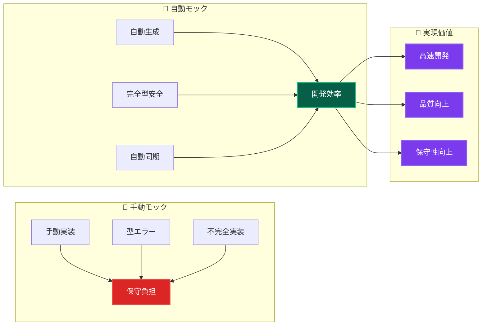
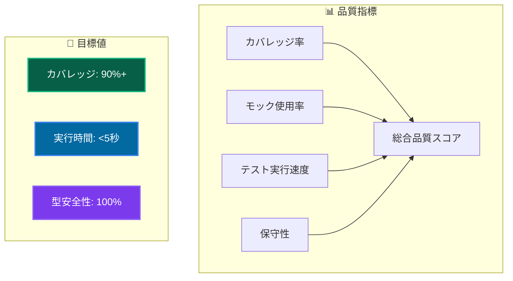

# 自動モック戦略 🎭

vitest-mock-extended を活用した効率的・型安全なモックテスト実装

---

## 📖 このドキュメントについて

### 🎯 目的

- **自動モック活用**: vitest-mock-extendedによる効率的テスト
- **型安全性確保**: 完全型対応のモック実装
- **DI統合**: 依存性注入との統合によるテスタブル設計

### 📚 前提知識

- **必須**: [ユニットテスト概要](overview.md) 理解
- **推奨**: [依存性注入パターン](../../architecture/patterns/dependency-injection.md) 理解
- **参考**: [テスト戦略](../strategy.md) | [実装パターンガイド](../../guides/implementation/patterns-guide.md)

### 🔗 このドキュメント後の推奨学習

1. **実践**: [実装パターンガイド](../../guides/implementation/patterns-guide.md) → 包括的テスト実装
2. **E2E**: [E2Eテスト](../../guides/e2e-testing-guide.md) → エンドツーエンドの検証

---

## 🚀 自動モック戦略の価値

### 従来の手動モック vs 自動モック


```mermaid
graph LR
    subgraph "🔧 手動モック"
        A[手動実装] --> D[保守負担]
        B[型エラー] --> D
        C[不完全実装] --> D
    end

    subgraph "🤖 自動モック"
        E[自動生成] --> H[開発効率]
        F[完全型安全] --> H
        G[自動同期] --> H
    end

    subgraph "🎯 実現価値"
        I[高速開発]
        J[品質向上]
        K[保守性向上]
    end

    H --> I
    H --> J
    H --> K

    style D fill:#dc2626,stroke:#ef4444,stroke-width:2px,color:#ffffff
    style H fill:#065f46,stroke:#10b981,stroke-width:2px,color:#ffffff
    style I fill:#7c3aed,stroke:#8b5cf6,stroke-width:2px,color:#ffffff
    style J fill:#7c3aed,stroke:#8b5cf6,stroke-width:2px,color:#ffffff
    style K fill:#7c3aed,stroke:#8b5cf6,stroke-width:2px,color:#ffffff
```

---

## 🔄 手動モックと自動モックの使い分け

### 現在のモック移行状況

プロジェクトでは **vitest-mock-extended による自動モック** を推奨していますが、一部のケースでは手動モックが必要です。

```
tests/utils/mocks/
├── autoMocks.ts      # ✅ 推奨: 自動モック（vitest-mock-extended）
└── commonMocks.ts    # ⚠️ 手動モック（段階的削除予定）
```

### 手動モックが必要なケース

以下のケースでは自動モック化が困難なため、`commonMocks.ts` で手動実装を維持しています：

| 対象                         | 理由                                         | 対応方針             |
| ---------------------------- | -------------------------------------------- | -------------------- |
| **PrismaClient**             | 型構造が非常に複雑でジェネリクス解決が困難   | 手動モック維持       |
| **関数モック（getAuth等）**  | インターフェースではなく関数のため           | モジュールモック使用 |

### 使い分けガイド

```typescript
// ✅ 推奨: インターフェースを持つサービスは自動モック
import { createAutoMockUserRepository } from '@tests/utils/mocks/autoMocks';
const mockRepo = createAutoMockUserRepository();

// ⚠️ 例外: PrismaClientは手動モック
import { createMockPrismaClient } from '@tests/utils/mocks/commonMocks';
const mockPrisma = createMockPrismaClient();

// ⚠️ 例外: 関数はモジュールモック
vi.mock('@/layers/infrastructure/persistence/nextAuth', () => ({
  getAuth: vi.fn(),
}));
```

### 移行ロードマップ

1. **完了済み**: Repository、DomainService、HashService、Logger → `autoMocks.ts`
2. **維持**: PrismaClient → 型複雑性のため `commonMocks.ts` で継続
3. **維持**: 関数モック → Vitestモジュールモックで対応

---

## 🛠️ vitest-mock-extended セットアップ

### 📦 インストール・設定

```bash
# 既にプロジェクトに統合済み
pnpm add -D vitest-mock-extended
```

### 🔧 基本設定

```typescript
// tests/utils/mocks/autoMocks.ts
import type { IUserRepository } from '@/layers/domain/repositories/IUserRepository';
import type { ILogger } from '@/layers/application/interfaces/ILogger';
import type { IHashService } from '@/layers/infrastructure/services/IHashService';

import { mock, MockProxy } from 'vitest-mock-extended';

// 🚀 自動モック生成ファクトリ関数
export function createAutoMockUserRepository(): MockProxy<IUserRepository> {
 return mock<IUserRepository>();
}

export function createAutoMockLogger(): MockProxy<ILogger> {
 return mock<ILogger>();
}

export function createAutoMockHashService(): MockProxy<IHashService> {
 return mock<IHashService>();
}

// 🎯 ドメインサービス用
export function createAutoMockUserDomainService(): MockProxy<IUserDomainService> {
 return mock<IUserDomainService>();
}
```

---

## 🎯 実践的モック実装パターン

### 📋 UseCase テストの標準パターン

```typescript
import { container } from '@/di/container';
import { resolve } from '@/di/resolver';
import { INJECTION_TOKENS } from '@/di/tokens';
import type { CreateUserUseCase } from '@/layers/application/usecases/user/CreateUserUseCase';
import { User } from '@/layers/domain/entities/User';
import { Email } from '@/layers/domain/value-objects/Email';

import { setupTestEnvironment } from '@tests/utils/helpers/testHelpers';
import {
 createAutoMockHashService,
 createAutoMockLogger,
 createAutoMockUserRepository,
} from '@tests/utils/mocks/autoMocks';
import { beforeEach, describe, expect, it } from 'vitest';
import type { MockProxy } from 'vitest-mock-extended';

describe('CreateUserUseCase', () => {
 // 🔄 テスト環境自動セットアップ
 setupTestEnvironment();

 let createUserUseCase: CreateUserUseCase;
 let mockUserRepository: MockProxy<IUserRepository>;
 let mockHashService: MockProxy<IHashService>;
 let mockLogger: MockProxy<ILogger>;

 beforeEach(() => {
  // 🤖 自動モック生成
  mockUserRepository = createAutoMockUserRepository();
  mockHashService = createAutoMockHashService();
  mockLogger = createAutoMockLogger();

  // 💉 DIコンテナにモック登録
  container.registerInstance(
   INJECTION_TOKENS.UserRepository,
   mockUserRepository,
  );
  container.registerInstance(INJECTION_TOKENS.HashService, mockHashService);
  container.registerInstance(INJECTION_TOKENS.Logger, mockLogger);

  // 🎯 UseCaseインスタンス取得（型安全なresolve関数）
  createUserUseCase = resolve('CreateUserUseCase');
 });

 describe('🟢 正常系', () => {
  it('有効な入力でユーザーを作成できる', async () => {
   // 📋 Arrange - テストデータ準備
   const validRequest = {
    name: 'テストユーザー',
    email: 'test@example.com',
    password: 'password123',
   };

   // 🎭 Mock動作設定
   mockUserRepository.findByEmail.mockResolvedValue(null); // 重複なし
   mockHashService.hash.mockResolvedValue('hashed_password_123');

   // ⚡ Act - 実行
   const result = await createUserUseCase.execute(validRequest);

   // ✅ Assert - 検証
   expect(result.isOk()).toBe(true);
   if (result.isOk()) {
    expect(result.value).toMatchObject({
     name: 'テストユーザー',
     email: 'test@example.com',
    });
    expect(result.value.userId).toBeDefined();
    expect(result.value.createdAt).toBeDefined();
   }

   // 🔍 Mock呼び出し確認
   expect(mockUserRepository.findByEmail).toHaveBeenCalledWith(
    expect.objectContaining({
     toString: expect.any(Function),
    }),
   );
   expect(mockHashService.hash).toHaveBeenCalledWith('password123');
   expect(mockUserRepository.save).toHaveBeenCalledWith(expect.any(Object));
   expect(mockLogger.info).toHaveBeenCalledWith('ユーザー作成処理開始', {
    email: 'test@example.com',
   });
  });
 });

 describe('🔴 異常系', () => {
  it('メールアドレス重複の場合は失敗する', async () => {
   // 📋 Arrange
   const duplicateRequest = {
    name: 'テストユーザー',
    email: 'existing@example.com',
    password: 'password123',
   };

   // 🎭 既存ユーザーのモック（コンストラクタ + ファクトリーメソッドパターン）
   const existingUser = User.create(
    new Email('existing@example.com'),
    '既存ユーザー',
    'hashed_password',
   );

   mockUserRepository.findByEmail.mockResolvedValue(existingUser);

   // ⚡ Act
   const result = await createUserUseCase.execute(duplicateRequest);

   // ✅ Assert
   expect(result.isErr()).toBe(true);
   if (result.isErr()) {
    expect(result.error.message).toBe(
     'そのメールアドレスは既に使用されています',
    );
    expect(result.error.code).toBe('EMAIL_ALREADY_EXISTS');
   }

   // 🔍 Repository saveが呼ばれていないことを確認
   expect(mockUserRepository.save).not.toHaveBeenCalled();
  });

  it('Repository例外発生時はシステムエラーを返す', async () => {
   // 📋 Arrange
   const validRequest = {
    name: 'テストユーザー',
    email: 'test@example.com',
    password: 'password123',
   };

   // 🎭 Repository例外設定
   mockUserRepository.findByEmail.mockRejectedValue(
    new Error('Database connection failed'),
   );

   // ⚡ Act
   const result = await createUserUseCase.execute(validRequest);

   // ✅ Assert
   expect(result.isErr()).toBe(true);
   if (result.isErr()) {
    expect(result.error.message).toBe(
     'ユーザー作成処理中にエラーが発生しました',
    );
    expect(result.error.code).toBe('UNEXPECTED_ERROR');
   }

   // 🔍 エラーログ確認
   expect(mockLogger.error).toHaveBeenCalledWith(
    'ユーザー作成処理中にエラーが発生しました',
    expect.objectContaining({
     error: 'Database connection failed',
     email: 'test@example.com',
    }),
   );
  });
 });
});
```

---

## 🎭 高度なモック技法

### 🔄 部分モック・条件付きモック

```typescript
describe('Advanced Mocking Techniques', () => {
 it('部分的なモック設定', async () => {
  // 🎯 特定メソッドのみモック
  mockUserRepository.findByEmail
   .mockResolvedValueOnce(null) // 1回目: ユーザーなし
   .mockResolvedValueOnce(existingUser); // 2回目: 既存ユーザー

  // 🔄 連続呼び出しテスト
  const result1 = await useCase.execute(request);
  const result2 = await useCase.execute(request);

  expect(result1.isOk()).toBe(true);
  expect(result2.isErr()).toBe(true);
 });

 it('条件付きモック動作', async () => {
  // 🎯 引数に応じた動作分岐
  mockUserRepository.findByEmail.mockImplementation(async (email) => {
   if (email.value === 'admin@example.com') {
    return adminUser;
   }
   return null;
  });

  const adminResult = await useCase.execute({ email: 'admin@example.com' });
  const userResult = await useCase.execute({ email: 'user@example.com' });

  // 🔍 異なる結果の確認
  expect(adminResult).toBeDefined();
  expect(userResult).toBeDefined();
 });
});
```

### 🔍 モック状態検証

```typescript
describe('Mock State Verification', () => {
 it('モック呼び出し順序・回数の検証', async () => {
  await useCase.execute(validRequest);

  // 📊 呼び出し順序確認
  expect(mockLogger.info).toHaveBeenNthCalledWith(1, 'ユーザー作成処理開始', {
   email: 'test@example.com',
  });
  expect(mockUserRepository.findByEmail).toHaveBeenCalledAfter(
   mockLogger.info as any,
  );

  // 🔢 呼び出し回数確認
  expect(mockUserRepository.findByEmail).toHaveBeenCalledTimes(1);
  expect(mockHashService.hash).toHaveBeenCalledTimes(1);
  expect(mockUserRepository.save).toHaveBeenCalledTimes(1);
 });
});
```

---

## 🛡️ セキュリティ・ベストプラクティス

### 🔒 機密情報のモック処理

```typescript
describe('Security-focused Mocking', () => {
 it('機密情報のマスク確認', async () => {
  const sensitiveRequest = {
   password: 'super_secret_password',
   token: 'sensitive_api_token',
  };

  await useCase.execute(sensitiveRequest);

  // 🛡️ ログに機密情報が出力されていないことを確認
  expect(mockLogger.info).toHaveBeenCalledWith(
   '処理開始',
   expect.not.objectContaining({
    password: 'super_secret_password',
    token: 'sensitive_api_token',
   }),
  );

  // ✅ マスクされた形式での出力確認
  expect(mockLogger.info).toHaveBeenCalledWith(
   '処理開始',
   expect.objectContaining({
    password: '***',
    token: '***',
   }),
  );
 });
});
```

---

## 📊 モックテストの品質指標

### 🎯 品質評価基準


```mermaid
graph TB
    subgraph "📊 品質指標"
        A[カバレッジ率] --> E[総合品質スコア]
        B[モック使用率] --> E
        C[テスト実行速度] --> E
        D[保守性] --> E
    end

    subgraph "🎯 目標値"
        F[カバレッジ: 90%+]
        G[実行時間: <5秒]
        H[型安全性: 100%]
    end

    style F fill:#065f46,stroke:#10b981,stroke-width:2px,color:#ffffff
    style G fill:#0369a1,stroke:#3b82f6,stroke-width:2px,color:#ffffff
    style H fill:#7c3aed,stroke:#8b5cf6,stroke-width:2px,color:#ffffff
```

### 📈 継続的改善

1. **定期レビュー**: モック使用状況の確認
2. **パフォーマンス監視**: テスト実行時間の最適化
3. **型安全性確認**: 自動モックの型整合性チェック
4. **ベストプラクティス共有**: チーム内知識展開

---

## 🔗 次のステップ・関連リソース

### 🚀 実践・応用

1. **[実装パターンガイド](../../guides/implementation/patterns-guide.md)** - 包括的テスト実装
2. **[E2Eテスト](../../guides/e2e-testing-guide.md)** - エンドツーエンド検証

### 📚 深掘り学習

- **Mock Library比較**: Jest mock vs vitest-mock-extended
- **パフォーマンス最適化**: 大規模テストスイートの高速化
- **CI/CD統合**: 自動テスト・品質ゲート設定

### 🛠️ 実用ツール

```bash
# テスト実行・分析コマンド
pnpm test:unit --reporter=verbose    # 詳細レポート
pnpm test:coverage --reporter=html   # HTML形式カバレッジ
pnpm test:watch                      # 開発時監視モード
```

---

**🎭 自動モック戦略により、効率的で高品質なテスト駆動開発を実現しましょう！**
