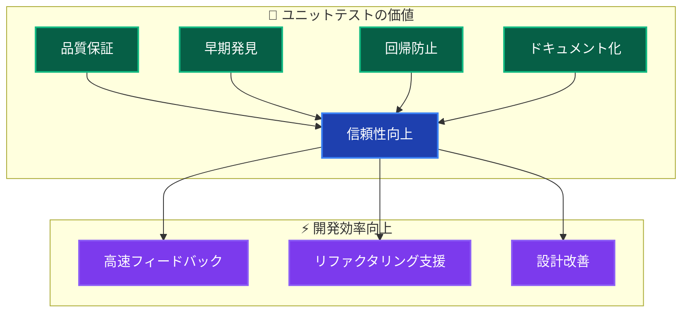
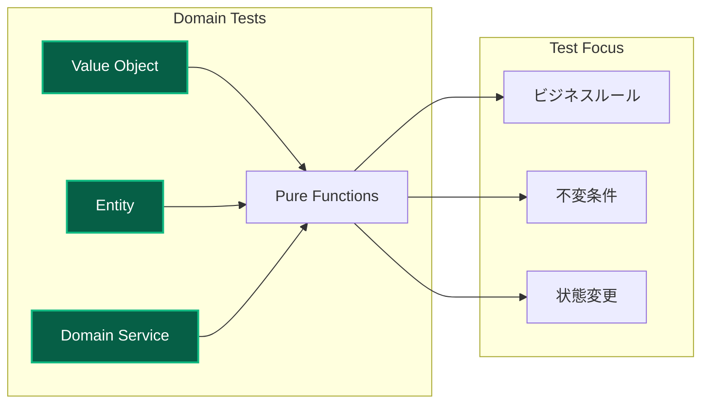
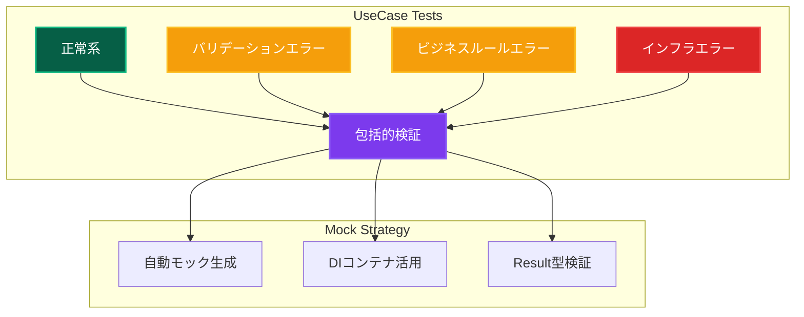
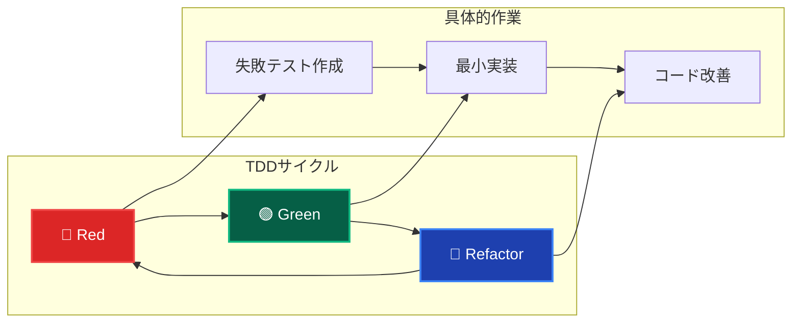
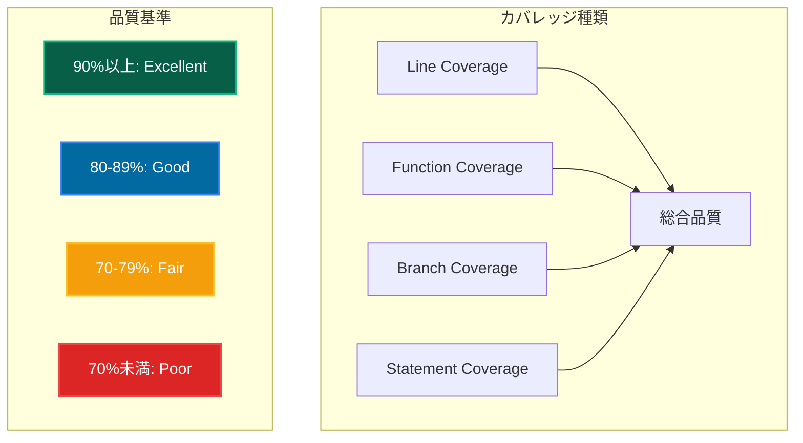

# ユニットテスト概要 🧪

Clean Architecture + DDD における効果的なユニットテスト戦略

---

## 📖 このドキュメントについて

### 🎯 目的

- **ユニットテストの基本**: 概念・目的・実装方法
- **品質保証**: レイヤー別テスト戦略の確立
- **開発効率**: テスト駆動開発による品質向上

### 📚 前提知識

- **必須**: [テスト戦略](../strategy.md) 理解
- **推奨**: [アーキテクチャ概要](../../architecture/overview.md) 理解
- **参考**: [自動モック戦略](mocking.md) | [開発フロー](../../guides/development/workflow.md)

### 🔗 このドキュメント後の推奨学習

1. **実践**: [自動モック戦略](mocking.md) → 効率的テスト実装
2. **統合**: [統合テスト](../integration/overview.md) → より広範囲のテスト
3. **E2E**: [E2Eテスト](../e2e/overview.md) → エンドツーエンドの検証

---

## 🎯 ユニットテストの定義と目的

### 定義

**ユニットテスト**: 個別のコード単位（関数・クラス・モジュール）を独立してテストし、期待通りに動作することを検証するテスト手法。

### 🚀 主要目的



---

## 🏛️ レイヤー別テスト戦略

### 📊 レイヤー別カバレッジ目標

| レイヤー              | カバレッジ目標 | 重点テスト項目           | 主要技術       |
| --------------------- | -------------- | ------------------------ | -------------- |
| **👑 Domain**         | **90%以上**    | ビジネスルール・不変条件 | Pure関数テスト |
| **📋 Application**    | **94%以上**    | UseCase・Result型        | Mock・DI       |
| **🔧 Infrastructure** | **85%以上**    | データ変換・外部連携     | 統合テスト中心 |
| **🎨 Presentation**   | **80%以上**    | Server Actions・UI状態   | E2E補完        |

### 👑 Domain Layer テスト



**実装パターン例:**

```typescript
describe('Email Value Object', () => {
 describe('作成', () => {
  it('有効なメールアドレスで作成できる', () => {
   const result = Email.create('test@example.com');

   expect(isSuccess(result)).toBe(true);
   if (isSuccess(result)) {
    expect(result.data.toString()).toBe('test@example.com');
   }
  });

  it('無効な形式の場合は失敗する', () => {
   const result = Email.create('invalid-email');

   expect(isFailure(result)).toBe(true);
   if (isFailure(result)) {
    expect(result.error.code).toBe('EMAIL_INVALID_FORMAT');
   }
  });
 });

 describe('等価性', () => {
  it('同じ値のEmailは等価', () => {
   const email1 = Email.create('test@example.com').data!;
   const email2 = Email.create('test@example.com').data!;

   expect(email1.equals(email2)).toBe(true);
  });
 });
});
```

### 📋 Application Layer テスト



**UseCase テストパターン:**

```typescript
describe('CreateUserUseCase', () => {
 setupTestEnvironment(); // DIコンテナリセット

 let useCase: CreateUserUseCase;
 let mockRepository: MockProxy<IUserRepository>;

 beforeEach(() => {
  // 自動モック生成
  mockRepository = createAutoMockUserRepository();
  container.registerInstance(INJECTION_TOKENS.UserRepository, mockRepository);

  useCase = container.resolve(CreateUserUseCase);
 });

 describe('成功ケース', () => {
  it('有効な入力でユーザーを作成できる', async () => {
   mockRepository.findByEmail.mockResolvedValue(null);

   const result = await useCase.execute({
    name: 'Test User',
    email: 'test@example.com',
    password: 'password123',
   });

   expect(isSuccess(result)).toBe(true);
   if (isSuccess(result)) {
    expect(result.data.name).toBe('Test User');
   }
  });
 });

 describe('エラーケース', () => {
  it('メール重複時は失敗する', async () => {
   const existingUser = createMockUser();
   mockRepository.findByEmail.mockResolvedValue(existingUser);

   const result = await useCase.execute(validInput);

   expect(isFailure(result)).toBe(true);
   if (isFailure(result)) {
    expect(result.error.code).toBe('EMAIL_ALREADY_EXISTS');
   }
  });
 });
});
```

---

## ⚡ 実行・開発フロー

### 🔄 テスト駆動開発 (TDD)



### 🚀 テスト実行コマンド

```bash
# 基本テスト実行
pnpm test:unit

# ウォッチモード（開発中推奨）
pnpm test:watch

# カバレッジ付き実行
pnpm test:coverage

# 特定ファイルのテスト
pnpm test:unit UserService.test.ts

# 詳細レポート
pnpm test:unit --reporter=verbose
```

---

## 📊 品質指標・メトリクス

### 🎯 カバレッジ分析



### 📈 継続的改善プロセス

1. **現状測定**: カバレッジ・品質指標確認
2. **目標設定**: レイヤー別目標値設定
3. **優先順位**: 重要度・影響度による優先付け
4. **実装**: 段階的テスト追加
5. **監視**: 継続的品質監視

---

## 🛠️ 開発支援ツール

### IDE統合

- **VS Code**: Jest/Vitest拡張
- **IntelliJ**: テスト実行・デバッグ
- **WebStorm**: 統合テスト環境

### CI/CD統合

```yaml
# GitHub Actions例
- name: Run Unit Tests
  run: pnpm test:unit --coverage

- name: Upload Coverage
  uses: codecov/codecov-action@v3
```

---

## 🔗 次のステップ

### 🚀 実践・応用

1. **[自動モック戦略](mocking.md)** - 効率的モック活用
2. **[統合テスト](../integration/overview.md)** - より広範囲のテスト
3. **[テストパターン](patterns.md)** - 実装パターン集

### 📚 深掘り学習

- **テスト設計**: 境界値・等価クラス分析
- **パフォーマンステスト**: 負荷・ストレステスト
- **セキュリティテスト**: 脆弱性検証

---

**🧪 包括的ユニットテストにより、高品質で信頼性の高いコードベースを実現しましょう！**
