# よくある問題と解決策 🔧

開発中に遭遇する一般的な問題の効率的な解決方法

---

## 🎯 問題解決アプローチ

### 問題分類と対処方針

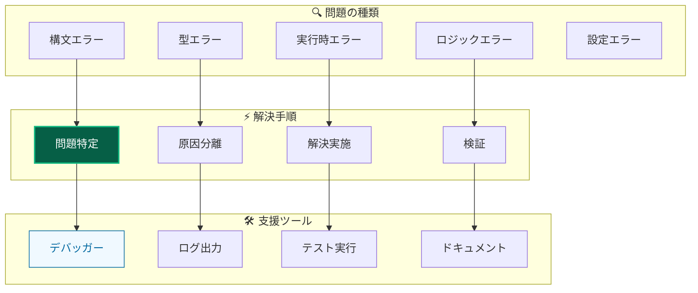

### トラブルシューティング手順

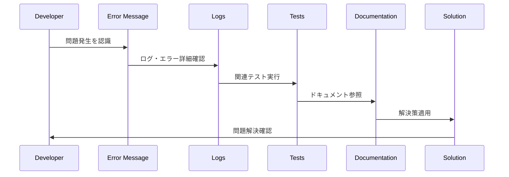

---

## 💉 依存性注入 (DI) 関連問題

### 🔄 循環依存エラー

**症状：**

```
ReferenceError: Cannot access 'applicationContainer' before initialization
```

**原因分析：**

```mermaid
graph TB
    subgraph "❌ 問題のパターン"
        A[ServiceA] -->|@inject| B[ServiceB]
        B -->|"resolve関数"| A
        C[循環依存発生]
    end

    subgraph "✅ 解決パターン"
        A1[ServiceA] -->|@inject| IFACE[Interface]
        B1[ServiceB] -->|implements| IFACE
        D[依存方向の統一]
    end

    style A fill:#dc2626,stroke:#b91c1c,stroke-width:2px,color:#ffffff
    style B fill:#dc2626,stroke:#b91c1c,stroke-width:2px,color:#ffffff
    style A1 fill:#065f46,stroke:#10b981,stroke-width:2px,color:#ffffff
    style B1 fill:#065f46,stroke:#10b981,stroke-width:2px,color:#ffffff
```

**解決手順：**

1. **問題箇所の特定**

   - サービス層で `resolve()` 関数を使用していないか確認
   - DIコンテナの初期化順序を確認

2. **修正方法**

   - サービス層では `@inject()` コンストラクター注入を使用
   - `resolve()` はPresentation層でのみ使用

3. **検証**
   - アプリケーション起動確認
   - テスト実行確認

### 🔍 依存関係解決エラー

**症状：**

```
Error: Cannot resolve dependency 'ServiceName'
```

**解決チェックリスト：**

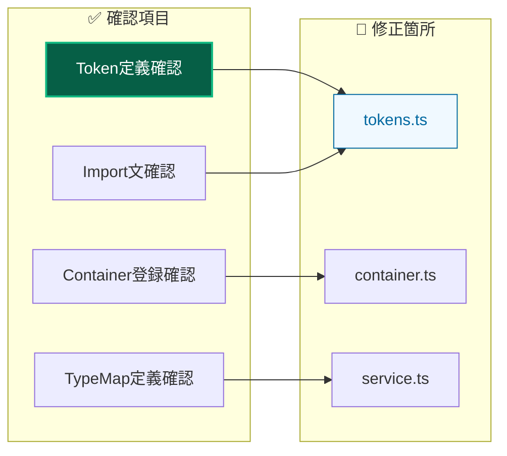

**修正手順：**

1. `tokens.ts` でトークン定義を確認
2. `ServiceTypeMap` に型定義を追加
3. 適切なコンテナファイルに登録
4. `@injectable()` デコレータ確認

---

## 🧪 テスト関連問題

### 🎭 vitest-mock-extended 設定問題

**症状：**

```typescript
TypeError: mock<IService> is not a function
```

**解決手順：**

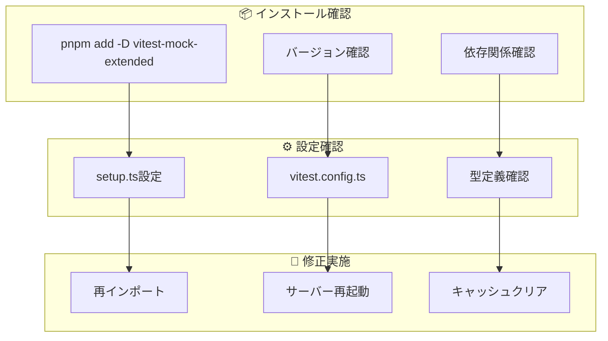

1. **インストール確認**

   ```bash
   pnpm add -D vitest-mock-extended
   ```

2. **import文確認**

   ```typescript
   import { mock, MockProxy } from 'vitest-mock-extended';
   ```

3. **型定義確認**

   ```typescript
   const mockService: MockProxy<IService> = mock<IService>();
   ```

### 🧪 テスト独立性問題

**症状：**

```
Tests are interfering with each other
```

**解決パターン：**

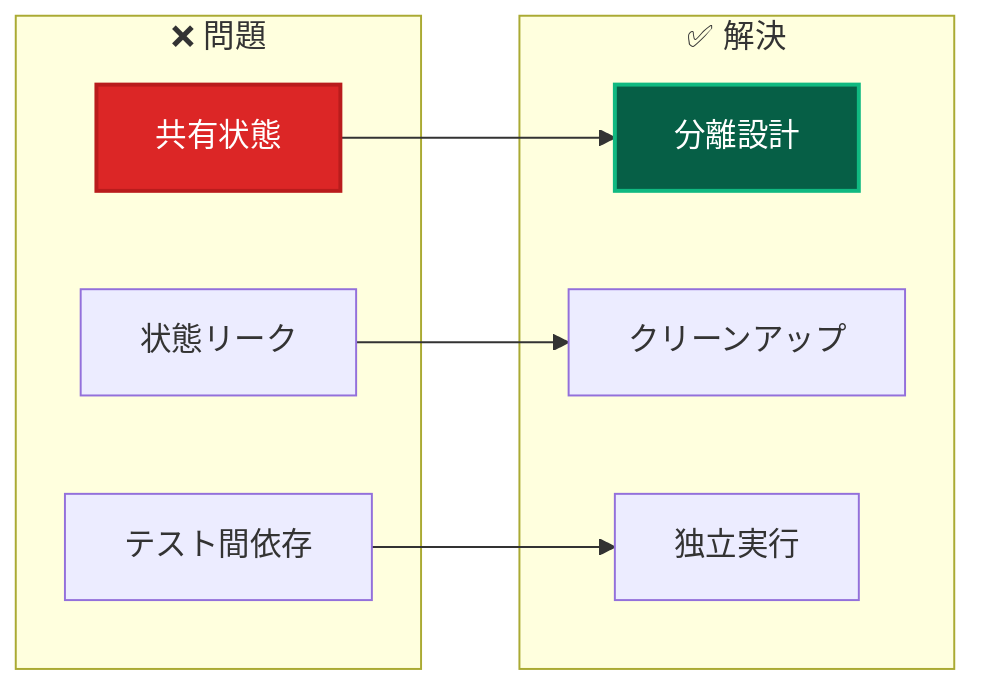

**修正方法：**

1. **`setupTestEnvironment()` 使用**

   ```typescript
   import { setupTestEnvironment } from '@tests/utils/helpers/testHelpers';

   describe('TestSuite', () => {
    setupTestEnvironment(); // DIコンテナリセット
   });
   ```

2. **beforeEach でのクリーンアップ**

   ```typescript
   beforeEach(() => {
    container.clearInstances();
   });
   ```

---

## 📝 TypeScript関連問題

### 🔍 型エラー

**よくある型エラーと解決策：**

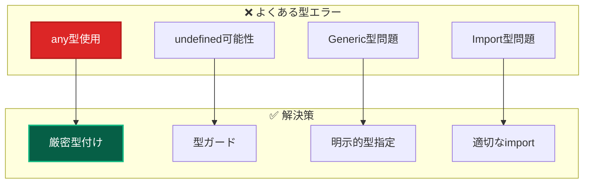

**解決例：**

1. **any型の削除**

   ```typescript
   // ❌ 悪い例
   const result: any = await useCase.execute(input);

   // ✅ 良い例
   const result: Result<CreateUserResponse> = await useCase.execute(input);
   ```

2. **undefined チェック**

   ```typescript
   // ❌ 悪い例
   user.getName().toLowerCase();

   // ✅ 良い例
   if (user) {
    user.getName().toLowerCase();
   }
   ```

### 🔧 Import/Export 問題

**症状：**

```
Module not found or Cannot find module
```

**解決チェックリスト：**

| 問題              | 確認項目                       | 修正方法             |
| ----------------- | ------------------------------ | -------------------- |
| **相対パス使用**  | `../`, `./` を使用していないか | `@/*` エイリアス使用 |
| **index.ts 参照** | `@/components/ui` 形式の参照   | 個別import使用       |
| **拡張子問題**    | `.ts`, `.tsx` 拡張子           | 自動解決設定確認     |
| **大文字小文字**  | ファイル名の大文字小文字       | 正確なファイル名使用 |

---

## 🎨 フロントエンド関連問題

### 🔄 Server Actions エラー

**症状：**

```
Error: Functions cannot be passed directly to Client Components
```

**解決パターン：**

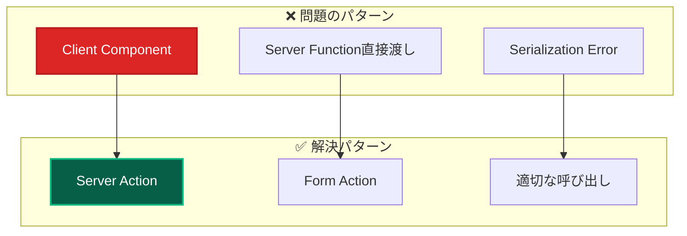

**修正方法：**

1. **Server Action として定義**

   ```typescript
   'use server';
   export async function createUser(formData: FormData) {
    // Server Action実装
   }
   ```

2. **Form action として使用**

   ```typescript
   <form action={createUser}>
     {/* form content */}
   </form>
   ```

### 🎨 Styling 問題

**よくある問題：**

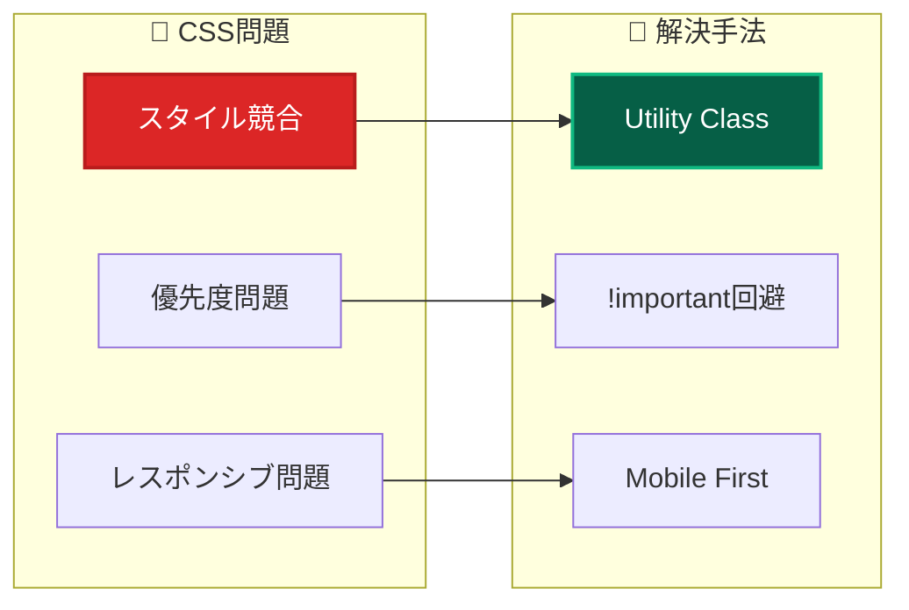

**解決例：**

1. **TailwindCSS v4 活用**

   ```typescript
   // ✅ 推奨: Utility Classes
   className = 'bg-primary hover:bg-primary-hover';

   // ❌ 避ける: カスタムCSS
   className = 'custom-button-style';
   ```

2. **テーマ変数使用**

   ```typescript
   // ✅ テーマ統一
   className = 'bg-[var(--primary)] text-[var(--text-inverse)]';
   ```

---

## 🏗️ ビルド・実行時問題

### 🚀 Next.js ビルドエラー

**よくあるエラーと解決策：**

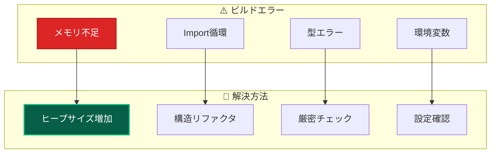

**解決手順：**

1. **メモリ不足の解決**

   ```bash
   # ヒープサイズ増加
   NODE_OPTIONS="--max-old-space-size=4096" pnpm build
   ```

2. **Import循環の解決**

   - 依存関係グラフの確認
   - インターフェース分離

3. **型エラーの解決**

   ```bash
   # 型チェック実行
   pnpm type-check
   ```

### 🗄️ Database 関連問題

**Prisma関連エラー：**

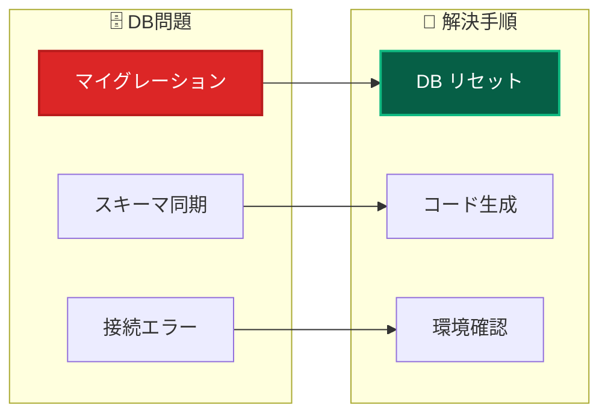

**解決コマンド：**

```bash
# Prisma関連問題の解決
pnpm db:generate    # Prismaクライアント再生成
pnpm db:push        # スキーマプッシュ
pnpm db:migrate:dev # 開発用マイグレーション
```

---

## 🔒 セキュリティ関連問題

### 🛡️ 認証・認可エラー

**NextAuth.js関連問題：**

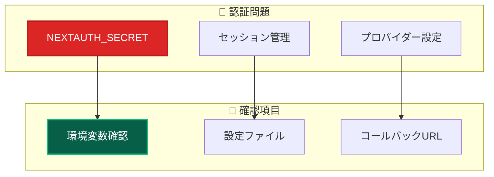

**解決チェックリスト：**

1. **環境変数確認**

   ```bash
   # .env.local ファイル確認
   NEXTAUTH_SECRET="your-secret-key"
   NEXTAUTH_URL="http://localhost:3000"
   ```

2. **設定ファイル確認**
   - NextAuth設定の確認
   - プロバイダー設定の確認

### 🔍 ログ・エラー情報の取得

**デバッグ情報収集：**

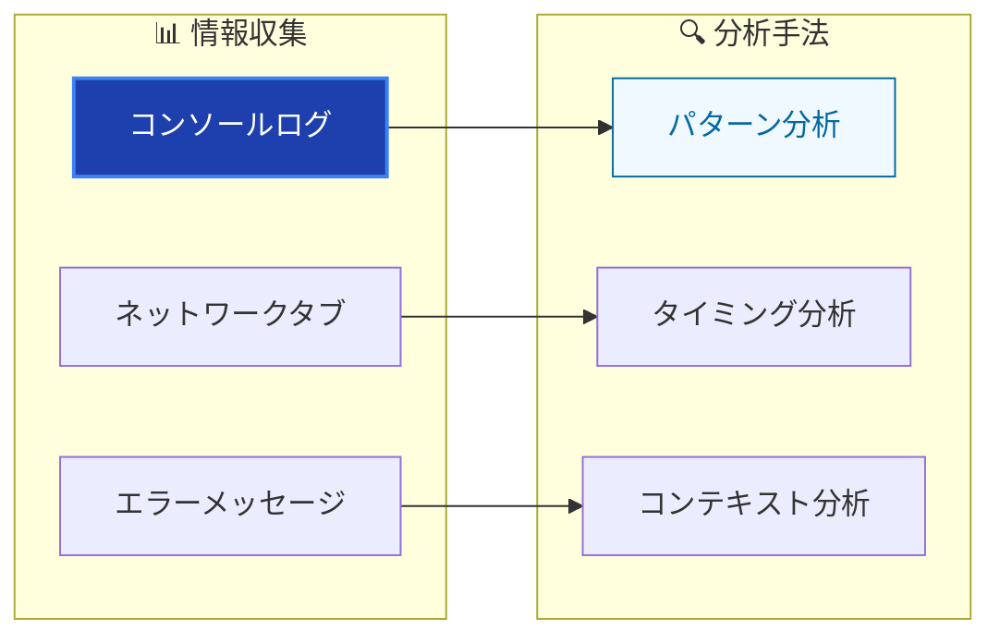

---

## 📋 問題解決チェックリスト

### 🔍 基本診断手順

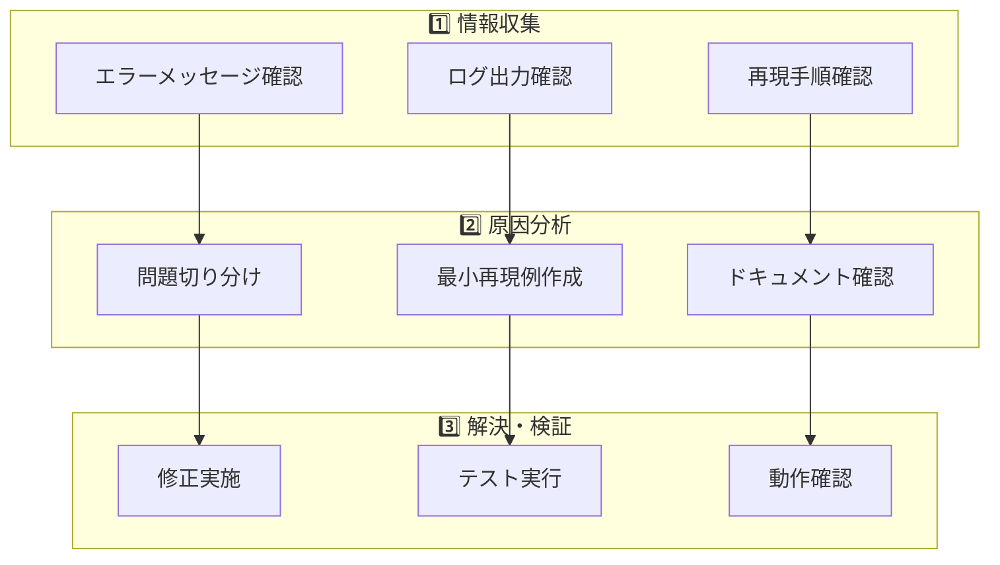

### ✅ 解決後の確認事項

| 確認項目       | 実施内容           | 合格基準           |
| -------------- | ------------------ | ------------------ |
| **機能動作**   | 修正箇所の動作確認 | 期待通りに動作     |
| **回帰テスト** | 関連機能の動作確認 | 既存機能に影響なし |
| **テスト実行** | 自動テスト実行     | 全テスト通過       |
| **ビルド確認** | 本番ビルド実行     | エラーなく完了     |
| **コード品質** | Lint・型チェック   | エラーなし         |

---

## 🚨 緊急事態対応

### 🔥 本番環境問題

**対応プライオリティ：**

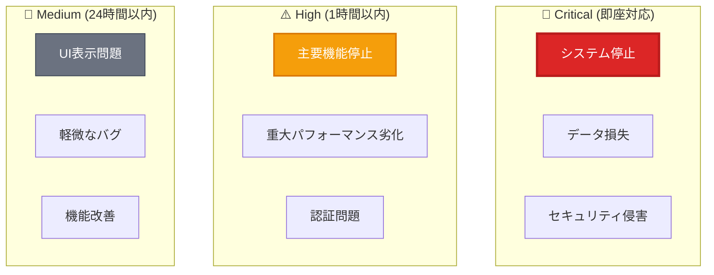

### 🛠️ 緊急対応手順

1. **影響範囲の確認**
2. **一時的な回避策の実施**
3. **根本原因の調査**
4. **恒久的な修正の実施**
5. **再発防止策の検討**

---

## 🔗 関連ドキュメント

### 問題別詳細ガイド

- **[DI関連問題](development/dependency-injection.md)** - 依存性注入のトラブルシューティング
- **[テスト問題](testing/)** - テスト関連問題の解決
- **[TypeScript問題](development/typescript.md)** - 型関連問題の解決

### 開発・設定

- **[開発フロー](../guides/development/workflow.md)** - 正しい開発手順
- **[環境設定](../reference/configuration/)** - 設定方法詳細
- **[コマンドリファレンス](../reference/commands.md)** - 実行コマンド一覧

### 品質保証

- **[テスト戦略](../testing/strategy.md)** - 包括的テスト手法
- **[コーディング規約](../guides/standards/coding.md)** - 実装標準
- **[アーキテクチャ原則](../architecture/principles.md)** - 設計思想

---

**🔧 適切な問題解決により、安定した開発体験を維持しましょう！**
