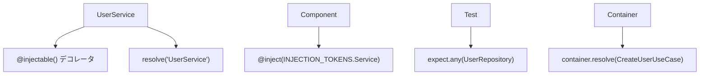
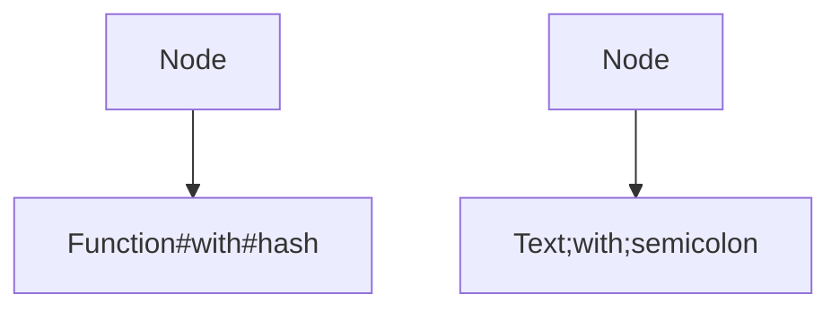
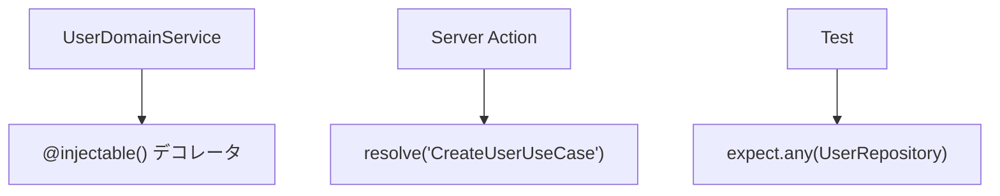

# Mermaid特殊文字エスケープ問題 🎨

Mermaid図で特殊文字（`@`、`()`、`'"`など）を表示する際のエスケープ方法とトラブルシューティングガイドです。

---

## 🚨 問題の概要

Mermaid図内で関数名やコード例を表示する際、特殊文字が正しく表示されない問題が発生します。

### 典型的な問題例

```markdown
❌ 間違ったエスケープ方法

```mermaid
graph TD
    A[UserService] --> B["&#64;injectable&#40;&#41; デコレータ"]
    A --> C["resolve&#40;&#39;UserService&#39;&#41;"]
```


**問題点**：

- `&#64;` は `@` の正しいエスケープではない
- `&#40;&#41;` は `()` の正しいエスケープではない  
- `&#39;` は `'` の正しいエスケープではない
- 表示時に文字化けや解析エラーが発生

---

## ✅ 正しいエスケープ方法

### 1. **推奨方法：ダブルクォートで囲む**

最も簡単で信頼性の高い方法です。

```markdown
✅ 正しいエスケープ方法


### 2. **HTMLエンティティコード（必要時のみ）**

ダブルクォートでも解決しない場合の代替手段：

```markdown
特殊なケースでのエスケープ


**よく使用するHTMLエンティティ**：

- `#35;` → `#` (ハッシュ)
- `#59;` → `;` (セミコロン)
- `#40;` → `(` (開き括弧)
- `#41;` → `)` (閉じ括弧)

---

## 🔧 実際の修正例

### Before（間違ったエスケープ）

```mermaid
graph TD
    A[UserDomainService] --> B["&#64;injectable&#40;&#41; デコレータ"]
    C[Server Action] --> D["resolve&#40;&#39;CreateUserUseCase&#39;&#41;"]
    E[Test] --> F["expect&#46;any&#40;UserRepository&#41;"]
```



### After（正しいエスケープ）



---

## 📋 特殊文字別対応表

| 文字 | ❌ 間違った書き方 | ✅ 正しい書き方 | 用途 |
|------|------------------|-----------------|------|
| `@` | `&#64;` | `"@injectable()"` | デコレータ |
| `()` | `&#40;&#41;` | `"function()"` | 関数呼び出し |
| `'` | `&#39;` | `"resolve('Service')"` | 文字列リテラル |
| `"` | `&#34;` | `'Text "quoted"'` | クォート内クォート |
| `.` | `&#46;` | `"object.method"` | プロパティアクセス |
| `#` | `&#35;` | `"hash#35;tag"` | ハッシュタグ（必要時のみ） |
| `;` | `&#59;` | `"code#59;statement"` | セミコロン（必要時のみ） |

---

## 🎯 ベストプラクティス

### ✅ 推奨事項

1. **ダブルクォート優先**: まずは `""` で囲んでみる
2. **シンプルに保つ**: 過度なエスケープは避ける
3. **テスト**: 変更後は実際にMermaid図が正しく表示されるか確認
4. **一貫性**: プロジェクト内で統一した書き方を使用

### ❌ 避けるべき事項

1. **HTMLエンティティの乱用**: `&#数字;` 形式は最終手段として使用
2. **混在エスケープ**: 同一図内で複数の方法を混在させない
3. **過度な複雑化**: 読みやすさを犠牲にしない

---

## 🐛 トラブルシューティング

### 問題：Mermaid図が表示されない

**原因**：

- 特殊文字の不正なエスケープ
- 構文エラー

**解決方法**：

1. 特殊文字をダブルクォートで囲む
2. Mermaidのライブプレビューでテスト
3. ブラウザの開発者ツールでエラーを確認

### 問題：文字化けが発生する

**原因**：

- HTMLエンティティコードの誤用
- 文字エンコーディングの問題

**解決方法**：

1. ダブルクォートエスケープに変更
2. ファイルエンコーディングをUTF-8に確認

### 問題：一部の文字だけ表示されない

**原因**：

- 予約語との衝突
- 特定文字の処理問題

**解決方法**：

1. 該当箇所をダブルクォートで囲む
2. 必要に応じてHTMLエンティティコードを使用

---

## 🔍 検証方法

### 1. **ripgrepでの問題検出**

```bash
# 問題のあるエスケープパターンを検索
rg "&#[0-9]+;" _DOCS --type md

# 特定の問題パターンを検索
rg "&#64;" _DOCS --type md    # @のエスケープ問題
rg "&#40;" _DOCS --type md    # (のエスケープ問題
```

### 2. **修正後の確認**

```bash
# 修正が完了したか確認
rg "&#[0-9]+;" _DOCS --type md
# 出力がなければ修正完了
```

### 3. **Mermaidプレビューツール**

- [Mermaid Live Editor](https://mermaid.live/)
- VS Code Mermaid Preview拡張
- GitHub/GitLabのMermaidプレビュー

---

## 📚 参考資料

### 公式ドキュメント

- [Mermaid Flowcharts Syntax](https://mermaid.js.org/syntax/flowchart.html)
- [Mermaid FAQ - Special Characters](https://mermaid.js.org/config/faq.html)

### Stack Overflow参考記事

- [Mermaid CLI - how do you escape characters?](https://stackoverflow.com/questions/28121525/mermaid-cli-how-do-you-escape-characters)
- [Mermaid diagram escape invalid characters](https://stackoverflow.com/questions/77964627/mermaid-diagram-escape-invalid-characters)

---

## 💡 今後の予防策

1. **テンプレート化**: よく使うパターンをテンプレート化
2. **リンター設定**: Markdownリンターでの自動検出
3. **CI/CD統合**: プルリクエスト時の自動チェック
4. **ドキュメント更新**: 新しい問題が見つかったら本ドキュメントを更新
